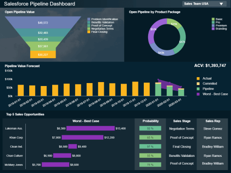

在线仪表板是一种可视化工具，公司用于分析和评估其业务流程、关键绩效指标和重要组织点的状态，而其在线性质提供了随时从任何设备进行的访问。这些类型的在线仪表板的一些功能和优势包括：

- **全天候访问：**创建和共享详细的在线仪表板对于所有业务部门都至关重要。借助现代 SaaS 解决方案，这些仪表板可以 24/7/365 全天候访问；是否要求管理层向董事会、向营销部门解释独立访问者的增加或向 IT 部门提供有关安全措施的更新的收入变化——随时从任何地方都可以随时使用正确的工具具有 Internet 连接的设备对于快速准确地分析和呈现数据至关重要。拥有 90 多个[实时仪表板的便利性](https://www.datafocus.ai/infos/live-dashboards)可以适应您的特定 KPI、利用大量数据、突出趋势或只是为您提供创建自己的灵感或模板，datapine 使您可以随时从任何设备轻松访问您需要的内容，使您能够满足您的所有数据可视化要求。
- **自定义仪表板创建：**易于使用的在线仪表板工具使您能够轻松共享图表和其他数据可视化，以创建自己的数据故事。您无需编写任何代码即可生成交互式图表，并通过拖放界面设置可视化，同时我们的算法会在后台自动处理您的数据。不仅如此，如果您还没有准备好创建自己的在线仪表板，您可以使用预制模板，仪表板将自行构建。然后，您的任务将集中在简单的微调上，以适应您公司或部门的数据展示。只需单击几下，您就可以执行高级[在线数据分析](https://www.datafocus.ai/infos/data-analysis-tools)并获得深入的数据洞察并做出明智的决策。
- **通过数据分析为您的业务赋能：**由于仪表板工具的用户友好性，每个人都可以在没有专业知识或 IT 团队支持的情况下创建高质量的在线仪表板，因为功能强大的[仪表板创建者](https://www.datafocus.ai/infos/dashboard-creator)可以针对任何特定或战略进行调整业务需求和用户。像这样，您的整个企业都可以使用数据，促进部门间协作以及为您的组织建立强大的数据驱动文化。
- **安全地共享您的仪表板：使用我们的**[KPI 软件](https://www.datafocus.ai/infos/kpi-dashboard-software)时无需担心安全性。使用在线仪表板进行报告的客户可以放心，在开始使用我们易于操作的工具之前，所有安全措施都会得到妥善处理。始终为您的数据提供安全和随时随地的访问。一旦您在线创建了令人惊叹的仪表板，您就可以对其应用查看者权限，以便接收者只会获得您希望他们看到的数据。作为在线环境的一大优势，您还可以使用受密码保护的 URL 共享您的仪表板。这样您就可以放心，您的信息将永远是安全的。
- **处理实时数据：**管理和分析数据从未如此简单。手动准备、清理和不断更新数据源的繁琐任务已成为过去。使用强大的[商业智能仪表板软件](https://www.datafocus.ai/infos/bi-dashboard-tools)创建的在线仪表板始终是最新的，为您提供最新的可用数据。您只需连接一次数据源，一旦有新信息可用，该工具就会自动更新它们。这将使您能够密切监控业务的各个方面，并始终保持更进一步。
- **利用智能报告：**过去，报告是静态的，只有少数技术人员可以理解。由于企业通过交互式仪表板和智能[报告工具](https://www.datafocus.ai/infos/online-reporting)利用其数据的力量的兴起，传统的电子表格已成为过去的一个特征。这些仪表板工具由传统报告方式无法跟上的人工智能和算法支持，是可持续业务发展和数据分析的未来。话虽如此，我们将探索仪表板工具在现代报告世界中的优势和功能。

### 仪表板工具有什么好处？

[仪表板构建器](https://www.datafocus.ai/infos/dashboard-builder)让您只需单击几下即可创建令人惊叹的可视化和仪表板，以比最先进的 Excel 仪表板更好的方式显示所有相关业务信息。选择在线仪表板工具时，您需要确保投资于一个综合解决方案，该解决方案将灵活的 SaaS 软件的优势与[在线数据可视化工具](https://www.datafocus.ai/infos/data-visualization-tools)的多功能性相结合。

通常，最先进的仪表板工具使您能够：

- **与您的业务保持同步：**您可以随时随地从任何连接互联网的计算机访问您的基于 Web 的仪表板 24/7。借助现代移动可访问性，您可以在办公室外快速做出业务决策，在一个针对 Android 和 iPhone 设备定制的简单移动应用程序中为用户提供所有信息。
- **省钱：**作为 SaaS 应用程序，仪表板工具可以是基于订阅的产品，这意味着不需要许可费用。此外，您可以自由决定何时升级或降级您的订阅计划。这些类型的工具具有高度可扩展性——只要随着您的业务增长而使它们适应您的需求。这种灵活性使得 SaaS 解决方案在企业主和部门经理中非常受欢迎。
- **减轻您的 IT 部门的负担：**这些工具负责所有 IT 基础架构，因为所有操作都在外部运营的云中执行。您在设置、维护和修复内部服务器上花费的时间更少，硬件和 IT 人员的 IT 成本也低得多。因此，IT 部门可以专注于其他重要任务，而您可以立即生成报告。
- **分析大型数据集：**在线仪表板工具的设计考虑了业务专业人员的需求。借助直观的拖放界面，您无需任何编程技能即可进行复杂的跨数据库分析并制作交互式仪表板。这使您能够根据数据做出快速决策，而不受数据源和数据量的限制。
- **自动化您的报告：**始终使用实时数据，无需手动更新您的数据库。您可以自动生成报告；在预定的日期或固定的时间间隔将它们发送出去。您可以将它们以 pdf、png、xls 或 csv 格式发送给选定的收件人，或通过 URL 共享，该 URL 也可以嵌入到内部系统（例如 Intranet）中。
- **无需担心更新：** SaaS 供应商将为您管理软件更新和升级，无需安装或下载补丁。您始终可以确保您使用的是最新的软件。SaaS 使您能够更加专注于您的业务，并且您可以根据您的订阅计划将软件管理留给供应商 - 最好的灵活性。
- **助您一臂之力：**让您的团队成员能够轻松访问特定部门的详细数据，这将促进日常业务运营。员工将有可能监控他们的绩效并访问相关的 KPI，以了解仍有改进的空间。然后可以轻松地与整个团队分享他们的见解和想法。
- **根据您的需求进行定制：**可以针对特定用户或部门要求修改仪表板工具。通过这些工具可以实现的灵活性无法与传统的报告和数据分析方式相媲美。特别是如果一个[仪表板软件](https://www.datafocus.ai/infos/best-dashboard-software-features)提供了在一个单一的屋顶下支持所有业务需求的先决条件，包括自定义数据连接器、即用型模板、数据准备、分析和智能警报，它们将设置警报以立即通知任何业务异常。
- **展望未来：**仪表板工具可以带来的宝贵好处之一是企业以前无法使用的先进技术。预测分析功能分析您的历史数据，以发现趋势并预测您的业务未来表现。获得这种级别的洞察力可以帮助您在问题变得更大之前发现任何问题，根据可能的结果提前计划您的策略，并通过做出明智的决策来确保您的业务健康增长。
- **提高业务敏捷性：**拥有一个工具，可以将您的所有数据置于稳定的业务范围内，具有实时洞察力，可通过移动设备或任何网络浏览器直接访问，使用户能够做出更快的决策，从而带来更多公司所有流程的效率和生产力。这种敏捷性创造了一个可持续的业务环境，您的所有数据都在其中得到控制。
- **可视化数据：**最后但并非最不重要的一点是，当今企业可以拥有的最重要的好处之一是可视化书面信息。人脑处理视觉信息的速度要快得多，并且通过拥有一个可以创建交互式可视化的工具，您可以点击它并尽可能深入地挖掘，整个公司的绩效将得到显着改善。

仪表板工具不仅使您的业务流程无缝衔接，而且通过为您提供在传统业务环境中不可用的选项来提高您的底线，在这些环境中人为错误的风险更高，并且经常得出错误结论的可能性. 这些工具不仅为您提供了信任数据的安全性，而且还可以作为基于纯事实建立业务的基础。

### 立即访问我们的在线仪表板工具

SaaS 作为最流行的 BI 软件分发模型的出现促使许多公司从耗时的内部运营转向基于云的外部服务。几年前，SaaS 只是一个新兴行业，它已成为现代数据发现的成功模式。与过去的商业智能工具相比，[SaaS BI](https://www.datafocus.ai/infos/saas-bi)提供分析工具，无需时间、费用和内部开发 BI 基础架构的麻烦。

SaaS 不仅使公司能够利用云，而且使业务灵活性成为现代管理的未来。这些解决方案可以扩展、扩展、合并各种订阅计划等功能，可以立即访问数据，而无需挖掘电子表格或等待 IT 生成报告。如果您的业务问题需要紧急答案，即席分析将使您能够通过快速准确的报告充分利用现代仪表板工具。当您没有时间进行深入分析但需要答案时，这很有用——昨天。

通过注册我们的免费试用版，您可以立即从现代 SaaS 仪表板工具（如 DataFocus）中受益，并了解我们的产品将如何满足您公司的需求。当您决定让数据松成为您业务的一部分并进入我们的订阅计划之一时，您可以确定不会有隐藏或不可预测的额外费用。您的每月经常性费用将取决于您选择的订阅计划。您可以随时取消订阅，而无需支付许可软件模型中假定的购买或许可费用。SaaS 软件为您提供可预测的订阅和管理成本优势。即使您进行扩展，您也可以清楚地了解您的成本是多少。这允许更准确的预算，

只需单击一下按钮，即可将 DataFocus 连接到现有数据库。整个过程将在不到十分钟的时间内完成。连接到 DataFocus 后，无论您可能需要何种来源（数据库、平面文件、营销分析、社交媒体、CRM/ERP 或帮助台等），您都可以开始设置各种令人惊叹的数据可视化。这些数据源都可以与我们的[数据连接器](https://www.datafocus.ai/infos/data-connectors)集成，只需点击几下。

DataFocus将为您的公司提供数据驱动和自信决策的附加价值。我们的智能工具可让您随时随地直接访问所有报告和图表。注册 30 天免费试用，了解我们的在线仪表板工具可以为您做什么。
