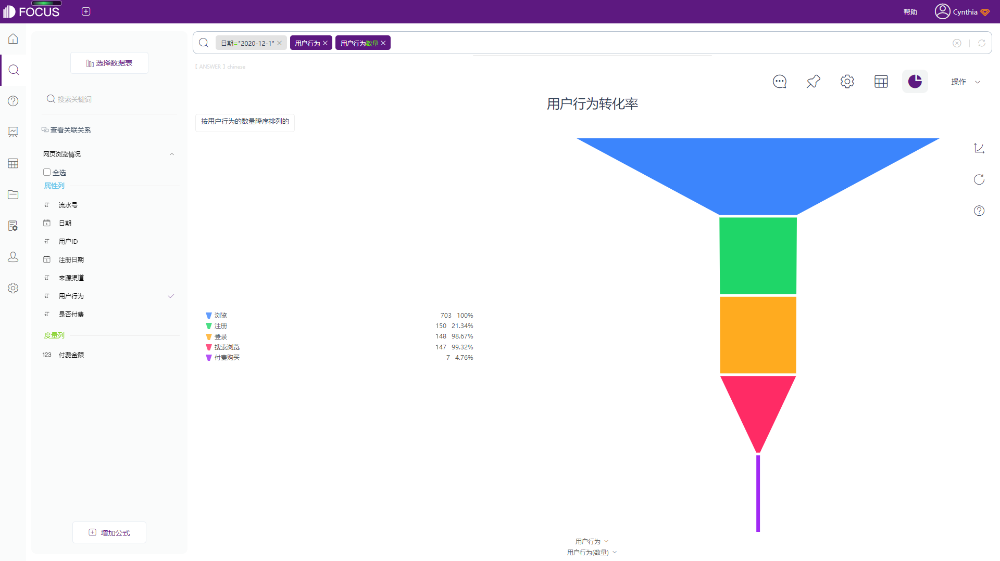

海盗法则AARRR模型在2007年被首次提出，其中最重要的五个指标分别是Acquisition（获取）、Activation（激活）、Retention（留存）、Revenue（收入）和Referral（自传播），用于研究获客和客户留存的原理，是目前最优的用户增长模型。

**在这5个指标中，最重要的指标就是激活。**流量获取相对比较容易，最难的是客户留存和变现。相比较而言，用户激活操作起来难度中等，还可以为后续的3R打好基础。

### **什么是用户激活？**

肯定会有很多人认为，用户激活等同于注册。从形式上看，两者确实很容易混淆，但用户激活会比注册更为复杂，可以将用户激活理解为一组动作，它的核心是在用户第一次使用产品时为用户迅速提供产品的核心价值单元。举个例子，对Facebook来说，一个激活用户的标准是14天内添加了10个朋友；对DataFocus来说，一个激活用户的标准可以是7天内完成了10次搜索。

激活率则是衡量用户在使用程序的早期阶段中发生的里程碑时间的人的百分比。**一般选定激活里程碑事件后，当用户完成它，通常会使他们成为付费或高度参与的客户。**

里程碑因公司而异，具体取决于公司产品和业务目标，可以是任何增加用户回来并继续使用产品几率的事件，属于产品的核心价值事件。社交平台的里程碑时间可能是添加第一个朋友的用户百分比；音乐APP可能是查看有多少用户创建了第一个列表专辑。

### **如何计算激活率**

**【完成设定里程碑的用户数/总人数（注册用户数）】\*100=激活率(%)**

只要选定需要跟踪的里程碑事件，计算激活率就很简单。将完成该事件的用户数除以注册产品的用户总数，即可得出激活率。

DataFocus等BI工具可以通过问答或数据大屏，提供简单的方法来监控有多少人正在完成设定的里程碑事件。同时还可以帮助企业监测多个事件用以确定其里程碑事件。

截图来源：DataFocus（数据已脱敏）

截图来源：DataFocus（数据已脱敏）

### **为什么跟踪激活率至关重要**

激活率可以衡量用户引导工作是否成功。优秀的用户激活可以让用户在第一次使用产品时迅速体验到**“aha moment”**（惊喜时刻）。如果您的激活率较低，则可能表明您的用户引导过程存在问题，用户在完成关键里程碑之前就退出了。

持续偏低的激活率也可能意味着您的营销和销售工作正在吸引低质量的潜在客户。他们中的大多数人在完成用户引导之前退出，可能是因为他们意识到产品并不适合他们，那么拥有大量初始注册的好处就会减少。

如果您知道自己的激活率明显偏低，一定要借助数据分析工具，深入挖掘数据以了解原因，然后从根本上解决问题。

最后，我们可以将得到的激活率与行业基准进行比较。注意，务必要查看拥有类似产品并可能正在审查类似客户引导的公司的基准。当然，如果您的激活里程碑事件是比较独特或稀少的，那么可以选择使用公司内部基准。

希望看完这篇文章的同学们，可以通过监控用户激活阶段核心数据指标的变化，不断设计策略进行优化，反复迭代，最终提升激活率，达到用户增长的目标。
