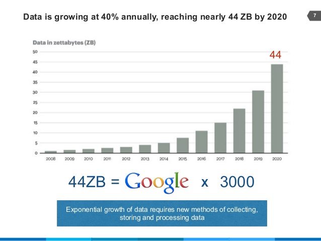

# 数据的复杂性有两个维度

根据IDC的预测，到2020年，全球数据总量将达到44ZB，这相当于3000个谷歌数据量，年复合年增长率高达40%。数据越来越多，数据源也呈现多样性。根据Ventana的研究，70%的组织需要集成6个以上不同的数据源。与此同时，解锁数据并使用它进行业务决策的价值也在增加。

对于企业用户来说，理解这些复杂的数据并释放其潜力是保持竞争力的关键。对于IT组织来说，复杂的数据可能会在数据管理方面造成各种各样的问题，阻碍系统的性能，甚至导致程序崩溃。

显而易见，数据的复杂性越来越高，突出的表现在两个方面：

**一个是数据的量级，另一个是数据源的种类。**

如上图所示，数据的复杂性可以用一个矩阵表示。数据量越大，查询和存储数据的工作量就越大，成本也越高；数据源种类越多，用于分析的数据所需的准备工作就越多，难度也会加大。数据复杂度矩阵从这两个维度很好的描述了数据的问题。您的数据可能是简单的、多样化的、大型的或复杂的。在考虑业务分析程序时，不同的数据状态应该选择不同的处理方案。

# 简单数据

数据复杂性矩阵中，简单数据由来自有限来源的较小数据集组成。大量的中小企业、团体组织的数据都呈现这种情况。要对简单数据集进行分析，不需要复杂的操作，也不需要进行数据模型优化。简单数据集一般可以直接查询，而不需要对数据源创建索引或进行复杂的聚合。如果只有一两个数据源，可以直接对数据关系进行建模；甚至可以直接查询数据库，而不需要对数据进行中间处理，比如存储、清洗等等。

不过，在考虑为简单数据提供业务分析解决方案时，也存在一些挑战。你的数据总是很小吗?它会随着时间的推移而增长，还是会扩展到更多的数据元素或数据源?如果您的数据大小或数据源的种类都在增加，您的业务分析解决方案将如何扩展?

这些挑战在关系型数据库的实时连接中被放大。当用户数量逐渐增多时，执行复杂的查询，对性能的影响是非常大的。糟糕的性能将会成为用户做好业务分析的头号障碍。这样的连接不仅会使业务分析解决方案面临性能低下的风险，而且还会影响核心业务系统的性能。这些性能问题最终会影响到IT部门，而“简单”的东西就不那么简单了。因此业务部门在规划数据分析业务时，一定要有一定的前瞻性，考虑好平台的扩展性。

# 大数据

数据的来源或种类较少，但是数据量非常庞大（如：单表行数亿级以上）。这种情况位于数据复杂度矩阵的大数据象限。大量的互联网企业、电商企业或零售企业的数据情况均属于此类。他们数据往往只是来源于少量业务系统，如电商平台、CRM系统，APP等。这类数据的处理往往要创建索引、聚合表、搭建集群等，以便以合理的性能查询数据。

IT人员在应对大数据集的时候，一般会通过建设数据仓库来打造解决方案，例如购买用于分析查询的数据仓库 Vertica 或专门的数据仓库设备(例如Netezza)，也有一些用户采用Kylin等Cube解决方案。这类解决方案，大部分时用空间换时间的思路，通过消耗大量的内存去解决性能瓶颈；或者通过OLAP，比如构建Cube、数据切片，这样往往又牺牲掉了业务分析的灵活性，丢失数据分析的精细粒度。以上所提的解决方案，还没有考虑到企业的业务数据向复杂性转变带来的复杂度，而这几乎时必然的。企业发展到一定的程度，业务会原来越多元化，产生的数据种类也会逐渐趋于复杂。如果只是简单为应对大数据集的性能问题建设解决方案，IT人员会发现工作会逐渐变得越来越复杂。

# 多样化的数据

多样化的数据一般是指从较多的数据源导出而来的，但是数据量并不大（单表数据在百万行量级）。这类数据的分析要耗费大量的时间在数据预处理上，比如进行ETL清洗，弄清楚并建立各种数据表之间的正确关系结构。随着数据源（和数据表）数量的增加，这个ETL过程变得越来越复杂，需要专业的DBA人员重塑数据、创建新模型或创建各种各样的数据库视图，这就对数据库工程师的业务能力提出了较高的要求。此外，为了保证保持分析的敏捷性和及时性，数据清洗流程必须自动化，此时，如果又有新的数据源接入，则整个数据清洗流程框架就必须进行迭代更新。由此可见，对于多样化数据，在生成任何数据分析输出之前，IT团队的大部分时间和精力将消耗在ETL步骤中，持续的开发，迭代，维护等等。然后，整个数据团队的资金投入或资源消耗将会向这类数据准备工具倾斜，比如花费巨资购买诸如Informatica等，尽管从数据量的角度来看，根部用不着。

# 复杂的数据

数据量巨大，并且数据来源也多种多样，这就构成了复杂数据集。大型集团公司或跨国组织的数据一般属于这类情况。复杂数据集的挑战来自于两个方面，一个是应对海量数据的性能挑战，一个是应对多样性数据源的数据清洗和管理挑战。大量的复杂建模工作、创建索引、聚合，甚至创建数据cube，进行切片，等等都需要大量经验丰富的数据库工程师团队的专业技能。处理这类复杂数据集的数据分析业务时，往往需要组建项目小组，进行跨部门的合作。所有上面讲到的多样性数据集和大数据集的问题都会在这里被放大，最终你会发现这是一个极其消耗高成本人力资源的工作，并且需要大量的硬件资源做支撑。

复杂数据集常常带来高成本。首先，需要购买多种第三方工具，BI（商业智能）工具的许可费通常只是冰山一角，还包括额外的数据仓库和数据准备工具的许可费用，以及对应的硬件成本；另外，集成和维护来自不同供应商的多种工具所需的开销和专业技能也可能产生额外成本，这些工具有时候不一定能有效地协同工作，这就需要增加配置运维人员应对这些挑战。这些都会导致业务分析师的敏捷性降低，获得有效洞察的时间更长。

# 如何运用DataFocus应对这些挑战

数据复杂性矩阵是客观存在的，企业或组织的数据形态也不会简单的只停留在某个象限一成不变，当企业的业务发展时，特别是快速增长时，他们的数据形态将会快速迁移。

如何根据企业的特征，花费合理的成本打造有效的解决方案，是CIO们必须面对的选择。我们可以把这类挑战分成两个方面，一个是永远的性能挑战，一个是永远的复杂性挑战。优秀的方案一定是要兼具这两个方面的考量。通过引入新技术，投资新硬件，可以有效的提升性能，但是我们不能因此丧失灵活性；同样的，解决复杂性的挑战，最好的方法就是化繁为简，但绝对不能丢弃灵活性，不能将分析任务进行简单的固化，这会为将来数据量的升级带来巨大的障碍。

DataFocus最大的特点是其基于NLP技术的灵活的查询技巧，围绕这一点，DataFocus Mini可以很好的处理一些企业的简单数据，既可以直接通过读取excel，或者连接用户的业务数据库，数据量不大的情况下，无需建模，就可以实现快速的查询、分析、可视化等工作；DataFocus 标准版则增加了内存数据库模块，其MPP数据仓库可以有效的应对大数据集的难题，专业版更是提供了弹性扩展能力。当企业用户的数据进化到复杂数据集阶段是，DataFocus又可以和优秀的第三方数据工具协作，简化数据源的复杂性。
