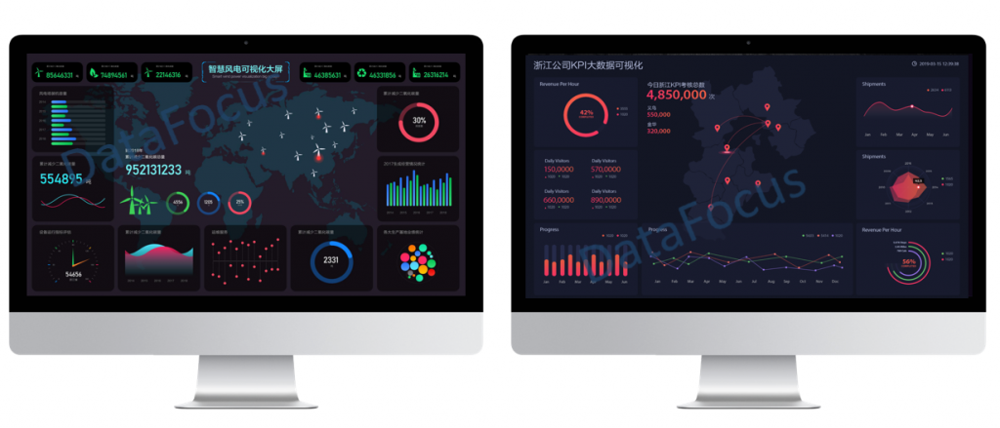
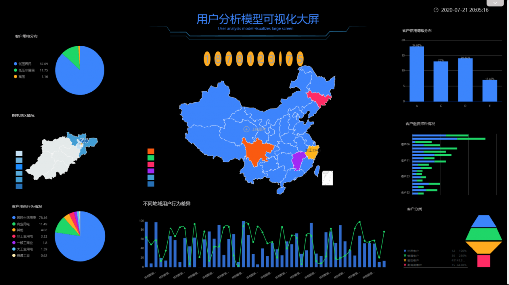

运营产生数据，数据支撑运营数据分析这件事情，听起来像是程序员干的，但它却在悄无声息地接近每一个运营人。通过数据分析的方法，我们可以快速去了解一些新的领域，了解新的市场，从而知道机会在哪，有效降低试错成本。

运营人为什么要做数据分析？

## 一 运营产生数据，数据改变运营方式

数据分析，听起来像程序猿做的，但却在悄悄的靠近每一个运营者。

很多互联网大厂，早已把数据分析做为管理决策的客观性根据。即便是在初创期产品，用户、运营、市场销售等数据信息也被证实具备非常大的剖析使用价值。

产品功能如何更新迭代？转化流程该如何优化？如何通过用户画像来做资源的精准投放？如何通过用户行为高效促活？……这些之前看似可以拍脑袋决策的事情，缺点和局限性在客观数据面前仍然很大。

之前的日色减缓了，如今每日都是有新的造成、兴盛、消退。很有可能会发觉，之前合理的经验，在商业服务自然环境的迅速不断中，已不那麼靠谱，生命期显著减少。

之前的时间过得很慢，但是现在随着科技互联网的飞速发展每时每刻都有新产品新东西的产生。我们发现之前积累的经验变得不再那么有效，产品的生命周期也明显变短。

数据驱动和精细化运营时代已经来临

流量运营：从仅仅关注pv、uv等指标到现在的CPC、DAU、平均访问时长、跳出率、访问深度、转化等等更加精细的指标，虽然数据规模呈现指数式的递增，但是这对于用户行为的判断将更加的准确，更具有分析价值。

## 二 数据分析 让运营更加精细化

实际上，在一些稍微正规的产品运作中，精细化运作的趋势越来越明显。以下是关于运营中最常见的几种流程的说明：

### 拉新用户画像。

这件事看起来似乎很简单，但实际上却是因为猜测很简单，精确的定义很难。以前我们对用户的定义通常是：“25-30岁的白领”、“有阅读习惯的工作场所年轻人”、“1-3年的程序员”……但是，实际上这并不意味着什么。

使用者使用的产品、对产品的认知程度、使用频率、消费量分布等，其实这些都可以通过对产品本身的用户数据进行分析，得出更深刻的结论。

或许我们也可以通过开放数据集，或者利用爬虫程序获取外部数据进行分析，这是一项非常可靠的行业调查。利用数据分析的方法，我们可以迅速了解到一些新的领域，了解到新的市场，从而知道哪些是机会，哪些是有效降低尝试成本的。

### 广告&渠道选择

你需要分析特定渠道的用户和目标用户的吻合程度，面对多个相似的渠道时，只是粗略估计，往往收益很低。如利用用户画像、市场调查等原始数据进行精确定位，通过广告投放数据进行优化，这些都是需要精确计算和分析的地方。

深入了解广告市场复杂的交易结构及其本身的产品、用户特征，选择合理有效的营销方案和技术架构，是实现商业化的第一步。

### 留存转化分析

产品里面有很多地方要做转换分析：注册转化，购买转化，激活转化等等，一般我们都是借助漏斗模型分析用户的转化过程程。通过漏斗模型分析我们可以大致得出一些结论，如用户在哪些环节受阻，是文案吸引力不足，还是功能体验太差。

但是如果对数据进行更深入的分析，还会得到更多的信息，比如不同渠道的用户转化漏斗的差异，可以为渠道选择和广告投放的优化提供参考。也就是哪些标签下的用户转化更好？丢失的用户是否会受到影响，分别是什么？转换过程中各种影响因素的优先次序如何确定？

精准分析，通过更多的假设检验，从而得到更优解。

### 促活精准推荐

用户行为分析逐渐成为各类优秀产品中不可忽视的一环，今日头条的异军突起，网易云音乐的好口碑，都与此有关。

要分析用户的需求，比如用户感兴趣的内容，内容阅读与传播的比例等等。怎样区分用户类别、相似性，如何根据用户历史习惯精确推荐商品、内容，逐渐成为提高用户活跃度、提高用户粘性的关键。

无论是产品的迭代计划，还是促活策略，产品迭代的方向都是如何确定的。通过对用户行为数据的分析，定位用户浏览热力图，并对不同页面、不同功能的流量进行监控，逐步有针对性地推出新功能，提高用户的使用体验。

## 三 运营者为何必须学习培训数据分析

### 1.用客观分析取代感性的判断

我们工作的每一个细节都在不断的产生着新的数据，而运营则是接触数据的第一个环节，同样也是与用户和产品接触最频繁的人。由于数据经常被技术人员所掌控，或者沉浸在系统之中没有发挥任何作用，导致运营人员作为策略的制定者和实施者却没有办法很好的利用数据进行价值发掘。

从运营的角度来说，在数据的产生和决策的制定之间，必然存在着很大的优化空间，而这个绝大部分是源于数据。从数据分析中发掘价值，优化决策，将会更好的提升运营效率。

从另一方面来说，如果你能够利用好这些数据，从而得出可以支撑决策的结论，并通过容易理解的可视化方式进行展现，那么你便可以更好的说服你的老板，纵使跟技术、产品撕逼，也完全不虚。

### 2.培养对数据的敏感度

当前作为大数据时代，每一个产品都意味着超大的数据量、超多的字段，面对这些将会显得很茫然，不知如何下手？

当然如果你有一些经验就会好很多，基于已有的知识，你知道分析影响产品质量的几个指标，影响转化的因素的优先顺序，这样可以让你经过前期的分析，得出一些初步的结论。

所以在你分析的问题多了之后，你将会有自己对于数据的敏感度，从而养成用数据分析、用数据说话的习惯。在这个时候，你基本已经根据自己的经验基于数据通过对数据分析找出问题、得出结论。这个时候，便是基本养成了数据思维。

### 3.从精细化运营到自动化运营

数据驱动这个词相信你已经听过很多了，粗犷式的运营策略带来的低信噪比、资源浪费，通过精细化运营可以有效缓减。uv、pv等指标已经无法精准决策的时候，如何通过更精细的数据分析，将会是未来运营的驱动力量。

更有甚者，基本的，重复的，低价值的运营工作，会逐渐被自动化运营所取代。比如基于数据分析的推荐系统，已经很好地代替一部分内容的筛选和推送。未来运营人的一个核心竞争力是，通过数据分析实现高效自动化运营。

## 四 怎样快速入门数据分析

要入门数据分析，你一定要了解什么是数据分析，数据分析就是指用适当的统计分析等方法对收集来的大量数据进行分析，并从中提取有用的信息，形成结论用[可视化](https://www.datafocus.ai/tag/%e5%8f%af%e8%a7%86%e5%8c%96)的形式展示。在实际的业务工作中，数据分析常常辅助企业管理层制定各项决策。

其次，要想进行数据分析，必然要有辅助工具，选好数据分析工具是关键，就像我，在数据分析工具这里踩过多少坑，差点被打击的放弃数据分析。市场上数据分析工具有很多，我之前就选了一款比较有知名度的，但是因为我没有什么IT基础，到后面根本用不下去，因为很多操作以及分析过程还是需要用到IT知识或者代码基础，所以当时很受打击。后来实在不行，我果断放弃这款工具，选择了另一款数据分析工具，正是这款工具帮助我踏入了数据分析的大门，这款工具就是DataFocus，可能很多人也听过。

DataFocus有它“过人之处”，它独有的[自然语言](https://www.datafocus.ai/tag/%e8%87%aa%e7%84%b6%e8%af%ad%e8%a8%80)搜索式分析，不仅非常创新，还大大降低了数据分析的难度，真的不夸张，我刚学了几分钟，就可以进行简单的分析了。而且它的图表类型也很丰富，时序图、词云图、[弦图](https://www.datafocus.ai/tag/%e5%bc%a6%e5%9b%be)、箱型图等高级图形也都有，基础的柱状图折线图这些也不少，图表转换也非常简单。总而言之，就是用了DataFocus之后，我的信心又找回来了，它操作简单，功能强大，性价比高，基本人人都可以很好地用它进行数据分析，没有难度，学习成本非常非常低。
