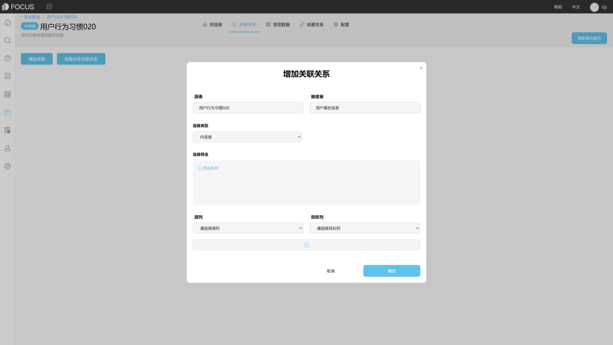

其实如今技术的进步和信息技术的发展，使整个世界成为了一个全球化时代，让全球的社会生活的方方面面都拥有了各个领域都发生了很大的改变。那么从营销服务看看BI分析技术，

今天小编帮大家总结相关的知识。

基于软件工程的思想，在客户营销服务支持系统（CMSS）中加入商业智能技术是十分可行的，因为在客户营销服务领域中，更加适合加入轻型的BI技术，这有利于一些新的尝试性和创造性的想法的产生与应用。

要将BI技术应用与营销服务行业，就必须首先了解商业智能的几个核心技术：数据仓库（DW），数据集市（也是数据仓库的一种形式），在线分析处理（OLAP）和数据挖掘（DM）。在设计与实现对一个特定企业的客户营销服务支持系统时，首先需要对企业的需求进行明确，企业究竟需要哪些功能和系统应该完成哪些模块，都是需要重点考虑的。在完成需求分析之后，就要对客户营销服务支持系统中的BI应用模块进行充分的系统分析，进行蓝图设计和系统模式的选择。对于开发过程中BI技术的一般原理和方法的应用，需要格外引起关注，只有在这些原理和方法的基础上进行设计，才能实现有效的系统，并进而满足企业的需求。

当然，局部系统的设计和实现是最值得精细打磨的，需要不断得到完善。总之，BI技术在客户营销服务领域具有很大的发展潜能，在企业内部建立并推行客户营销服务支持系统具有普遍价值与意义。

以上这些从从营销服务看BI分析技术，不知大家的都了解了多少呢，其实作为企业对于这点应该都是熟悉的，而datafocus作为分析系统，也是一个很好的呈现。还有不懂的知识，可前往网站询问小编。
