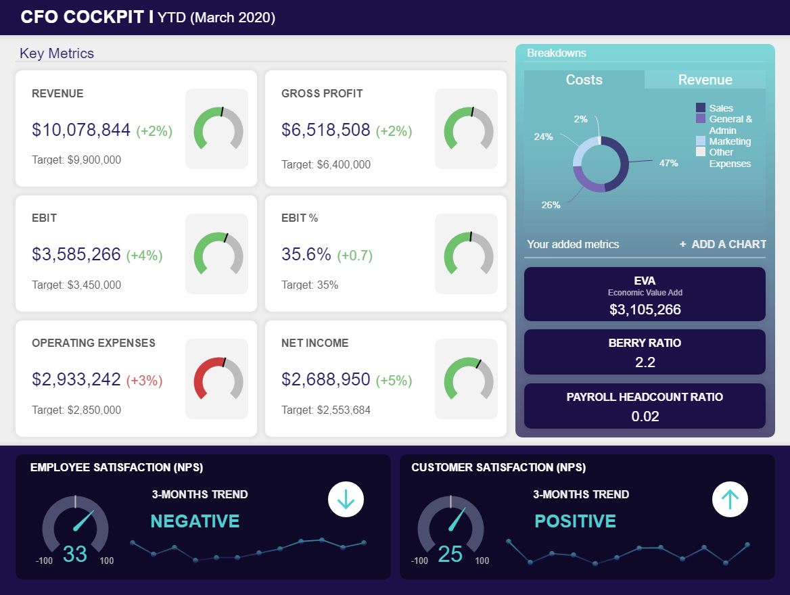

企业世界是快节奏和不断变化的。无论您从事何种行业或细分市场，如果您想保持适应能力并在竞争中领先一步，使用正确的数据驱动工具并利用公司仪表板至关重要。

通过从企业最有价值的数据中榨取每一滴价值，您将提高效率，同时提高利润。这就是企业仪表板的用武之地。

凭借动态功能和大量交互式洞察，[业务仪表板](https://www.datafocus.ai/infos/dashboard-examples-and-templates)是实现更繁荣、更智能的业务未来_的关键。_

在这里，我们更详细地探索企业仪表板，着眼于企业仪表板软件的好处，以及一些真实行业的例子。

让我们首先考虑一下公司仪表板是什么。换句话说，就是企业仪表板的定义。

## 什么是企业仪表板？

公司（或企业）仪表板是动态数字和可视化工具，为广泛的企业或公司的指标和数据提供全面的工作洞察，专注于监控、优化和战略目标的实现。

良好的现代企业[仪表板功能](https://www.datafocus.ai/infos/best-dashboard-software-features)将提供从一个中心位置访问每一个重要的数据驱动的洞察，以易于理解的视觉格式呈现信息，最终全面改善决策制定。

公司仪表板软件使用易于理解的可视化 KPI，使您能够发现趋势、识别潜在弱点并制定战略，从而提高您在所有关键业务领域的绩效。

[使用现代商业智能工具](https://www.datafocus.ai/infos/best-bi-tools-software-review-list)创建的企业仪表板，是您在黑暗中的火炬 ，是 一种了解数据并将其转化为公司最强大资产的有效方法。

## 企业仪表板示例

我们已经查看了企业仪表板定义并考虑了企业绩效仪表板的主要功能 ， 现在我们将了解三个完全不同但同样强大的真实公司仪表板示例。

### 1) 首席财务官仪表板

_\*\*点击放大\*\*_

**主要 KPI：**

- 工资总人数比率
- 经济附加值 (EVA)
- 贝里比率
- 员工满意度

[我们的 CFO 仪表板旨在提供对每条相关财务分析](https://www.datafocus.ai/infos/finance-analytics)数据的一目了然的见解，是一种全面提升公司的财务健康状况的工具。

这是一个基于成本、销售目标、毛利和客户或员工满意度水平的企业绩效仪表板，深入到四个动态[财务图表中，这是所有类型的企业业务的成功都需要的仪表板。](https://www.datafocus.ai/infos/financial-graphs-and-charts-examples)

企业仪表板的设计意味着首席财务官即使在压力下，也可以提取重要的内部和外部数据洞察，同时进行详细的财务分析，最终提高货币效率，同时有利于业务的整体增长。

### 2) 首席技术官仪表板

_\*\*点击放大\*\*_

**主要 KPI：**

- 关键bug数量
- 未解决的问题
- 估计的准确性
- 新开发的功能
- 团队流失率

在许多方面，IT 部门是每一个现代企业跳动的心脏，或者至少是神经中枢。如果您照顾好公司的神经中枢，它就会照顾您。 我们的 CTO 仪表板将帮助您做到这一点。

作为我们最强大的公司仪表板示例之一，这个技术驱动的工具专注于五个高度可视化的[IT KPI 和指标](https://www.datafocus.ai/infos/kpi-examples-and-templates-it)，它们共同提供了以 CTO 为中心的高级见解的清晰全景概览。在这里，您可以发现需要修复的潜在问题或错误，处理任何未解决的问题，并检查任何新开发的进度以及许多其他重要活动。

CTO 的工作节奏很快，并且在不断发展。这种最全面的企业仪表板工具将通过其逻辑设计、交互功能和以 IT 为中心的 KPI 的紧密组合来简化任务。

### 3) 首席营销官仪表板

_\*\*点击放大\*\*_

**主要 KPI：**

- 销售目标和增长
- 网站流量与潜在客户比率
- 每个潜在客户的成本
- 线索与 MQL 比率
- MQL 与 SQL 比率

公司的成功需要的另一个仪表板；我们的 CMO 数据工具对于希望简化和扩展其业务的核心营销工作的任何人来说都是无价的。

在如此重要且包罗万象的角色中，CMO 并不总是有时间详细研究其最高级别的营销指标。但是，作为一个企业仪表板设计，它提供了可消化的基本洞察组合，包括每个潜在客户的成本、销售目标和增长以及网站流量与潜在客户的比率（以及其他基本信息），我们的 CMO 仪表板可以让您快速简单地掌握营销数据。

借助这个最强大的企业仪表板工具，您将能够了解应该如何以及在何处对您的活动进行战略改进，同时创建真正引起受众共鸣的活动和信息。

通过节省时间并能够加强基于营销的决策，您将加速公司的成功，同时在竞争中领先。此外，专注于长期营销目标的[KPI 记分卡甚至可以帮助最忙碌的 CMO 定期跟踪公司促销活动的进度。](https://www.datafocus.ai/infos/kpi-scorecard-examples-templates-to-track-performance)

## 动态企业仪表板的 10 大好处

既然我们已经确定了公司仪表板是什么，并查看了真实世界公司仪表板的动态组合，我们将通过提供十个不可否认的公司仪表板优势来将我们的信息带回家——从简单的概念开始。

### 1）仪表板很简单

传统的电子表格软件使您的生活复杂化。老实说 - 在当今日日益增长的快节奏（和彻头彻尾的疯狂）的世界中，谁需要更多的复杂性？

您可以创建使用反映许多不同数据源的图表构建的[交互式仪表板。](https://www.datafocus.ai/infos/interactive-dashboard-features)这些数据源的范围可以从 SQL 数据库到 CSV 文件，再到 Facebook 或 Google Analytics。因此，您不必为每个数据源以不同的方式手动创建演示文稿，而是可以拥有一个公司仪表板，其中包含来自世界各地不同数据中心的数据。

对你的下一次会议有用吧？这就引出了我们的下一个好处……

### 2) 企业仪表板可让您实时显示结果

[仪表板软件](https://www.datafocus.ai/infos/best-dashboard-software-features)可以让您直接连接到客户的实时数据（包括社交数据和网络分析），而不是静态的、难以使用的电子表格。这些图表实时更新，让您可以随时进行准确的演示。

想象一下，当潜在客户亲自询问您如何帮助现有客户时，这种能力将是会给人留下多么深刻的印象。空谈很便宜 ，但用数据表明，您的公司就走在了前面。这和说“由于我们的广告代理，我们的客户在本季度注册量比上一季度增加了 23% ”是一回事。

在动态仪表板中逐字地向他们展示注册列表和增长率是另一回事。人是视觉动物。在为您的公司完成交易和兑现支票时，永远不要低估漂亮（且准确）的仪表板的力量。

### 3）您可以在现场自定义和共享您的仪表板

你有没有看过一次性现金结算的电视广告，广告人惊呼“这是你的钱，在你需要的时候使用它！”。就像 JG Wentworth 一样，我们希望您知道 - 这是您的数据，您可以在需要时（以及如何）使用它！

我们的[仪表板创建者](https://www.datafocus.ai/infos/dashboard-creator)允许您根据自己的需求和品味来可视化您的数据。我们认为，对于习惯于处理视觉信息和一目了然地做出决策的消费者来说，企业仪表板是必不可少的。您可以使用正确的logo和颜色对它们进行主题化和品牌化设计，以使外观和感觉与您的品牌个性相匹配。

如果缺少图表，没问题，通过搜索界面，您可以立即将可视数据添加到仪表板。

这种“即时”定制将赢得重要国际客户员工会议的支持，为他们所有紧迫问题提供实时可视化的答案。

### 4）权限和安全性不再是问题

使用不同的权限系统，您可以轻松地强制执行谁可以访问您的仪表板以及允许多少人构建它们，以提高数据安全性。

相比之下，要么让每个人都可以随意访问Excel表格或数据集，要么让初级员工在每次需要回答与数据相关的问题时联系IT部门。

此外，通过这种方式，您可以邀请用户通过选择他们想要跟踪的指标来回答他们自己的问题。

### 5）如果你知道 SQL，仪表板会更强大

到目前为止，我们一直专注于仪表板如何让事情变得更简单、更容易。我们直观的搜索界面会自动生成并执行优化的 SQL 代码，让您可以实时创建有意义的图表和图形。

但是，如果您拥有强大的 SQL 技能，您也可以使用我们的软件作为引擎来获得更强大的洞察力。您在构建查询时手动输入代码以获得更高的灵活性。您可以执行跨数据库查询并立即将结果可视化。

此外，我们的[SQL 报告软件](https://www.datafocus.ai/infos/sql-reporting)接受广泛的输入。我们支持 MySQL、Oracle、PostgreSQL、SQL Server 到 AWS 等等。您将能够运行跨数据库查询并轻松合并结果。

### 6) 易于查看的 KPI 推动绩效

我们的核心信条之一是，什么被跟踪，什么得到改进。当您让团队的所有成员轻松跟踪和查看[KPI](https://www.datafocus.ai/infos/kpi-examples-and-templates)时，您的团队就可以更轻松地以可衡量的方式进行改进。

例如，每个销售代表都可以查看整体[销售仪表板](https://www.datafocus.ai/infos/dashboard-examples-and-templates-sales)，并直接查看他们的绩效如何与更大的图景联系起来。他们可以看到一个“排行榜”，显示谁创造了最多的收益，并被竞争所激励。每日和每周的[销售报告](https://www.datafocus.ai/infos/sales-report-kpi-examples-for-daily-reports)也可以作为强有力的反馈机制，帮助经理们对销售部门进行试点。

此外，营销专业人员可以快速了解他们当前的活动与过去的活动相比表现如何。这允许他们在活动低于标准时迭代活动，或者在该活动成功的情况下继续投资。

### 7) 可以从任何设备轻松访问它们

使用许多传统的数据呈现方式，您只有在公司内部的特定计算机上才能访问。

想通过手机查看 KPI？祝你好运。

想在平板电脑上向客户展示您的最新销售数据？对不起，朋友。

但是，我们所有的仪表板都是基于浏览器的，这意味着您可以从您的智能手机、平板电脑、上网本、笔记本电脑或 PC 上访问它们 。要全面了解移动的可能性，您可以阅读我们的[移动仪表板](https://www.datafocus.ai/infos/mobile-dashboards-examples-and-designs)指南。

### 8）他们改善沟通与协作

古语有云：_知识就是力量。_如果企业中的每个人都能获得他们需要的信息，以便更好地完成他们的工作（并与其他部门的人分享重要的见解），那么企业将变得更有效率、更有凝聚力和更具创新性。

公司仪表板软件的可访问的可视化特性与交互式功能相结合，使得在整个企业中理解和共享数据变得容易。要仔细研究此类可视化效果的潜力，我们建议您阅读我们的文章，该文章阐述了各种[KPI 仪表板示例](https://www.datafocus.ai/infos/best-kpi-dashboard-examples)。

当每个人都表现得更好并能够积极协作时，企业就会受益无穷，从而增强在此过程中的增长和适应性。

如果您的业务是分散的并且充满了内部孤岛，那么您应该构建企业仪表板。这将是你做过的最好的企业投资之一。

### 9) 公司仪表板增强了数据驱动的故事讲述能力

公司仪表板的下一项好处是以数据驱动的故事讲述形式出现的。虽然这似乎是一个抽象的概念，但数据讲故事是一种强大的工具，可以显着提升您的业务成功 - 如果您做对了。

数据驱动的故事叙述是将受数据启发的分析转变为具有清晰开头、中间和结尾的逻辑可视化格式的过程。通过这样做，您可以影响业务决策，清晰地概述战略，并通过使最相关的指标具有启发性、吸引力和相关性，促进积极的内部或外部行动。

公司仪表板允许用户以逻辑格式绘制数据驱动的见解，并创建内部和外部利益相关者都可以遵循的叙述，在每一步都保持参与。通过使用公司仪表板软件进行数据讲述，您将：

- 将静态指标转化为可执行的想法。
- 全面改善您的业务流程。
- 简化内部职能并帮助其他人发现重要趋势或联系。
- 提高协作能力，以及鼓励高级员工参与的机会。。

### 10) 企业仪表板有助于进行前瞻性预测

如果您根据自己的特定需求和偏好定制或构建企业仪表板，您将能够以一种超出您想象的方式与数据进行交互，从而扩展您的视野。

通过允许您混合使用过去、实时和预测性数据可视化，[执行仪表板](https://www.datafocus.ai/infos/executive-dashboards-and-reports)将成倍地提高您的前瞻性预测技能，为您提供始终领先于竞争对手所需的工具。

您可以从过去的趋势中学习，通过实时分析快速响应您周围的情况，并利用预测数据将任何潜在问题扼杀在萌芽状态，同时制定仅在财务上有效并有助于加速成功的活动或策略。

使用公司风格的仪表板时，您会很快意识到过去的、实时的和预测性洞察相辅相成，为您提供精简每个业务领域所需的洞察力，同时以绝对的信心进行预测——这是数字时代可持续成功的关键因素。

## 数据呈现的未来

_“如果没有大数据分析，公司就会失明又失聪，就像高速公路上的鹿一样在网络上徘徊。” ——_ _杰弗里·摩尔_

[数据分析软件](https://www.datafocus.ai/infos/data-analyst-tools-software)不仅有助于营销专业人员的工作，也有助于任何需要报告和可视化大数据集的企业家的工作。

无论您是负责汇报供应链的运营人员，还是向投资者融资的首席执行官，共享有意义的公司仪表板是实现成功业绩的首要任务。

以企业为中心的仪表板不再是为 CMO 或孤独的数据分析师所保留的，他们在大量的数字信息中跋涉。在现代商业时代，数据驱动的工具和平台对于任何希望生存或真正繁荣的公司都是不可或缺的。

借助交互式仪表板，业务中的每个人都将获得他们需要的数据，以发挥他们的能力，同时与同事分享任何新发现或见解。

自信、协作、透明的企业文化将在我们这个超级互联的时代中遥遥领先。数据驱动的仪表盘是使这一级别的成功成为现实的工具。

说到数据驱动的卓越，我们可靠而灵活的[在线数据可视化](https://www.datafocus.ai/infos/data-visualization-tools)工具将为您节省大量时间：

- 在 Excel 中对列进行排序。
- 回答非 IT 人员的问题。
- 在不同的数据源和工具之间切换以创建图表。

您可以将时间投入到以下方面，而不是浪费时间执行这些平凡的任务：

- 批判性地思考公司战略（在直观的仪表板的指导下）。
- 与公司内部的关键人物建立关系。（通过令人信服的图表）。
- 在最赚钱的销售渠道上加倍投入。
- 开发值得您投入时间和金钱的活动。
- 以推动动力和创新的方式改善内部关系。

借助基于云的技术，您可以随时随地从多种设备访问数据仪表板。通过将自己从不需要的基于数据的管理任务中解放出来，你可以在远离办公室、咖啡馆或公园长椅的时间里专注于“高层次思考”（大自然可以激发和平静你的思维）。

共享、理解和交流数据不应该是一种乏味或痛苦的体验。我们生活在一个收集、显示和共享您的数据可以很容易和互动的新时代，这是一件美好的事情。

**您准备好加强您的业务并增加您的成功了吗？**

[在此处注册免费试用，](https://www.datafocus.ai/console)以设计一个清晰且具有视觉冲击力的公司仪表板，让您到达您需要到达的地方，甚至更远。

不要错过！
