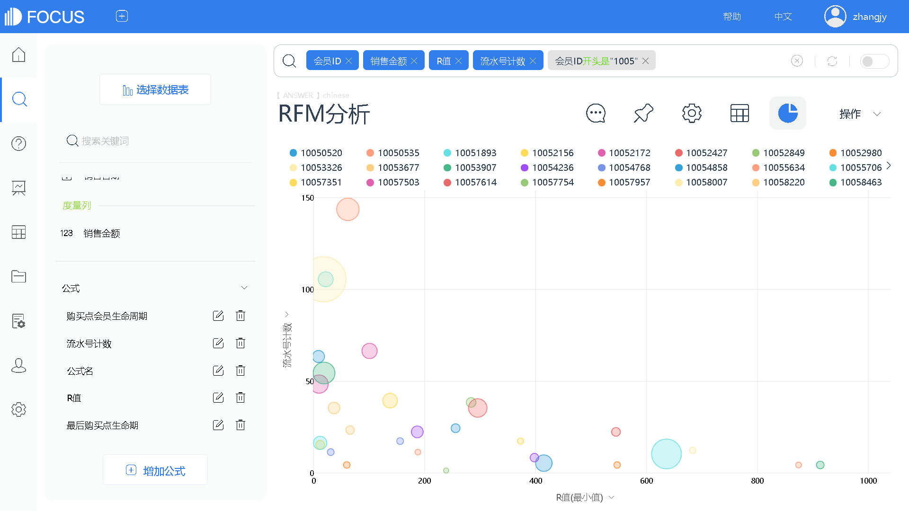
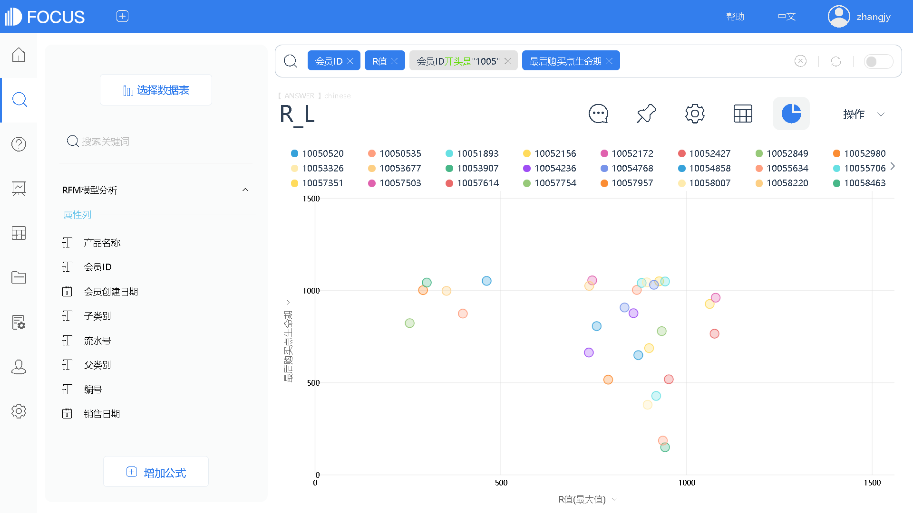
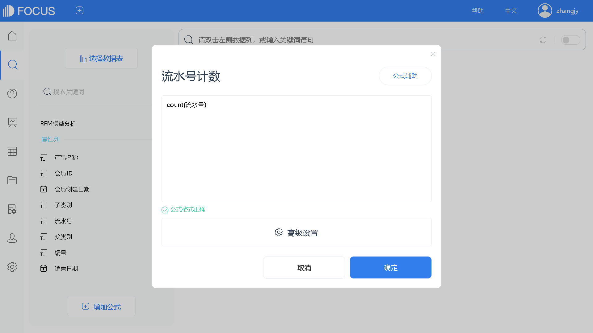

### 1   RFM模型介绍

在上一章中，我们了解了客户生命周期的概念。这章我们来看另外一种客户价值体系的分析——RFM分析。在零售行业中，RFM模型是衡量客户价值和客户创利能力的重要工具和手段。该模型通过一个客户的近期购买行为、购买的总体频率以及花了多少钱三项指标来描述该客户的价值状况。一般的分析型CRM着重于对客户 贡献度的分析，而RFM则强调以客户的行为来区分客户。

RFM包含以下三个指标：

R（Recency）：客户最近一次交易时间。最近一次消费时间越近的顾客最有可能是对提供的商品或者服务最有反应的群体，R在互联网产品指标中代表最近一次登录。

F（Frequency）：代表客户在最近一段时间内交易的次数。最常购买的顾客，也是满意度最高的顾客，F在互联网产品指标中代表登录频率。

M（Monetary）：客户在最近一段时间内交易的金额。消费金额是所有数据报告的支柱，客户的交易度量越大越好，M在互联网产品指标中代表在线时长。

对个体进行上述三个指标的综合状态分析，可以描绘出个体的状态。而对整个用户群体进行上述三个指标的综合分析，就可以看到产品用户的消费特征群像。接下来我们具体来看看RFM分析的使用，观察企业整个用户群体的生命周期状况、消费情况和活跃情况。这里我们加入了一个客户生命周期维度（客户最后一次购买行为点的客户生命周期），引入新指标“RFM\_L”分析。

在观察消费频次和消费金额的基础上，计算出R值，观察所有客户最后一次消费的时间点距离 2020 年 8 月 1 日（数据提取时间范围之后月份第一天）的天数。R值越小，代表最后一次消费时间距离分析时间点越近，客户活跃程度高。从图17-1中可以看到，纵坐标代表消费次数，横坐标表示最近一次消费时间，圆圈大小代表消费金额。一个圆代表一个客户。

图17-1 RFM分析

在图形中加入客户最后一次消费时间点的生命周期信息，以点的大小来表示（见图17-2），观察在不同消费状态下的客户生命周期状态。我们可以看到以R值为横坐标，纵坐标为最后购买点的生命周期。将两张图结合起来，便是RFM\_L分析。

接下来需要对客户进行分类，研究不同类型群体的消费特征。消费进度、消费频率、消费额是测算消费者价值最重要也是最容易的方法，这充分表现了这三个指标对营销活动的指导意义，通过建模可以发现高价值客户的特征和行为模式，并迅速定位到该类人群，建立良好的客户关系，以获得更高的企业利润。除了进一步建模之外，还可以结合其他营销目标，通过客户的消费行为数据，构建多种具有混合特征的标签，实现更细微、更精准的营销活动，如图17-3。

图17-2 RFM\_L分析

图17-3 数据看板

### 2   技术实现：应用DataFocus实现RFM模型分析

（1）构建“购买点会员生命周期”字段。打开“RFM 模型分析”数据表→单击“增加公式”→输入公式内容：if diff\_days（销售日期，会员创建日期）＞0 then diff\_days（销售日期，会员创建日期）else 0 →单击“确定”，完成字段的创建，如图17-4。

图17-4 构建“购买点会员生命期”字段

（2）构建“最后购买点生命期”字段。单击“增加公式”→输入公式内容：max（购买会员生命周期）→命名为“最后购买点生命期”→单击“确定”，完成字段的创建，如图17-5。

（3）构建“R值”字段。单击“增加公式”→输入公式内容：diff\_days（“2020-8-1”，销售日期）→设置聚合方式为“最小值”→命名为“R值”→单击“确定”，完成字段的创建，如图17-6。

（4）构建“流水号计数”字段。单击“增加公式”→输入公式内容：count（流水号）→命名为“流水号计数”→单击“确定”，如图17-7。

（5）RFM分析。双击选择“会员ID”“销售金额”“R值”“流水号计数”进入搜索框→在搜索框中键入“会员ID开头是‘1005’”，筛选出ID是1005开头的学生会员→切换图形为气泡图，并更改图例位置，保存为“RFM分析”历史问答，如图17-8和图17-9。

图17-5 构建“最后购买点生命期”字段

图17-6 构建“R值”字段

图17-7 构建“流水号计数”字段

图17-8  RFM分析

图17-9 调整RFM分析结果

（6）R\_L分析。删除“销售金额”“流水号计数”字段，双击选择“最后购买点生命期”进入搜索框→切换图形为散点图，保存为“R\_L”历史问答，如图17-10。

图17-10 R\_L分析结果
