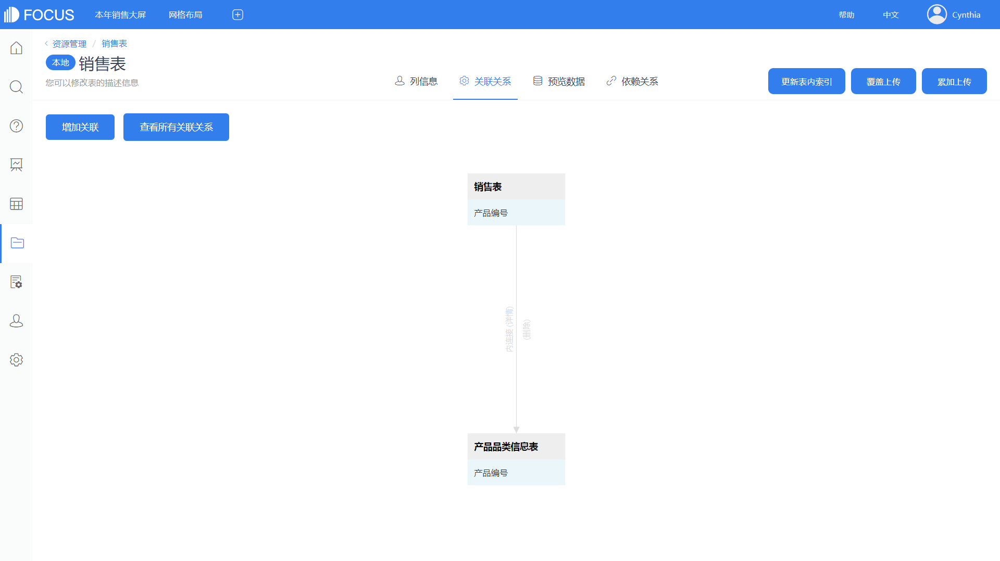
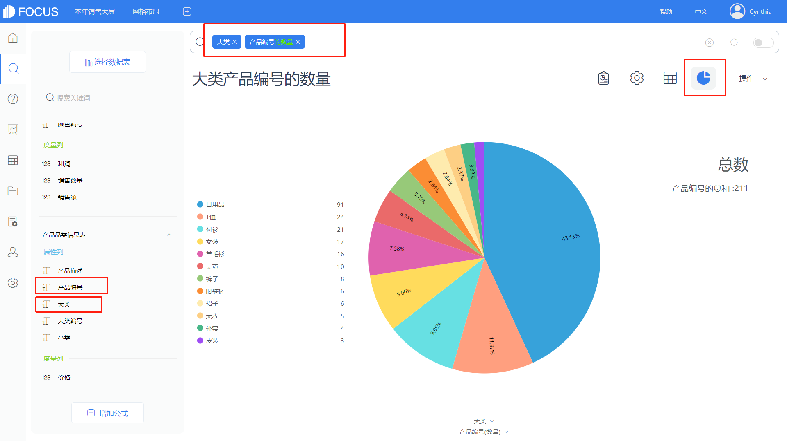
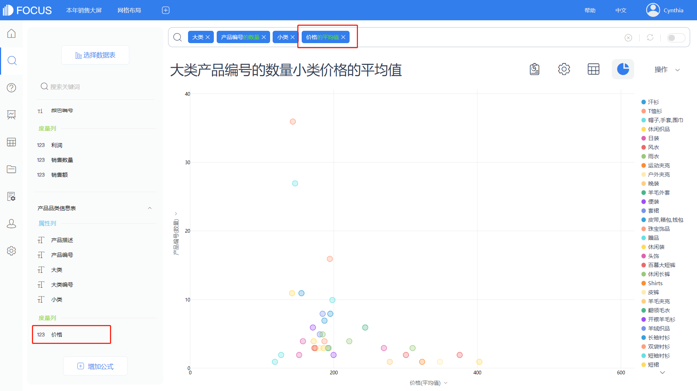

从事企业的数据分析工作，一开始总是围绕企业的产品做文章，尤其是生产制造、贸易流通类企业，其所有的业务活动均与产品息息相关。因此，从产品入手开展分析能最快切入主题。本部分内容将详细讲解如何运用DataFocus快速了解企业产品线分布、评估产品线的优劣；进一步地，通过分析产品各品类的销售数据、挖掘销售规律，进而全面评估企业的产品线，搞清楚哪些是金牛产品类，哪些是瘦狗产品类 （波士顿矩阵，BCG Matrix）。

## 快速了解产品线状况

通常情况下，如果想要了解一个企业的业务，比如了解这个企业的产品线状况，可能需要花费一定的时间，从产品的设计到生产，再到销售，搞清楚这一系列流程，估计几个月就过去了。那么有没有什么方法，能够帮助一个新人快速了解自家企业的业务以及产品销售等状况呢？

其实，最能体现一个企业过去经营状况的，不是同事跟你说公司怎么样，也不是上司给你的一份份文档，而是企业运营多年积累的海量业务数据。数据是最真实的，也是最直接的。因此，如果你是刚进公司的新人小白，那么，从数据的角度来了解企业业务以及各个产品线状况，是最直接也是最快速的。

利用专业的数据分析工具DataFocus，从数据出发，由简单到复杂，整个过程既能了解企业过往的业务，也能了解企业业务中存在的不足之处。

本章所需要用到的数据表以及详细字段如表10-1，数据主要来源于某服装企业脱敏的产品数据以及销售数据。

 表10-1 某服装公司数据

<table id="o90gu" class="ne-table alignleft" style="width: 300px;"><tbody><tr><td colspan="2" width="244">
销售表
</td></tr><tr><td width="122">
ID
</td><td width="122">
String
</td></tr><tr><td width="122">
产品编号
</td><td width="122">
String
</td></tr><tr><td width="122">
颜色编号
</td><td width="122">
String
</td></tr><tr><td width="122">
周ID
</td><td width="122">
String
</td></tr><tr><td width="122">
分店编号
</td><td width="122">
String
</td></tr><tr><td width="122">
利润
</td><td width="122">
Double
</td></tr><tr><td width="122">
销售额
</td><td width="122">
Double
</td></tr><tr><td width="122">
销售数量
</td><td width="122">
Int
</td></tr></tbody></table>

<table id="vClXq" class="ne-table" style="width: 300px;"><tbody><tr><td colspan="2" width="254">
产品品类信息表
</td></tr><tr><td width="127">
产品编号
</td><td width="127">
String
</td></tr><tr><td width="127">
产品描述
</td><td width="127">
String
</td></tr><tr><td width="127">
小类
</td><td width="127">
String
</td></tr><tr><td width="127">
大类
</td><td width="127">
String
</td></tr><tr><td width="127">
大类编号
</td><td width="127">
String
</td></tr><tr><td width="127">
价格
</td><td width="127">
Double
</td></tr></tbody></table>

### 分析案例：简单的产品线分析

首先，我们以某服装企业为例，从最简单的产品品类出发，来了解该企业产品类别的相关信息，从而逐渐知悉其产品线状况。

我们用DataFocus数据分析工具，对该服装企业的产品品类数据做了分析，并以图形和数据看板的方式来展示分析结果，从图10-5中，我们可以站在产品角度了解企业销售现状：

（1）从图10-1中，我们可以直观地了解到该服装企业的产品大类共有12种，但是再往下细分成不同的产品时，可发现其下属产品的数量大有不同，例如日用品下的产品数量最多，高达91种，占所有产品的43.13%，几乎是占据了半壁江山。但是日用品不算是真正的服装，只是服装的附带品。而服装相关大类下的产品品类数量都较少，由此可见，该企业的服装产品线较为单一，类别不够丰富，例如外套，其下属的产品品类竟然只有 4种，这对于当代喜欢追逐时尚潮流的年轻人来说，几乎就等于压缩了其选择的余地。

图10-1 产品大类数量及占比

图10-2 各类产品细分数量

（1）了解产品大类之后，我们可以从更细的维度做进一步分析。从图10-2可知，该企业不仅将所有产品分成了大类，同时也细化成不同的小类别。分析的维度越细，越有利于发现隐藏在深处的问题。在小类中，我们可以看到产品种类最多的是珠宝首饰和帽子、围巾、手套这两类，分别有36种和27种。但这两类都不是真正的服装，而真正的服装小类中，产品种类最多的是T恤衫，仅有16种。从图10-2中，我们可以找到一些疑点。这时候，需要考虑是数据录入的不规范，还是产品分类标准有问题。在分析过程中复查数据源是否正确同样非常重要。

（2）在上述第二个分析结果的基础上，我们加入产品价格的维度，以此观察产品数量和价格之间的关系。从图10-3中可知，该服装企业产品的价格主要集中在 200元上下。这对于一个服装企业来说，价格定位是偏低的，因此判断，该服装企业主要是销售中低端产品。

图10-3 产品价格数量关系

综合上面几个分析结果来看，可以快速了解到该企业简单的产品线状况，其产品类别不够丰富，虽然价格较为低廉，但是由于产品线比较单一，营收来源的广度不足，所以可能导致该企业的风险较高。

为了验证这一想法，随后我们在此基础上，加入了利润这个维度进行进一步分析，结果如图10-4所示：

图10-4 产品利润分布

（3）如猜想的一般，由上述帕累托图可知，企业营收来源比较单一，T恤衫的收入占总体的33%。企业产品单一的劣势在市场中进一步显露，没有足以占据市场的产品，这是企业业绩的一个重大缺陷，过度依赖于某一产品，导致企业抗风险能力大大降低，从而产生诸多隐忧。而且风险高的企业，盈利模式往往单一，外界一有风吹草动，企业就将面临巨大风险，应对不当可能就会破产。

将制作好的历史问答导入一个数据看板中构建一个综合观察大屏，通过数据更新实时监测企业产品线动态，如图10-5所示。从上述的分析中，我们不仅知道了该企业大致的产品线状况，还发现了企业业务中存在的问题。为了了解更多的产品线状况，后续我们将分析更深层次的信息。

图10-5 产品线分析数据看板

### 技术实现：应用DataFocus实现10.1的分析

前面我们利用DataFocus进行数据分析，来了解企业的产品线状况，那么具体是如何进行数据分析的呢？现在，就让我们一起来重现整个过程。

（1）数据导入

首先，数据来自某服装企业（已经过脱敏处理），本次分析需要用到两张表，一张是产品品类信息表，一张是销售表。

DataFocus支持本地数据导入，故我们直接在“数据表管理”页面，点击左上角“导入表——从本地导入表”，即可看到导入本地文件的弹窗，选择恰当的文件格式，随后按照提示进行导入即可，如图10-6。

图10-6 导入数据

（2）联表分析

本次导入的是两张表，而且表与表之间需要联合分析。在DataFocus中，两张表之间联合分析的基础是，这两张表之间创建过关联关系。

首先，选择销售表为主表，在数据表管理页面点击该表详情，进入关联关系页面，可看到两张表刚开始并没有创建过关联关系，如图10-7所示。

图10-7 选择主表

点击增加关联，选择维度表，即产品品类信息表，选择连接类型、关联字段，最后点击确定即可，如图10-8。

图10-8 创建关联关系

关联关系创建完毕，即可在当前页面查看到刚刚创建的关联关系，如图10-9。

（3）搜索分析

DataFocus是国内首个采用搜索的方式进行分析的工具，开创了数据分析中新的交互方式。首先，进入搜索页面，点击选择数据表，数据源选择上述导入的两张表格，随后双击产品品类信息表中的大类以及产品编号，然后在搜索框中产品编号的后面输入“的数量”关键词，即可实时得到分析结果。点击右上角图形转换，转换成饼图显示，并且设置显示数据标签，结果如图10-10所示，这就是DataFocus关键词搜索的便捷之处。

图10-9 显示关联关系

图10-10 产品大类分析

其次，在上述分析的基础上加入产品小类的维度，双击“小类”，将图形转换成堆积柱状图显示，配置图轴，修改X轴为大类，图例为小类，并在图表属性设置中勾选Y轴显示百分比，如图10-11。

图10-11 产品小类分析

我们在小类的基础上，再加入价格的维度，双击价格，修改聚合方式为平均值，将图形转换成散点图，点击配置图轴，X轴为价格的平均值，Y轴为产品编号的数量，图例为小类，点击图表属性，取消勾选显示数值标签，如图10-12所示。

图10-12 价格数量关系

最后，我们分别选择产品品类信息表中的小类，以及销售表中的利润，并在搜索框内输入“按利润的总和降序”，选择以帕累托图显示，勾选显示占比标签，如图10-13所示。

图10-13 产品利润

上述就是本书10.1数据分析的技术实现过程，DataFocus搜索式分析在整个过程中已经有了出色的表现。
