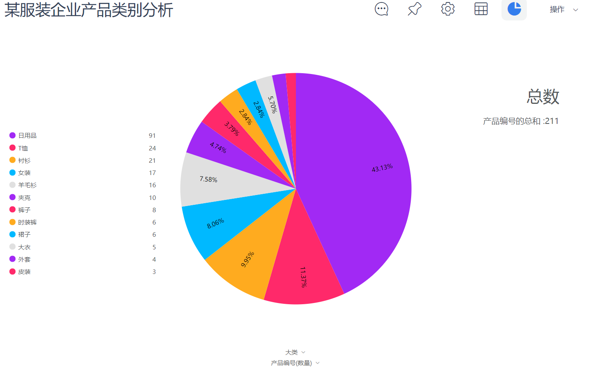
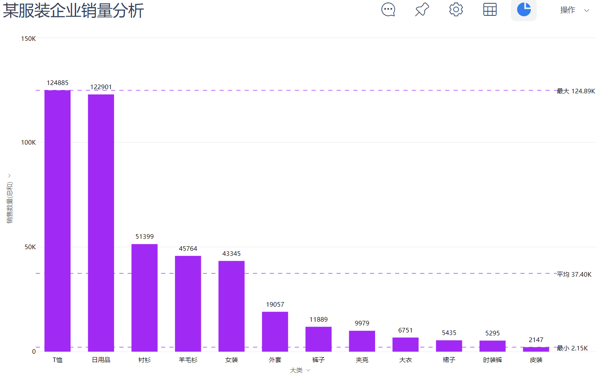
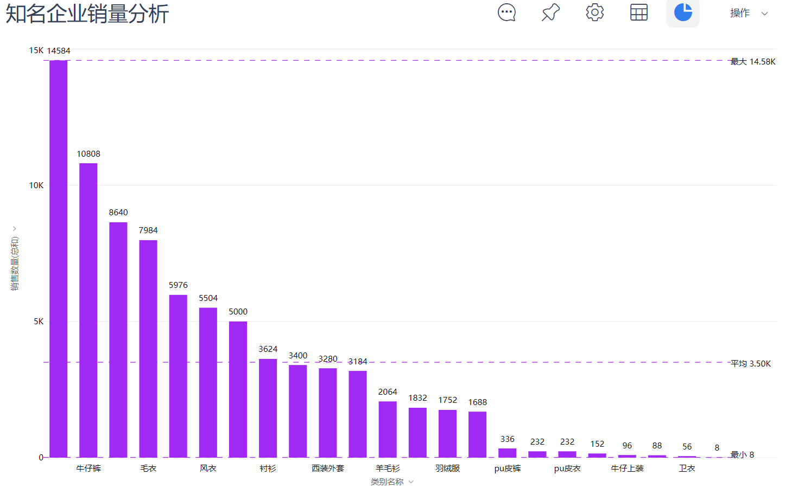
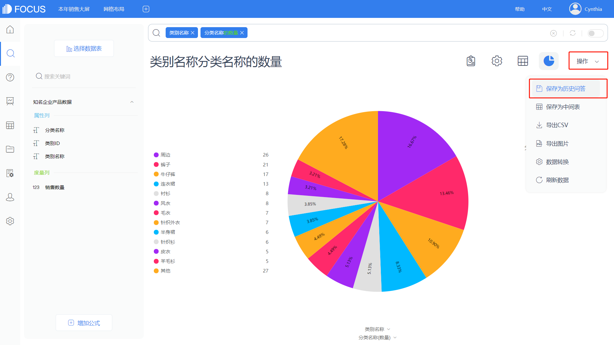
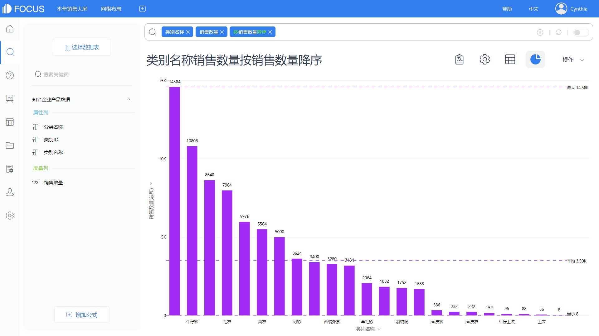

## 学会评估产品线优劣

在《[企业数据分析该怎么开始？如何快速了解企业产品线分布和优劣？](https://www.datafocus.ai/infos/42390.html)》中，我们经过粗略分析，发现该服装企业的产品线其实存在一定的问题。本章，我们将结合行业内强有力的竞争对手或已成为业界领袖的企业进行比较，从产品的种类、数量、销售情况等方面，来进行比较分析和量度。一方面，通过对比和综合思考可以发现企业产品的差距；另一方面不断地吸取他人优点，取人之长，补己之短，不断提高产品效益以及营收水平。

任何事物都是既有共性，又有个性的，只有通过对比，才能分辨事物的性质、变化、发展、与别的事物的异同等个性特征，从而更深刻地认识事物的本质和规律。对比分析也是运营效果评估时经常要用到的。

本章所需要用到的数据表以及详细字段说明如下（表 11-1），数据主要来源于某服装企业脱敏后的产品数据以及销售数据。

表11-1 企业产品数据表

<table id="FQfcG" class="ne-table aligncenter" style="height: 309px;" width="582"><tbody><tr><td style="width: 572px;" colspan="2">
知名企业产品数据
</td></tr><tr><td style="width: 282.922px;">
类别ID
</td><td style="width: 283.078px;">
String
</td></tr><tr><td style="width: 282.922px;">
类别名称
</td><td style="width: 283.078px;">
String
</td></tr><tr><td style="width: 282.922px;">
分类名称
</td><td style="width: 283.078px;">
String
</td></tr><tr><td style="width: 282.922px;">
销售数量
</td><td style="width: 283.078px;">
Double
</td></tr></tbody></table>

### 2.1   分析案例：不同品牌的产品线分析

对比分析，不能随便找个对比的对象，我们需要找的是服装行业内强有力的对手或者业内的领先者。因此，我们选择了业内某知名企业，选取其产品线数据（脱敏后数据），与上一节讲到的服装企业进行对比分析，如图11-1。

图11-1 类别对比分析

（1）从上图可以知道，相比该服装企业的产品类别分布，知名企业的产品类别分布更加均衡，虽然总体的产品类别数量不如该服装企业多，但是由于该服装企业中有43%是日用品类，而知名企业类似于日用品的周边这一类别，仅占了全部品类的16.67%。因此，从服装相关的种类来看，知名企业种类更加丰富，产品线繁多，可供顾客选择的范围也更大，消费的概率也更高。

在之前的分析中，我们发现产品线过于单一，会影响产品的销售情况，也会影响企业的营收以及抗风险能力。由此，我们推断，知名企业的产品线销售情况比该服装企业的更好，而且盈利模式更加多元，抗风险能力更强。

图11-2 销量对比

（2）从图11-2得出的分析结果证实了我们的猜想。从图上可以看到知名企业销售情况更加平衡，没有出现一边倒的趋势，而且“周边”这一类别的销量占比也没有特别大，符合一个优秀企业的产品线状况。综上对比，我们可以推断该服装企业的生产线必然存在一定的问题，可以结合企业营销策略进一步分析。

### 2.2   技术实现：应用DataFocus实现11.1的分析

上一节，我们将该服装企业的产品线状况与业内知名企业的产品线状况进行对比分析，从而发现该服装企业的不足之处，以及可能存在问题的地方。本章节具体来学习如何利用DataFocus快速实现不同产品线之间的对比分析。

（1）先有数据，后有分析

要做数据分析，前提是必须有数据。因此，除上一章节我们已经导入的该服装企业的产品品类信息表和销售表，我们还需要导入对标企业的产品线数据。同样地，我们依然选择导入本地数据文件。

在数据表管理页面选择“导入表——从本地导入表”，选择适合的文件格式，按照提示进行导入，如图11-3。

图11-3 导入对标企业数据

（2）搜索分析，保存图表

我们需要以不同的数据源分析不同的数据，并将图表保存，将保存下来的图表进行对比分析。

首先，需要对该服装企业的类别进行分析。双击选择“大类 产品编号”进入搜索框，修改产品编号的聚合方式为计数，将图表以饼图形式显示。点击右上角“操作——保存为历史问答”，对该图表命名，点击“确定”即完成历史问答的制作，如图11-4所示。

其次，对知名企业的产品线数据进行类别分析。切换数据表为“知名企业产品数据”，双击选择“类别名称 分类名称”，在分类名称后修改聚合方式“的数量”，即可得到分析结果，并将图表转换成饼图显示，点击“操作——保存为历史问答”，如图11-5。

图11-4 某服装企业产品类别分析

图11-5 知名企业类别分析

分析完各自的类别数据，接下来分析销售情况。

双击选择“大类 销售数量”字段进入搜索框，在框内输入“按销售数量降序”，并将分析结果以柱状图的形式展示，同样点击“操作——保存为历史问答”，如图11-6。

图11-6 某服装企业销量分析

接下来我们分析知名企业的销售情况。同样地，切换数据表为“知名企业产品数据”，双击选择“类别名称 销售数量”，在搜索框内输入“按销售数量降序”，将结果以柱状图的进行展示，点击“操作——保存为历史问答”，如图11-7。

（3）直接对比，得出结论

图表制作完毕后，可以通过数据看板整合所有历史问答，以便多个图表可以进行直接对比。在数据看板页面，我们可以图表的大小及位置，在自由布局下，点击某一组件，可以在页面右侧进行尺寸等组件样式配置；鼠标选中组件进行拖动可以自由变换组件的位置；除此之外，还可以导入文字组件、多媒体和素材，对数据看板进行美化，如图11-8。

图11-7 知名企业销量分析

图11-8 修改组件样式

经过简单的布局调整和样式设计，我们得到了最终的产品线对比分析数据看板，如图11-9所示。

图11-9 数据看板效果
