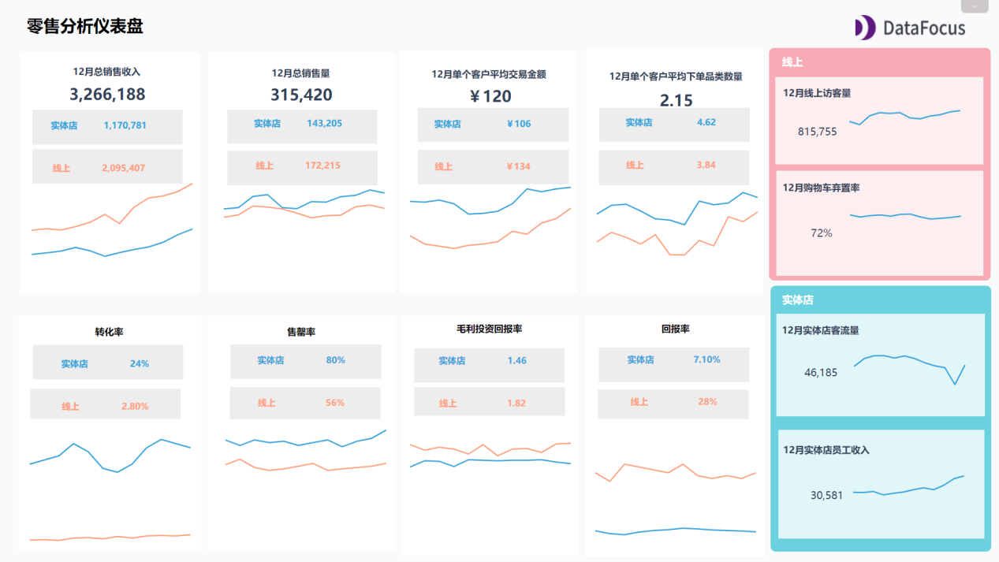
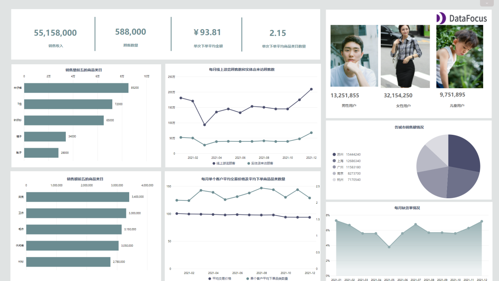

5月12日，在国务院政策例行吹风会上，国家税务总局社会保险费司司长郑文敏介绍，将对受疫情影响较大的**餐饮、零售、旅游、民航和运输**等特困行业阶段性实施**缓缴企业社保**政策。

养老保险可以缓缴所属期为2022年4-6月的费款，最迟在2022年底前补缴到位；失业保险、工伤保险可以缓缴所属期为2022年4月至2023年3月的费款，原则上在期满后一个月内补缴到位。

已缴纳所属期为4月份费款的企业，缓缴月份可以顺延一个月，也可以申请退回已缴纳的费款。缓缴期间免收滞纳金。

这无疑对于餐饮行业是一个福报。

随着餐饮业越来越激烈的竞争，有越来越多的企业进入市场，却也有越来越多的企业退出市场。尤其在今年年初，疫情又开始爆发，据相关数据统计，今年1-3月餐饮业整体营业额下降44%以上，全国范围内餐饮业收入只有6000多亿。部分餐饮品牌甚至由于没有撑过艰难时期而被迫倒闭。

传统餐饮经不起疫情的打击，大风一吹就跨。因此现在很多大型企业开始探索数字化运营，借助大数据对菜品品类进行优化、对用户进行精准分析，建立结构化运营模式，为企业构建数字壁垒。

如今国家政策已逐步开始扶持，餐饮企业也无需坐以待毙，而是积极采取应对措施进行“自救”，谋求新的发展。

那么餐饮人到底该如何应对呢？这里总结了三条建议，并且借助搜索式BI平台DataFocus清晰地展现了企业数字化转型效果。

1. 优化成本控制

首先不能忽略的就是餐饮成本，包括房租租金、食材价格以及员工工资，尤其最近蔬菜、肉类价格的上涨，给餐饮企业和门店带来不小压力。因此其中成本的计算与控制就需要较之前有很大的提升。

餐饮知名企业肯德基在餐饮成本控制方面就有许多值得借鉴的地方。

肯德基餐厅会设置好成本标准，尤其对材料有严格的控制标准。如果有材料浪费、产品不合格、原材料过期等造成损失也需要填写产品废弃表，记录产品数量和作废原因。

另外，肯德基人员实行分班制，每天2到3个班次，根据每个岗位不同时间段的需求配备人员。而肯德基也会对新人进行岗位培训及考核，每个员工都需要熟练掌握两个及以上产品加工程序，确保人手紧张时及时补位正常运营。

当然不只是这些，还包括原材料采购、生产、配送、库存等环节，都会产生成本问题。做好成本控制，可以帮助餐饮企业掌握数据后沉着应对问题，并最大限度降低损失。

1. 线上线下双监控

疫情期间，由于更多的人选择足不出户就能购买所需物品，去实体餐饮店的次数更是屈指可数。此外相比线下，线上的优惠力度更大，各种优惠券、打折、限时限量抢购在吸引用户的眼球。

尤其当疫情严重时，餐饮企业不得不需要关店，为了满足特殊时期用户的需求，不少企业都关闭堂食保留外卖。当然，也不是完全摒弃实体店，只是在安全和成本上考虑做出的策略。

线上线下如何结合营运，既能保证安稳营业，又能满足用户需求及体验，就需要对线上和线下情况进行分析，并了解用户特性、偏好、及行为特征，以此来调整营运策略。

1. 做好库存管理

今年上旬就已经有不少餐饮企业相继爆出丑闻，老坛酸菜、螺狮粉等等食品巨头企业都频踩雷区。而食品安全问题的出现很大程度上是由于库存管理，可能稍不注意就引发了食品安全问题，影响到整个企业的经营。

同时，库存也是一笔不小的成本费用，会导致企业运营风险增加。此外，绝大多数餐厅又容易杂乱摆放货物，甚至有的食材过期仍使用，太多的问题传统餐厅无暇顾及。

为此，企业需要将库存这一过程数字化。例如根据餐厅的大数据来预估合理的采购清单，以减缓库存压力。对于库存管理过程问题及时预警，将责任划分清晰。

餐饮行业遭遇疫情是危机，也是机遇与挑战，只有跟上企业数字化转型的步伐，方能利用数据来为业务创造价值。如何跟上时代快速发展的步伐，找到行业新的拐点，或许是企业需要不断去思考总结的问题。
