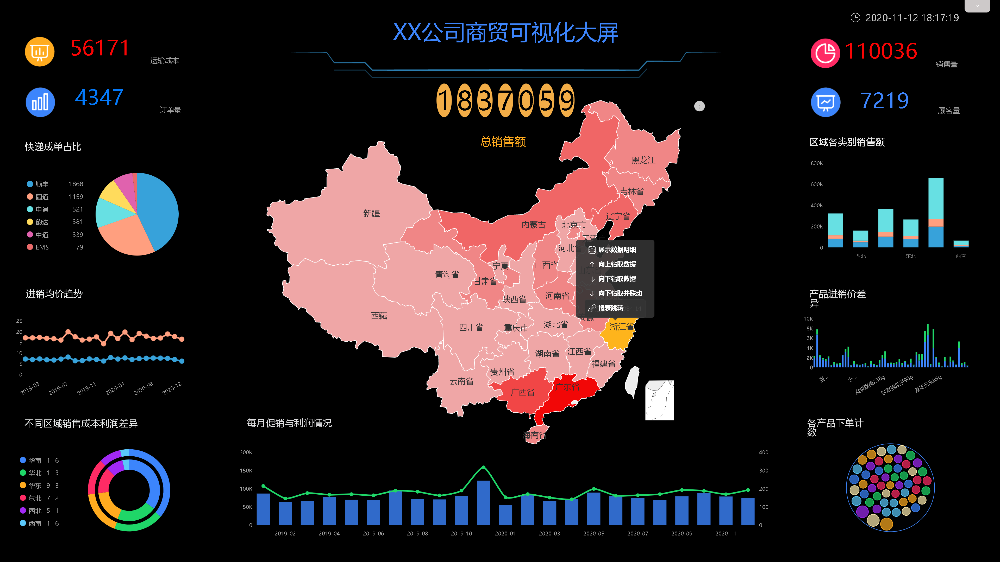

传统BI，最熟悉的，莫过于我们庞大的SAP BW/BO了，而新型BI，我们选用最有新意的DataFocus，我们今天主要对比这新老两款BI，看看传统BI是如何没落的，新型BI是如何崛起的。

我们从这几个方面来一一对比：操作性、适用范围、功能对比、性价比。

**操作性**

众所周知，SAP系统非常庞大，而且不是任何人都能适用的，里面涉及的规则，事物代码，内容非常之多，学习也非常难学，而且即使经过专业学习，但是没有几年实际工作经验的，要想熟练的运用BW/BO做数据分析报表，也很难。一般SAP BW/BO面向的是专业的BW/BO顾问，而不是简单的IT技术人员，更不可能是普通的业务人员。

BW流程

DataFocus，操作简单是它的一大特点，这都要归功于它的分析方式，搜索式分析。这种分析方式使得数据分析变得像谷歌搜索一样简单，搜索即分析，不需要任何IT背景，普通的业务人员也能自行分析。

DataFocus分析流程

**适用范围**

在一般的中小企业，根本无法使用如此大型的BI系统，其不仅需要大量的人力维护，也需要大量的成本支撑，中小企业无法承担。

DataFocus不仅适合大型企业，也适合中小型企业。在大型企业中，DataFocus会比传统BI更容易推广，推广成本也更低，更能减轻业务人员的负担，而不是增加他们的负担。在中小企业中，DataFocus不需要多余的人力维护，也不需要高薪聘请专业的顾问，各部门业务人员自己就能进行分析。

**功能对比**

BW是SAP BI的集成化组件之一，为SAP数据和非SAP数据的采集、存储、分析和管理提供一个集成的，面向商务的平台。它可以智能化地管理整个企业管理信息系统的海量数据信息并从中挖掘出最有价值的信息。BW主要是做数据部分的，例如数据建模、数据采集、数据存储，数据分析等，其过程涉及一系列操作，比如创建数据包，创建DSO，创建CUBE等等。BO是将BW中的数据前端展示用的。展示的图表样式多，而且效果也不差，各类钻取，筛选等基本操作也都有。不可否认的是，其功能确实非常强大，也非常齐全，还可以通过代码来实现部分比较难操作的结果。

水晶报表

DataFocus，既是数据仓库，也是数据分析系统，还是数据可视化系统，也可以是数据报表系统，对于BI需要的功能，它全都有，数据分析即简单又高效，可以实时看到分析效果，这是BW做不到的，而且可视化在效果上，我觉得更胜一筹，样式更美观，配色更符合视觉习惯。虽然在一些功能上，DataFocus可能稍微差点，但是作为一款新型的自助式BI来说，DataFocus绝对是领先者。

可视化大屏

**性价比**

SAP的价格之高也是很多企业无法使用的原因之一，光是上线这一个系统，花费的成本就让人乍舌，还不包括后期少则几个月的实施费用，当然上线完成，每年的运维费用也是高的吓人，所以现在有很多前期使用SAP的企业，现在都想找另外的BI产品来代替BW/BO，因为成本确实太高，同样能完成分析工作的DataFocus和BW，为什么不选择性价比更高，价格低好几倍的DataFocus呢？

综上所述，可以预见的是，新型的自助式BI，会逐渐取代传统式BI在企业中的位置。
