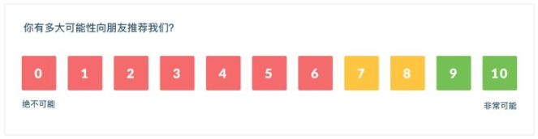
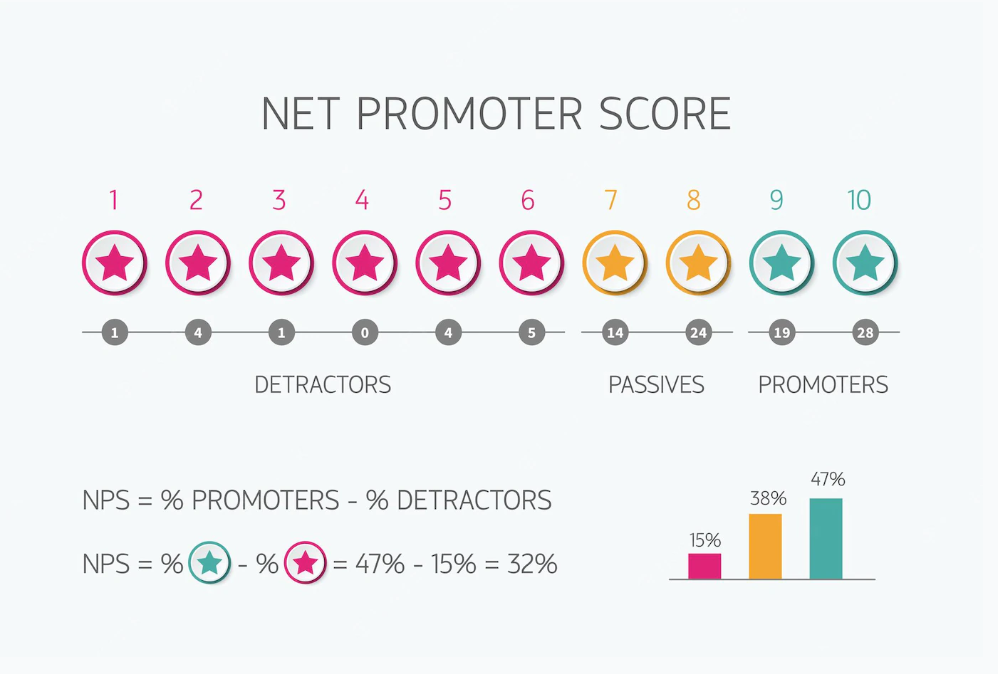

**“在0-10的范围内，您向朋友或同事推荐XXX的可能性有多大？”**

上面这个问题是一个典型的NPS问题，我们可以在越来越多的应用APP上看到这句话，用以取代之前的满意度提问。那么NPS能带给企业什么样的变化呢？

净推荐值（NPS，Net Promoter Score），是评估用户向朋友、其他人推荐公司产品或服务的可能性的一个指标。一般情况下，在问卷或调研时，适当提出一些NPS相关问题，可以帮助用户更精准的了解用户对公司、产品或服务的反馈和看法。

NPS是用户满意度评估的升级，不仅评估客户自身是否满意，同时评估客户是否有意愿为公司产品或服务做背书，主动进行推荐。在统计上，NPS也比用户满意度更加真实、实用，也与业务增长这个目标更匹配。

### **什么是净推荐值(NPS)？**

净推荐值（NPS，Net Promoter Score），是评估用户向朋友、其他人推荐公司产品或服务的可能性的一个指标。一般情况下，在问卷或调研时，适当提出一些NPS相关问题，可以帮助用户更精准的了解用户对公司、产品或服务的反馈和看法。

0~6分代表的是贬损者(不愿意推荐的用户)，对产品/服务的不满意，不可能向朋友推荐，甚至可能向朋友吐槽的用户。

7~8分代表的是中立者，对产品/服务没太多感觉，使用感一般般。即使朋友有类似的需求，推荐的可能性也比较小。

9~10分代表的是推荐者，对产品/服务用下来感觉不错，比较愿意向朋友推荐的用户。

### **如何计算净推荐值：**

**（推荐者人数/总样本数）\*100%-（贬损者人数/总样本数）\*100%= 净推荐值**

按照用户评分将受访样本用户分成三类，分别是贬损者、中立者和推荐者。需要注意的是，虽然NPS分数是一个百分比，但它最终呈现为整数。

例如接受访问的受访者总人数为1000人，其中50人不愿意推荐，750人愿意推荐，则净推荐值为：

（750/1000）\*100%-（50/1000）\*100%=75%-5%= 70（%）

截图来源：DataFocus（数据已脱敏）

### **行业基准**

由于净推荐值是标准化的，几乎每个行业都存在大量的NPS基准查看外部NPS基准（所在行业的其他公司）在一定程度上可能会有所帮助，同时由于变量范围广泛，有时通过定期发送NPS调查来设置内部基准可能更具可操作性和洞察力。

2022年公布的多行业NPS基准报告中

 

<table style="width: 790px;"><tbody><tr><td style="width: 206.266px;">类型</td><td style="width: 320.406px;">行业</td><td style="width: 241.328px;">平均NPS得分</td></tr><tr><td style="width: 206.266px;">B2B</td><td style="width: 320.406px;">咨询</td><td style="width: 241.328px;">68</td></tr><tr><td style="width: 206.266px;">B2B</td><td style="width: 320.406px;">技术与服务</td><td style="width: 241.328px;">61</td></tr><tr><td style="width: 206.266px;">B2B</td><td style="width: 320.406px;">数字营销</td><td style="width: 241.328px;">60</td></tr><tr><td style="width: 206.266px;">B2B</td><td style="width: 320.406px;">建筑</td><td style="width: 241.328px;">45</td></tr><tr><td style="width: 206.266px;">B2B</td><td style="width: 320.406px;">物流与运输</td><td style="width: 241.328px;">43</td></tr><tr><td style="width: 206.266px;">B2B</td><td style="width: 320.406px;">B2B软件和SaaS</td><td style="width: 241.328px;">40</td></tr><tr><td style="width: 206.266px;">B2B</td><td style="width: 320.406px;">云托管</td><td style="width: 241.328px;">25</td></tr><tr><td style="width: 206.266px;">B2C</td><td style="width: 320.406px;">保险</td><td style="width: 241.328px;">71</td></tr><tr><td style="width: 206.266px;">B2C</td><td style="width: 320.406px;">电子商务</td><td style="width: 241.328px;">62</td></tr><tr><td style="width: 206.266px;">B2C</td><td style="width: 320.406px;">零售</td><td style="width: 241.328px;">61</td></tr><tr><td style="width: 206.266px;">B2C</td><td style="width: 320.406px;">金融服务</td><td style="width: 241.328px;">56</td></tr><tr><td style="width: 206.266px;">B2C</td><td style="width: 320.406px;">医疗卫生</td><td style="width: 241.328px;">38</td></tr><tr><td style="width: 206.266px;">B2C</td><td style="width: 320.406px;">通讯传媒</td><td style="width: 241.328px;">29</td></tr><tr><td style="width: 206.266px;">B2C</td><td style="width: 320.406px;">互联网软件与服务</td><td style="width: 241.328px;">4</td></tr></tbody></table>

NPS分数是一个非常有价值的指标，推荐者人数越多代表公司的用户增长也就越高。研究表明，在大多数行业中，净推荐值占增长的20-60%。

但是，问卷法注定企业在调研过程中缺少某些客户的数据，这些客户可能是因为各种各样的原因没有做出回应。专家意见表示，最不满意的客户普遍都不会回复NPS调查，因此专注NPS指标不可避免会对企业产生误导。

因此可以借助DataFocus等工具制作数据看板，同步关注多个指标，包括用户留存情况，客户努力得分等。

截图来源：DataFocus（数据已脱敏）

很多新出的产品都喜欢用NPS来衡量产品的好坏，因为新产品还没有用户基数，需要通过爆炸性增长来获取巨大的用户基数。而如果NPS高，那就意味着有机会免费获取大量用户。但NPS只是起点，病毒式传播要看传染效率，否则传着传着就没有了。
