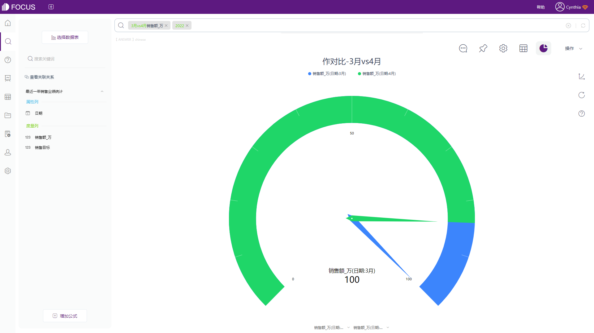

在进行数据分析的时候，我们时常会碰到需要将两个或两个以上的数据进行比较，分析他们差异，并从中寻找一定的规律。这种情况我们就可以称之为使用了对比分析法，对比分析可以通过选定参照数值，分析数值之间的区别和联系，从得到的结果中挖掘出数据蕴含的价值，从而帮助企业制定正确的运营决策。

使用对比分析法进行数据分析，需要明确对比对象。对比对象一般可以分为自身对比和行业对比，这篇内容我们先来介绍一下自身对比：自身对比是动态的，即再同一总体条件下，对不同时期的数据的比较，也可以称为纵向比较。

举个例子，李老板经营着一家零售加盟店，财务上报说上个月4月份的销售额是100万，如何衡量4月份的销售业绩？

于是李老板让财务整理了一份最近12个月的销售额统计表，借助DataFocus的VS对比关键词，很快得出了对比结果。

从下图中可以清晰的看出，对比3月份，4月份的销售额明显高于3月份；

同样的，今年4月的销售额对比去年4月出现了显著的销售增长。

因此，从自身出发，分析原始数据的上月对比以及今年和去年的销售情况对比，我们可以初步判定，李老板的公司，今年4月份的销售情况是比较优异的。
