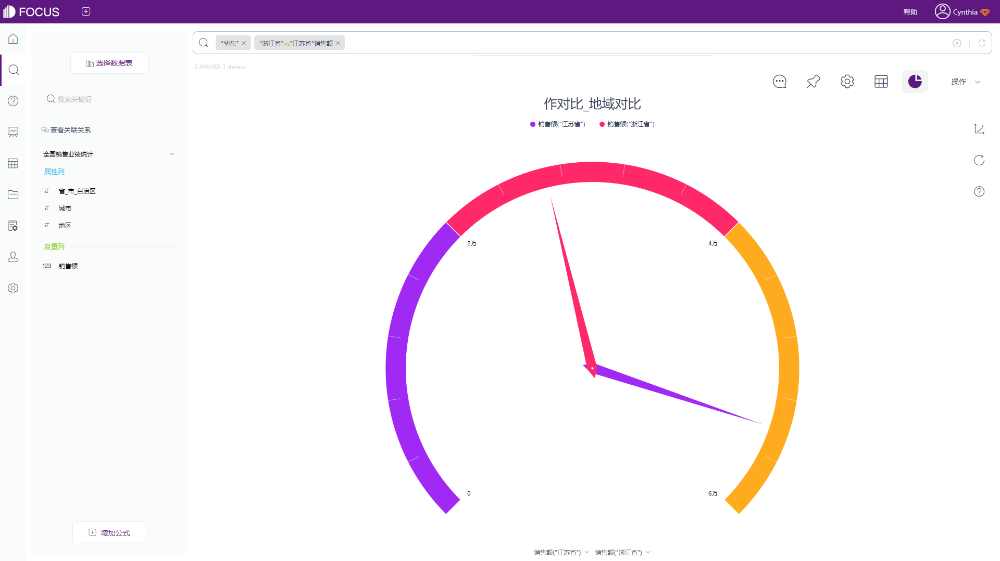

承接上一篇的内容，我们可以知道，对比不同时期的数据，李老板在4月份销售业绩是比较不错的，但这个结论没有受到市场的评判。因此我们需要添加行业对比。

行业对比是静态的，是在同一时间条件下对不同总体指标的比较，如不同部门、不同地区、不同国家等，也可以称为横向比较。

例如，本案例中，李老板作为浙江省内的独家经销商，可以将自己的销售数据与同区域的不同省份或者与全国的店均销售额进行对比，从而看出自家店铺的销售额在同行业中所处的位置。

这里我们同样用到DataFocus的VS关键词，通过添加双引号，可以在搜索框中填入具体的列中值进行对比；

从下图中可以看到，同属华东地区，江苏省的销售额明显领先于李老板管辖的浙江省销售额；

接下来再对比全国的销售额数据，我们可以借助VS关键词和“all”快速实现合计销售额的对比，如图所示，浙江省的销售额对比全国销售额，存在巨大的差距，还有很大的上升空间。

当然，行业对比除了上述介绍的两种，小伙伴们也可以拓宽思路，进行同行业的竞品分析和市场份额的情况分析，放大自身优势，弥补欠缺的劣势，更快更好的实现销售目标。
