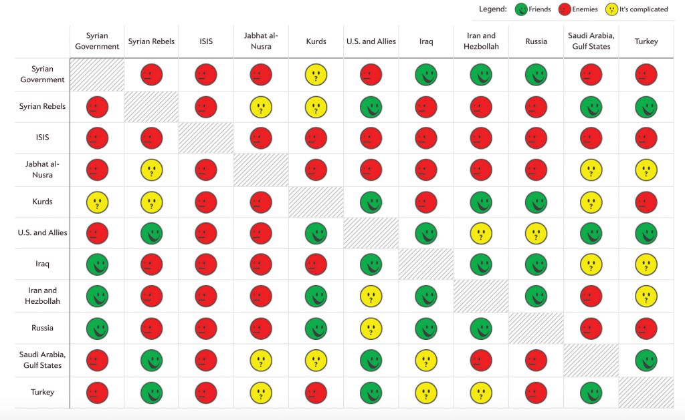
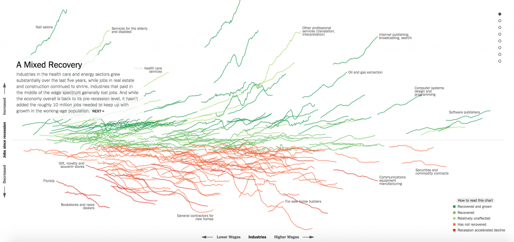
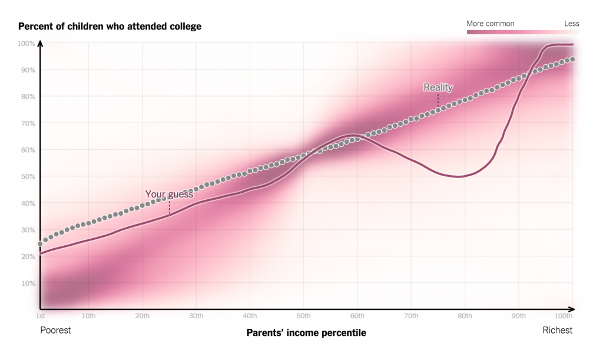
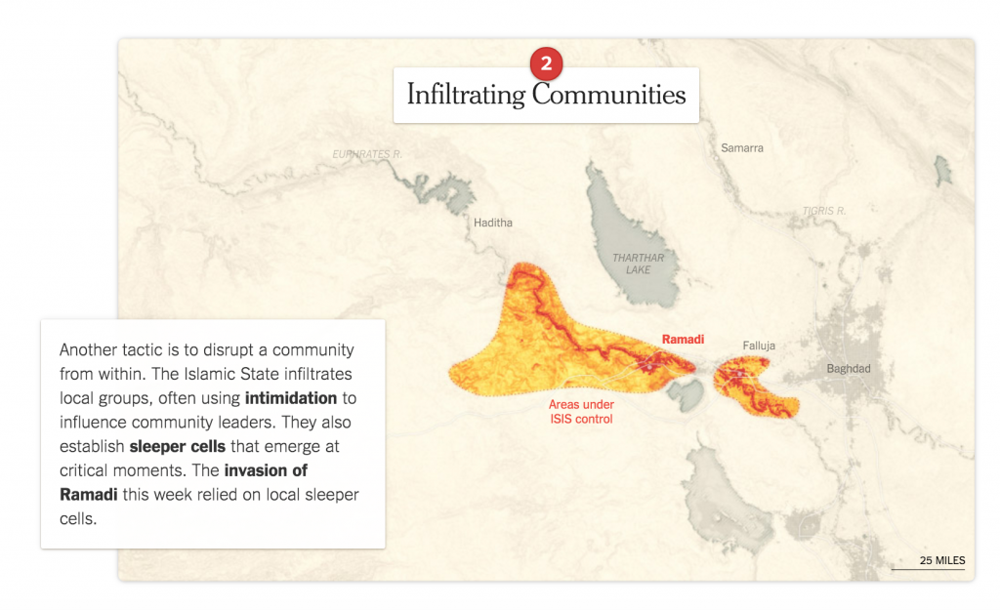

# 您需要看到的17个令人印象深刻的数据可视化示例

_通过可视化信息，我们将其转化为您可以用眼睛探索的景观，一种信息地图。当你迷失在信息中时，信息地图会很有用。-David McCandless_

作为企业所有者，企业家或团队经理，您无法单独使用原始数据来说服或教育人们。相反，您需要以人们可以快速检视和理解的方式呈现您的数据，您需要数据可视化。

幸运的是，您可以以极低的成本获得像DataFocus这样的数据可视化和商业智能（BI）工具。从原始数据创建精美引人注目的视觉效果从未如此简单。但也不是没有问题：知道从哪里开始并不总是那么容易，制作数据可视化对某些人来说可能有点令人生畏 - 制作引人注目的，有说服力的信息图表需要一定程度的创造力和对美观、简洁和功能的关注。值得庆幸的是，有很多例子可以帮助您获得创意。以下是您需要查看的20个令人印象深刻的数据可视化示例：

****1.**  美国人生活中的一天**

这一数据可视化分析说明了2014年美国人时间使用调查的微观数据。您在下面看到的点实际上会根据一天中的时间移动到图表中的不同区域。每个点代表一个人，每种颜色代表活动。

****2.**  美国2016年预算**

这个数据可视化图表展示了您的税金将用于何处，以及在2016年奥巴马总统提议的预算下，可以查看联邦预算的哪些部分专用于不同的计划领域。您可以使用此可视化的交互式部分查看针对个人部分的总金额，并了解有关每个部分的更多信息。

****3.**  传染病和疫苗的影响**

“华尔街日报”的数据可视化说明了疫苗的引入如何影响某些传染病的流行和存续。可视化使用70多年来，所有50个州的测量结果。

****4.**  地球风图**

这个动画演示展示了全球的风，天气和海洋条件。这是超级计算机的预测，每3小时更新一次。要了解有关数据来源的更多信息，[请单击此处](http://earth.nullschool.net/about.html" \t "https://www.maptive.com/17-impressive-data-visualization-examples-need-see/_blank)。

****5.**  地球轨道上每个活跃的卫星**

根据Quartz的说法，在任何时候都有超过1,300颗活跃的卫星在地球轨道上运行。该数据可视化使用由科学家联盟编制的数据进行。在下面的视觉中，卫星的大小根据其发射质量而定，不同国家的卫星用颜色区别。可视化显示低地球轨道，中地球轨道，地球静止轨道和高地球轨道上的卫星。

****6.**  纽约街道树木的交互式可视化**

该数据可视化是使用NYC Open Data提供的数据创建的。它显示了纽约市所有五个行政区的街道树木的种类和数量。创作者进行了可视化，因为他们想要找出哪些树在纽约市的五个区域中越来越不常见。

****7.**  千禧一代多样性交互式地图**

该数据可视化显示了不同世代的多样性如何变化。根据这篇文章，以下是此可视化中最重要的三个要点：

- _去年美国最常见的年龄是22岁。与其他年龄组相比，22岁以上的年龄更多。_
- _从真实的中位数来看，美国的中年人年龄为37.6岁。50％的美国人年龄较小，而另外50％的人年龄较大。_
- _今天的婴儿标志着第一代白人仅占人口的50％。人口普查局预测白人孩子将在短短几年内不再占多数。_

****8.**  Universcale**

在尼康的演示中，我们看到物体的相对尺寸排列在一个刻度上。创作者进行了可视化，以帮助人们更好地掌握在现实世界中无法并排比较的对象的真实大小。

****9.**  世界语言**

该数据可视化说明了对当前世界语言状况的分析。它利用来自WALS的数据，据资源显示，_“语言结构世界地图集（WALS）是一个庞大的数据库，包含从描述性材料（如参考语法）收集的语言的结构（语音，语法，词汇）属性。它由一个55位作者组成的团队制作（其中许多人是该主题的主要权威人士）。“_

****10.**  下一个美国**

在这个可视化中，皮尤研究中心旨在帮助说明我们的国家如何随着时间的推移而变化，以预测我们在不久的将来可能面临的挑战。这是一个相当丰富的数据表示皮尤研究中心汇编了民意调查，人口统计和经济分析。

****11.**  2008-2015每部主要电影的可视化**

这个数据可视化说明了过去八年来超过1000部好莱坞主要电影的数据。此资源可用于查看和比较全球总预算与各个预算和实际预算回收等事项。

****12.**  世界上最大的数据泄露事件**

此数据可视化编译了与各种行业中世界上最大的数据泄露相关的信息。它是一种交互式资源，可用于显示违规行为的发生，丢失或损坏的记录数量以及组织类型。

****13.**  基于数据的最受欢迎的狗**

_根据美国养犬俱乐部的说法，_为了在狗的受欢迎程度上创建这种数据可视化，制造商  _“检查了有关智力，长寿，遗传疾病和其他标记的数据，以创建”数据得分“，然后根据各种品种的公众普及情况绘制它。 ”_ 

****14.**  美国国家橄榄球联盟的完整历史**

来自FiveThirtyEight的数据可视化显示了团队的NFL历史。制造商根据Elo对球队进行评级，Elo是基于逐个游戏结果的衡量标准。制作人计算了联盟历史上每场比赛的Elo评分 - 总共超过30,000个评分。

****15.**  谁在叙利亚战斗谁的指南**

来自Slate的这种数据可视化，可以快速了解叙利亚境内战斗的国家和团体之间的复杂关系。绿色面孔代表朋友，红色代表敌人，黄色代表灰色区域。要了解有关如何创建此图表的更多信息，[请单击此处](http://www.slate.com/blogs/the_slatest/2015/10/06/syrian_conflict_relationships_explained.html" \t "https://www.maptive.com/17-impressive-data-visualization-examples-need-see/_blank)。

****16.**  经济衰退如何重塑经济？**

“纽约时报”的这一数据可视化全面而详细地展示了经济衰退如何重塑经济。创造者制作的图表可以追踪经济衰退对各个行业和就业市场的影响。

****17.**  家庭收入如何预测儿童上的大学机会**

在纽约时代杂志的另一个数据可视化中，我们可以看到家庭收入如何预测该家庭上大学的孩子的可能性。在下面的视觉中，每个点，一个单一的收入百分位，代表了近20万名出生于20世纪80年代初的儿童。

****18.**  ISIS如何扩展**

该数据可视化显示了ISIS在中东的存在和扩展。具体来说，它说明了ISIS如何能够扩展，通过社区渗透，政府对某些石油丰富地区的控制以及吸收世界各地其他群体等因素。

****19.**  美国人的生命历程与战争的关系**

“华盛顿邮报”的这一数据可视化显示了美国人在战争中的生活，以及美国人在一生中所经历的战争。深蓝色表示在战争中度过的百分比，淡蓝色表示在和平中度过的百分比，深蓝色表示在战争中度过的时间，浅红色表示在和平中度过的时间。

****20.**  连接2016年总统候选人背后的点**

这种数据可视化显示了2016年总统候选人背后的复杂网络。正如您从下面的视觉中看到的那样，每个候选人的视觉效果都显示出与之前的广告系列，主管部门和其他组织相关的数十年的关系。

**21.如何了解你的数据趋势？**

DataFocus展示了一个简单的描述数据随时序变化的方法。新颖的不是这种可视化的类型--这种互动性质的可视化项目已经出现过很多次了。有创意的是，这个可视化作品是一瞬间就可以创造出来的。通过DataFocus的简单搜索就可以实现它，这真的很神奇。

****

****22.** 在水力压裂和地震中设置记录**

政治家们要求否认水力压裂与地震之间的联系--这是愚蠢的。同样愚蠢的是左派的主张，他们甚至否认压裂作为原因。在这个可视化中，Max Galka表明废水处理是大多数诱发地震的根本原因，而不是压裂。

