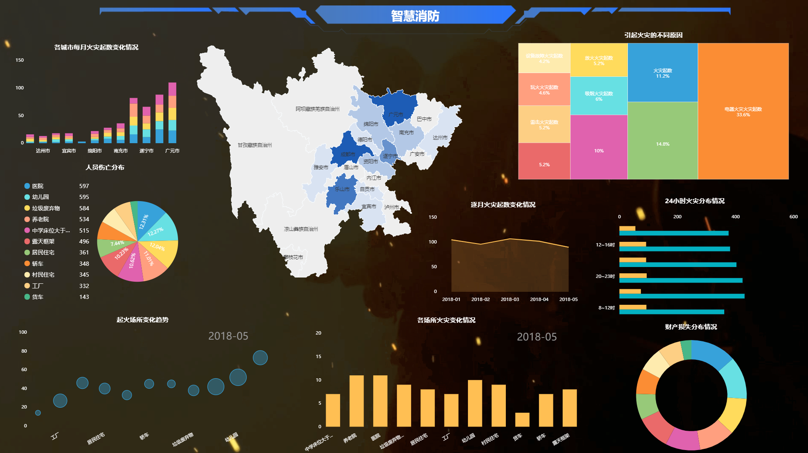
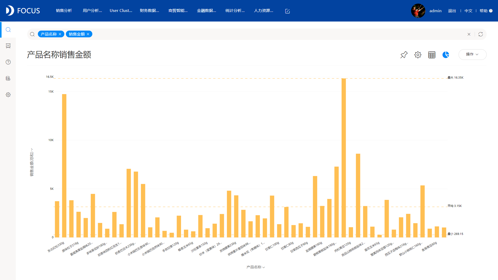

别人的可视化都是这样的：

你的可视化是这样的：

你自己觉得你的可视化和别人的差在哪儿？

正常人都能看出来，明显上面的两个可视化大屏比下面单调的可视化图表好看多了吧。那又要问了，怎么才能做出上面那样的大屏呢？

其实要做上面那样好看的可视化大屏，一点都不难，只要你找到一个好的“帮手”——一个实用的可视化工具，如果不知道怎么选，我可以推荐一款我一直在用的可视化工具——DataFocus，它超好用，超实用。

那有了DataFocus这个“利器”，你的图表类型可以更加丰富，你的图表配色可以更加多彩，你的图表可以制作成一个个大屏……你的图表可以变成下面这样：

看了图，知道自己差在哪儿了吗？你就差在缺少一款好用的工具！

数据可视化可以使数据变得更有意义，而且好看的可视化也可以使数据变得更容易理解更有乐趣。如果数据可视化的过程很复杂，结果很单调，那也就失去了可视化的一大意义。

DataFocus可以使数据可视化变得不再复杂，且其正帮助越来越多的企业从浩如烟海的复杂数据中理出头绪，化繁为简。企业利用DataFocus创建一个个高颜值的大屏，变成一笔笔看得见的财富。其实现在很多企业在上了ERP之后，面对海量数据，难以分析，难以清晰的呈现，难以从中发现问题，即使发现了问题，也无法很好地将问题呈现。而一款好的数据可视化工具能够以一种简便易用的方式解决企业目前遇到的问题。
