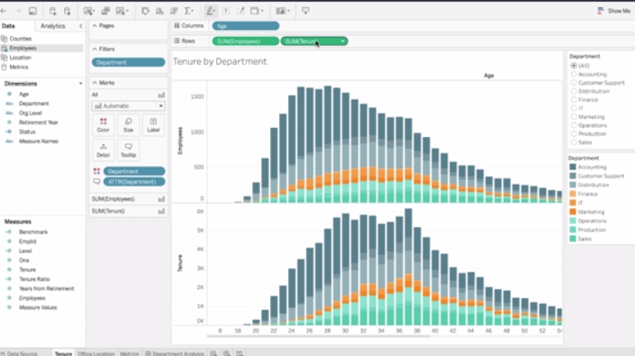
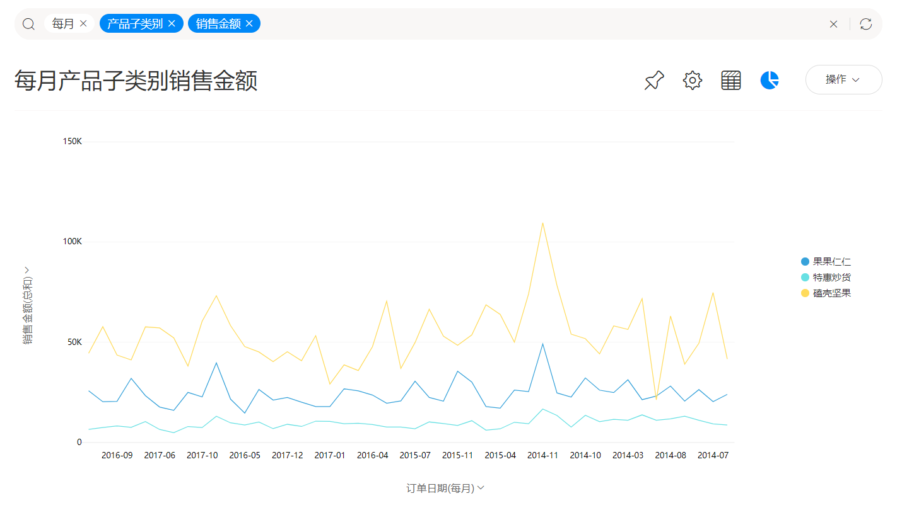
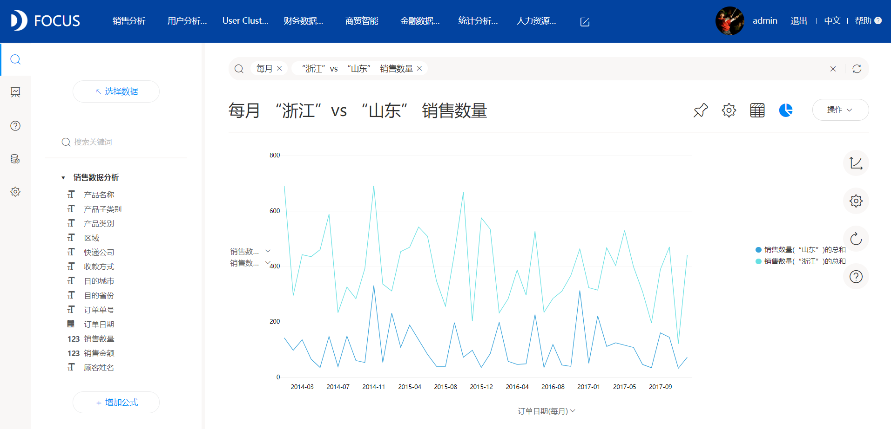

商业智能BI经过数十年的发展，从最初的简单的数据统计和报表功能，发展到现在拥有丰富的可视化，自动分析甚至智能洞察的功能。当前，商业智能的形态已经进化到了敏捷型BI的阶段，所谓敏捷性bi，一个关键的衡量标准就是使用门槛大大降低，能轻型化部署。

当前敏捷性BI产品的技术路线有两种，一种是采用拖拽式分析的方法。这种交互方式要求用户在图表开发时，将对应的字段拖拽到相应的X轴或Y轴上，并且进行详细的配置，以进行更好的可视化展现，或者流程逻辑（比如钻取）。拖拽式分析方法最早由美国的tableau公司创立（发明了GraphQL语言），目前是市场上最为主流的交互方式，大量新型BI产品都是学习并模仿这种方式。

另一种技术路线就是问答搜索式的交互。使用界面极其类似百度或谷歌搜索引擎，用户只需要在搜索框中输入对应的问题，系统自动计算并返回结果。这是近年来人工智能领域的一大典型应用，其代表产品如DataFocus，支持中英文搜索，学习曲线平缓，业务人员很容易掌握。

拖拽式分析，还是搜索式分析，这不是技术路线之争，这是先进生产力替代落后生产力的必然。通过这两种操作方式的对比，你很容易就会发现搜索方式的优越之处。

首先，搜索方式更符合人类的使用习惯。就像谷歌搜索引擎，你根据智能提示输入简单的关键词或字段信息，或者二者的组合，系统自动计算并绘图，你不需要考虑如何配置X轴或Y轴，也不用去考虑选择什么图形，简单搜索，结果自动呈现；其次，搜索更加灵活，要获得多种维度的分析结果，你不需要频繁的拖拽操作，或者进行事先配置，钻取都是智能的；最后，搜索的方式可以处理更加复杂的查询。想想看，人类能通过简单的语言交流表达复杂的逻辑，用拖拽又是如何实现呢？比如，我们要比较北京和上海地区女性销售员在周末的销售业绩，如何拖拽去实现呢？

DataFocus的搜索式分析，拥有平滑的用户体验，感兴趣的读者可以去他们官方网站下载试用哦。
