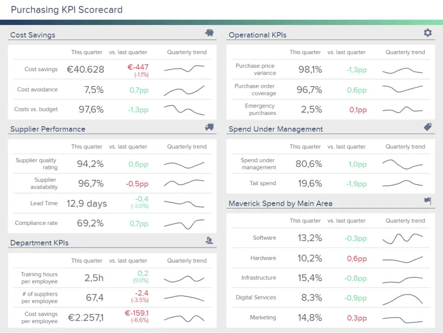

在当今的数字时代，监控业务绩效并跟踪相关见解使经理和 C 级高管能够获得宝贵的数据量，从而提高生产力并降低成本。事实上，数据已成为每个业务决策所依据的原材料，而[报告软件](https://www.datafocus.ai/infos/online-reporting)创造了快速准确地对生成的信息采取行动的环境。进入 KPI 记分卡仪表板的世界。

根据您的需求跟踪成功 KPI，以及在比较您的值时选择的时间范围，可以使用简单而有效的记分卡来完成。在这里，我们将查看记分卡的定义，了解它们如何与仪表板区分开来，并深入挖掘业务场景中的 KPI 记分卡示例，这些示例可能应用于整个组织的不同部门 - 您还可以用作[在线数据分析](https://www.datafocus.ai/infos/data-analysis-tools)的路线图。

 

让我们开始吧。

您的机会：[想要完全免费创建令人惊叹的KPI记分卡吗？](https://www.datafocus.ai/console/)我们提供 14 天免费试用。受益于我们的仪表板软件！

## 什么是 KPI 记分卡？

KPI 记分卡是一个术语，用于描述用于衡量设定绩效指标的进度或成就的统计记录。它使决策者能够组合特定指标，以便获得完整绩效记分卡的概述。

动态记分卡仪表板提供了易于理解的 KPI 绩效可视化表示，因此，使决策者能够进行战略调整，从而简化其业务。

数据只有在有效呈现和分析时才有价值。基于 KPI 的记分卡旨在增强数据分析过程，并帮助用户从非常具体的功能、任务或目标中获得额外的价值。这使得业务分析中的记分卡成为持续业务成功的数据驱动显微镜。

记分卡分析对于实际了解您的 KPI 以及了解您正在衡量的内容是否为您的业务增加了任何价值至关重要。

## 记分卡的好处和特点

现在，让我们检查一些关键记分卡报表的优势和功能。有许多业务方案非常有用，无论是特定的 KPI 记分卡、绩效记分卡模板还是利用[KPI 软件](https://www.datafocus.ai/infos/kpi-dashboard-software)生成有价值的见解的 BI 记分卡。由于有 2 种主要（或伞形）类型，我们现在将解释每种类型的特点和优点。

### 1\. 传统记分卡

传统的记分卡提供了整个公司、部门、团队或个人的概览。这种“广泛性”完全取决于设定的目标，无论是来自客户还是内部经理。这些性能工具的优点包括：

- 时间段：这种或 KPI 记分卡具有时间段作为基本必需品。时间段可以显示以前的时间段，也可以仅显示静态时间段的概述。
- 评分系统和总计：绩效水平基于评分系统，例如，员工的评分系统通过员工记分卡模板将其分数汇总到总体目标中，我们将在后面讨论。
- 比较：它们可能因人员、部门、设定目标或以前的目标或预算而异。

现在您已经对传统记分卡有了基本的了解，让我们看一下使用平衡类型记分卡的优势。

### 2\. 平衡计分卡

平衡计分卡模板提供了公司组件、齿轮和整个运营的全面快照。例如，平衡计分卡 KPI 不仅提供企业外部销售和服务的数据，还显示其许多内部职能视角的数据。

平衡计分卡的四个关键领域包括：

- 财务：它包括相关的[财务 KPI](https://www.datafocus.ai/infos/kpi-examples-and-templates-finance)，用于评估企业的财务状况，例如不同活动中涉及的销售、成本和收入。典型的财务目标与盈利能力、增长和股东价值有关。这是通过每月或每季度评估进度来衡量的。
- 客户：通过创新体验、产品和服务为客户提供价值是任何企业的首要任务。也就是说，跟踪您在这方面的表现变得至关重要。用于此目的的指标包括客户满意度、获取和保留率。
- 内部流程：虽然基于客户的指标是一个相关的点，但内部行为使您的产品或服务变得良好，从而使您的客户满意。因此，内部生产力指标（如缺勤率、整体劳动效率等）是平衡计分卡的重要组成部分。
- 创新和学习：我们刚才提到的前三个部分是企业定义竞争成功的最重要参数的基础。本部分包括公司为有效增长而采取的措施，例如新市场的销售、新产品的开发或员工培训。

通常，这种以 KPI 为中心的工具称为平衡记分卡仪表板。可以从一个中心位置显示多个值。KPI 平衡计分卡包括每个角度的最高指标（通常是最可衡量的 KPI）。目标写得很清楚（即削减支出或增加收入），而目标则作为数字未来值包括在内，以显示当前状态与目标之间的比较，或与以前的值进行比较。它还必须包括设定时间范围内的当前值。

平衡模型的好处包括：

- 增强战略规划：可以改善因果关系之间的战略沟通。这意味着通过构建完整的业务图景，可以明确地将制定战略和确定结果相关联。
- 改进管理决策：通过使用KPI记分卡软件，公司被迫为其战略目标创建记分卡指标。这最终将确保管理人员衡量真正重要的事情，从而提高制作更好的[KPI报告](https://www.datafocus.ai/infos/what-are-kpi-reports-examples)和数据驱动决策所需的信息质量。
- 高级绩效报告：使用绩效记分卡示例的结构化方法，我们将在后面解释，使公司能够增强[KPI](https://www.datafocus.ai/infos/kpi-management-and-best-practices)管理流程，通过创建有意义的[管理报告](https://www.datafocus.ai/infos/management-reporting-best-practices-and-examples)来带来内部和外部信息的透明度。
- 提高组织透明度：使用平衡计分卡还有助于在整个组织中创造新的内部凝聚力和透明度。如果每个人都可以访问用于绩效分析的可消化的示例记分卡，并了解正在衡量的 KPI 的价值，那么连接、协作和共享见解将变得更加容易。因此，您可能会看到您的生产力和内部创新水平飙升，这反过来又会让您领先于竞争对手。

使用简单的记分卡模板，您可以真正掌握您的战略规划、沟通和决策过程。平衡计分卡指标模板将确保您可以从 KPI 数据中榨取最后一滴价值，创建可操作的见解，推动您的商业成功，而不仅仅是踩水或在黑暗中射击。

通常，记分卡和仪表板用作同义词，尤其是平衡记分卡仪表板，但我们必须区分两者，因为它们确实有一些相似之处并且可以连接，但它们是两组不同的数据分析和绩效跟踪。让我们更详细地看一下。

## 业务中的记分卡与仪表板 - 实际区别是什么？

许多人谈论“仪表板记分卡”，但这种表达方式有意义吗？记分卡和仪表板之间存在许多差异，现在我们将专注于最突出的差异，以明确了解两者。

- 用途和更新：[在线仪表板](https://www.datafocus.ai/infos/online-dashboard)的目的是监视性能，而记分卡则专注于管理性能。专业仪表板集成了智能警报，可实时监控数据，而记分卡则定期（每天、每周/每月/每季度）进行监控。假设您正在参加会议，向相关利益干系人展示数据。如果发生特定业务异常，仪表板将立即设置警报（在会议期间）。记分卡会告诉您相同的信息，但一周后。另一方面，在 KPI 记分卡模板上，您可以查看在达到设定目标之前错过了多少值，因此，您可以决定需要采取哪些步骤。
- 决策性质和影响：公司每天都使用[实时仪表板](https://www.datafocus.ai/infos/live-dashboards)，因为它们提供并提供易于访问的成功运营视图，而记分卡则专注于公司的政策。仪表板中的数据用于提供更有效的团队、费用和资源的日常管理，而记分卡始终将绩效与设定的目标值进行比较。虽然有许多类型的仪表板也可用于不同的业务需求并与记分卡互连，但使用这两种[仪表板](https://www.datafocus.ai/infos/strategic-operational-analytical-tactical-dashboards)来充分利用业务信息和整体情况可能是有意义的。
- 度量值和参数：记分卡最常侧重于跟踪与设定目标相比的 KPI。但是，由于他们的数据不是实时更新的，因此他们只能定期查看这些信息，如前所述。这意味着记分卡通常以总体进展（实现目标或衡量特定部门的效率）和与关键绩效指标相关的战略措施为目标，从而使管理人员能够在更大范围内做出明智的决策。
- 受众：这两种分析工具之间的另一个区别是受众。虽然它们都可以而且应该跨部门工作以实现绩效跟踪成功，但它们为不同的受众提供不同的目的。一方面，由于其长期观点，记分卡主要由C级高管用于优化公司的生产力。另一方面，仪表板可以跨部门使用，以跟踪日常运营。
- 数据收集：如前所述，绩效记分卡的范围是衡量组织在财务、客户和内部流程等领域的进度。这意味着数据收集过程可以包括广泛的领域和操作。另一方面，仪表板关注需要适合一个屏幕且不包含任何干扰的 KPI。因此，数据的收集更加集中。

如前所述，通常使用术语仪表板记分卡，因为两者可以相互关联，但以下是记分卡与仪表板的可视化摘要，以更清楚地了解差异：

\*\*点击放大\*\*

从此表中可以明显看出[，仪表板](https://www.datafocus.ai/infos/data-dashboards-definition-examples-templates)和记分卡有一些明显的差异。也许最重要的是记分卡的长期、几乎“缓慢发布”的性质。虽然可以从记分卡中提取一些实时信息，但这些信息主要用于制定创新的长期战略，最终使您的企业更适应变化。

我们已经确定了记分卡和仪表板之间的定义、一般特征、优势和区别。现在，我们将讨论并关注如果正确使用它们可以并且将改进的业务场景，以及如何改进。

您的机会：[想要完全免费创建令人惊叹的KPI记分卡吗？](https://www.datafocus.ai/console/)我们提供 14 天免费试用。受益于我们的仪表板软件！

## 何时使用记分卡？真实示例解释

现在，是时候查看一些现实世界的 KPI 公司记分卡示例了。

我们下面商业平衡计分卡的第一个示例可用于大型或中型公司。我们对财务目标、学习和成长、客户和内部目标进行了概述。

### 1\. 平衡计分卡 – 我的公司表现如何？

让我们看看我们的第一个平衡计分卡公司示例从时间框架和财务目标开始告诉我们什么。

\*\*点击放大\*\*

我们将目标日期设置为 2018 年 12 月，我们可以在上面示例的顶部看到当前时间范围结合了一年的前 11 个月。在示例中，我们可以看到如何以及是否实现了（或不）了我们的目标。

在财务目标中，我们设定了年度目标，以增加总收入、净利润、利润率和每位客户的利润。第一列显示我们的目标设定为 5.458 欧元，我们当前的目标显示我们已达到 6.197 欧元。最后一栏显示我们已经实现了目标，甚至超过了13.5%。任务完成。

现在让我们来看看我们提高利润率的目标。我们可以看到，我们还有一个月的时间才能达到25.5%的既定目标，但我们处于23%的边缘。我们不太可能在短短一个月内做到这一点（我们错过了近 10% 来实现它），因此我们在业务记分卡示例右侧的线条颜色显示了相应的可能性（您还可以在底部看到完整的图例）。总体而言，我们可以说我们的财务目标表现良好，但可用于明年规划和[业务调整](https://fi.co/insight/5-steps-to-a-great-annual-plan)的利润率有所下降。

让我们来看看客户目标：增加活跃客户和注册的数量，维持客户保留率，提高整体满意度。我们看到，这些目标不太可能或不太可能实现。通过启动专注于此目标的营销活动，可以增加活跃客户的数量，但我们看到其他目标不太可能甚至不太可能达到。我们可以注意到，我们甚至失去了客户，我们的目标是保持保留。我们没有达到14.6%，要在一个月内达到这个目标，这将是非常困难的，不是说不可能。我们的客户满意度也下降了14%，为了在如此短的时间内提高它，我们可以放心地说它不会发生，右边的红线清楚地总结了这一点。

同样的分析我们可以应用于学习和成长，以及内部目标。有些目标很有可能实现，有些则不太可能实现。这有助于我们明年的战略规划，并了解我们遇到了什么样的挫折以及如何改进它们。如果我们深入研究日常运营和绩效，我们也许能够定义影响这些结果的具体原因。

话虽如此，我们的下一个示例将侧重于在客户服务中工作的代理的特定表现。

### 2\. 绩效记分卡 - 受益于员工记分卡

我们的绩效记分卡示例之一提供了个人或部门整体绩效的一般概述。让我们通过一个视觉示例来了解这一点。

\*\*点击放大\*\*

认识苏菲。她在德克萨斯州的客户服务部门工作，她的整体表现非常出色。她比目标高出18分，是2018年第二好的客户服务代理。让我们探讨一下她可以教给同事什么，以及她可以通过员工记分卡示例在哪些方面进一步提高自己。

部门经理根据对部门整体积极绩效很重要的百分比设定了评分系统的权重。她的具体表现分为按平均值、客户关注度和每周通话周期（也是平均数字）设定的评分。这些主要等级在设定的时间范围内（在本例中为2018年）更加详细分布。她的目标数字后面跟着她的实际数字，所以她和她的经理可以清楚地看到绩效的确切差异。下一列显示她脱靶的程度（也超过），以及总分。如果她的经理会详细说明，他/她可以建议如何调整她的响应时间和每小时的电话以提高效率。我们可以看到她的客户保留率比目标高出 20 分，这意味着她可以与其他表现不佳的同事交谈并分享她的最佳技巧和窍门。她解决的问题也体现在高水平的表现上，这在客户服务角色中非常重要。

她的经理可以很容易地得出结论，苏菲是一个表现最好的人，这个员工的例子准确地说明了在哪些方面。

此员工记分卡示例也可以在项目期间和整个项目期间使用，也可以在项目结束时回顾时使用。对于项目经理、部门领导和高层管理人员来说，这是一个紧凑的视图，可以看到项目或员工绩效的高效、成功和符合预期的进展。如果您想更深入地了解呼叫中心数据管理，我们建议您阅读我们关于[呼叫中心报告](https://www.datafocus.ai/infos/call-center-dashboard-reports-and-data-analytics)的文章。

### 3\. 仓库 KPI 记分卡 - 监控您的拣货和包装

我们的下一个示例是仓库 KPI 记分卡，旨在监控 4 个主要领域的整个拣选和包装过程：财务、有效性、利用率和质量。通过详细监控这些领域的绩效，电子商务或零售商等企业可以有效地管理其供应链，并通过有效的流程节省金钱和时间。让我们更深入地了解供应商 KPI 记分卡。

\*\*点击放大\*\*

从财务领域开始，我们首先看到每个订单的拣货和包装成本。这包括与拣选和包装相关的所有成本，例如劳动力、包装材料或设备。与此仪表板中的所有其他指标一样，成本与上个月的绩效目标进行比较。在这种情况下，成本高于前一时期，因此值得深入研究以降低这些数字。一种方法是详细分析每行工作。在这里我们可以看到，A线的成本高于B和C。一个好的做法是在每条生产线上测试不同的方法，看看哪条方法最终成本更低。在此指标旁边，仪表板显示退货成本，这应该始终尽可能低，因为退货是您仓库最昂贵的流程之一。

转到拣货和包装仪表板的利用率部分是包装材料的成本。这里的目标应该是永远不要使用超过您需要的材料，因为这会增加总体成本，并使您的企业因在材料使用方面没有采用可持续做法而名声不佳。这里一个好的策略是根据订单的大小预定义包装措施，这样您就可以确保不会通过将小物品包装在大盒子中来浪费材料。与此配对，我们看到设备利用率不应高于 90%，因为这意味着您的员工需要排队等候使用设备，从而延迟您的整个订单处理。

物流仪表板的有效性部分旨在监控员工的绩效以及[物流](https://www.datafocus.ai/infos/dashboard-examples-and-templates-logistics)流程的效率。这是通过测量每人在一小时内拣选和包装的订单数量以及拣选和包装物品的平均长度周期来完成的。

最后但并非最不重要的是质量部分，在这里我们看到了拣选准确性和退货率，这两个指标都直接影响退货成本以及客户满意度。没有人愿意在线订购东西并交付错误的物品。因此，您应该密切监视它们，以确保一切都是有效的，并确保优质的服务。

让我们快速转到下一个绩效模板，看看我们可以创建什么样的记分卡，可以包含在全面的[社交媒体报告中](https://www.datafocus.ai/infos/social-media-reports-examples-and-templates)。

### 4\. 社交媒体的营销 KPI 记分卡示例

这是专注于在社交媒体上执行的营销活动的 KPI 记分卡示例之一。我们可以看到四种不同社交媒体渠道的概述：Facebook，Twitter，Instagram和YouTube。让我们看看我们如何实现设定的目标。

\*\*点击放大\*\*

在Facebook上，我们定义关注者的目标数量是2500。我们可以清楚地看到实际数字是 2400，我们错过了 4% 来实现我们的目标。如果将其与上一时期进行比较，我们可以肯定地得出结论，我们的关注者总数增加了 2.3%。同样，我们可以应用于展示次数、链接点击次数和参与度。下图显示了 6 个月内点击率的趋势。如果我们发现所有其他记分卡指标都实现了我们的既定目标，我们可以创建一个广告系列，该广告系列将只专注于增加关注者数量，从而完成我们所有的 Facebook 目标。

虽然每个社交媒体平台在用户人口统计、参与时间、特性和功能方面都不同，但通过让您的内容营销工作恰到好处，您可以提高品牌知名度并增加您在 Facebook、Twitter、Instagram 和 YouTube 上的受众。

此特定示例中包含的[运营指标](https://www.datafocus.ai/infos/operational-metrics-and-kpi-examples)具有凝聚力和一致性，将使您能够（如上面的 Facebook 案例示例中所述）在每个平台上对绩效进行基准测试，并了解您需要在哪些方面进行改进。

例如，在这里，可以了解参与度下降的地方。如果您注意到特定平台上的参与度发生了负面变化，并且您低于目标，您将能够检查原因。例如，这可能是您发布的时间。通过比较跨平台的表现并研究最佳内容发布时间，同时查阅其他客户记分卡 KPI 以获得面向消费者的通信数据的全景图，您将能够提高参与度并始终如一地超越您的目标。

您的社交媒体和营销策略的成功将对您的整体增长水平以及长期成功产生重大影响。这些指标将被证明在推动创新和在竞争中获得至关重要的优势方面非常宝贵。

类似的[社交媒体 KPI](https://www.datafocus.ai/infos/social-media-kpis-and-metrics)也可以在其他平台中找到，使我们能够相应地调整我们的活动。

### 5\. 制造 KPI 记分卡模板

我们已经考虑了客户记分卡、营销和物流示例，现在是时候探索使用基于制造的 KPI。我们的制造示例通常位于供应商记分卡仪表板的分支下，可提供基本数据的高级快照。

\*\*点击放大\*\*

该工具结合了平衡的见解，旨在帮助首席运营官全面做出明智的战略决策，并为平衡计分卡提供了相关指标。这个功能强大的工具分为四个明确的部分——有效性、质量/性能、生产和成本/收入——深入到[制造 KPI，](https://www.datafocus.ai/infos/kpi-examples-and-templates-manufacturing)让制造 KPI 更加深入。

在这里，首席运营官和高级运营人员可以从以元素有效性为中心的明确“概览”见解快照中受益，包括设备以及项目交付和每位员工的收入。

此外，强大的记分卡指标（如产量）提供了出色的决策工具。此交互式指标提供了您的工厂在特定时间范围内（每月、每年等）能够生产的工作快照。通过将您的数据发现与之前的时间范围进行比较，您可以评估您的性能并进行有效的调整，以帮助您降低不必要的成本，简化您的生产交付流程，并在您的任何设备意外失望时制定可行的 B 计划。此外，在[电视仪表板](https://www.datafocus.ai/infos/tv-dashboard-software-for-office-display-design)上可视化这些指标将确保团队中的每个人都对可持续增长的最关键方面有一个战略概述。

为了补充这一指标，仪表板的生产停机时间 KPI 将帮助您不断改进制造流程，同时提高财务效率。如果您的机器停止运行，您将无法生产产品，也无法盈利。因此，从高层次的运营意义上讲，尽可能减少生产停机时间应该是重中之重。

借助使用[在线商业智能软件](https://www.datafocus.ai/infos/online-bi-tools)创建的这种易于理解且易于量化的视觉效果，您可以通过了解停机时间中归因于哪个特定问题或效率低下的百分比来快速找到问题的根源。因此，您可以采取果断措施来减少整体生产停机时间，同时进行战略调整，以最大限度地减少问题，包括维修问题、零件丢失或机器损坏。

在制造方面，效率和一致性是关键。如果您能够保持一切流畅运行，同时减少任何不必要的成本或流程，您将随着时间的推移不断增加产量并提高您的底线。

您的机会：[想要完全免费创建令人惊叹的KPI记分卡吗？](https://www.datafocus.ai/console/)我们提供 14 天免费试用。受益于我们的仪表板软件！

### 6\. 采购 KPI 记分卡

\*\*点击放大\*\*

通过提供任何采购部门应跟踪以确保有效支出的 5 个关键领域的摘要，此[采购仪表板](https://www.datafocus.ai/infos/dashboard-examples-and-templates-procurement)记分卡是衡量上一时期进度并发现趋势和改进机会的完美概览工具。

从顶部开始，成本节约部分涵盖了与成本节约操作的性能相关的指标。这可以说是采购部门的最大目标之一，它是通过不同的努力来实现的，被认为是节省成本和避免成本。第一个包括可以计入预算的有形节省，第二个包括可以避免的任何额外费用，例如投资设备维护以避免未来的损坏成本。

转到本记分卡的下一部分，我们将深入了解重要领域，例如运营、供应商和部门绩效以及管理支出。这些部分中包含的每个指标都为采购团队提供了有关其绩效的见解。例如，我们可以看到供应商的可用性略低于上个季度。这是需要考虑的事情，因为较低的可用性会带来更高的后果，例如无法满足客户需求的成本增加。另一方面，我们也可以看到，与上一季度相比，员工成本节约存在赤字，这也是需要分析以找出原因并进行优化的事情。

最后，记分卡提供了按主要领域划分的特立独行支出的见解。特立独行的支出被定义为合同外支出或与非首选供应商的支出。这意味着您无法从最初与通常供应商协商的折扣和交易中受益。如果这成为一种普遍做法，特立独行的支出可能会给组织带来巨大的成本。理想情况下，您应该将其保持在 15% 以下，并观察不同部门。

定期监控此[数字仪表板](https://www.datafocus.ai/infos/digital-dashboard-definition-and-examples)，持续衡量您的进度，您将加快业务进度 - 这证明了记分卡报告和分析的力量。

## 如何创建 KPI 记分卡？

我们向您展示了 KPI 记分卡如何提高业务绩效的 5 个真实行业示例。现在，为了帮助您从这些可视化工具的强大功能中受益，我们汇总了您需要遵循的提示和技巧的一小部分列表，以便从记分卡中获得您期望的结果。让我们深入研究它！

- 定义明确的业务目标

正如我们之前提到的，KPI 记分卡是一种基于特定目标的可视化工具。因此，为了创建成功的记分卡，您需要做的第一件事是定义您的主要业务目标和战略。您的目标可以是短期的（每天或每月）或长期的（季度或每年），也可以特定于业务的某些领域，也可以是公司整体增长的更一般的。这里要考虑的最重要的事情是，你的目标应该是现实的和可实现的。

- 创建战略路线图

一旦你有了你的业务目标，你还需要定义某些措施或策略来实现它们。为此，您可以创建一个战略路线图，列出您和您的员工为实现总体目标而将实施的所有措施。[在创建策略时](https://www.productplan.com/learn/creating-a-roadmap)，您需要考虑预算、工作能力、可能的机会以及每个策略之间的相关性。定义完所有内容后，您可以将其组合在路线图中，稍后将在 KPI 记分卡的帮助下进行分析。

- 定义您的关键绩效指标

可以说，创建成功的 KPI 记分卡最重要的一步是定义您将用于衡量绩效的指标。在企业的所有关键领域都有许多可用的 KPI，但是，只有特定的 KPI 才能真正告诉您衡量目标所需的见解。也就是说，在选择指标时，请确保它们是可衡量的，它们为您的主要目标提供了背景，并且可以随着时间的推移而发展。

如果您想找到适合您业务目标的最佳 KPI，请查看我们的[KPI 示例](https://www.datafocus.ai/infos/kpi-examples-and-templates)，我们涵盖了现实世界业务的多个行业和功能。

- 设定性能目标

一旦您定义了跟踪目标的主要 KPI，您需要定义目标或基准，为您的公司提供一些努力。这些目标是 KPI 记分卡的基础，因为它们可以让您深入了解您的业务绩效。常见的基准可以是上个月的表现、更大的业务目标或行业平均水平。只要确保您定义的价值观对您的业务来说是可以实现的和现实的。

例如，如果您希望您的业务更具可持续性，您可以设定一个目标，即在一年内将碳足迹减少 20%。这可以通过较小的操作进行跟踪，例如减少材料的使用，正如我们在拣货和包装示例中看到的那样，或者微调订单的拣选准确性以避免对退回的物品进行不必要的运输。这两个较小的目标可以通过使用上个月的效果作为目标值来跟踪，以每月减少。

- 让所有相关部门参与进来

最后但并非最不重要的一点是，我们创建 KPI 记分卡的技巧是让每个相关人员都参与到流程中。在大多数情况下，您的业务目标将取决于要完成的多个业务领域。通过使用交互式[KPI 仪表板](https://www.datafocus.ai/infos/best-kpi-dashboard-examples)可视化您的数据，您将促进部门内部协作，因为每个人都可以访问数据，从而提高业务生产力和增长。

- 设置审阅时间表

另一个很好的最佳实践是自动生成记分卡及其上的数据。这在在线数据分析工具的帮助下是可能的，该工具允许您在几分钟内自动生成报告。这些解决方案还会自动更新报告中的数据，以便您始终了解进度的最新状态。您还可以设置智能数据警报，以便在发生异常时通知您。这样你就有足够的时间来计划你的战略举措。

7\. 设置复习时间表

鉴于 KPI 记分卡涉及可以跟踪更长时间的战略目标，因此设置审查计划以评估和重新评估当前策略是一种基本的最佳实践。这可以是每月、每季度甚至每年，具体取决于要评估的活动。重要的一点是明确确定需要改进的领域并实施它们以优化所有努力和资源。

## 使用平衡绩效记分卡时应避免的常见错误

正如在这篇文章中所看到的，KPI 记分卡是有价值的工具，使企业能够提高他们在各个领域的绩效。到目前为止，我们已经向您展示了一些示例、好处和最佳实践。在最终确定这份富有洞察力的指南之前，我们将介绍企业在工作中实施记分卡时犯的一些常见错误。相反，您正在一家大企业或一家试图做大的小企业工作，这些错误可能会发生，在这里我们告诉您如何避免它们。

- 缺乏重点：正如我们在最佳实践部分中提到的，在组织中实施绩效记分卡时，您应该遵循的第一步是考虑总体策略。企业在使用这些工具时常犯的一个错误是没有概述明确的战略和计划。不使用明确的策略可能会向利益相关者发送混合信息，并使整个绩效衡量过程受挫。因此，重要的是要设定长期战略目标以及实现这些目标的短期任务，因为这将有助于真正评估进展并解决任何需要改进的领域。
- 将它们保持在执行级别：另一个常见的错误是将您的 KPI 记分卡保持在执行级别。虽然决策者主要使用这些工具来了解不同活动的绩效和进展，但重要的是让整个组织参与这一进程。让员工和其他相关利益相关者参与进来并了解情况将使每个人都为同一事业成为统一战线。也就是说，让每个人都参与这个过程意味着你需要确保存在正确的知识水平。这就引出了我们的下一点。
- 知识不足：下一个常见的错误是假设员工拥有使用数据驱动工具（如绩效记分卡）的知识。研究表明，只有24%的员工对自己“阅读、处理、分析和争论数据”的能力充满信心。考虑到这一点，有必要评估公司层面的知识水平，并提供必要的培训，使各部门的每个人都有信心使用记分卡。
- 衡量太多或不够：即使拥有必要的技能和策略，企业仍然会陷入没有衡量正确数据的错误。在选择要包含在绩效记分卡中的正确 KPI 时，可能会出现各种错误，这可能是衡量太多可能会混淆您的分析的指标，或者仅仅因为它们易于跟踪而衡量没有真正价值的过于简化的指标。为避免这种情况，重要的是要监控特定于您的战略的深思熟虑的 KPI 选择，并将帮助您发现改进领域以保持增长。
- 过多地关注竞争对手：虽然在设定 KPI 目标和要实现的目标时进行竞争对手分析很重要，但许多企业犯了一个错误，即他们的绩效[目标](https://www.datafocus.ai/infos/kpi-targets-goals-examples)完全基于竞争对手或其他成功公司正在做的事情。这是一个错误，因为每家公司都是不同的，可能对其他人有用的东西可能对你不起作用。为了避免这种情况，您需要专注于您的业务需求，并在此基础上，您可以从其他人正在做的事情中获得灵感，使其适应您的现实。
- 未使用正确的工具：上述所有错误都可以与一件事有关：未使用正确的工具。许多组织在使用数据进行绩效跟踪时会失败，因为他们没有以正确的方式管理数据。现代[KPI 工具](https://www.datafocus.ai/infos/kpi-reporting)具有自助服务方法，允许企业在几秒钟内收集、监控和分析其最相关的绩效指标。使用这些解决方案可以实现一种更易于访问和协作的方法，使每个人都能够处理数据。

您的机会：[想要完全免费创建令人惊叹的KPI记分卡吗？](https://www.datafocus.ai/console/)我们提供 14 天免费试用。受益于我们的仪表板软件！

## 使用绩效记分卡报告收集数据

记分卡报告包含我们在实际示例和实用信息中讨论的所有信息。

这种独特的报告风格对于在所有部门更新或聚会中为战略决策提供有说服力的信息和论据也非常宝贵，同时展示了经理应该围绕特定任务或业务职能进行多少细节研究。

因此，记分卡报告是呈现记分卡状态的完整概述以及 C 级高管可能希望与其团队共享的任何其他信息的好方法。

我们解释了 KPI 记分卡的动态，探索了与所有行业和规模的企业相关的真实业务场景，触及了许多种类的[BI 仪表板](https://www.datafocus.ai/infos/bi-dashboard-best-practices)（从客户到安全 KPI 记分卡等），并解释了平衡记分卡绩效衡量示例。

在我们的数据驱动之旅中，有一件事变得清晰：基于记分卡的 KPI 和指标是衡量成功基准的最有效方法，同时为基于业务的活动提供明确的方向。

通过投资记分卡仪表板和[数据分析软件](https://www.datafocus.ai/infos/data-analyst-tools-software)，有可能在生产力和创新方面突破极限，超出您的想象。现在，组织内的每个人都可以访问可访问的信息级别，这些信息将优化他们的绩效，同时为整个公司的发展做出贡献。

保持你的表现分数不再是一种遥远的奢侈品。现在，这是一个活生生的现实，不仅可以确保您生存，还可以帮助您在不断变化的数字世界中茁壮成长。

您准备好将您的业务提升到一个新的水平了吗？拥抱数字技术的力量，并使用我们的软件创建您自己的记分卡，以正确的方式衡量您的成功。立即试用我们的[14 天免费试用](https://www.datafocus.ai/console/)版。
