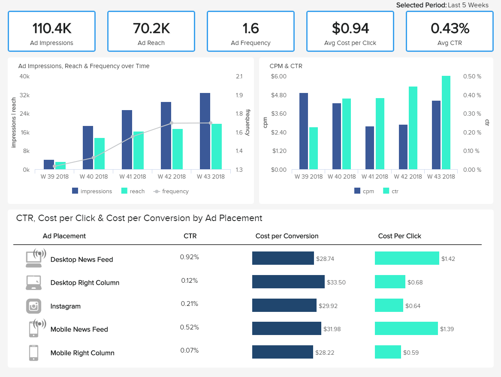
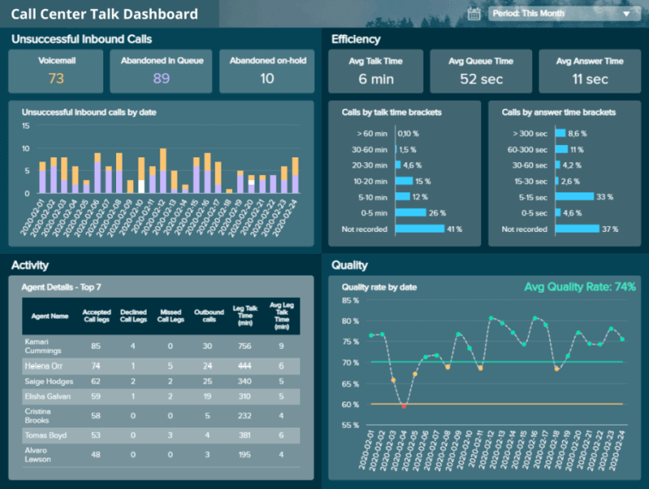
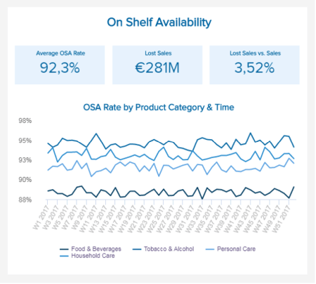

几十年来，企业一直在通过传统的书面报告分析其绩效，但随着每天产生的数据量越来越大，对更频繁报告的需求也在增长。通常，公司会生成用于多种目的的月度、季度或年度的书面报告，但它们无法提供企业成功和保持竞争优势所需的详细洞察力。这就是交互式周报发挥作用的地方。

借助强大的可视化和实时数据，现代每周总结报告使企业能够密切监控其业绩和战略进展，提取相关见解并优化其流程，以确保持续增长。

为了让您开始使用具有强大数据可视化的交互式周报，在这篇文章中，我们将介绍周报的定义，告诉您使用它们的一些好处，为您提供适用于不同业务行业的顶级周报模板和使用专业的[BI 仪表盘软件](https://www.datafocus.ai/infos/bi-dashboard-tools)创建的功能，并最终给出一些实现成功的周报的技巧。

让我们从定义开始。

## 什么是周报？

周报是一种工具，可以为企业提供给定一周内业绩的详细总结。在交互式可视化的支持下，管理人员使用这些报告来概述一周的进度，并为未来寻找改进机会。

通常，周报用于跟踪不同业务场景的进度或绩效，例如项目、销售、财务、市场营销活动、人力资源或任何其他可能相关的领域。传统报告通常采用书面形式，可能包括引言、正文和结论。尽管需要这种周报格式来总结一些相关信息，但它也是静态的，效率较低。

如今，越来越多的企业正在转向在线数据可视化，例如用户友好且所有人都可以访问的[仪表板创建器。](https://www.datafocus.ai/infos/dashboard-creator)通过交互式报告可视化您的每周工作表现的能力可以360 度全方位地观察你的进步，从而改善你的决策。我们将在这篇文章中看到这些交互式报告的实际应用。

## 为什么每周进度报告很重要？

如前所述，周报为企业提供了影响各个部门和职能的相关任务的详细概述。既然远程工作已经成为商业世界的一个永久组成部分，对性能和任务进行更详细监控的需求也在增长。在线[报告工具](https://www.datafocus.ai/infos/online-reporting)为经理们提供了交互式每周状态报告，因此即使他们在远程工作，他们和他们的员工也可以保持联系。这样可以减少会议频率，并有更多时间专注于任务。与此同时，每周活动报告很重要，因为：

- **它们允许做出明智的决策：**除了对商业成功有帮助外，月度、季度和年度报告不能像每周运营报告那样提供即时的洞察力。每周跟踪相关的关键绩效指标将改善决策过程，同时让每个利益相关者都参与到数据中。
- **它们支持团队绩效跟踪**：跟踪不同团队的绩效是周报对现代企业如此重要的另一个原因。作为管理者，您需要了解您的员工在做什么以及他们是如何做的。能够根据员工的表现每周向他们提供反馈，这会让他们更加专注于自己的任务并提高工作效率。
- **它们有助于发现改进机会**：周报的短期性质允许对不同业务战略的发展有更详细地了解。这样，您就可以找到改进机会，并在潜在的低效率问题变成更大的问题之前发现它们。与此同时，周报还可以为您的业务节省金钱和时间，因为您可以快速确定策略是否成功，并相应地重新分配资源。
- **它们增强了协作和沟通**：使用现代周报的主要好处之一是，它们可以作为有价值的工具来加强不同利益相关者之间的沟通和协作。现代[BI 报告工具](https://www.datafocus.ai/infos/bi-reporting)使您可以轻松地将所有相关数据源可视化到一个访问点，这样每个人都可以与最新发展保持联系。授权组织中的每个人每周生成自己的交互式报告将提高公司的生产力，从长远来看可以实施数据驱动的文化。

既然您已经了解了可视化周报的好处，那么我们将针对不同的行业、平台和业务功能列出 7 个强大的周报模板。

## 用于状态跟踪的周报模板

### 1\. 营销周报

我们的第一个周报示例是一个交互式[营销 BI](https://www.datafocus.ai/infos/business-intelligence-marketing)仪表板，通过总印象数、点击次数、获取量和成本等指标跟踪不同活动的绩效。让我们更详细地看一下。

每周营销报告首先提供广告活动的总支出并将其与预期支出进行比较。这是每周监控的重要指标，因为它可以让您了解您的成本目标是否真实符合可行性。举个例子，您进行了一个预算较大的广告活动，但在一周中发现它没有回报您，您可以在为时未晚并浪费预算之前立即做出调整（如果您每月或每季度都在监控您的支出，这中情况很可能会发生）。您还可以查看广告活动是否表现出色，并为其分配更多资源。

接下来，我们概述了点击次数、展示次数和获取量等性能指标，每个指标都显示了过去 12 周。在这份交互式[营销报告](https://www.datafocus.ai/infos/daily-weekly-monthly-marketing-report-examples)中清楚地描述了在您的每周状态报告中包含历史数据的价值。每周跟踪每个活动的发展将允许您测试不同的策略，并将结果与​​前几周的值进行比较。这使您可以更详细地监控广告活动的每个重要方面，并明智地使用您的资源。

### 2\. IT周报

在处理工单和处理网站更新等大型项目之间，您的 IT 部门总是忙得不可开交。这份每周项目状态报告旨在为您提供有关 IT 项目状态的最重要信息，促进沟通并确保高效开发，从而让您的生活更轻松。

这份直观的 IT周报提供了运营和成本相关的[IT 指标](https://www.datafocus.ai/infos/kpi-examples-and-templates-it)的组合，形成了项目状态的准确图景。像这样，您可以确保您没有超出预算，跟踪所有截止日期，并且您的员工没有超负荷工作。此外，通过每周查看这些指标，您可以更深入地了解逾期任务的原因并找到明智的解决方案，以免影响项目的开发。

每周使用[IT 仪表板](https://www.datafocus.ai/infos/dashboard-examples-and-templates-it)跟踪大型 IT 项目的性能和状态，将使管理人员和参与项目的任何其他人了解每项相关任务或开发，促进决策过程并最大限度地缩小范围，以便快速发现问题并得到有效处理。不仅如此，每周获得这种级别的洞察力还将帮助团队与他们的任务和截止日期保持联系，同时加强协作。

### 3.销售周报

我们的下一个周报模板是一个[销售仪表板](https://www.datafocus.ai/infos/dashboard-examples-and-templates-sales)，提供销售部门业绩的详细概述，重点关注销售增长、销售目标、ARPU、CLV 和 CAC 等指标。

这份易于理解的每周销售报告采用了有价值的数据可视化组合，为您提供了销售运营的全貌，因此您可以快速轻松地了解您的业绩，而不会丢失任何有价值的信息。例如，仪表板的顶部提供了对销售团队业绩的洞察。通过查看销售目标指标，您可以轻松评估是否有人需要额外培训才能达到个人目标。

另一方面，仪表板底部跟踪 ARPU、CLV 和 CAC，提供了这些指标在过去12周内如何发展的快照，以便您深入挖掘并找到有助于提高业绩的趋势和模式。将所有这些信息汇集到一个交互式的销售周报中，就像这样，你可以比较这些重要的数字，并监测你是否正在实现你的目标。从长远来看，您将加强您的运营管理并提高您的利润率。

### 4\. 医院周报

在我们的示例列表中，接下来是医疗保健行业的周报模板。借助与管理和运营相关的强大指标，此[医疗保健仪表板](https://www.datafocus.ai/infos/dashboard-examples-and-templates-healthcare)将使您能够识别趋势、发现任何瓶颈并帮助分配资源以实现可持续的设施发展。

运营医疗机构并非易事，每个细节和部门都需要仔细监控，因为任何问题都可能会直接影响到患者的护理。出于这个原因，在这个行业中制作周报的价值是毋庸置疑的。

上面的仪表板是用一个具有实时数据的[医疗保健商业智能工具创建的，因此您始终可以提取新的业务洞察力。](https://www.datafocus.ai/infos/healthcare-analytics)从左侧开始，我们可以看到相关值，例如患者总数、入院患者总数、平均治疗费用、平均急诊等待时间和可用的工作人员。这些信息都有更详细的图表补充。这样，您将能够了解特定部门是否过于拥挤，并分配资源以确保患者得到最佳护理。

### 5\. Facebook 周报

一种特别有价值的周报格式，此[Facebook 仪表板](https://www.datafocus.ai/infos/dashboard-examples-and-templates-facebook)专注于广告的开发，使您能够优化您的活动，明智地分配您的资源，并跟上可能出现的任何算法变化。这样，您将通过创建有数据支持的活动来节省时间和资源。

通过这份 Facebook 周报，我们首先看到了[Facebook 基本 KPI](https://www.datafocus.ai/infos/kpi-examples-and-templates-facebook)对广告管理的当前价值，例如展示次数、覆盖面、频率、每次点击成本和 点击率（CTR）。然后将它们中的每一个分解成更详细的图表，以一种视觉上吸引人的方式展示过去 5 周的发展，使它们一目了然。每周获得这种级别的洞察力将使您能够密切监控你的广告活动的效果，并根据哪种广告策略对您的业务表现更好来测试不同的广告策略。如果您想更深入地了解，可以按天过滤每周。

### 6\. 服务周报

接下来，我们有一个流行的基于云的客户服务解决方案的周报示例：Zendesk。考虑到呼叫中心因等待时间长和解决方案效率低而臭名昭著，因此应将您的精力集中在提供最佳通话服务上，而此仪表板将帮助您做到这一点。

通过提供与呼叫中心绩效相关的[Zendesk KPI](https://www.datafocus.ai/infos/kpi-examples-and-templates-zendesk)组合，这份服务周报将帮助您优化与呼叫团队性能相关的每个细节，以确保提供优质的服务。

尽管此份报告关注的是一个月的进展，但它也是每周跟踪的宝贵资源，因为它可以让您更深入地挖掘特定问题或趋势的原因。例如，每周跟踪座席代理的表现可以让您了解是否有人需要额外的培训。此外，您可以找到客户行为的模式，例如他们最有可能致电的时间，或者他们最常遇到的问题。这样您就可以准备相应的资源和策略。

### 7\. 快速消费品周报模

快速消费品 (FMCG) 行业可以说是与每周业绩报告最相关的行业之一，因为这些公司处理的是人们消费的可食用产品，因此任何错误都可能产生重大影响。根据德勤的一项研究，使用分析技术的快速消费品企业将通过识别市场中的关键价格点、了解消费者行为以及基于竞争情报制定新的定价策略来保持领先地位。现在我们来看看两个对这个行业很有价值的周报模板。

1. **现货上架**

此每周进度报告模板旨在衡量特定产品上架销售的时间百分比。在大多数情况下，该指标是通过审核商店中的可用产品或通过对库存进行更深入的分析来衡量的。

这是一个重要的[FMCG KPI](https://www.datafocus.ai/infos/kpi-examples-and-templates-fmcg)，需要每周测量一次，因为它可以让您了解某些特定商品的销售频率，并相应地规划您的库存和库存策略。如果顾客到达超市，但反复没有找到他们要找的东西，他们就会转移到下一个超市。

1. **准时交货**

在这个周报样本中，我们将研究快速消费品行业的供应链交付表现。该报告跟踪不同级别的交付，包括质量标准、交付时间和交付数量。每周跟踪这份报告可以帮助超市衡量供应商的表现，因为它可以让他们确定有些供应商是否没有提供预期的服务。

我们介绍了适用于各种业务功能、行业和平台的周报模板。如果您想查看超过 80 种交互式报告，请浏览我们的[仪表板示例](https://www.datafocus.ai/infos/dashboard-examples-and-templates)列表，并找到更适合您业务的示例。现在我们将进入本指南的最后一部分，我们将为您提供一些完美的周报格式的技巧。

## 每周绩效报告的主要内容

创建完美的每周绩效报告并不需要遵循一套规则，因为正如您在我们的示例中看到的那样，每个规则都有不同的目的。但是，要想成功完成周报，有几个步骤和要素是你应该遵循的。例如，您应该把上一周取得的成就和下一周的未来计划相结合。与此相对应的是，在创建每周报告之前，您还应该考虑谁是您的受众，以及哪些 KPI 和视觉效果能尽可能以最佳方式讲述您的数据故事。更详细地说，一份成功的每周绩效报告应该包含的主要要素是：

### 历史和当前数据

如前所述，创建报告时应遵循的步骤之一是在周报中包含当前绩效以及过去的数据。一方面，深入了解不同策略和任务的进展将有助于让团队中的每个人都对自己的表现保持一致，并从他们在那一周面临的不同障碍中学习，找到改进的机会。另一方面，拥有历史数据将帮助您发现业绩趋势和模式，让您更深入地了解您的业务。例如，您实施了一项更改，然后发现前几周的数字有所下降，那么就表明该策略可能不起作用。

### 实现目标和指标的进展

设定目标是一种有价值的报告实践，因为它不仅可以激励员工更好地实现目标，还可以让您以现实的方式衡量您的进展。您的每周绩效报告可以包括跟踪年度业务目标的 KPI，以及较小的目标，例如每周销售额或要达到的粉丝数。这里要记住的重要一点是，并非每个 KPI 都能以最佳方式代表您的目标，因此您需要选择能够为您的报告提供价值的那些，而不是让它充斥着无用的信息。如果您想查看不同功能、行业和平台的多个指标，请浏览我们的[关键绩效指标示例](https://www.datafocus.ai/infos/kpi-examples-and-templates)列表。

### 混合数据可视化

正如整篇文章所提到的，现代每周绩效报告的价值在于它们是强大的可视化工具，使每个人都可以访问报告过程，而无需任何技术技能。在您的周报中包含交互式图形和图表的组合是基本的，因为它们将为您的数据提供上下文，并让您一目了然地提取相关见解。诸如DataFocus之类的工具提供了一个 BI 仪表板工具，使您只需单击几下即可以[在线仪表板的形式创建交互式周报](https://www.datafocus.ai/infos/online-dashboard)。这样，通过使数据分析过程可视化和用户友好，让每个利益相关者都参与到数据分析过程中。

### 已完成的任务

由于每周报告的主要好处之一是加强经理与其团队之间的沟通，因此您的每周绩效报告还应包括已完成的任务和本周达成的目标。这将帮助管理人员与团队的不同任务保持联系的同时，记录在业务目标方面已完成的工作。

### 自动化功能

考虑到现代企业比以往任何时候都更加忙碌，如果不占用其他工作的宝贵时间，就不可能每周手动创建报告。出于这个原因，成功的每周报告流程应该包括[报告自动化](https://www.datafocus.ai/infos/automated-reporting-system-and-tools)功能，这些功能将摆脱过去手动报告的痛苦，并促进企业处理报告的方式。BI 工具（例如DataFocus）会根据您决定的任何时间计划自动生成带有实时数据的报告。只需单击几下，您就可以获得包含等待开发的新业务洞察的周报。

## 成功报告的关键知识

随着我们的周报之旅的结束，我们希望您能更好地了解使用交互式数据可视化跟踪进度和状态的好处。您的周报将不仅为您提供当前表现的概览，还为您提供前几周的历史数据，让您了解数据中的各种现象。因此，您将享受基于事实信息而不是简单的人类直觉的高效决策过程。

我们定义了现代周报，讨论了您的企业可以从中获得的好处，审查了不同业务场景的示例，并总结了开发成功的周报的技巧。为了让您的头脑保持清醒，这里简要总结了您不应该忘记的关键事项：

**为什么周报很重要？**

- 它们允许做出明智的决策
- 它们支持团队绩效跟踪
- 他们有助于发现改进机会
- 他们增强了协作和沟通

**每周报告应该包括什么？**

- 历史和当前数据
- 实现目标和指标的进展
- 混合数据可视化
- 已完成的任务
- 自动化功能

如果您准备在专业仪表板工具的帮助下开始创建自己的交互式周报，那么请完全免费尝试我们的[30 天试用](https://www.datafocus.ai/console/)版 ，并从今天开始从高质量报告中受益！
