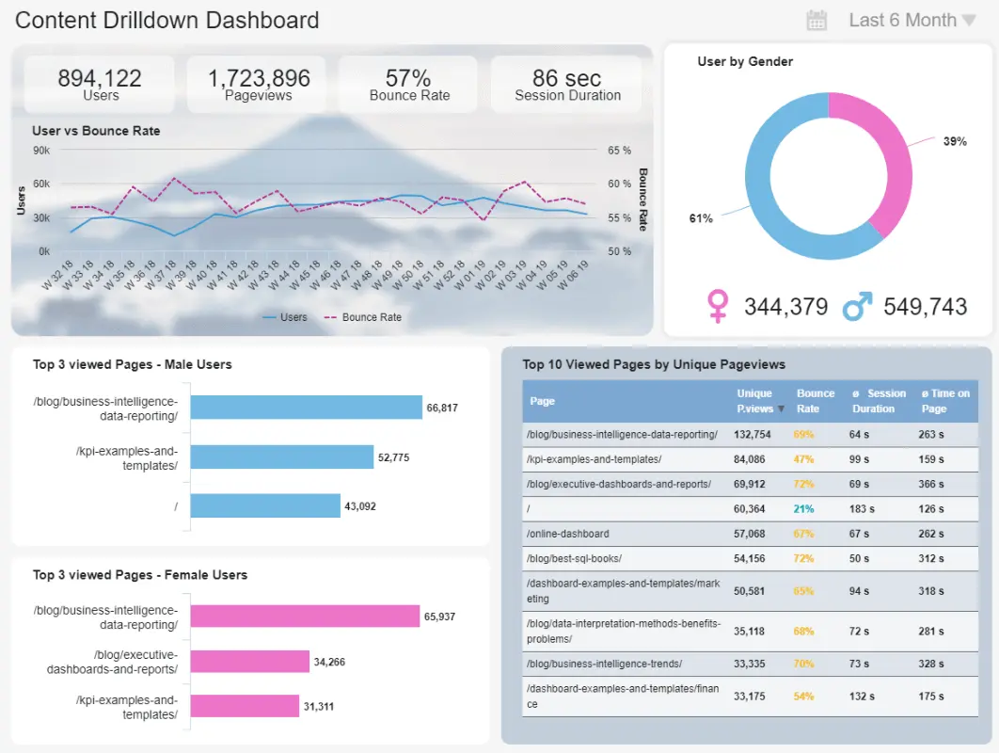
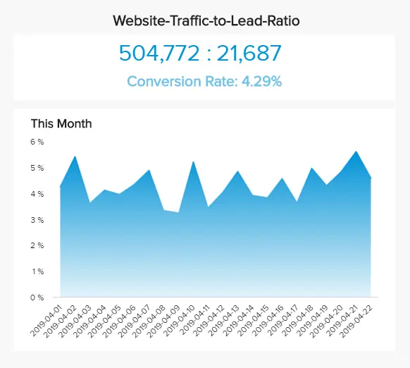
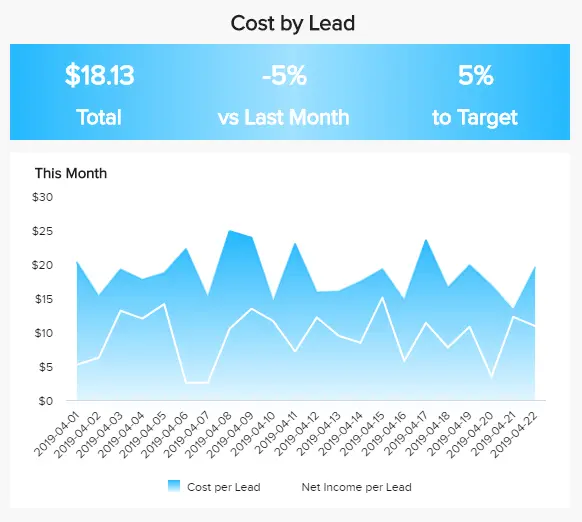
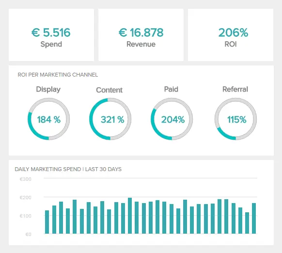

作为内容经理，您很可能将大部分时间花在撰写高质量的博客、电子邮件通讯和社交媒体帖子上，所有这些都是为了确保业务增长并实现其目标。 也就是说，衡量这些努力的成功是工作的另一个重要部分，在许多情况下，它可能被证明是压倒性的，因为您需要使用多种工具来收集数据。 输入新式内容报告。

交互式在线仪表板形式的现代内容性能报告提供了一种直观且易于访问的方式来实时评估内容的成功及其投资回报率，并且在一个集中位置。 为了帮助您开始了解该主题，我们整理了本指南，包括定义、优势、示例和最佳实践列表。 让我们开始吧！

## 什么是内容报告？

内容报告是营销人员分析来自网络分析、社交媒体渠道、博客交互等的数据以评估其内容是否成功的过程。 像这样，他们定义什么是有效的，什么是无效的，并改进他们的策略以取得成功。

几十年来，企业一直在使用静态工具处理报告流程，这使得在适当的时候提取见解变得更加困难。 由于引入了交互式仪表板等现代报告工具，情况已不再如此。 我们在下面介绍。

## 什么是内容仪表板？

内容仪表板是一种分析工具，其中包含用于评估所有与内容相关的计划是否成功的关键绩效指标。 有了实时数据，营销人员和内容经理就可以为他们的战略提供信息，并实现他们的所有内容营销目标。

内容性能仪表板的价值在于其交互性和可访问性。 在为不同渠道构建内容时，能够做出符合受众需求的快速决策至关重要，因为这是成功的途径。 现代[仪表板软件](https://www.datafocus.ai/infos/best-dashboard-software-features)为您提供了必要的工具，可以在一个集中的位置可视化所有最重要的信息源。 通过这种方式，您可以发现任何问题以及改进机会，以充分利用您的资源并在此过程中实现您的目标。

现在我们已经了解了一些关键定义，让我们看看为什么分析您的内容可以成为一种成功的做法。

## 为什么内容报告分析很重要？

内容分析模板允许您以可理解和可访问的方式呈现相关信息，它不仅可以作为评估内部绩效的完美工具，还可以向投资者、经理或客户展示策略的执行情况。 其他一些好处包括：

- 创建实际执行的内容：在当今快节奏的世界中，在决定向观众提供哪种类型的内容时，不再可能在黑暗中拍摄。 内容分析报告是一个完美的工具，可以 360 度查看您的受众最喜欢的主题、格式和频率，并生成针对他们的内容。 通过查看相关的[KPI 指标](https://www.datafocus.ai/infos/kpi-examples-and-templates)来跟踪特定目标的进度，您可以确保只关注成功的工作，避免将精力投入到与您的目标无关的绩效不佳的领域。 这是使用实时数据最大化时间和资源的好方法。
- 提高内容投资回报率：通过根据从内容报告中收集的见解构建基于数据的明智策略，您将能够生成可能成功的内容。 随着时间的推移，这不仅可以节省您的业务时间和金钱来生成无用的内容，还可以通过充分利用可用的资源来最大限度地提高您的投资回报率。
- 提高品牌知名度和忠诚度：客户要求品牌比以往任何时候都更能预测他们的需求和需求。 通过使用[业务仪表板](https://www.datafocus.ai/infos/dashboard-examples-and-templates)分析您的受众行为，您将能够生成与客户对您的期望相一致的内容。 反过来，您将看到知名度和忠诚度水平的提高，这也将显着提高您的投资回报率以及忠诚客户向朋友和家人推荐您的机会。
- 让客户和团队了解情况：最后但并非最不重要的一点是，从内部角度来看，内容报告模板也可以证明是非常有价值的。 相反，您是一家与多个客户合作的机构或公司的营销团队，使用内容报告和仪表板让每个相关利益相关者了解最新发展是一种非常宝贵的方法。 这些现代报告易于共享和理解，使其成为支持讨论和促进协作的完美工具。

您的机会：[想立即使用数据提升您的策略吗？](https://www.datafocus.ai/console/) 试用我们的现代内容报告软件 14 天，完全免费！

## 内容仪表板示例和模板

为了正确看待内容报告工具的价值，我们现在将提供一个示例列表，您可以使用这些示例以有效的方式衡量您的内容 KPI。 如前所述，这些仪表板将来自多个来源的数据提供到一个位置，并且可以钻取以探索较低级别的信息并得出更深层次的结论。

### 1\. 内容明细仪表板

\*\*点击放大\*\*

我们的第一个示例是一家在其网站上生成大量内容并希望评估其成功的公司的完美概述。 这个最有见地的[Google Analytics仪表板](https://www.datafocus.ai/infos/dashboard-examples-and-templates-google-analytics)提供了概述指标和更详细的见解之间的完美组合。 在顶部，您可以看到一个图表，跟踪网站用户的每周发展、页面浏览量、跳出率和会话持续时间，在右下角，您可以看到特定页面跟踪的这些指标。 能够深入到较低级别的数据以了解数字背后的原因是一种非常宝贵的做法，尤其是在生成针对您的受众的内容时。 让我们在下面更详细地看一下其中一些指标。

- 跳出率：跳出率表示通过特定页面进入您的网站并在未点击任何其他页面的情况下离开的人数百分比。 高跳出率可能表明您的网站不够吸引人，无法保持用户的兴趣，这也会影响您内容的可见性。 另一方面，这也可能意味着他们最初查看的页面有效地回答了他们的问题，这就是为什么需要详细分析此比率以找到其背后的原因的原因。
- 会话持续时间：您的内容工作不仅对于为您的网站带来流量很重要，而且对于保持用户尽可能多地参与也很重要，因为他们停留的时间越长，他们回来的可能性就越大。 平均会话持续时间将告诉您哪种类型的内容或页面让用户参与的时间最长，哪些内容或页面不那么有趣，以便您可以相应地进行优化。
- 按性别划分的用户：了解您在用户性别中所占的份额是另一种可以帮助您提高策略的技术。 通过了解哪种类型的受众最喜欢您的作品，您可以确保为他们提供最好的体验和知识。 您还可以[向下钻取](https://www.datafocus.ai/infos/drill-down-drill-through-reports)到较低级别的数据，例如女性和男性用户的首页，并从中提取更深入的结论。

### 2\. 内容质量控制仪表板

\*\*点击放大\*\*

评估内容质量并非易事，因为它可能是一个主观过程。 也就是说，有一些指标可以帮助您了解您的工作是如何被感知的以及在哪些领域可以改进。 上面的示例通过提供对内容具有的不同交互的见解来帮助您做到这一点。 在这种情况下，我们的[数字媒体仪表板](https://www.datafocus.ai/infos/dashboard-examples-and-templates-digital-media)专注于博客文章等书面文章，它包括 KPI，例如按点赞排名前 5 的文章、每篇文章的平均评论、获得的订阅者和故事周转时间。 让我们在下面更详细地看一下其中的一些指标。

- 故事周转时间：该指标并非在线出版物所独有，几十年来，它已在出版业用于衡量文章从批准到实际发布的时间。 它可以帮助您优化每个阶段，使流程尽可能高效。
- Flesch 阅读易用性：Flesch 阅读易用性是一项在美国开发的可读性测试，由不同的内容营销报告工具用于评估文本的可读性水平。 虽然这个指标可能是主观的，但它是一个很好的参考，可以评估你的文章的阅读难易程度。 您可以为您的文章设置基准并相应地对其进行评估。
- 文章互动：点赞、分享和评论等互动是评估内容质量的最佳方式。 最后，您希望您的文章具有最多的互动，因为这意味着观众正在享受它们。 密切跟踪互动不仅可以让您了解客户最喜欢哪种类型的文章和主题，还可以帮助您了解参与度和忠诚度。

### 3\. 读者洞察仪表板

\*\*点击放大\*\*

正如在这篇文章中提到的，在建立成功的内容营销策略时，更深入地了解您的受众是一种基本实践。 为此，我们上面的数字媒体仪表板示例为您提供了必要的见解，以完整地了解受众人口统计数据和偏好。

- 读者排名靠前的类别：这是一个简单的指标，可帮助您了解哪些主题类别对您的读者最感兴趣。 对于撰写广泛主题的网站来说，这是一个特别有用的指标，因为它可以帮助将注意力集中在最具潜力的主题上。
- 读者的热门文章：深入了解顶级类别可以让您了解该类别中的哪些特定主题和文章是最成功的。 通过查看此指标以及此内容指标仪表板上的其他指标，您将能够全面了解读者在您的网站上寻找的内容。
- 按性别和年龄划分的读者：虽然了解受众的年龄和性别是一个有价值的工具，但这些指标放在一起时证明更加有用，因为这将帮助您准确了解目标受众的样子。 如上图所示，我们可以看到该企业在 25-34 岁之间的女性和男性比例很高，这是一个开始建立的好地方。

### 4\. 社交媒体内容绩效仪表板

\*\*点击放大\*\*

社交媒体渠道是用于共享内容并将流量重定向到您网站的终极工具。 话虽如此，我们的下一个示例侧重于 4 个社交媒体渠道（Facebook、Instagram、Twitter 和 YouTube）以及它们的实时表现。 这些指标中的每一个都针对一个目标进行跟踪，负数标记为红色，正数标记为绿色，以快速了解是否有任何表现不佳的地方。

- 参与率： 在社交媒体内容方面，参与率被用作成功因素，因为它在计算中包括任何类型的互动，例如喜欢、分享、评论、点击等。 这是评估策略成功与否的相关指标，您可以针对不同的渠道和内容类型（例如付费或自然内容）对其进行跟踪，并了解您应该将精力集中在何处。
- 平均转化时间： 转化时间是此[社交媒体仪表板](https://www.datafocus.ai/infos/social-media-dashboard-template)中最重要的指标之一。 最终，您正在生成所有内容，目的是将其转化为积极的业务成果，例如新客户或增加销售额。 也就是说，根据您的策略目标，转化可能会有所不同，因此将此指标用作内容成功的效果指标非常重要。

### 5\. C 级内容营销报告

所有内容营销活动的底线是将更多客户带入组织并在此过程中最大限度地提高投资回报率。 考虑到[79%](https://startupbonsai.com/content-marketing-statistics)的公司使用内容营销来产生高质量的潜在客户，这一点尤其正确。 这些目标是C级高管对营销团队的期望，也是针对他们的报告中应该包含的内容。 到目前为止，我们已经介绍了如何评估策略和工作质量的示例。 现在，让我们看一些高级指标来评估这些努力的成功。

- 网站流量与潜在客户比率

网站流量与潜在客户比率跟踪已转化为实际潜在客户的网站访问者数量。 当然，在您的网站上生成高质量内容的最终目标是将访问者转变为付费客户。 也就是说，这个比率应该尽可能高。 低费率可能意味着您的网站无法瞄准新客户。

- 每条线索的成本

在这个过程中，一旦您对潜在客户率有了了解，您还需要考虑成本。 通过量化对潜在客户进行评分的成本，营销人员可以更好地为不同的策略和活动分配资源和预算。 为了获得更好的见解，可以将该指标细分为不同的渠道，以更全面地了解哪些领域最有利可图。 这就引出了最后一个例子。

- 王

拥有高投资回报率是您内容策略之旅的最终目标。 鉴于该指标与收入直接相关，它是营销部门最相关的成功衡量标准之一。 这方面的一个好做法是比较不同的领域，看看哪些领域带来的回报最多。 在这种情况下，我们可以看到内容具有最高的投资回报率，这意味着成功的策略。

## 内容报告最佳实践

现在我们已经看了一些示例，您可能已经准备好生成自己的内容报告了。 为了帮助您完成此任务，以下是成功分析数据并生成有见地的报告的一些最佳实践。

- 根据目标制作报告

作为基础，任何成功的[数据报告](https://www.datafocus.ai/infos/data-report-examples)过程都应从定义明确的目标和目的开始，以用作衡量绩效的指南。 就内容策略而言，目标应基于两个因素：一般业务目标，例如增加销售额，以及更具体的业务目标，例如通过SEO策略增加自然流量。

通过设定明确的目标，更容易以高效和有效的方式衡量投资回报。 定义目标后，您可以开始问自己需要仪表板和报告来回答的问题，并定义将用于衡量您的努力的 KPI。 这就引出了我们的下一点。

- 使用 SMART 标准

定义常规目标后，下一步是选择将用于衡量为实现这些目标所做的努力的绩效的 KPI。 为此，有必要避免选择不会告诉您实际进度的虚荣指标。 在这方面的一个很好的做法是使用 SMART 标准。 根据它，您选择的 KPI 应该是：具体、可衡量、可实现、相关和及时。 换句话说，您的 KPI 应该与您的总体目标相关，考虑到业务现状，切合实际且可实现，并且可以及时衡量。 如果您想获得有关该主题的更多见解，请查看我们关于[KPI 指标和目标](https://www.datafocus.ai/infos/kpi-targets-goals-examples)的指南。

- 考虑您的受众

在处理内容报告时，您很可能需要将它们展示给不同的受众。 例如，内容代理机构可能需要为不同的客户生成有关其战略最新发展的客户[报告](https://www.datafocus.ai/infos/client-dashboard-report-examples)。 另一方面，营销人员可能需要向 CMO 或团队其他成员展示报告，以支持会议和讨论。 话虽如此，考虑每个受众的需求是成功报告过程的好方法。 在这里，有必要考虑您的受众需要通过报告回答哪些问题以及哪些 KPI 将帮助他们解决这个问题。

- 受益于文本分析

从不同的技术中受益，从数据中提取最大潜力是您应该遵循的另一种最佳实践。 事实证明，在评估受众对您的内容的情绪时，文本分析特别有用。 简而言之，文本分析使用机器学习以及统计和语言技术来分析大量文本数据，例如社交媒体评论，并了解情绪是消极的、积极的还是中立的。 这是另一种方式，您可以通过它了解每件作品是如何被感知的，并找到改进的机会。

- 使用自动化和实时数据

生成高质量的内容是一项耗时的任务。 考虑到这一点，报告这项工作的绩效可能更加难以挤进去。 出于这个原因，依靠包含自动化功能和实时数据的[仪表板创建器](https://www.datafocus.ai/infos/dashboard-creator)是享受内容报告和见解的所有好处的最佳选择，而无需手动生成它们的繁琐任务。 使用自动化工具，您的报告会自动生成并使用实时数据进行更新，因此您始终可以轻松获得最新的发展。

您的机会：[想立即使用数据提升您的策略吗？](https://www.datafocus.ai/console/) 试用我们的现代内容报告软件 14 天，完全免费！

## 内容报告的关键要点

正如您在整篇文章中所看到的那样，内容报告和仪表板是非常宝贵的工具，它们提供了必要的知识来做出明智的决策并根据您的受众偏好量身定制有针对性的策略。

借助基于数据的现代方法，您不再需要在黑暗中拍摄或将宝贵的资源浪费在错误的目标策略上。 现代 BI 仪表板软件为您提供了以用户友好、可访问和高效的方式处理内容数据的关键功能。

如果您已准备好开始构建自己的内容报告，请尝试我们的[在线报告软件](https://www.datafocus.ai/infos/online-reporting)进行[14 天免费试用](https://www.datafocus.ai/console/)，并立即从实时性能跟踪中受益！
