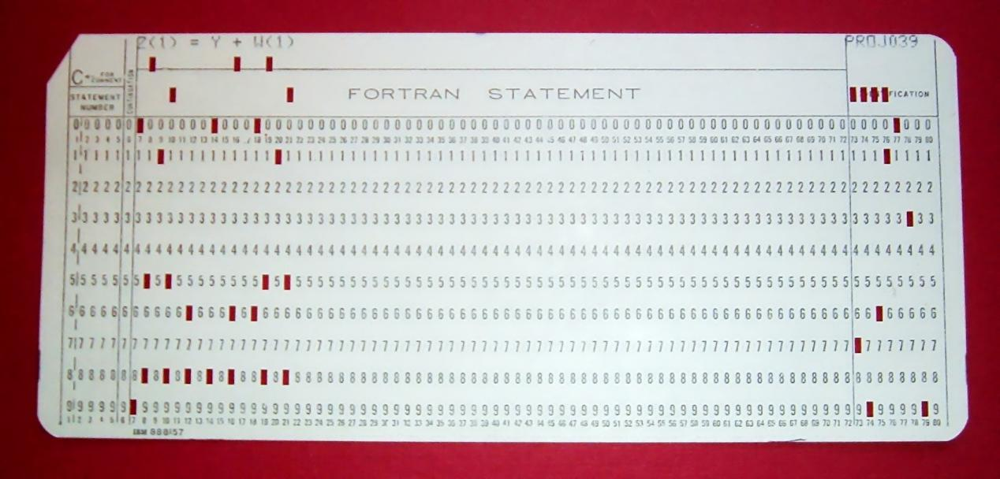

信息可视化有着悠久的历史，并在17世纪以来取得了长足的进步。由于计算能力的发展，20世纪在信息可视化的发展方面取得了卓越的成就。我们从历史说起，在1812年至1813年的俄罗斯战役中，绘制法国军队连续损失的地理图形可视化可谓是信息可视化历史上的一座丰碑，提到信息可视化的历史，都少不了要提起它。现在，同样的图形可以通过更丰富的细节和交互元素渲染出来。

_作者/版权所有者：IñigoLopez。版权条款和许可：CC BY-SA 4.0_

**20世纪的信息可视化发展情况**

在20 世纪早期，信息可视化领域的进展不大。人们做了一些努力来改进现有的模型，但整体而言 - 虽然可视化仍在向前发展，但是这门学科似乎没有突显出来，也很少有惊人的进步。

然而，20世纪下半部分的信息技术发展，则创造了信息可视化学科的发展和繁荣，持续至今。20世纪是个充满戏剧性的时代，各种新技术一批一批涌现，先是计算技术的革新，之后又是互联网的发明，加快了信息传播的速度，这就间接催生了信息可视化技术的发展。

## **1950-1975 - 数据可视化的变化**

约翰·图基于1962年发表了一篇论文“数据分析的未来”。在那篇论文中，他探索了信息可视化的学科（没有参考信息可视化，因为这个术语在20世纪80年代在施乐帕洛阿尔托研究中心创造后才成为常用的说法），特别是开始创建可用于分析的新模型，如箱形图，悬挂根图等, Tukey的工作重振了这门学科，并开始吸引专业人士回到数据分析领域。

1967年，法国的Jaques Bertin试图在他的作品Semiologie Graphique中统一图形和演示。它提供了巨大的洞察力，可以直观地生成信息，从而更好地了解统计分析。

然后在20世纪50年代末和60年代，采用编程语言FORTRAN，这是第一种“高级”语言，开始能够创建计算机处理的统计数据 - 大大增加了要处理的信息量。在20世纪60年代后期，通过计算机创建信息可视化的过程正在进行中，并且第一批统计应用程序在20世纪70年代初开始出现。

_作者/版权所有者：Arnold Reinhold。版权条款和许可：CC BY-SA 2.5_

许多形式的统计表示也在20世纪70年代早期出现，包括：傅立叶函数图，Chernoff面图，起始图，聚类和表示以及使用多维双标图。

## **1975年 - 至今 - 互动和动态数据可视化的出现**

由于发展过于迅速，为信息可视化的进展提供精确时间表变得更加困难。Michael Friendly提供以下要点：

- 开发了高度交互的统计计算系统并且这些系统是常用的。这与使用编译批处理的早期命令驱动系统进行了比较。
- 实现了可视化数据分析的新方法，例如链接，刷涂，选择，聚焦等，可以应用于交互式数据模型。
- 开发了诸如盛大游览，散点图矩阵，平行坐标图等工具，因此可以更好地分析具有大量维度的数据。
- 开发了用于绘制离散的分类数据的新技术。
- 信息可视化领域已经扩展到包含许多新形式的数据，数据结构。
- 除了提供美学上令人愉悦的简单静态可视化之外，信息可视化领域已经开始实现对显示数据的认知和感知方面的理解。

一个比较通用的例子，是一大批工业界商业智能产品和数据可视化软件的出现，将可视化的发展推向了新的高度，除了大量的使用交互新技术以外，一些前卫的软件如DataFocus也开始引入自然语言处理技术（NLP），增强数据分析的易用性，将数据可视化推向深入。

 _作者/版权所有者：Chris 73.版权条款和许可：CC BY-SA 3.0_

虽然理论上可以手动创建上述图像，但实际上它们需要计算能力才能实现经济高效的开发。如果手工绘制的话，一个小小的错误会使这样的图表变得无用; 在计算机上单击按钮可以修改可视化。

除此之外，整个世纪还开发了越来越强大的应用程序来实现信息可视化。这包括开发动态图形方法，允许数据用户快速，轻松，直接地处理图形及其属性。

在20 个世纪一直是一个时期的信息可视化的感谢显着进步来计算的出现和“大数据”的曙光。由于互联网，研发团队在互联网领域的快速发展和新方法之间的协作迭代，很难（如果不是不可能的话）为这一时期提供完美的事件年表。
