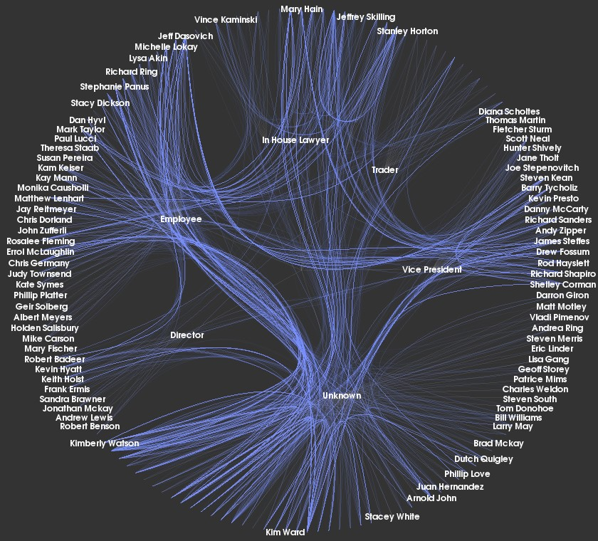
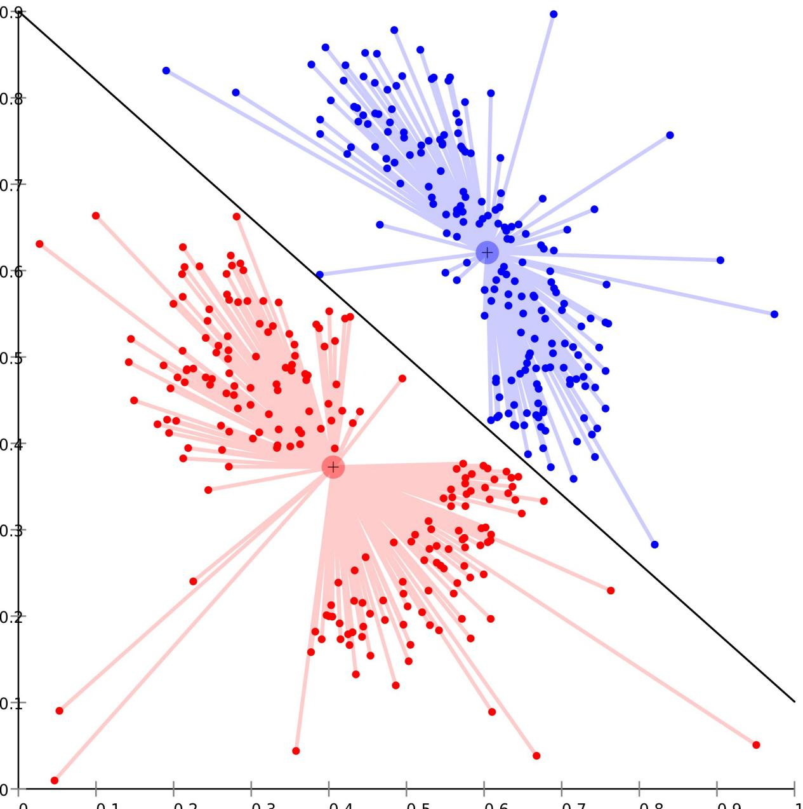

如您所见，信息可视化 可以产生令人难以置信的美丽图像，高效的传达信息。下面的图像是现已解散的安然集团的通信组织图。

__

_作者/版权所有者：Kitware Inc.版权条款和许可：CC BY-ND 2.0_

Ben Shneiderman说： “可视化的目的是洞察力，而不是图片。”

那么，可视化是否有设计诀窍呢？Riccardo Mazza在他的书“Introduction to Information Visualization”中，为我们提供了一种信息可视化的5步设计法，我们一起来看看吧。

## **设计信息可视化的5个步骤**

整个设计过程很简单，一旦你审查了这个过程，它应该是常识：

1. 定义问题
2. 定义要表示的数据
3. 定义表示数据所需的维度
4. 定义数据的结构
5. 定义可视化所需的交互

## **1.定义问题**

与任何用户体验工作一样; 第一步是定义信息可视化将解决的问题。这通常需要一些用户研究 来回答问题; “我的用户需要什么呢？”、“他们将如何使用它？”

您可能正试图向用户解释某些内容，或者您可能正试图让他们建立新的联系或观察; 为了将问题定义清楚，您还应考虑用户群特有的任何特定因素，比如：他们的教育水平或数据处理能力如何？他们过去的数据有什么样的经验？这将指导输出的复杂程度，并阐明用户的整体需求。

## **2.定义要表示的数据**

有三种主要类型的数据可以通过信息可视化来表示，它们的映射方式可能会有很大差异 - 因此，在开始设计之前，在您的脑海中清楚地了解数据，您将使用哪些数据？

1. ****定量数据**** - 这是数值类的数据。
2. ****有序数据**** - 非数值的，但具有内在顺序的****数据****。（例如，想想一周中的几天。）
3. ****分类数据**** - 既没有数字也没有内在顺序的数据。（例如商业名称或地名）。

## **3.定义表示数据所需的维度**

必须仔细考虑数据集的维度或属性的数量，因为它将在很大程度上确定哪些数据可用于进行信息可视化。数据中表示的维度越多 - 理解信息可视化就越混乱。因此值得注意的是，具有大量维度的数据可能更适合使用高度交互式表示，不适合静态图形展示。可以根据要研究的相关维度的数量将分析分成四种类型：

1. ****单变量分析**** - 针对自变量研究单个因变量
2. 双变量****分析**** - 其中两个因变量针对自变量进行研究
3. 三变量****分析**** - 其中三个因变量针对自变量进行研究
4. ****多变量分析**** - 针对自变量研究三个以上的因变量

__

_作者/版权所有者：Chire。版权条款和许可：CC BY-SA 3.0_

多变量分析的图像，其中数据点之间的关系很多且相关。

## **4.定义数据的结构**

这是关于检查数据集如何相互关联的全部内容，常见的关系结构包括：

- ****线性关系**** - 数据可以以线性格式显示，例如表格，向量等。
- ****时间关系**** - 数据随着时间的推移而变化
- ****空间关系**** - 与现实世界相关的数据（例如地图数据或办公室平面图）这有时也被称为地理关系
- ****分层关系**** - 与定义的层次结构中的位置****相关的****数据（从办公室管理结构到简单的流程图）
- ****网络关系**** - 数据与同一数据中的其他实体相关

__

_作者/版权所有者：Nathanael Crawford。版权条款和许可：CC BY-SA 3.0_

以上示出了分层网络模型的示例。

## **5.从可视化中定义所需的交互**

设计过程的最后一部分要求您了解用户信息可视化所需的交互级别。有三类互动：

1. ****静态模型**** - 这些模型按“原样”显示，例如您保存在汽车中的道路地图集中的地图。用户无法修改它们。
2. ****可转换模型**** - 这些模型使用户能够转换或修改数据。它们可以允许用户改变用于分析的参数或者为数据集选择不同形式的视觉映射。
3. ****可操作模型**** - 数据有时候是高度关联的，通过操作部分数据图形，可以获得关联数据的变化，从而产生新的见解是一种常见的互操作方法。例如：我们可以通过[DataFocus](https://www.datafoucs.ai)快捷创建图形的联动操作。

**小贴士：**设计信息可视化的过程可能与您的最终输出并不直接相关，但可以使您更加明智地决定何种表示形式最适合您的用户。通过充分了解用户的需求，以及他们需要展示的数据、数据中的关系和模型类型，信息可视化设计师可以提供充分满足这些需求的可视化作品。
