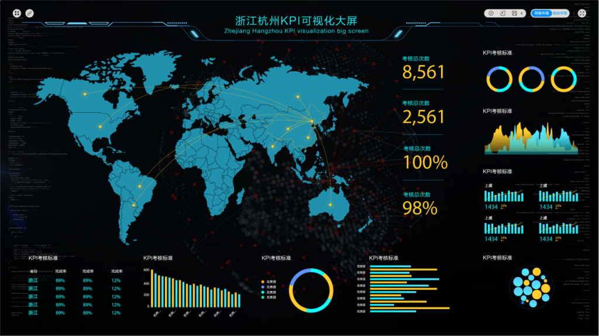

纵观以往大数据的发展过程，之前的企业想要进行企业的数据可视化分析却需要组建自己的研发团队，耗费大量的时间成本和人力成本将数据进行导入导出，通过技术部门的复杂的代码指令来实现数据的简单可视化展现，而且需求一变之前所做的工作将化为乌有，重新开始。但是现在，通过互联网技术的不断进步，数据可视化不仅仅是只能通过复杂的代码进行简单的分析展现，而是涌现了大批的数据可视化工具。通过体验了绝大多数的BI工具之后，我们挑选了几款给大家进行深入的分析。

## 1、Power BI

PowerBI背靠微软，大厂商的背景就注定了这款工具不平凡。主要基于高级excel功能发展起来，作为根基深厚的元老级软件的集合，顺延excel的风格，发展个人用户的个人数据分析软件。

PowerBI的操作有浓郁的excel风格，在集合后使用标志性的微软风格增加了许多界面操作功能，复杂功能辅以M语言、DAX函数、R语言、三方插件等集成来实现，功能强大但是对新手入门不是很友好，需要一定的技术基础。

## 2、DataFocus BI

DataFocus是杭州汇数智通科技有限公司研发的首个中文自然语言数据分析系统，自动建模，采用简单的搜索式的交互，系统便可以自动以数据或图表给予回答，支持进行数据筛选、钻取、数据联动等操作，自由、多角度地分析数据。让不具备代码能力、不熟悉数据结构的业务人员也能迅速上手制作出美观深入的数据图形。

DataFocus支持数据源连接和抽取数据至系统两种数据连接的方式，且支持整体或单表的数据全量或增量的更新，支持定时更新。

DataFocus支持主流的关系数据库、部分大数据数据库、多维数据库以及文本数据集，对企业数据平台对接能力更强。

DataFocus支持中文自然语言分析，用户可以通过跟AI人机对话的方式探索数据，系统可以理解人类关于数据的问题，以丰富的图表和数据回答相关问题，无需像拖拽操作一般要用户预先在构建好数据图形的数据结构，真正实现帮助业务人员去探索数据问题所在的目的。支持数据的钻取、过滤、联动等操作，多角度、各个维度的自由分析数据。同时还拥有丰富、美观的图表类型，根据数据问题智能选择合适的图表类型。

  

## 3、Tableau

Tableau的功能全面而且可操作深入，更适合专业的数据分析人员依靠自身强大的业务理解来进行个性化的数据展示

Tableau是连续六年在Gather BI与数据分析魔力象限报告中占据领导者地位的体量巨大的老牌产品。Tableau功能强大，注重细节，倾向于较专业的数据分析师，只要数据预先处理好，就可以制作很多绚丽多彩的信息图。覆盖数据源范围广，拖拽式操作只需把相应的数据拖到对应位置即可将数据信息映射为图形信息。在熟悉软件后，通过用户对组件的操作可以深入分析数据图表，生成美观清晰的数据报告。

