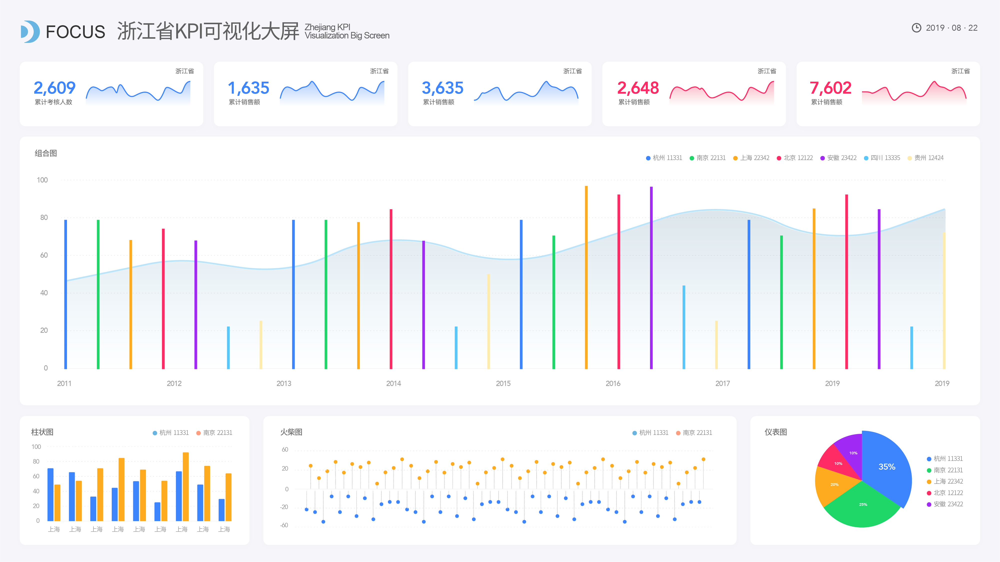

在这个大数据时代，因为数字化交易的不断普及，原本“实体”的客户不断的被数据化，并且有很多企业已经建立了自己的客户数据库，并且根据企业的实际，使用了不同的数据分析方法。比如聘请专门的数据分析师或是购买诸如DataFocus、数据赢家等智能数据分析工具。我们以前介绍过如何分析和处理客户数据，以及一些数据建模表比如CLV、客户生命周期等。尤其是对于CLV，同期群分析和它几乎是孪生兄弟，密不可分。

首先我们要明白为什么需要把客户数据细分。因为每个客户的价值不一样，每一个客户也会找到又带来更高贡献的客户。而这个“带来”更高价值客户的路径也会根据客户属性的不同随着你的不同营销方式改变。比如同期群分析，对于CLV来说，可以找出并获取最高CLV客户数据，像是某些电商案例，可以按第一次购买的月份去验证当月凭什么决策或改变策略，以吸引到这些高CLV价值人群。那么具体在应用端应有什么样的实施效果？

举个例子，2019年1月份至12月份的同期群，如果能看到每一个月的同期群的后面个月留存率走势比上个月更高，证明我们每个月做的策略或改变是有提升的，并且反映到客户对我们的价值，越多客户认可我们价值，就能产生更多重复购买率。

像是电商数据，我们的同期群分析还能参考下列数据分析公式，尤其是每个月的平均CLV：

（留存率 x 平均人件数）x 当月平均CLV= 当月真实CLV累计数

当月平均CLV= 总共CLV / 总当月人数

因此，同期群分析就是指将客户进行同期群划分以后，分析和对比不同同期群组客户的相同指标或者同一同期群在不同情况下的行为，这套分析方法结合CLV就是对客户数据细分处理的一种非常强大的应用方式。。
