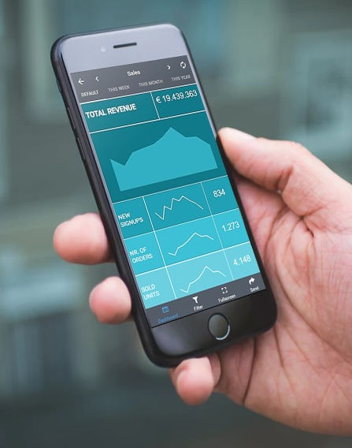

\[caption id="attachment\_43987" align="alignnone" width="610"\] 封面 banner\[/caption\]

我们生活在一个移动的世界。根据统计门户网站Statista的数据，目前全球约有 47.8 亿移动设备用户。我们不再受限于笨重的台式电脑或某个特定的地理位置，来进行研究或完成[在线数据分析](https://www.datafocus.ai/infos/data-analysis-tools)或其他重要的在线任务。在这个高度连接的时代，您可以在世界上任何地方进行连接、宣传和生产——而移动革命是造成这种巨大转变的原因。

移动技术改变了我们与周围世界互动的方式，在分析有价值的业务洞察时，移动仪表板提供了自由和灵活性，让您在旅途中将统计数据转化为成功。

在这里，我们将考虑什么是移动仪表板、仪表板移动设计、在移动设备上进行可视化以及真实的业务示例，以解释这种最灵活的数据驱动技术可以为您的业务带来的好处。

## 什么是移动仪表板？

移动仪表板提供了一种可移植的方式，用于监控与业务或组织的所有领域相关的最重要的高级 KPI 和数据。它提供了通过移动设备随时随地访问的便利，关键指标一目了然。

移动设备和仪表板正迅速成为性能监控的关键，将易用性与[实时仪表板](https://www.datafocus.ai/infos/live-dashboards)报告相结合，使用户可以随时随地无限制地访问以业务为中心的宝贵信息。

这些小巧便携的仪表板能够以一种易于理解的格式深入了解业务各个领域的洞察力、统计数据和指标，这种格式不仅具有交互性，而且针对移动设备进行了优化。这些紧凑、便携的仪表板拥有 24/7 的潜在决策能力。

## 为什么移动仪表板很重要？

如前所述，一个强大的仪表板移动设计通过一种易于理解的交互式格式提供对关键组织见解的远程访问，有可能以指数方式提高基于业务的生产力。对于希望在残酷的数字时代获得最重要的竞争优势的现代组织而言，仅此一项优势就是一个令人难以置信的加分点。

无论您身处哪个行业或部门，数字化转型意味着利用数字和[在线数据可视化](https://www.datafocus.ai/infos/data-visualization-tools)来增强您的业务运营不再是一种奢侈——如果您想生存，这是必要的。在当今世界，通过各种[KPI 示例](https://www.datafocus.ai/infos/kpi-examples-and-templates)（你可以根据自己的行业进行选择，并且不受限制）分析关键指标和衡量绩效的能力，是成功以及商业增长和发展的极其重要的驱动力。

为了更好地理解这个概念，以下是数字时代移动仪表板的主要好处：

- **快速决策：**通过各种[数据连接器](https://www.datafocus.ai/infos/data-connectors)和数据源提供数据和信息，并将其整合到一个中央定制仪表板中，可以快速从您的见解中提取价值，并以一种可访问的方式与关键利益相关者分享，从而产生可以改善您的业务运营方式的行动。
- **即时访问分析：**由于移动仪表板灵活且几乎可以从任何地方访问，因此可以在任何给定时间制定关键业务计划。这些[在线仪表板](https://www.datafocus.ai/infos/online-dashboard)的交互性、用户友好性意味着，你可以非常简单地利用您之前的见解并通过在移动设备上进行可视化来深入挖掘特定的信息口袋。这种对分析的即时且一致的访问还将改善内部沟通流程，减少数据碎片化，同时在整个组织内提供更高水平的数据驱动价值。
- **公司范围内的**[**商业智能**](https://www.datafocus.ai/infos/bi-skills-for-business-intelligence-career)**：**由于移动仪表板允许用户以灵活、可访问的格式分析、研究和交流关键业务数据，移动应用程序仪表板可以使所有部门的人员共享和利用数字数据，从而获得更明智、更准确的数据，以及有价值的业务决策，这些决策会导致持续改进、增长和发展。

_“移动的未来就是在线的未来。这就是现在人们访问在线内容的方式。”——David Murphy，Mobile Marketing Daily 创始人_

## 移动与桌面仪表板

移动设备上的仪表板与桌面上的仪表板不同。这两个平台对于现代企业的持续增长和成功都至关重要，但有 3 件事您应该了解。

1. **设计上的差异：** 由于移动屏幕比桌面小得多，仪表板元素的比例和位置会有所不同。由于移动设备的主要功能是检查和概述业务绩效，因此可以轻松调整各种[绩效仪表板示例](https://www.datafocus.ai/infos/performance-dashboard-examples)，以提供可通过移动设备访问的主要指标和 KPI 的概览。
2. **分析级别：**桌面仪表板具有令人难以置信的交互性和可视性，但由于它们专为桌面使用而设计，它们的选项和分析级别通常比移动应用程序仪表板更深入。移动仪表板无法提供这种级别的深入分析，因为它们的目的是收集高层次和最重要的数据。
3. **适应性：**由于桌面和移动仪表板的视图非常不同，因此考虑在移动设备上调整桌面视图的难易程度是很重要的。使用正确的[KPI 软件](https://www.datafocus.ai/infos/kpi-dashboard-software)，您只需单击几下即可轻松做到这一点。

此外，这可能看起来有点不寻常，但如果使用正确的平台或解决方案，移动仪表板和桌面仪表板之间几乎没有区别。事实上，如果您使用一个强大的平台，您的桌面和移动平台都将彼此沟通，创建一个无缝的数据分析系统，让您将洞察力转化为积极的行动。

## 如何创建移动仪表板

任何称职的移动数据技术平台都不需要从头开始构建不同[类型仪表板](https://www.datafocus.ai/infos/strategic-operational-analytical-tactical-dashboards)的技术知识 ——相反，您将能够以一种简单又直观的方式自定义它们以满足您的特定业务需求。

为了帮助您确保您的自定义尽可能成功，让我们回顾一下移动仪表板的最佳实践。

- **精简内容：**为确保您的移动[仪表板设计](https://www.datafocus.ai/infos/great-dashboard-design-examples-for-inspiration)尽可能高效和用户友好，仅包含您认为对业务进展至关重要的数据、KPI 和功能是至关重要的。任何您认为多余的需求都应该从您的移动仪表板设计中删除。
- **跨设备测试：**当您在移动设备上自定义仪表板时，跨不同设备（除了台式机）测试您的布局、视觉效果和功能相当重要，以确保您的设计针对许多不同的移动媒体进行了优化，包括智能手机和平板电脑等。
- **为“更大的手指”而设计：**尤其是在移动平台上，人们将使用手指与您的仪表板进行交互——当然，人们的手指有多种形状和大小。在设计仪表板时，确保功能、按钮和滚动选项足以适应不同的大小手型，以确保您的平台全面用户友好。
- **专注于可扫描性：**特别是在移动设备上，用户会快速扫描屏幕以查明他们需要的确切信息。您应该组织内部焦点小组来测试您的仪表板设计的“可扫描性”，并找出需要改进的地方。这样做将确保您组织内的特定用户可以轻松访问对其角色最有价值的指标或信息，并与之交互。自然，这将改善内部沟通和[数据发现](https://www.datafocus.ai/infos/what-are-data-discovery-tools)过程、促进商业增长，并最终提高您的利润。

## 3 个出色的移动仪表板示例

既然我们已经考虑了基本的移动仪表板最佳实践，让我们看看 3 个实用的移动仪表板示例，以获得更多的移动仪表板设计灵感，我们从基于移动的[营销仪表板](https://www.datafocus.ai/infos/dashboard-examples-and-templates-marketing)开始。

**1\. 营销移动仪表板示例**

借助我们以移动设备为中心的营销仪表板，您可以一目了然地访问基于企业营销和促销计划的重要周期性信息。借助可扫描的地理视觉效果、大量的快速统计数据，以及根据您的特定需求筛选数据的选项，您可以快速简化[营销报告](https://www.datafocus.ai/infos/daily-weekly-monthly-marketing-report-examples)并提高投资回报率。

**2\. 销售移动仪表板示例**

作为我们在移动设备上最有效的模板之一，我们灵活的[销售仪表板](https://www.datafocus.ai/infos/dashboard-examples-and-templates-sales)提供了针对您组织的销售健康和收入的指标和见解的组合。通过在旅途中访问这些数据，您可以制定策略以提高[销售报告](https://www.datafocus.ai/infos/sales-report-kpi-examples-for-daily-reports)和流程的效率，并在白天或晚上的任何时间与您的团队高效交流您的发现。

**3.管理移动仪表板示例**

管理是任何企业（无论大小）的关键且全面的组成部分，这个直观的移动模板可让您在移动过程中拥有快速访问趋势和洞察收入、绩效和销售的能力—— 这是任何一个快速发展的现代组织的宝贵工具，可以随时随地访问[管理报告，并更快地做出重要的业务决策。](https://www.datafocus.ai/infos/management-reporting-best-practices-and-examples)

我们希望这些移动仪表板示例为您提供了丰富的移动仪表板设计灵感，并且我们的指南为您提供了获得基于移动的数据分析仪表板回报所需的所有信息。

我们的解决方案不仅适用于您能想到的每一项商业计划，而且我们的移动仪表板应用程序适用于Android和iOS。它们还针对每种类型的移动设备或平板电脑进行了优化——因此无论您使用什么设备，都可以得到保障。我们的移动仪表板技术与桌面数据分析协同工作，将为提高您的业务生产力和加快的决策制定奠定坚实的基础。

拥抱移动仪表板的强大功能，为您的企业带来更美好的明天——没有时间可以浪费了！在DataFocus 免费注册30[天试用](https://www.datafocus.ai/console/)，享受移动的力量！
