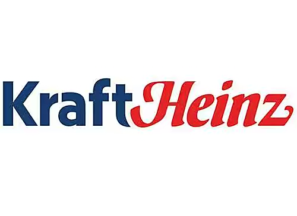

数据对组织的发展至关重要，这一点毋庸置疑。

亚马逊通过挖掘海量用户数据，尝试定位客户并获取用户反馈，成为全球第一大零售商。

华为通过数字化转型激发生产活力，逐步成为全球5G技术领导者。

然而，随着数字化转型席卷各行各业，数据来源和类型也在迅速发展，仅仅依靠企业专有数据就已经是目不暇接了。

在过去的几年里，创新型公司竞相利用新的外部资源，如行业报告、就业报告和社交媒体等外部数据，以更好地了解客户行为和优化供应链。

**然而，大多数公司通常利用这些外部数据非常低效。**

此外，多个部门和业务线都需要采购外部数据集，**企业很容易就在重复购买中浪费数百万元**。

许多公司会聘请高级数据分析师，但这样专业的人员很少能够深入了解每个领域，并很难确保购买领域内所有的外部数据。

不仅仅是这些数据的采购存在问题，而且引入、准备和分析外部数据通常是一个费时费力的过程，何况这样的数据还是孤立的，没有办法共享。

### 云计算共创共享数据

云完全颠覆了这一过程。数据共享不再需要数据移动，为数字原生代、知名品牌等提供了更高的可见性和规模。

这已经在整个行业中如火如荼地发生。

CPG公司卡夫亨氏便是利用外部数据来创新产品，并通过全面了解客户的购买模式来更好地为客户服务。

**云以多种方式改变规则。**

它增加了可用数据的类型和数量，并且它为如何共享数据提供了新方法。

随着世界以越来越多的方式实现数字化，人类的流动性、信用卡交易、招聘趋势变化和空气质量等新数据源可以进行更方便的深入分析。

### 利用外部数据还只是开始

购买外部数据是入门的一种方法，但还只是一个开始。

现在是时候重新构想整个价值链在数据共享方面实现的可能性了，这意味着利用区块链技术，建立数据共享生态系统。

而作为企业决策者需要考虑数据交接问题，谁来捕捉数据，以及如何连接数据，以在整个客户生命周期中创建增值数字生态系统。

在英国，Pet at home通过共享零售、兽医和忠诚度等宠物相关数据创建了一个独特的生态系统。

到2021年，企业总收入共增长18%。而其他宠物连锁店的增长幅度很小，比如PetSmart，在同一时期只增长了9%。

无论哪个行业，企业利用共享数据建立行业领导者优势，这一趋势正在加速。

例如，在汽车领域，福特等汽车制造商可以通过共享从汽车传感器收集的数据来改善驾驶员的安全性，和其他汽车制造商一起预警道路危险。

想象一下，你正在驾驶一辆奔驰，而防刹车系统因为一棵树挡住了道路而启动。而如果数据达成共享后，便可以警告您身后几英里的宝马司机。

当数据共享时，几乎对每一方都有利。

### BI工具开启数据共享新时代

开始利用数据共享和其他关键数据趋势，并通过BI工具建立数字化平台实现数据共享，让数据价值最大化。

而在众多BI中，搜索式云BI软件DataFocus成为中小企业首选。

它涵盖了一体式湖仓、ELT、下一代智能搜索式 BI 系统，数据链接器和转换器，提供全功能的一站式数据分析服务。

平台能容纳亿级数据，团队可以轻松协作，还设置好数据权限，选择性共享。

### 小结

数据共享程度越高，这代表企业信息发展水平也越高。

通过DataFocus的全栈式平台服务将业务信息实时更新至系统中，实现企业数据共享，一键托管式管理，给每位组织成员带来最好的体验。
