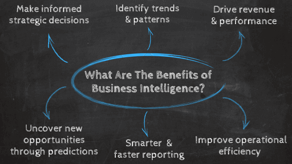
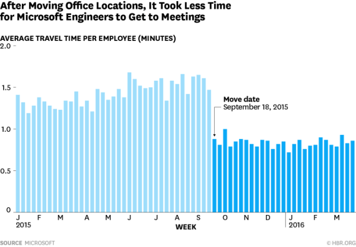

有效地使用商业智能和分析是现代环境中成功公司与失败公司之间的关键区别。为什么？因为商业各领域的情况都在发生变化，竞争越来越激烈，由此，商业智能和正确使用数据分析是超越竞争对手的关键。

例如，在市场营销方面，在不衡量投资回报率的情况下在电视、广播和平面广告上花费大量资金的传统广告方法已不像过去那样有效了。消费者对并非直接针对他们的广告越来越免疫。

在 B2C 和 B2B 营销方面最成功的公司都在使用数据和[在线 BI](https://www.datafocus.ai/infos/online-bi-tools)工具来精心策划特别的活动，通过策划的信息来接触目标潜在客户。每件事都要经过测试，然后成功的活动会获得更多的资金，而其他活动则不会重复。

## 为什么商业智能如此重要？

商业智能的主要用途是帮助业务部门、经理、高管和其他运营人员在准确数据的支持下做出更明智的决策。它最终将帮助他们发现新的商机、削减成本或确定需要重新设计的低效流程。

[BI 软件](https://www.datafocus.ai/infos/best-bi-tools-software-review-list)使用算法从公司的数据中提取可操作的见解，并指导其战略决策。[BI 用户以仪表板和各种类型的报告](https://www.datafocus.ai/infos/types-of-reports-examples/)的形式分析和呈现数据，以更简单、更平易近人的方式将复杂的信息可视化。商业智能也可以被称为“描述性分析”，因为它只显示过去和现在的状态：它不说要做什么，而是说现在是什么或曾经是什么。采取行动的责任仍然掌握在高管手中。

这种“测试、查看数据、调整”的方法论是商业智能的核心和灵魂。这一切都是使用数据来更清楚地了解现实，这样您的公司就可以做出更具战略意义的决策（而不是仅仅依靠直觉或公司惯性）。

最终，商业智能和分析不仅仅是用于收集和分析数据的技术。他们要有一种实验者的心态，愿意让数据指导公司的决策过程。

## 商业智能有什么好处？

商业智能和分析的好处是丰富多样的，但它们都有一个共同点：它们带来了力量，知识的力量。无论他们影响哪个部门，他们都可以深地改变您的组织和经营方式。以下是 6 个主要商业智能优势的概述：

- 做出明智的战略决策
- 识别趋势和模式
- 推动业绩和收入
- 提高运营效率
- 通过预测寻找改进机会
- 更智能、更快速的报告

在这篇文章中，我们将深入探讨商业智能的 6 优势，并在此过程中附带一些真实案例研究。在这篇文章的结尾，你会觉得有必要加倍努力在你的公司创建一种数据驱动的文化，并且你会有一些确凿的证据可以用来说服持怀疑态度的队友。

## 商业智能的好处：6 个案例研究

这里有六个用例说明了不同的商业智能优势。

### 1) 明智的战略决策

作为分析的第一个也是所有好处中最有影响力的，我们有能力在事实信息的支持下做出明智的战略决策。专家表示，BI 和数据分析使企业的决策过程加快了5 倍。让我们看看我们的第一个用例。

著名作家伯纳德·马尔 (Bernard Marr) 撰写了一篇富有洞察力的文章，讲述了壳牌如何成为一家完全由数据驱动的公司。尽管石油公司长期以来生产了大量数据，但随着基于云的新技术的兴起和数据在业务环境中的相关性越来越强，他们需要一种方法来在企业级别管理其信息，并跟上数据行业的新技能。

为了做到这一点，他们首先定义了哪些数据与公司最相关。正如壳牌公司数据科学经理 Dan Jeavons 所说：“我们试图做的是考虑最小可行产品，这些产品将立即对业务产生重大影响，并利用这些影响来制定对业务真正重要的 KPI”。有了这些信息，公司开始考虑如何投资于数据质量、数据标准以及支持它所需的技术。

技能对壳牌来说是一个巨大的挑战，然而，该公司为员工制定了量身定制的培训计划，让他们能够学会使用数据来解决自己的问题。此外，他们还投资让数据科学家的核心工作专业化，以应对更复杂的操作。

壳牌的举措之所以成功，是因为他们在整个组织中实施了数据驱动的文化。授权各级员工在决策过程中使用数据意味着在公司的各个级别提取相关见解。毫无疑问，[数据分析和专业自助式 BI 工具](https://www.datafocus.ai/infos/self-service-bi-tools)的一大好处是数据的民主化。

### 2) 确定趋势和模式

如上所述，商业智能和分析的一大好处是能够做出基于数据的明智决策。这种好处与分析为企业提供了发现趋势和模式的技术，这些趋势和模式将导致资源和流程的优化。商业智能和分析使用户能够更深入地了解他们的业务。让我们用一个真实的例子来看看。

著名的波士顿凯尔特人篮球俱乐部也加入了分析的行列，以了解他们的市场如何演变，并评估他们的球员。

由于他们收集了有关客户的数据，他们能够分析他们是谁、他们坐在哪里以及他们支付了多少钱。对于可以实时查看数据并了解其背后的杠杆作用的销售团队来说，这是宝贵的洞察力。它帮助他们快速推出促销活动以销售更多门票，并根据这些趋势进行收入分析。

更重要的是，可视化他们的数据有助于他们了解一个给定的座位在一个赛季中产生的收入，并比较体育场的不同区域。鉴于凯尔特人队的门票定价结构非常复杂（根据套餐、区域、个人、学生、竞技比赛等不同，票价有上百种），所以一眼就能看出哪个座位能带来什么就显得尤为重要，不至于仓间做出促销决定。

一个简单的例子是：如果即将到来的比赛中仍有许多低成本的座位可供使用，销售团队可以向当地学生发送定制的电子邮件报价。

结果呢？

根据波士顿凯尔特人队运营高级副总裁莫雷的说法，基于分析的促销活动会带来“五位数”的定期回报。但这仅仅是个开始：由于分析了球迷们的坐班计划，销售团队可以重新划定下赛季的价值折扣界限。

目的当然是为了赚更多的钱，但不仅仅是为了钱。他们从这些分析中获得的资金将重新投资于球员和他们的训练，这意味着球员会变得更好，比赛也会变得更好。

### 3) 推动业绩和收益

推动业绩和收入是商业分析的相关优势之一。麦肯锡对一家在全球拥有数千家分店的快餐连锁公司进行了案例研究。该公司希望将重点放在员工身上，更深入地分析有关其员工的任何数据，以了解驱动他们的因素，以及他们可以做些什么来提高业务绩效。

在用尽了大部分传统方法之后，该公司正在寻找其他方法来改善客户体验，同时解决他们的每年高员工流动率问题，这一数字高于其竞争对手的平均水平。高层管理人员认为，解决这种周转是改善客户体验的关键，这将带来更高的收入。

为此，该公司首先确定了目标，并找到了一种方法，将员工的行为和经验转化为数据，以便根据结果进行建模。目标是多方面的​​：收入增长、客户满意度和服务速度。然后他们开始分析三个方面：员工选拔和入职、日常员工管理，最后是员工在餐厅的行为和互动。

他们使用收集到的数据建立了一个逻辑回归和无监督学习模型，以确定驱动因素和结果之间的潜在关系。然后，他们开始测试一百多个假设，其中许多假设得到了高级管理人员的支持，他们在经验过后坚信这些方法。这是一次强有力的经历，因为它向高级管理人员提供了证据，证明他们认为是正确的，并且多年来一直在实践。

结果呢？

他们收集到的所有见解都挑战了他们的信念和经验，但根据他们的发现，实施新措施后的结果是无可争辩的：客户满意度得分在四个月内提高了 100% 以上，服务速度提高了 30 秒，新员工的流失大幅减少，销售额增长了 5%。

### 4) 提高运营效率

科技巨头微软正在寻找一种方法来提高工作效率和协作。为此，该公司的一位高级研究员进行了一项研究，以了解在微软进行远程工作所面临的常见问题。调查结果表明，主要的挑战包括“计划会议中的沟通、临时对话、对队友及其工作的认识，以及在队友之间建立信任关系”。

这些发现证实了团队成员的意识随着物理距离的降低而降低的理论。该研究甚至表明，同一栋大楼但位于不同楼层的员工进行协作的可能性更小。考虑到这个问题，Microsoft提出了将 1200 人从 5 座建筑物转移到 4 座建筑物的想法，以改善协作。

由于搬迁，分析团队分析了附加在员工日历上的元数据，发现出差时间减少了 46%，这意味着员工每年节省 的时间可转化为52万美元。如下图所示，该团队发现“随着时间的推移，为每位员工节省的时间相当于为组织节省了数十万美元的成本。”

分析还显示，每人每周开会的次数从 14 次增加到 18 次。总体而言，在此用例中使用数据分析表明，员工协作显著增加，公司的运营效率也有所提高。工作场所Workplace分析研究和战略主管Chantrelle Nielsen表示：“公司必须考虑这些指标，并深思熟虑地指导他们设计办公空间，从而最大限度地延长面对面时间而不是屏幕时间。” 这是说明商业智能的运营优势的好方法。

### 5) 通过预测寻找改进机会

在您的公司中实施商业智能和数据分析的第五个好处是使用预测分析。优步就是一个很好的例子。这家公司最初成立于 2009 年，是旧金山的一家黑车叫车服务公司。虽然这项服务比普通出租车花费更多的钱，但客户还是被通过智能手机订车的体验所吸引。

现在，您可能想知道，这家位于旧金山的小型初创公司是如何发展成今天这样成功的全球公司的？答案是数据分析和商业智能。

优步有一个算法，可以从每个司机和乘客那里获取有价值的数据，并用它来预测供需。收集的数据包括客户的等待时间、高峰需求时间、每个城市的交通情况、司机在旅途中的速度等等。然后，所有这些数据将用于设定定价费用、满足需求，并确保为他们的司机和客户提供优质服务。例如，通过使用预测模型，他们能够生成热图，告诉司机他们应该把自己放在哪里，以利用最佳需求区域。

根据这个案例研究，优步数据最有趣的用途之一是其峰时定价方法。基本上是算法让优步在交通高峰期、节假日、下雨天等时段变得更加昂贵。优步通过使用交通模式、供需情况进行实时预测，制作了这个系统。虽然这是一个成功的定价系统，受到其他企业的称赞，但较高的票价给该公司带来了强烈的反对，因为其行程价格是原来的两倍。为了避免这个问题，优步最近宣布，他们将使用机器学习技术来预测未来的需求，并确保更多的司机被引导到高需求地区，以避免高峰期定价，并为他们的客户提供公平的费用。

这是商业分析优势的一个明显例子，以及预测分析的使用如何帮助企业发现改进机会，以优化其流程并确保更高的客户满意度。

### 6) 智能和更快的报告

在我们对商业智能和分析的最大好处的总结中，最后一个与数据管理和可视化有关。BI 工具的强大功能之一是它们为更高效的报告流程打开了大门，这也使每个人都可以访问数据分析，而无需事先掌握技术知识。让我们通过一个[成功案例](https://www.datafocus.ai/infos/customer-success-stories-lieferando)来看待这一点。

Lieferando 是一家欧洲在线订餐服务公司，于 2014 年被 Just Eat Take Away 收购。该品牌主要在德国、英国和瑞典开展业务，其明确使命是为其 9800 万客户提供更快捷方便的从他们最喜欢的餐馆获取食物。该公司在 25 个国家/地区拥有数百万消费者和超过 58 万家合作餐厅，面临着与数据管理和访问大量企业级信息相关的问题。

他们面临的主要挑战是在一个中心位置实时结合不同来源的数据，利用基于数据的洞察力优化营销活动，并全面了解整个客户生命周期。此外，他们需要一种工具，让公司的所有员工无需 IT 部门参与也都可处理数据。

通过在他们的系统中实施[BI 报告工具](https://www.datafocus.ai/infos/bi-reporting)，该公司能够实时管理大量数据，同时大大减少了他们在报告生成上花费的时间。这样可以加快决策过程，简化营销和销售活动，并在内部和外部层面对多个流程进行全面优化。

Lieferando 的团队成员表示：“我们新的实时仪表板使我们能够通过定制的关键绩效指标监控所有主要业务运营。我们可以立即对变化采取行动，现在能够更好地适应新的业务挑战，而不是几周甚至几个月后。”

## 商业智能和分析导致投资回报率

商业智能是监控业务趋势、检测重大事件以及借助数据全面了解组织内部正在发生的事情的关键。优化流程、提高运营效率、增加新收入和改进公司的决策非常重要。

我们生活在历史上竞争最激烈的商业市场中。技术进步和全球经济结合在一起，共同形成了一个竞争高压锅，实力较弱的公司要么被吞并，要么被摧毁。幸运的是，商业智能工具已经为公司开发了有效管理数据的必要技术。[如下所示的BI 仪表板](https://www.datafocus.ai/infos/bi-dashboard-best-practices)提供了企业领先于竞争对手所需的最重要指标的集中视图。不仅如此，对多个领域的绩效有一个可视化概览也能让员工在决策过程中使用数据。

鉴于当前的情况，您的公司不能不使用BI 工具。尤其是在我们研究了6个案例之后，这些案例研究显示了使用它们可能带来的难以置信的投资回报率以及商业分析的许多好处。这种[商业智能投资回报率](https://www.datafocus.ai/infos/business-intelligence-roi/)可以有多种形式。您需要了解客户的想法、下一个最佳客户是谁，以及如何以最有效的方式为他们服务。所有这些领域都可以用数据来回答——您需要 BI 和分析工具来处理这些问题。但是请避免任何错误的行为并记住：有一些[商业智能最佳实践](https://www.datafocus.ai/infos/business-intelligence-best-practices-worst-practices/)需要了解 - 以及一些最糟糕的实践要远离！

当您的公司不得不依赖内部或外部 IT 人员来生成数据报告时，它就对最需要的东西造成了巨大的障碍：数据驱动的企业文化，在这种文化中，通过清楚地看到现实来验证决策。

如果您想在使用直观的自助业务分析工具方面迈出第一步，您可以尝试我们的30[天免费试用](https://www.datafocus.ai/console/)并测试 DataFocus可以为您做什么。
