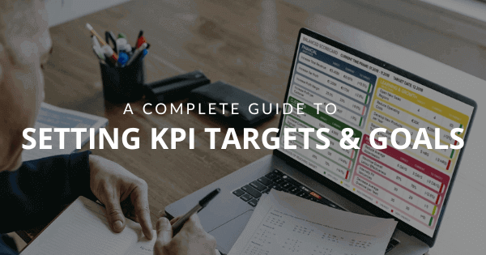
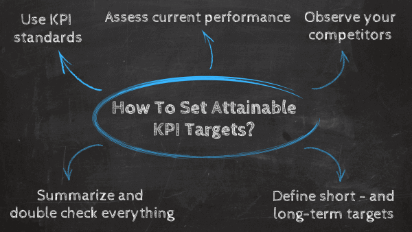
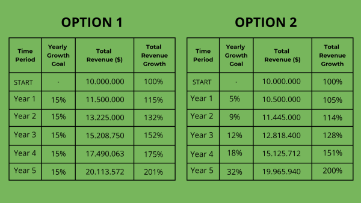
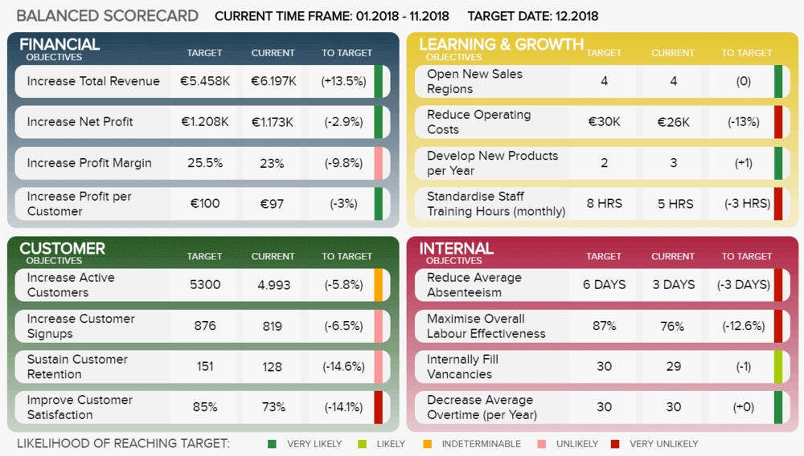
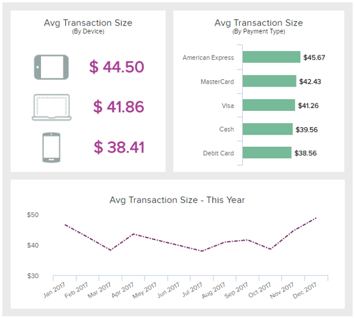
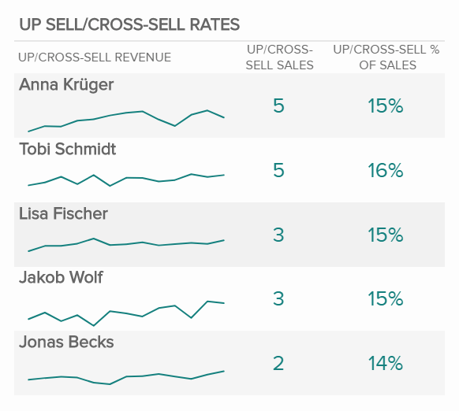
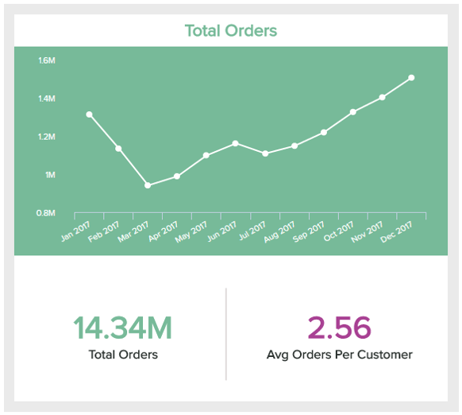
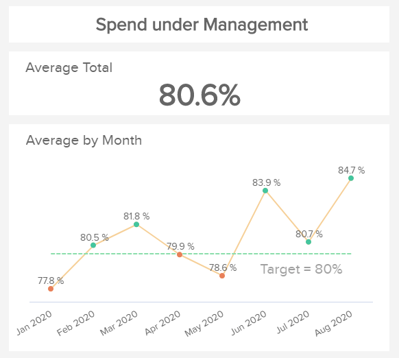
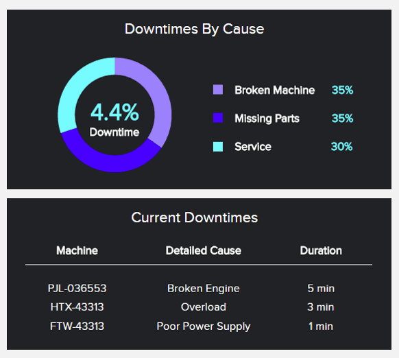
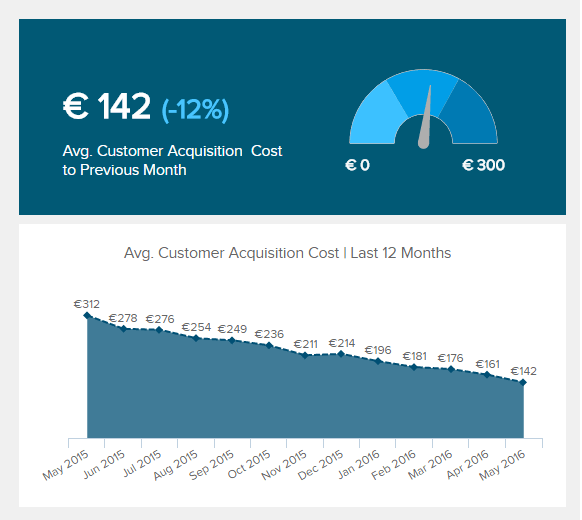

在数据代表企业主要竞争优势的世界中，基于特定目标和指标监控绩效的需求至关重要。仅跟踪相关客户或销售数据是不够的。为了真正确保您的数据驱动工作不断增长并发挥最大效益，有必要实施可衡量的目标，使您能够有效评估您的战略努力。

也就是说，企业可以使用各种方法和工具来管理他们的数据和优化他们的性能。最强大的指标之一是关键绩效指标 (KPI)。KPI 是一种衡量方法，可帮助组织评估其在不同活动和领域中的成功。考虑到这一点，设置 KPI 目标和指标被证明是一种非常成功的做法。

在本指南中，我们将涵盖与 KPI 目标相关的所有方面。从定义开始，了解如何定义它们的一些好处和技巧，最后是使用现代[KPI 工具](https://www.datafocus.ai/infos/kpi-reporting)生成的示例列表。让我们用一个定义来解决它！ ！

## 什么是 KPI 目标？

KPI 目标是企业用来确保实现最终目标的长期绩效衡量标准。为此，组织设置了各种 KPI 目标，用作实现总体目标的手段。

作为基础，企业需要 KPI 目标和指标来描绘长期成功的图景。为了确保实现这些目标，有必要将它们分解为较小的目标，作为公司应遵循的旅程的基准。

## 什么是 KPI 目标？

KPI 目标是企业用来跟踪实现总体目标的战略进展的短期绩效衡量标准。借助[KPI​​ 报告](https://www.datafocus.ai/infos/what-are-kpi-reports-examples)，所有这些目标都可以一起可视化，从而获得跨部门的全貌。

在这篇文章中，我们将主要关注目标的使用，但是，将目标作为基础是很重要的。KPI 目标是贵公司试图实现的战略目标，例如，在未来 5 年内实现收入翻倍。虽然目标是具体的更具操作性的衡量标准，可以帮助您了解您是否正在实现这些目标，例如，客户获取增加 20%，平均交易规模增加 10%，等等。简而言之，这两个进度衡量标准作为整个业务战略的一部分一起工作。

## 设定 KPI 目标的好处

如前所述，战略[KPI 跟踪](https://www.datafocus.ai/infos/kpi-tracking-software-and-tools)是任何希望通过数据取得成功的企业的基本业务活动。为此，设置 KPI 目标和指标是可行的方法。这是因为它们可以帮助您了解您在各种活动和策略方面是否走在正确的轨道上。例如，您可能会看到收入增加，但您如何确定这种增加足以满足您的长期目标？

通过设置明确且可实现的 KPI 目标，您可以确保您正在朝着明确的目标努力。这意味着您的业务效率的整体提高，因为您的团队有动力并相互联系以实现共同目标。随着时间的推移，这将创造一种以绩效为中心的文化，不仅会引导您的组织成长，而且会让它从竞争对手中脱颖而出。

## 如何设置KPI目标？

现在您已经了解了设置 KPI 目标的价值，您可能想知道如何实现正确的KPI目标？公司在处理关键绩效指标时犯的最大错误之一就是认为他们自己工作。相反，数据本身并不能说明问题，您需要对您可用的信息赋予意义和背景。

我们已经提到目标和指标不是一回事。第一个用于更大的结果，例如增加收入，而第二个代表实现该总体目标的手段，例如针对特定产品的营销活动，从长远来看可以带来更多收入。现在，一旦您定义了总体目标，就该定义您的 KPI 目标了。为了帮助您完成这项任务，我们在此处列出了设置它们的几个关键步骤。

### 1.使用KPI标准

第一步，可以说是最重要的一步，是从定义您将跟踪的关键绩效指标开始。正如我们在[KPI 与指标](https://www.datafocus.ai/infos/kpis-vs-metrics-differences)指南中提到的那样，并非所有可以衡量的东西都需要衡量，因此，您需要遵循一些步骤，以避免过多的 KPI 分散您的分析。为此，在选择过程中广泛使用了两种技术。让我们更详细地了解它们。

**SMART：**这个首字母缩写词代表具体的、可衡量的、可实现的、相关的和有时限的，它可以作为企业选择正确 KPI 的清单。简而言之，根据 SMART 标准，您的关键绩效指标应该针对您的目标、易于衡量、切实可行、与您当前的业务环境相关且及时。

**6 A**：与 SMART 标准在同一条线上，6 A 方法也可作为选择正确指标的清单。根据这些标准，您的 KPI 应该是一致的、可实现的、敏锐的、准确的、可操作的和有效的。换句话说，您应该选择与您的目标一致、符合您当前情况、易于理解和衡量并且可以灵活更改的指标。

### 2\. 评估你目前的表现

现在您已经根据两个流行的 KPI 标准选择了主要指标，是时候开始为您的目标建立基础了。一般来说，设置它们的过程应基于您自己的业务绩效。如果不了解这对您的业务来说究竟有多大的可实现性，您就无法期望实现 20% 的收入增长。为此，您可以使用专业的[在线数据分析工具来支持自己](https://www.datafocus.ai/infos/data-analysis-tools)深入探索和分析您的绩效数据。这样，您将能够描绘出清晰的画面并生成现实且可实现的目标。根据我们希望发生的事情而不是现实来设置它们，这是自取灭亡的行为。虽然说“我们将在下个月之前将销售额翻一番”似乎很诱人，但努力工作并意识到这是一个不切实际的期望可能会非常令人沮丧。

### 3\. 看看竞争对手

虽然内部绩效是制定准确和可实现目标的基础，但考虑一些行业基准也很有用。这是通过查看竞争对手并将它们与您的组织在不同领域的表现进行比较来完成的。通过进行此练习，您将能够识别策略中的强项和弱点，并补充这些信息以设定您的目标。此外，您可以借助[市场研究分析](https://www.datafocus.ai/infos/market-research-analytics)工具了解未来趋势，并深入了解您所在行业的基准。

在基准测试方面，另一个有用的做法是比竞争对手走得更远。例如，如果您拥有一家零售企业并希望改进您​​的物流流程，您可以研究物流行业的成功公司正在做什么，并为自己制定可实现的目标。

### 4\. 定义短期和长期目标

至此，您已经选择了要衡量的 KPI，评估了自己的绩效，并将其与竞争对手进行了比较。现在是时候开始做出一些决定了。如前所述，KPI 目标是长期目标，而目标是实现目标的手段。例如，一个目标可能有 5 年的持续时间，这意味着您需要各种较小的目标来衡量实现该目​​标的进度。为此，您需要考虑短期和长期目标。

想象一下，你想在 5 年内将收入翻一番。这意味着如果您目前的收入为 1000 万（100%），那么到第 5 年您应该会赚 2000 万（200%）。现在，跟踪该目标五年可能会令人困惑，因此，建议将其分解成更小的目标。例如，年增长率。在这里，您需要评估您的表现，以了解如何定义这些较小的目标。为此，您有两个合理的选择：

1. 首先，您可以将目标分成相等的部分，即每年增长 15%。然而，这可能从一开始就有点雄心勃勃和不切实际，因为它不会留下任何错误的余地。这将我们引向第二个选择。
2. 相反，您可以设定更加现实和可实现的渐进式增长目标。例如，您可以先设定第一年 5% 的收入增长，然后逐步增加，直到达到 5 年末收入翻番的目标。

下图分解了这两个选项：

无论您选择哪种方法，并根据您的业务特征（行业、客户等），您都应该定义涉及各个部门和领域的较小目标。在这里，您需要从客户的角度以及员工和其他相关利益相关者的内部角度进行思考。例如，如果预计收入增长战略的一部分将来自新客户，您可以设定渐进式收购目标。另一方面，如果您期望增长来自现有客户，您可以设定一个产品创新目标，以证明价格上涨是合理的，并直接影响您的重复购买率。

### 5.总结一切并仔细检查

到目前为止，您应该已经为您的 KPI 定义了一个目标列表，这些目标将在您公司的各个领域和部门中发挥作用。这是一个乏味的过程，有时雄心壮志可以让我们发挥出最好的一面。为避免这种情况发生并确保您使用可实现的 KPI 目标，在开始工作之前重新评估所有内容非常重要。您可以问自己重要的问题，我是否有足够的资金和能力来实施这一战略？这意味着如果您有足够的预算和人力资源来开发，您不想让员工过度劳累或在中途发现没有足够的预算来支付最初的计划。另一种方法是与您的团队交谈，并听取他们对这些目标现实的反馈。一旦解决了这个问题，您就可以开始执行您的策略了。

## 如何实施KPI系统？

这5 个过程应该可以帮助您根据自己的情况确定目标。现在，为了从关键绩效指标中挖掘出最大潜力，有必要实施一个适用于整个组织的 KPI 系统。在这里，我们为您提供一些关于如何创建一个允许您统一所有 KPI 数据的系统的建议。

- **考虑一般业务目标**

正如我们在这篇文章中一次又一次提到的那样，使用目标作为整个[KPI 管理](https://www.datafocus.ai/infos/kpi-management-and-best-practices)流程的基础至关重要。出于这个原因，创建成功的 KPI 系统的第一步应该是查看您的一般业务目标，因为这将帮助您了解哪些元素应该包含在您的系统中。您的目标很可能涉及多个领域和部门，因此，与不同的利益相关者坐下来讨论这些目标将有助于缩小战略范围并选择正确的指标来衡量。

- **实施工具来统一您的 KPI**

构建这些系统时，面临的最大挑战之一是将所有内容放在一起进行分析。[在线仪表板](https://www.datafocus.ai/infos/online-dashboard)工具通过提供所有最相关 KPI 的集中视图来实现这一点，以便在考虑全貌的情况下做出明智的决策。

继续说到目标，像下面这样的[KPI 记分卡](https://www.datafocus.ai/infos/kpi-scorecard-examples-templates-to-track-performance)是完美的工具，可以有效地汇总有关您最相关指标的进展情况和最新发展。例如，如果我们继续我们在 5 年内将收入增加 50% 的示例，您将需要监控财务、客户和人力资源等内部流程等各个领域的绩效。此仪表板提供所有这些领域的详细信息，并将您当前的绩效与目标进行比较，让您轻松发现是否达到预期结果。

该 KPI 系统的价值不仅在于它将所有目标统一到一个位置，而且其视觉特性使其一目了然。达到目标的可能性用一系列颜色来描述，这样您就可以很容易地看到不同计划的状态。

_\*\*点击放大\*\*_

- **确保可访问性和协作**

在处理相关 KPI 数据时，协作是关键。您的业​​务目标实现需要各个部门保持联系，以便根据公司的总体愿景制定连贯的战略。使用静态 Excel 表格或 PowerPoint 演示文稿等传统通信方式，由于这些工具的静态特性，可访问性和协作的主题变得困难。

也就是说，一个经过深思熟虑的系统应该以协作为基础。幸运的是，已经开发了各种[在线报告软件，允许用户从任何连接到互联网的设备上轻松共享他们的 KPI。](https://www.datafocus.ai/infos/online-reporting)由于实时访问数据，这些工具的在线性质确保了协作环境。

- **评估 KPI 进度并重新调整**

就像任何其他分析过程一样，需要不断评估 KPI 系统，以确保它与预期一致。为了让一切顺利进行，请不断检查您的 KPI 进度，并准备好在必要时进行调整。 你最不想做的事情是意识到你在第四年无法实现你的5年目标。

为此，有必要保持一个协作环境，与团队成员和任何其他相关利益相关者坐下来，并定期就您的战略状态进行沟通。人为因素与数据的力量相结合，可以让企业从他们的努力中获得所有回报。

## KPI 目标和指标示例

到目前为止，我们已经介绍了 KPI 目标的定义，概述了设定可实现目标的 5 步清单，并介绍了系统对有效监控和决策制定的重要性。在这篇文章的最后一部分，我们将通过提供业务中的示例来了解这两个度量方法是如何工作的。

### 1\. 目标：双倍收入

我们的 KPI 目标示例列表中的第一个是关于收入的。我们之前已经在文章中介绍了这个示例，但我们将在这里更详细地介绍它。

简而言之，收入是正常经营活动产生的资金，例如销售商品或服务。不考虑成本，计算公式如下：_收入 = 销售额 x 服务平均价格 / 销售价格 - 销售额扣除额_。

从公式中我们可以看出，影响收入增长的因素有很多。其中一些是销售数量、您的平均价格以及促销活动中的任何扣除的金额。现在，如果我们遵循 5 年内收入翻番的目标，我们的目标应该遵循同样的路线。下面我们提到了这个特定目标的三个示例，它们可以成为[销售仪表板](https://www.datafocus.ai/infos/dashboard-examples-and-templates-sales)的基本组成部分。

### a. 平均交易规模

顾名思义，平均交易规模衡量的是客户在每笔交易上花费的金额。自然，花费的金额直接影响最终收入，因此，它是确定运营目标的一个重要指标。

例如，如果您发现移动设备上的交易规模有可能增加，那么您可以设定一个可实现的目标来实现它。另一方面，您可以查看您的客户从哪些渠道购买最多，并针对这些渠道设置具体行动。

### b. 追加销售和交叉销售率

简而言之，追加销售是鼓励消费者购买比他们购买的产品或服务更昂贵或高端的产品或服务，而交叉销售是告诉他们购买原始产品未涵盖的相关或补充项目。这个目标是增加现有客户收入的一个很好的衡量标准。众所周知，留住现有客户比获得新客户更便宜，因此，这是一个利用战略行动来开发收入的好机会，同时为您的客户提供最佳机会。

如果操作得当，追加销售和交叉销售技术可以显着提高客户忠诚度，因为您可以预测他们的需求并为他们提供有针对性的购物体验。这使得它成为一个很好的指标来设定目标，因为满意的客户意味着更多的销售和收入，特别是对B2B企业。

### c. 总订单量

总订单量是直接影响收入的关键因素。它基本上代表了企业在一个月内实现的销售数量，这是实现这一特定目标的一个很好的目标。

虽然这似乎是一个简单的指标，但总订单量隐藏了许多可以通过正确的[零售分析软件](https://www.datafocus.ai/infos/retail-analytics)发现的洞察力。例如，您可以了解客户购买最多的高峰期，并针对他们进行促销或折扣，以激励他们购买更多产品并在此过程中增加您的订单量。

### 2\. 目标：提高净利润率

对于我们的第二个示例，我们将着眼于提高净利润率的目标。从本质上讲，净利润衡量的是减去所有相关成本后您的收入产生了多少利润。计算公式如下：_净利润率 = \[净收入（收入 - 销货成本 - 费用 - 利息 - 税收）\] / 收入 x 100%_

从公式可以看出，净利润受成本影响很大。虽然收入的计算只考虑了销售收入，但没有考虑盈利能力。一家企业可以使他们的收入翻倍，但成本如此之高，最终将赚不到钱。

也就是说，在增加净利润方面，一个好的策略是降低成本。让我们通过三个 KPI 目标示例来了解这一点。

### a. 退货率

如前所述，真正降低净利润率的因素之一是成本。也就是说，降低退货率是在不牺牲产品或服务质量的前提下降低成本的成功方法。

回报是昂贵的，因为它们需要超出预期的额外努力和资源。幸运的是，大多数退货原因都是可控的，并且可以通过一些优化来避免。因此，设定降低退货率的目标是降低成本和增加净利润的一个相当简单的方法。您可以通过调查退货原因并得出结论进行改进来做到这一点。

### b. 管理支出 (SUM)

SUM 是跟踪采购经理积极管理的支出百分比的指标。它包括与供应商在既定领域的战略管理支出，例如控制系统，以确保人们尊重协商的价格。

采购活动的优化是一种很好的成本节约策略，可以增强企业与供应商之间的透明度、问责制和沟通。通过将支出控制在预期目标以下，您可以确保节省成本的同时最大限度地提高采购工作。

### C. 生产停机时间

如前所述，降低成本可能涉及业务的多个领域。从销售到采购，现已覆盖生产区域。对于使用重型机械的制造企业来说，停机时间意味着可以赚到的钱更少，成本也会上升。

也就是说，任何制造组织的主要目标都是将停机时间降至最低。为此，有必要调查常见的停机原因并制定战略措施以降低它们。评估完成后，您可以设定一个可实现的目标，以在直观的[制造仪表板](https://www.datafocus.ai/infos/dashboard-examples-and-templates-manufacturing)中衡量进度。

### 3\. 目标：提高客户终身价值

我们的第三个也是最后一个目标是 CLV。客户生命周期价值是一个复杂的绩效指标，可能会受到多种因素的影响。它可以预测从与客户的整个关系中获得的货币价值。CLV 对于以订购为基础的公司来说是一个很好的指标，因为它们更容易预测关系的持续时间，但它也可以对任何其他类型的业务有用。计算公式如下：_客户生命周期价值=（客户价值\*平均客户生命周期）-客户获取成本_

鉴于 CLV 的复杂性和重要性，增加它是跨行业组织的共同目标。从公式中可以看出，对 CLV 影响最大的因素包括客户获取和满意度。因此，这些都是设定我们较小目标的绝佳起点。

### a. 客户满意度 (NPS)

客户满意度可以说是 CLV 中最重要的跟踪指标。自然，您的客户对您的业务越满意，他们就越有可能再次光顾。

也就是说，还有许多因素会影响客户满意度，例如购物和服务体验。这就是为什么提高满意度的一个好方法是投资于提供有针对性的体验以提高忠诚度。关于这一点，一个好的目标可以是在这些行动的基础上把中立的客户变成满意的客户。

### b. 客户获取成本 (CAC)

顾名思义，CAC 跟踪与获取新客户相关的所有行动的平均成本。它考虑了一段时间内的营销和销售支出，以及在此期间获得的客户数量。

显然，CAC 的目标应该是将成本保持在最低水平。获得客户的成本越低，CLV 就越高。因此，重要的是设定 CAC 目标并实施不同的策略来实现这些目标，以使客户与公司的关系随着时间的推移保持盈利。

### c. 平均响应时间

最后但并非最不重要的是，我们有平均响应时间。如前所述，客户满意度高度影响组织的 CLV。您为客户提供的支持质量可以使他们长期留在您身边或永远不会回来。

平均响应时间衡量的是从客户致电到客服人员响应该电话之间的时间。响应时间短意味着您告诉客户您尊重他们的时间并且随时可以帮助他们。因此，设定改进目标以实现您的总体目标非常重要。

这些只是智能 KPI 目标可能影响的部分领域。如果您想查看不同行业和功能的其他[KPI 示例](https://www.datafocus.ai/infos/kpi-examples-and-templates)，请查看我们的资料库。

## 关键要点和 KPI 目标

在本指南的结尾，我们希望您清楚地了解使用 KPI 目标进行性能监控的重要性。如果您没有经过深思熟虑的战略计划来根据您的发现采取行动，那么基于现有数据做出的重要决策将毫无用处。

如今，[业务分析工具](https://www.datafocus.ai/infos/best-bi-tools-software-review-list)允许公司以简单直观的方式管理来自多个来源的数据。有了这些解决方案，就没有理由不从您自己的信息中挖掘出最大的潜力。

如果您想开始设置自己的 KPI 目标并实时监控它们，请尝试我们的现代[KPI 仪表板](https://www.datafocus.ai/infos/best-kpi-dashboard-examples)软件，[免费试用 30 天](https://www.datafocus.ai/console)！
