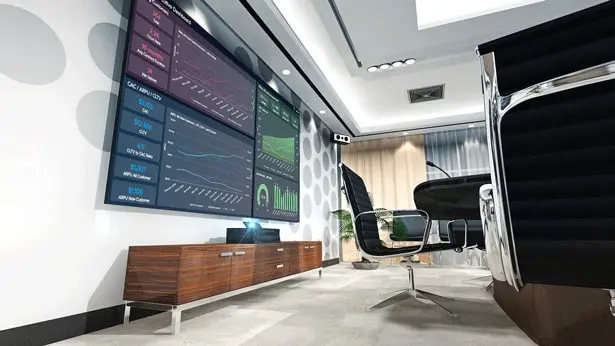
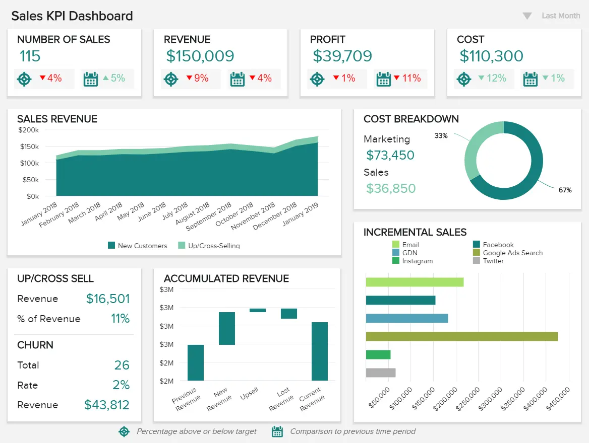

在信息时代，数据等于权力。通过利用企业最有价值的数字洞察的力量，您将增强决策、改善内部沟通并加速您的成功。

但是，由于一天中的信息如此之多，时间如此之少，您如何充分利用数据？当数据可视化、易于分析且组织中的每个人都可以访问时，数据最有效。[商业智能](https://www.datafocus.ai/infos/bi-dashboard-best-practices)仪表板与动态仪表板显示相结合，可让您从最重要的见解中榨取最后一滴价值。

在这里，我们将探讨仪表板显示或可视化大屏，以及在组织内使用它们的好处，以及可用于您自己的办公环境的可视化大屏示例。

 

但在我们深入研究之前，让我们考虑一下这种仪表板的定义及其在现代工作场所中的作用。

您的机会：[想要通过几下点击构建令人惊叹的可视化大屏吗？](https://www.datafocus.ai/console/)试用我们的专业仪表板软件 14 天，完全免费！

## 什么是可视化大屏？

可视化大屏是一种基于屏幕的工具，用于在企业或办公室环境中显示动态数据。可视化大屏通常显示在墙上，提供与特定部门、战略或计划相关的实时数据的可视化表示。

一些组织在其办公室中有多个电视显示仪表板，每个仪表板显示部门特定的数据，而其他组织则安装多个屏幕，在整个办公室中显示相同的信息。

这些仪表板多年来发生了巨大的变化。最初，关键指标显示在办公室白板上，然后显示在基本数字显示器上。但在我们这个技术驱动的时代，可视化大屏不仅仅是一个展示数字和统计数据的屏幕。它使用[仪表板生成器](https://www.datafocus.ai/infos/dashboard-creator)轻松创建，现在是办公室文化不可或缺的一部分，提供了一种动态、易于理解的方法来利用见解，以每个人（无论角色或状态如何）都可以使用的方式推动业务向前发展。

显示仪表板是一种由[可视化分析软件](https://www.datafocus.ai/infos/visual-analytics)组成的公共协作工具，无论行业或部门如何，都可以使每个现代组织受益，无论大小。

“对知识的投资总是能带来最大的利益。”

## 可视化大屏有什么好处？

我们已经确定仪表板显示是现代业务不可或缺的一部分。在这里，我们将介绍在您的工作空间中使用可视化大屏软件的主要好处。

1\. 提高内部透明度和沟通

缺乏透明度会严重阻碍组织内部[的积极性](https://blog.smarp.com/3-reasons-why-you-need-transparency-for-employee-engagement)。通过使用可视化大屏软件来发挥您的优势，您将提高参与度并促进内部沟通。

为什么？好吧，因为如果每个人都可以无限制地访问使业务运转的数据，人们将能够自由讨论见解和趋势，这反过来又将建立信任并促进协作。

如果没有人要求获取信息，每个人都会感到团结，因此有动力尽其所能地完成工作。如果每个人都以最大能力工作，就会发生伟大的事情。

2\. 更好的参与度

数据就是知识，知识就是力量。如果您通过可视化大屏软件让整个企业（或至少其中很大一部分）访问您最宝贵的数据，您将提高整个公司的参与度。

如果您的团队成员能够抬头看一眼可视化大屏显示屏并快速访问重要的信息块，他们可能会对业务有更深入的了解，并意识到他们（无论是作为个人还是作为团队的一部分）对业务的成功有多重要，从而推动参与。

3\. 实时性能

如果您向观众自定义仪表板演示文稿，并通过动态电视[仪表板](https://www.datafocus.ai/infos/dashboard-storytelling-with-kpis-presentation-examples/)显示供所有人查看，则实质上是让组织内的每个人都可以访问实时信息和报告，这些信息和报告将帮助他们更好地完成工作。

无论您是在谈论财务和人力资源还是销售和营销，办公室仪表板都将使团队以及组织内的个人能够在整个工作日做出更明智的决策、改进流程并制定有意义的策略，而不仅仅是通过延迟报告或安排会议。借助[SQL报告工具](https://www.datafocus.ai/infos/sql-reporting)，您无需等待IT部门生成见解或管理数据分析，但公司中的每个人都可以实时创建自己的仪表板报告。

如果每个人都能提高他们的绩效，你将发展业务并提高你的底线。就是这么简单。

4\. 问责制

问责制是企业成功的关键。如果你组织内的人对自己的行为负责，你将消除潜伏在大多数企业中的“责备文化”，并确保每个人都朝着一个共同的目标努力。

如果每个人都可以访问配备有正确关键绩效指标 （KPI） 和见解的办公室仪表板，那么一切都是公开的，组织内的人员必须对他们在业务中的角色负责。例如，[物流分析](https://www.datafocus.ai/infos/logistics-analytics)将帮助您协调供应链，从而降低运输问题并确保人们在发生异常时立即采取行动。反过来，这将加速您的组织进度。

“逃避责任就像未偿还的债务;它只是推迟了，我们必须最后回来算账。

## 顶级可视化大屏示例和模板

不可否认：办公室仪表板是一个强大的工具。既然您已经了解了为您的业务采用这些仪表板的核心好处，那么是时候通过查看 3 个值得注意的真实示例来深入研究可视化大屏设计了。

### a） 销售关键绩效指标仪表板

我们从销售可视化大屏示例开始，该示例侧重于希望通过每个跟踪的 KPI 超越其目标的 C 级经理和副总裁。

主要关键绩效指标：

- 每个销售代表的收入
- 客户流失率
- 追加销售和交叉销售率
- 每个销售代表的利润率
- 按活动划分的增量销售额

对于高级销售人员和与他们密切相关的人员，我们的[销售仪表板](https://www.datafocus.ai/infos/dashboard-examples-and-templates-sales)提供了大量高级见解，这些见解将很快成为您运营的核心。

\*\*点击放大\*\*

该仪表板显示拥有战略和运营数据的动态组合，将帮助您的团队成员制定战略和计划，以简化您的流程，加强任何弱点，利用优势，并最终随着时间的推移优化您的销售收入。

此仪表板不仅具有销售成功所需的所有[销售 KPI](https://www.datafocus.ai/infos/kpi-examples-and-templates-sales)和见解，而且其易于理解的设计和易于理解的可视化将为部门中的每个人提供尽其所能完成工作的工具。

您的机会：[想要通过几下点击构建令人惊叹的可视化大屏吗？](https://www.datafocus.ai/console/)试用我们的专业仪表板软件 14 天，完全免费！

### b） 招聘仪表板

近年来，人力资源经历了重大变化，通过使用具有最突出的[人力资源 KPI](https://www.datafocus.ai/infos/kpi-examples-and-templates-human-resources) 的现代可视化大屏模板，公司可以获得顶级招聘人员的鸟瞰图以及如何帮助他们取得更好的结果。

主要关键绩效指标：

- 每次雇用成本
- 招聘转化率
- 填满时间

作为任何人力资源 （HR） 部门最重要的职责之一，简化招聘流程是业务持续增长和发展不可或缺的一部分。

如果您的人才招聘流程缓慢，招聘成功率低，您将浪费时间和金钱，失去宝贵的资源并阻碍您的业务进展。但是使用正确的仪表板，您将消除这些问题。

\*\*点击放大\*\*

我们上面的[人力资源仪表板](https://www.datafocus.ai/infos/dashboard-examples-and-templates-human-resources)旨在提高您的招聘转化率、优化您的每次招聘成本并减少空缺填补时间。此外，其完美平衡的见解融合加上其时尚、合乎逻辑的布局意味着您的招聘人员将具备他们所需的洞察力，从开始到工作日结束，以最有效的方式为您的企业招聘最优秀的人才。

### c） 日常操作的 Zendesk 仪表板

帮助台部门是任何严肃业务的核心，如果您保持健康，整个组织都可以从中受益。由现代[客户服务 KPI](https://www.datafocus.ai/infos/kpi-examples-and-templates-customer-service)组成的专业可视化大屏软件将在此过程中为您提供帮助。

主要关键绩效指标：

- 门票和门票状态
- 第一响应时间
- 平均解决时间

撇开行业或部门不谈，监控您的客户服务管理至关重要，因为有效支持的要素会严重影响您的底线。

\*\*点击放大\*\*

我们上面的[Zendesk 仪表板](https://www.datafocus.ai/infos/dashboard-examples-and-templates-zendesk)是一个必不可少的客户支持工具，其中包含关键绩效指标，可帮助团队中的每个人深入了解组织的日常支持绩效，同时提取知识片段，帮助团队领导根据代理解决的工单、创建的工单数量、工单状态等进行预测。

这种可视化大屏设计将提供重要指标的全面概述，甚至帮助帮助台部门创建强大的[客户服务报告](https://www.datafocus.ai/infos/customer-service-reports/)。

通过以导航格式显示的信息以及仪表板中心的高度可视化图表和视觉效果，作为个人和有凝聚力的团队的一部分，访问重要指标并对关键客户服务趋势进行关键观察是快速而简单的。

“知识就是力量。信息是解放的。教育是进步的前提，在每个社会，在每个家庭中。

您的机会：[想要通过几下点击构建令人惊叹的可视化大屏吗？](https://www.datafocus.ai/console/)试用我们的专业仪表板软件 14 天，完全免费！

虽然数据被视为 21 世纪的石油，但只有当组织内的每个人都能从它提供的智慧中受益时，才值得挖掘。

动态数据仪表板和电视显示技术的结合将为您的整个组织提供共享知识 - 一定程度的集体智慧将使您在竞争中领先。

我们已经讨论过的这些可视化大屏模板是通信的容器。它们是建立信任、鼓励协作和简化组织最重要流程的一种手段，可以节省您的时间和金钱，并推动全面创新。

在信息时代，每个人都应该能够获得洞察力和信息，使他们能够更好地表现，而可视化大屏技术就是答案。为了帮助您构建自己的办公仪表板，您可以试用我们的软件进行[14 天试用](https://www.datafocus.ai/console/)，完全免费！
