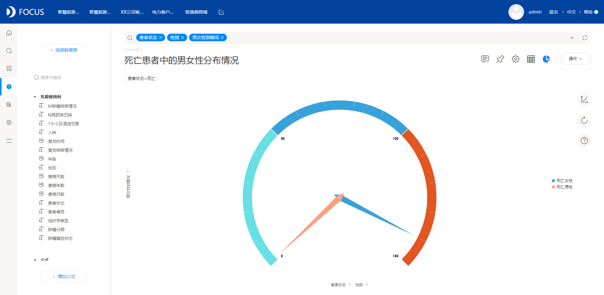
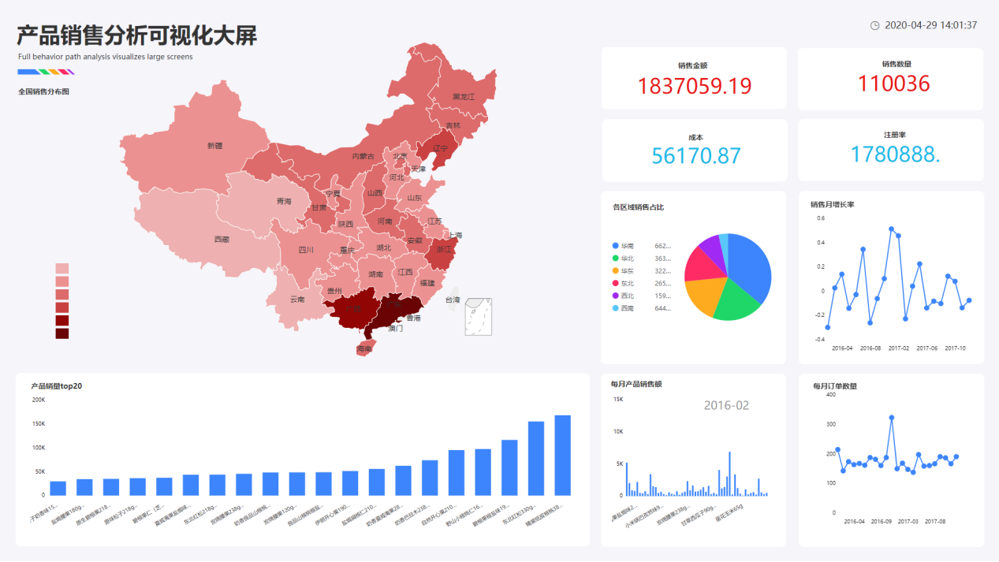

如果要寻找免费的项目数据进行分析，只要肯花费时间和精力还是比较简单的。像很多回答里面都提到的Kaggle和天池，这就是两个非常典型的竞赛类网站，里面都是整理好的数据表字段，有些完全可以直接拿来进行数据分析，选择自己感兴趣的仔细研究即可。

除了这些整理完毕的数据项目，还可以挑选一些自己比较感兴趣的课题在网上直接搜索数据，虽然这种做法的数据搜寻难度会上升，但是自己找到的数据自己更加熟悉，能分析的维度也会更加丰富。例举一些网址，比如说国家统计网站、WHO世界卫生组织、还有一些主动公开数据的医疗网站等。

举个例子，因为大学某同学的妈妈曾患乳腺癌，激起了我对乳腺癌的研究，希望能够对乳腺癌的病理特征进行了解，同时研究乳腺癌的患者手术风险及生存情况。于是，从TCGA数据库中获取了一些关于乳腺癌患者的情况，包括患者的性别，年龄，术后患者的状态，肿瘤的组织学分型，肿瘤转移情况，肿瘤复发情况，患病天数等。

案例分析结果如下，案例中用到的数据分析工具是DataFocus：

1.首先计算所有乳腺癌病例的存活率与死亡率。通过饼图，观察乳腺癌通过外科手术治疗后所能达到的生存率。乳腺癌虽然作为困扰女性的恶性肿瘤之一，但其通过手术治疗所能达到的存活率与其他癌症比较仍高出很多。从图中可以观察到，乳腺癌的术后存活率达到了86.58%，死亡率仅占13.42%，也就是在此次案例中，有910名患者通过手术成功生存。

2.对乳腺癌病例的患病天数进行研究，通过对比存活和死亡的患者的患病天数，观察患病天数对患者死亡的影响。从上图可以看出，不是患者患病天数越长，死亡的概率就越大。患者的患病天数与死亡率没有明显的相关性，但根据临床试验的结果，仍然是尽早发现，尽早治疗。

3.虽然乳腺癌对女性的影响相当大，但根据此次数据发现，男性也有一定的概率患病。从上图可以观察到，在死亡的所有患者中，女性患者高达140人，但有趣的是，死亡的患者中居然有1名男性。

4.此次研究还是主要围绕着死亡的女性患者展开，因此对死亡的女性患者的肿瘤基本情况进行研究。通过折线图观察不同类型的肿瘤转移情况的死亡人数。从图中可以观察到，在所有死亡的女性患者中，肿瘤无远处转移的患者占据最大部分。也就是说，乳腺癌本身较不容易发生远处转移，但仍有发生远处转移的概率。

5.接下来对无远处转移的死亡女性患者的肿瘤组织学类型进行研究。从图中可以看出，无远处转移的肿瘤类型种，乳腺癌的组织学类型占比较大的是中低分化而非高分化，这也为乳腺癌的高生存率提供了部分解释。

6.同样的，对中分化的肿瘤类型的局部淋巴结进行观察。从图中可以观察到，在中分化的肿瘤中，最常见的是同侧腋淋巴结转移。

7.最后，对肿瘤的大小及浸润情况进行统计。从图中可以看出，患者的死亡率与肿瘤大小及浸润情况存在较大的关系。在女性死亡患者中，存在同侧腋淋巴结转移的中分化肿瘤，其肿瘤大小仅存在两种可能，分别是肿瘤浸润范围的最大直径是0.1cm-2.0cm和2.0cm-5.0cm，其中占据大部分的肿瘤浸润范围是最大直径在2.0cm到5.0cm之间的。

最后将这7个结果图放入“乳腺癌手术预后情况”数据看板中，结果如下：

为了形成一份完整的、严谨的报告，最后再对此次案例分析做出一些建议：

1、建议女性定期进行身体检查，预防各类疾病。一旦发现，一定要尽快治疗；

2、如果发现自己患有乳腺癌，一定要及时治疗，尽力配合医生手术，因为乳腺癌的手术存活率还是非常高的。
