销售不再是随机寻找潜在客户或在商业黑暗中拍摄 - 它们是关于做出数据驱动的决策，从而带来真正的增加收入的机会。

在信息时代，数据就在我们身边。如果您的销售团队可以利用它的优势，那么您的公司将获得一切。这就是销售业绩图表的用武之地。

 

如今，使用粗略的估计值或模棱两可的数据不会让您在竞争中领先 - 使用准确的交互式可视化效果会。在这个高度互联的环境中，销售图表和图形是提高绩效的强大工具。也就是说，在这篇文章中，我们将探索 35 个图形和图表示例，这些示例将激发您的想象力，同时为您的企业增加收入活动提供一些有用的资源。在检查这些仪表板时，您还将更清楚地了解用于销售的图表类型。

这些图表都说明了[您的销售 BI](https://www.datafocus.ai/infos/business-intelligence-sales)部门的关键方面，您可以很好地了解和跟踪这些方面。与其使用 Excel 或 Google 表格来执行此操作，不如专注于这些图表。因为毕竟 -[业务仪表板](https://www.datafocus.ai/infos/dashboard-examples-and-templates)胜过一千个Excel工作表。

事不宜迟，让我们开始我们的旅程，进入销售图表的启发性世界。

## 前 35 名销售图表和图表业务示例

从销售业绩和目标到客户获取成本、销售周期等——在这里，我们将展示对贵公司持续增长至关重要的销售图表和图表，进而考虑基本问题，什么类型的图表用于销售？

让我们首先探索现代性能图的业务提升能力。

### 1） 最佳绩效的销售图表

如果您正在寻找对绩效的广泛概述，那么此销售增长图应该可以解决问题。它告诉您今年获得了多少新客户，每个客户获得了多少收益，以及每个客户获取的成本 - 以及许多其他有用的销售[KPI和销售](https://www.datafocus.ai/infos/kpi-examples-and-templates-sales)图表数据。

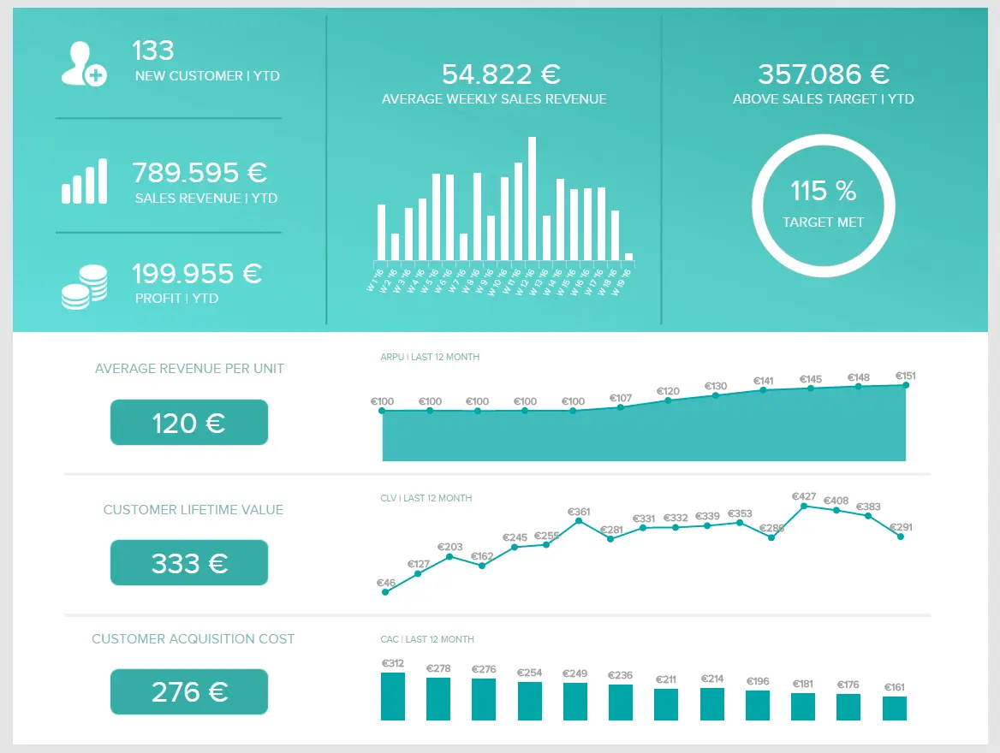

请注意，此示例中的视觉对象组合允许您使用标准数字显示一段时间内的销售趋势分析。这使销售图表具有整体的视觉对比感，使其一目了然。

但是，请记住，DataFocus 上可用的图表是非常可定制的——因此，如果此模板上的某些 KPI 过于宽泛，您不喜欢，您可以随意使它们更精细。让我们看看如何使用以下为综合[销售报表](https://www.datafocus.ai/infos/sales-report-kpi-examples-for-daily-reports)创建的 KPI 来实现这一点。

### 2） 客户终身价值 （CLV）

在销售发展方面，深入了解每个客户可以产生多少收入至关重要。这张显示销售情况的图表将帮助您做到这一点。

通常，要计算您的 CLV，您需要从您期望从新客户在关系生命周期内产生的总收入水平中扣除您的客户获取成本 （CAC）。

您留住现有客户的时间越长，他们花费的越多，您的销售收入就越健康。当您可以轻松监控您的 CLV 时，您将能够将任何潜在问题扼杀在萌芽状态，同时获得制定提高忠诚度计划所需的信息。这是任何现代品牌或组织每周的基本销售图表。

### 3） 销售目标（实际收入与预测收入）

接下来，我们的销售图表示例概要将重点介绍目标。设定目标，然后跟踪这些目标是否实现是高绩效团队的标志。毕竟，如果你不知道自己的目标是什么，就很难实现它。

这个由现代[仪表板创建器](https://www.datafocus.ai/infos/dashboard-creator)创建的精细图表向您显示与销售收入相关的几个 KPI，包括您到目前为止注册的新客户数量、今年迄今为止的总收入，以及您的逐月预测如何与您的实际收入进行跟踪。

查看某些月份的收入是否高于其他月份非常有用，这样您就可以计划未来的这些趋势，而不会因为收入非常低的月份和其他高峰月份而感到惊讶。

### 4） 获客成本

您的客户获取成本 （CAC） 是您可以跟踪的最重要的 KPI 之一。如果您跟踪的只是客户生命周期价值和客户获取成本，您可以看到有关您组织的大量重要数据。

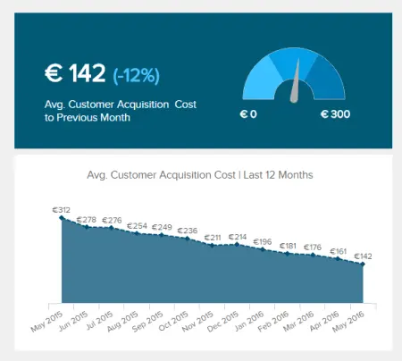

从根本上说，让您的 CAC 尽可能低是理想的。但是，如果您的 CLV 高于竞争对手，您可以通过负担得起更高的 CAC 来击败他们。

例如，假设您有一个销售不同价格的数字产品的网站。如果您可以设置电子邮件营销和营销渠道来提高您的 CLV，那么您可以在 Google 或 Facebook 广告上花费更多来吸引客户，而不是您的竞争对手。从长远来看，这是一个非常强大的竞争优势。

所有这些都表明：CAC 很重要，但它应该与其他 KPI 联系起来看待，您不一定需要将其降低到尽可能低的水平。话虽如此，此销售图表模板将允许您查看 CAC 随时间推移的趋势。如果您没有在战略上接受更高的 CAC，那么此图可以作为上升趋势的“预警系统”。任何成长型组织的权威销售图示例。

### 5） 每单位平均收入

此销售图表非常有用，因为它向您展示了获取新客户的成本与您从每个客户那里获得的收入相比如何。

要计算 ARPU，您只需将每月总收入除以该月的客户总数。同样，此图表可以用作警告系统，以确保您在短期内保持盈利。CLV 很棒，但现金流是王道，在保持灯亮方面。

无论您的利基或行业如何，使用[仪表板构建器](https://www.datafocus.ai/infos/dashboard-builder)生成的销售图示例都将证明是无价的。

### 6） 销售周期

此销售图表跟踪帐户平均需要多长时间才能完成您的漏斗，从识别机会到关闭帐户。在其他条件相同的情况下，销售周期越短越好，因此此图比较不同经理/代表成交率的能力可以显示谁是您的最佳表现者。

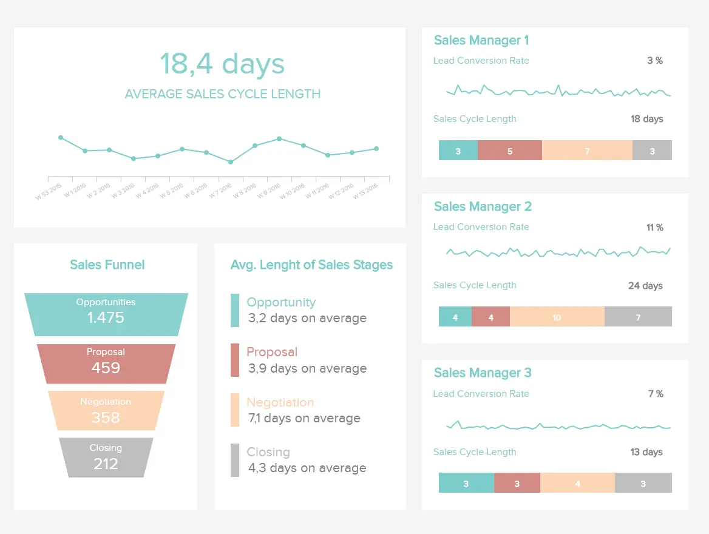

只需确保查看您的经理正在完成的交易的规模，并跟踪这些客户的 CLV。因为所有其他事情很少是平等的——你可能会发现一个销售经理需要很长时间才能完成交易，但会定期与客户签署大包裹，并停留一段时间。告诉管理者缩短销售周期可能会适得其反。销售增长图，将有助于使您的公司稳健、适应性强，当然还有盈利。

### 7） 平均销售周期长度

如果您需要优化漏斗以提高成功率，此收入图表模板将为您的业务创造奇迹。

如果您可以优化销售周期以实现最大的流畅性和效率，您将能够在此过程中缩短它，从而鼓励更多的底线提升销售。优化您的销售漏斗是有效的，因为潜在客户[与您的业务互动](https://www.redalkemi.com/blog/post/5-creative-ways-to-reach-your-prospects)并最终转化为付费客户的潜力将会增加。这将对您的底线产生积极影响。

这是机器中的关键齿轮，向您展示如何创建销售增长图表，这是我们以销售周期为中心的[关键绩效指标示例](https://www.datafocus.ai/infos/kpi-examples-and-templates)之一，可以清楚地了解您当前的周期绩效 - 这些数据将使您能够做出决定性的改变，产生积极的结果。

### 8） 开放管道价值

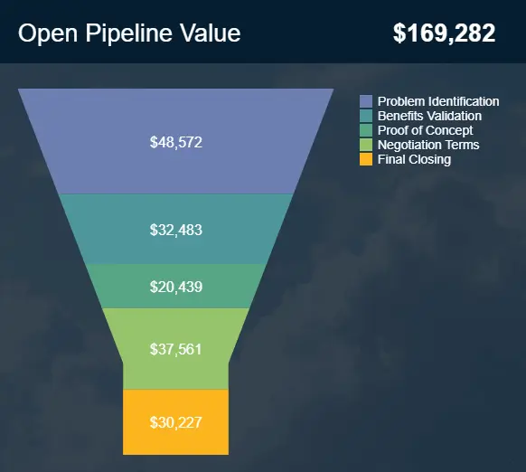

您的销售渠道对于您的转化关闭、销售促进策略的持续成功至关重要。如果没有成功优化管道的每个阶段或阶段，您的计划将变得效率低下，并且您将失去跨渠道的销售。

作为我们最有价值的销售跟踪图表之一，开放管道价值提供了与开放漏斗的每个阶段相关的货币价值的清晰、简洁和颜色编码快照。如果您注意到漏斗的一个阶段在价值方面表现不佳，它将对其他阶段产生连锁反应（几乎像多米诺骨牌一样），这意味着您将看到投资回报率 （ROI） 随着时间的推移而下降。但是，通过与这个宝贵的销售图表密切合作，您将能够将任何潜在问题扼杀在萌芽状态，并采取正确的行动方案来提高整个管道的价值和效率。

### 9） 按产品包装开放管道

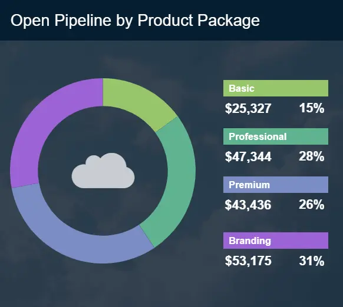

另一个基于管道的销售图表模板，这个美学平衡的示例根据您提供给客户或客户的特定产品或服务提供了一目了然的价值细分。

通过结合开放管道值进行跟踪，你将清楚地了解每个服务、包或产品的执行情况，并将其归因于管道的相应阶段。定期使用此图表还可以帮助您了解根据您的目标将资源集中在何处。例如，通过跟踪此指标，您可能会发现关闭几个低价值订阅比专注于高价值订阅更有利可图。

### 10） 年度合同价值

这个强大的收入图表创建了一个可访问的时间表，展示了您的合同正在推动的持续价值。

ACV 销售业绩图表包含合同的所有收入，包括与客户协议、订阅或预订相关的一次性费用以及月费或年费。经常分析此销售图表将使您能够了解需要多少联系人才能达到特定目标，同时查明显示价值下降或上升的任何趋势 - 这些数据将帮助您进行战略调整以进一步提高收入。适用于任何现代组织的宝贵销售趋势分析图表。

### 11） 管道价值预测

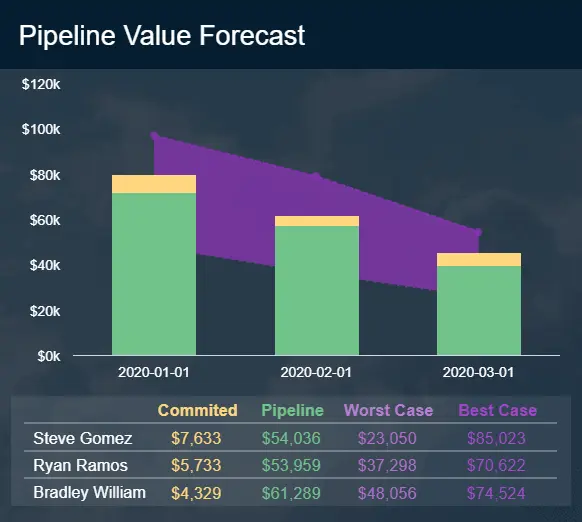

最后但并非最不重要的一点是，这个富有洞察力的销售图表提供了有关您未来销售数据以及代表进度的大量宝贵信息。

通过利用对历史趋势和数据的洞察力，这个强大的图表将帮助您了解销售渠道中的价值所在，同时做出具体决策，以一致地最大限度地提高转化率、参与度和绩效。当您这样做时，您将加速您的业务发展。

### 12） 销售转化

我们列表中的下一个是销售图表示例，它提供了转化率的详细快照。从广义上讲，基于销售的业务的收入增加可以来自几个领域。您可以增加目标潜在客户的数量，增加完成的交易规模，提高客户保留率或提高当前潜在客户的转化率/成交率。

此销售图使您能够了解您的团队如何有效地将潜在客户转化为机会，以及将机会转化为已完成交易，无论是在整体基础上还是针对每个经理或代表。它还可以让您查看您联系了多少潜在客户，并为您提供了有多少人进入销售漏斗每个阶段的精细分步细分。

这使您可以了解应该关注哪些领域。是的，没有销售团队是完美的，您总是可以在这些领域中的任何一个做得更好，但是此图将帮助您确定“唾手可得的果实”，您可以在其中投入一点精力来获得较大的投资回报率。

如果您喜欢使用数据库，则可以借助[SQL报告工具](https://www.datafocus.ai/infos/sql-reporting)轻松创建此图。

### 13） 铅转化率

潜在客户转化率是任何销售团队最重要的指标之一，无论利基或行业如何。

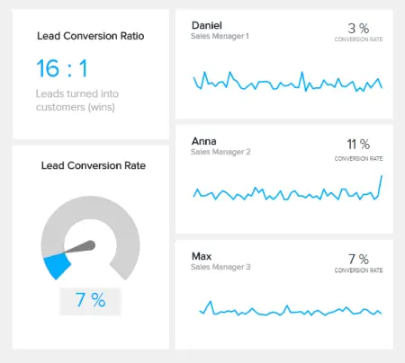

如果您的潜在客户转化率达到目标，您可以放心，您的销售渠道是健康的。相反，较差的潜在客户转化率会向您表明您的管道需要立即关注。

说到您的潜在客户转化率，每个行业都不同。虽然 1% 的比率可能对一个企业来说是健康的，但它可能对另一个企业有害。因此，设定[明确定义的基线](https://squareup.com/us/en/townsquare/how-well-are-you-really-doing-5-tips-for-benchmarking-your-business)对于衡量成功至关重要。做对了，你就会开始看到积极的结果。

这个直观、易于导航的 KPI 是区域经理的有效销售图表，可让您随时了解转化情况，让您每天保持警觉、响应迅速和高效。

### 14） 潜在客户与机会比率

在数字销售领域，潜在客户的质量很重要。有这么多潜在的创收来源和接触点需要考虑，准确衡量您的潜在客户至关重要。提示这个方便的以质量为中心的潜在客户图表。

基于BANT原则（预算，权限，需求和时间表要求），这种基于销售的[无价在线数据可视化](https://www.datafocus.ai/infos/data-visualization-tools)将告诉您潜在潜在客户转变为付费客户的可能性。

您的潜在客户与机会比率将使您明确了解保持总体收入目标所需的潜在客户数量。设置基准比率后，您将对获得可持续收入增长率所需的潜在客户数量有一个有效的了解。

通过获得这些宝贵的知识，您将能够在一致的基础上简化您的策略以获得最佳成功 - 这在当今快节奏的商业环境中至关重要。

您的机会：[想免费建立自己的销售图表和图形吗？](https://www.datafocus.ai/console/)我们提供 14 天免费试用。立即从出色的视觉销售数据中受益！

### 15） 机会制胜率

确定潜在客户资格后，了解它是否可能导致真正的销售或交易仍然很重要。这种易于理解的 KPI 就是这样做的方法。

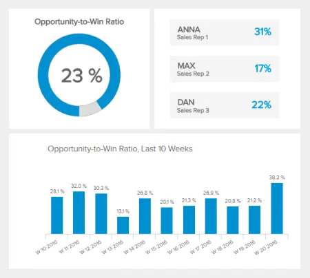

这个基本图表将为您提供销售团队或经理在完成交易或账户方面的表现的明确衡量标准 - 这是持续发展和成功的关键指标。

虽然一些销售代表很自然地将讨论或对话转化为销售或帐户转化，但其他人可能会遇到困难。如果您知道何时以及如何帮助您的销售代表将讨论转化为增加收入的机会，您可能会看到您的收入飙升。

这是一个模板，可让您自信地了解互动和讨论如何轻松转化为有利可图的交易，这是一个您不容忽视的 KPI - 改善转换、绩效和资格流程的关键工具。

### 16） 各期销售额增长

此销售图表示例旨在加速业务增长。如果你正在执行一个坚定的、积极的任务，每个季度都会把你的数字推得越来越高，那么这张图将是你最好的朋友。

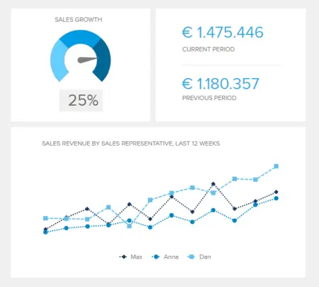

它不仅显示与前一时期相比的销售收入，而且还按代表/经理细分，让您了解团队中的摇滚明星。

### 17） 营收与销售互动管理概述

这是一个非常有趣的交互式销售图表，因为它可以让您根据您选择的不同时间段查看您的收入和销售额。特别是，每月视图非常有用。虽然能够根据日期和星期查看销售收入有点整洁，但这些视图并没有真正导致任何可操作的知识。

但是，能够看到 5 月是您的最佳销售月份可能会导致采取行动，例如在 4 月进行新的营销活动以进一步促进销售。一个值得利用现代[KPI 报告软件](https://www.datafocus.ai/infos/kpi-reporting)每月探索的收入图表。

### 18） 按付款方式划分的销售额

通过此折线图，您可以查看您在上一年中如何跟踪不同的付款方式，包括相互比较和客观情况。如果您刚刚推出新的付款方式（如PayPal），或者如果您在展位上使用Square进行付款，并且想查看通过这些选项带来了多少收入，那么此销售图表将很棒。

您还可以按月快速轻松地查看整体收入趋势。例如，在此图中，整体销售额在 9 月份下降了很多，然后攀升至正常水平，然后在 10 月和 12 月高于正常水平。

### 19） 平均交易规模

平均交易规模是另一个指标，在零售销售图表中可视化可能非常有用。在下面的示例中，KPI 按不同因素细分为 3 种图表类型：按设备划分的交易规模、按付款类型的交易规模和按月划分的交易规模。

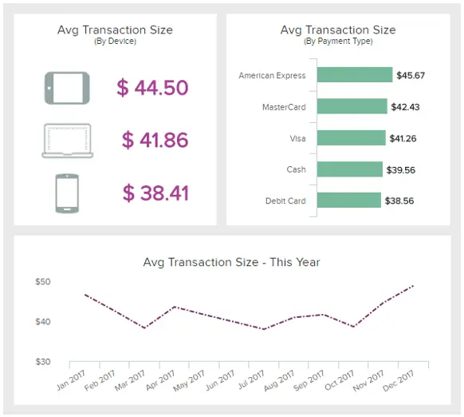

在[零售 KPI 仪表板](https://www.datafocus.ai/infos/dashboard-examples-and-templates-retail)中以视觉上吸引人的方式将所有见解汇集在一起，可以帮助企业评估客户最有可能购买的时间并相应地调整策略。将详细信息输入设备还可以帮助了解客户偏好并进行优化，以为他们提供最佳体验。

### 20） 销售机会仪表板

对于经理来说，这是一个宝贵的销售图表，这个收入图表模板可以在整个漏斗中磨练潜在的业务线索。

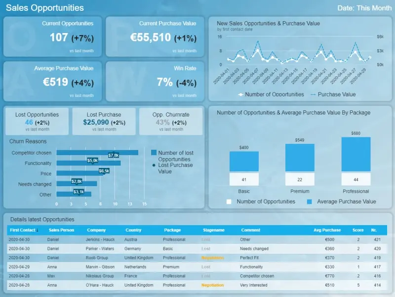

该仪表板与一目了然的数据在视觉上保持平衡，拥有监控和充分利用各种来源的销售机会所需的一切，同时对您的流程进行重要的运营改进。

这个强大的[在线仪表板](https://www.datafocus.ai/infos/online-dashboard)具有用于直接开发比较的图表和数据，以及有关如何从各种来源赚钱的更深入的信息，还将帮助您的团队消除效率低下的问题，同时在机会出现时抓住机会。

机会来得快去得也快，因此您必须在正确的时间抓住它们 - 这就是此[商业智能仪表板](https://www.datafocus.ai/infos/bi-dashboard-best-practices)提供如此多价值的地方。对于任何饥饿的现代企业来说，这是一个增加收入的销售图表。

### 21） 销售机会数量

我们的销售机会仪表板中最关键的 KPI 之一是销售图形，它将有助于成倍地改善您的销售管理活动。

通过清楚地了解新的销售机会和购买量，您将能够制定有效的计划，同时在漏斗的早期发现任何潜在的瓶颈。

如果您想全面优化和提高各种销售指标的价值，机会数量图表应该在您的优先级列表中排名靠前。虽然量化不合格的潜在客户确实在业务中发挥作用，但只有经过验证的合格潜在客户才真正与销售相关。因此，密切关注这个特定的 KPI 是明智的。

这是一个[绩效仪表板](https://www.datafocus.ai/infos/performance-dashboard-examples)，将使您的销售团队更高效、更具适应性，并更好地全面抓住机会。

### 22） 销售机会得分

这是确定销售机会优先级的快速有效的方法，这是每个销售团队生活中都需要的收入图表。

这种动态图表是一种非常精明的显示销售图表数据的方式，可让您以一到五的等级对可用创收机会的潜力进行评级。

可以说是我们最有价值的销售可视化之一，我们的机会数量KPI是一种特殊的日常资源，可以定期超越您的销售目标，节省不必要的成本，同时增加您的金钱收益。

通过使用此图表，您将提高销售效率，同时能够在正确的时间将资源放置在正确的位置 - 这是安排优先级以提高运营效率和可持续销售成功的可靠方法。

### 23） 平均购买价值

另一个重要的销售机会KPI，我们的平均购买价值是制定可持续增长战略的最佳销售图表和图表类型之一。

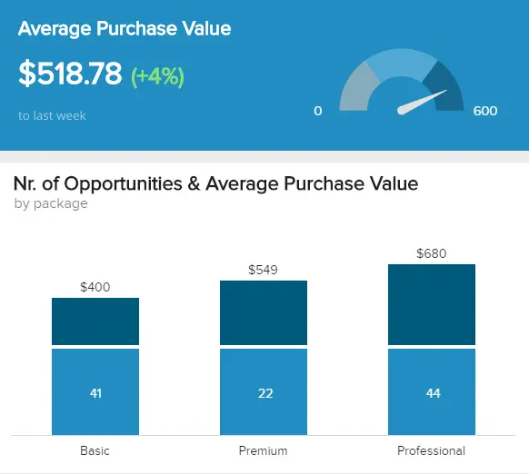

在查看如何比较销售进度时，此图表提供了。只需将您的平均购买价值与过去的表现进行比较，即可为销售机会和增长创建可行的基准。您的平均增长价值是整体销售健康不可或缺的一部分 - 因此，您应该定期监控这一点。要了解如何进一步扩展您的分析，我们建议您阅读我们关于[数据分析技术和](https://www.datafocus.ai/infos/data-analysis-methods-and-techniques)方法的指南。

### 24） 收入和客户概览

以另一个“概述”风格的销售 KPI 仪表板结束，这个季度收入和客户概述以一种易于理解的格式显示了大量最重要的[KPI](https://www.datafocus.ai/infos/best-kpi-dashboard-examples)。

使用季度视图是做出数据驱动决策的一个很好的实用选择，因为一个月的时间通常太短而无法看到真正的变化，而一年的时间有点太长而无法进行路线修正。还可以调整此视觉对象并将其创建为[移动仪表板](https://www.datafocus.ai/infos/mobile-dashboards-examples-and-designs)。

### 25） 销售关键绩效指标仪表板

我们最终的销售图表和图形清单中的下一个是销售仪表板，专注于[销售成功](https://www.datafocus.ai/infos/dashboard-examples-and-templates-sales)不可或缺的 KPI，因为它们提供了一种可衡量的方法来制定推动转化和鼓励增量增长的策略。

此动态销售图表模板提供了可视化 KPI 的[仪表板设计](https://www.datafocus.ai/infos/great-dashboard-design-examples-for-inspiration)组合，所有这些都旨在量化客户流失、跟踪增量销售水平、分析客户流失以及追加销售和交叉销售率，并深入了解利润率。这是一个值得探索[的业务报告示例](https://www.datafocus.ai/infos/business-report-examples-and-templates)，因为它可以为公司的战略销售发展提供所有细节。

借助大量交互式销售图表模板，此仪表板是如何为您的业务呈现销售数据的光辉典范。每天、每周和每月使用的多功能仪表板。

主要关键绩效指标：

- 每个销售代表的收入
- 客户流失率
- 追加销售和交叉销售率
- 每个销售代表的利润率
- 按活动划分的增量销售额

现在我们已经探索了我们尖端的销售 KPI 仪表板，我们将通过查看使其打勾的销售图表来更深入地挖掘它的功能。

### 26） 每个销售代表的收入

这个特定的销售图表模板的核心是关注您的销售代表为企业带来了多少收入。

这个易于理解的销售模板以编码折线图的形式呈现，使用户能够一目了然地提取与收入相关的关键数据，并制定策略，帮助您的团队更有凝聚力和效率地执行。

该指标是各行各业企业最重要的销售趋势图之一，是加强内部流程并在正确的时间为正确的人员提供正确支持的关键。

### 27） 售出率

我们的下一个示例是使用[零售分析软件](https://www.datafocus.ai/infos/retail-analytics)生成的销售率。此 KPI 指示在指定时间段内销售的库存与收到的库存之间的相关性。跟踪它的目的是改善库存管理流程，例如成本和客户体验。

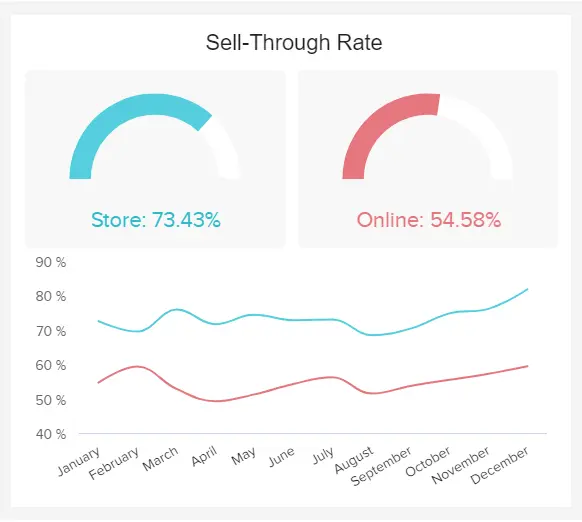

在上图中，我们可以看到售出率显示在两种类型的图表中。一方面，实体店和在线商店销售率的百分比用仪表图表示，而按月比较的两种百分比用折线[图](https://www.datafocus.ai/infos/gauge-chart-examples)表示，因为更容易发现数据中的趋势。

### 28） 客户流失率

正如您很可能知道的那样，获得新客户比保留新客户的成本更高。也就是说，这个最宝贵的销售图表模板将让您清楚地了解在特定时间范围内失去了多少客户。

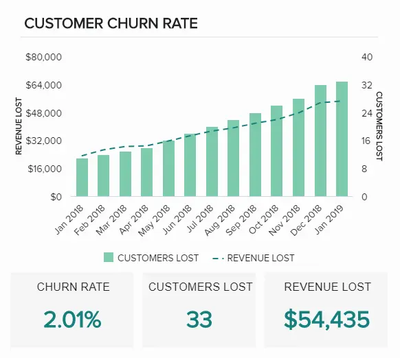

如果您正在寻找如何制作显示销售趋势分析的图表的示例，那么此销售报告图表值得研究。这个交互式销售图示例清晰、简洁且信息丰富，将为您提供计算确切流失率所需的工具，同时发现将增强客户获取策略的关键趋势。对于任何希望战略性地提高销售额的雄心勃勃的公司来说，这是必备的销售图表。

### 29） 追加销售和交叉销售率

现有客户更容易销售，这就是追加销售和交叉销售的艺术如此强大的原因。追加销售是新潜在客户的有效策略，但通过在销售过程中的正确时刻接触回头客，您可以显着提高利润。

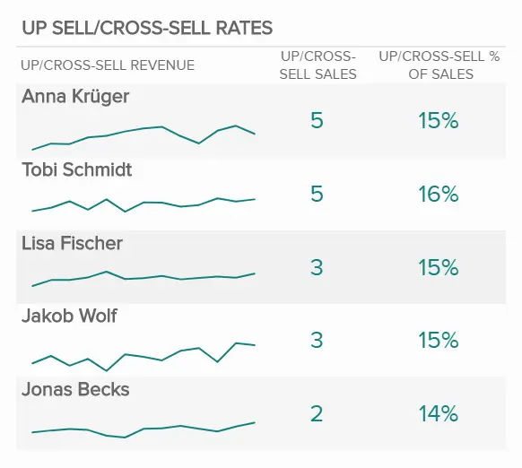

这个提高利润的销售图表是展示销售数据的完美示例，它提供了代理商基于收入和绩效的整体追加销售和交叉销售工作的全景快照。基于团队绩效和销售营销策略的销售比较图表，这种宝贵的可视化将帮助您提高品牌忠诚度，同时从每日、每周和每月的客户转化流量中榨取最大价值。另一个重要的例子是如何制作一个以正确的方式显示销售趋势的图表。

如果您希望升级绩效管理，甚至更多，您可以浏览我们关于各种[KPI 记分卡](https://www.datafocus.ai/infos/kpi-scorecard-examples-templates-to-track-performance)示例的指南。

### 30） 按销售代表划分的利润率

我们的下一个销售增长图表是另一个销售图表，重点关注销售代表的表现与企业利润的持续健康相关。

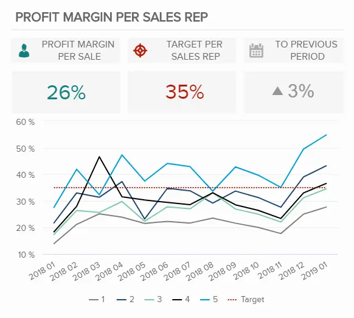

在任何企业中，利润率都很重要，此销售比较图表通过分析特定时间段、每个销售代表的利润和每个代表的销售目标之间的相关性来帮助您得出直接结论。

通过定期探索这些指标，您将能够深入了解包括佣金和奖金、绩效一致性和需要改进的领域在内的元素，从而能够更有效地分配您的支持和资源。

一个重要的月度销售图表，用于加强您的销售团队，同时照顾您的业务底线。

### 31） 按活动划分的增量销售额

我们按活动 KPI 增加的销售。增量销售对于长期业务成功至关重要，因为它们将为您提供哪些销售策略证明最有效的明确指示，这反过来又将帮助您的业务随着时间的推移而增长、发展和繁荣。

在问自己“什么类型的图表用于销售？”这个问题时，重要的是要了解您必须考虑增量销售。这个强大的销售报告图表将帮助您做到这一点。

这个最重要的销售图表模板提供了随时间推移增量销售成功的线性可视化，以及按渠道快速浏览的广告系列收入快照。

通过直观地访问这些见解，您将能够使您的销售计划更强大、更可持续、更经济高效，从而提高您的底线，同时随着时间的推移持续增加您的受众。用于完善[小型企业分析和](https://www.datafocus.ai/infos/business-intelligence-for-small-business)大型企业的销售增长图表，希望扩大规模并保持相关性，而不是偶尔进行快速销售。

### 32） 外呼销售

我们的销售图表和图表清单中的最后一个示例侧重于出站呼叫的艰巨任务。虽然许多人认为冷呼叫的艺术在当今时代变得越来越不重要，但通过正确的分析方法，您可以将出站通信转化为健康的收入来源。

作为功能强大的绩效图表主机，此动态出站销售仪表板提供了通信量、联系率以及安排的演示或约会数量的详细细分。这场以冷呼叫为中心的知识的完美风暴将帮助您发现任何潜在的参与问题，同时为人数减少的座席提供培训或支持。

您可以使用丰富的视觉信息，这是一个销售图表仪表板，可以将您的冷呼叫工作转变为可持续的增收策略。在这里，您可以精确地跟踪您的销售进度并发现趋势，让您深入了解为达到甚至超过目标而需要做出的战略变革。

### 33） 销售分析仪表板

此列表中提供的许多示例都侧重于B2B业务。我们的下一个模板专门用于在全球范围内销售产品的B2C企业，并且需要对其销售流程各个领域的绩效进行可视化概述。

通过与不同地区的产品和销售收入相关的指标显示在交互式图表上，这个实时销售分析仪表板被证明是做出明智战略决策的完美工具。

例如，通过仔细查看收入排名前 10 的国家/地区，您可以确定将精力集中在何处，并找到有潜力改进的国家/地区。同样，按收入排名前 10 的产品也是一个很好的指标，可以了解哪种产品类型最成功，并将精力集中在它们上。

此仪表板包含销售图形和图表（如表格、折线图、条形图和交互式地图）的组合，是展示将各种指标可视化在一起以获得完整绩效图的价值的完美示例。

### 34） 每个产品的收入和利润

顾名思义，这个简单的 KPI 使用传统的条形图按产品跟踪收入、利润和利润率。

通过深入了解每种产品的盈利能力，企业可以做出有关业务未来的重要决策。例如，如果您意识到与产品带来的利润相比，生产产品的成本太高，那么需要做出一些决定。另一方面，如果您发现最赚钱的产品有改进的空间，那么您可以分配促销工作等资源来增加销售额。

### 35） 各国销量

就像按产品跟踪收入和利润可以导致企业增加销售额一样，对不同地区做同样的事情也是一种非常宝贵的做法。

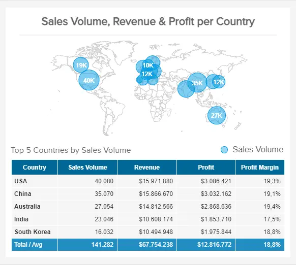

上图是另一个使用两种图表类型来传达信息的示例。通过查看顶部的地图，用户可以轻松发现销量最高的地区，而底部的表格则作为该数据的更详细细分。

如果这些示例还不足以透视销售图形和图表的力量，接下来我们将向您展示一些成功使用它们的最佳实践，然后是您的企业可以从利用销售数据可视化中获得的好处。

您的机会：[想免费建立自己的销售图表和图形吗？](https://www.datafocus.ai/console/)我们提供 14 天免费试用。立即从出色的视觉销售数据中受益！

## 销售图表和图表最佳实践

虽然使用您的销售数据生成漂亮的图表听起来像是一项容易的任务，但这与事实相去甚远。是的，数据可视化工具的可用性使现在的工作变得容易得多，但是，您仍然需要遵循一些最佳实践才能充分利用该过程。在这里，我们将向您展示其中的一些。

- 使用正确的图表类型

正如您在我们的示例列表中看到的那样，您可以使用多种图表类型来可视化最重要的销售数据。也就是说，您选择的可视化不应该是随机的，因为您认为它很漂亮或更容易创建。每种类型的图形都有不同的用途，并且根据您要查看的内容效果更好。例如，如果要比较不同时期的销售额，条形图是最佳选择，而如果要显示一段时间内的趋势，则折线图是最佳选择。要选择正确的一个，有必要遵循重要的数据可视化技术。下图可作为入门指南。

- 正确使用轴

在可视化销售 KPI 时要遵循的另一个重要最佳实践是正确使用轴。如果使用不当，轴会使图形和图表产生误导。您真正希望避免的事情发生在您的公司中，因为它不仅会损害您的战略决策，还会损害您在投资者或其他相关利益相关者面前的声誉。一个常见的例子是截断 y 轴。这是政治和媒体试图操纵公众的常见做法。简而言之，当 y 轴不是从 0 开始而是以不同的数字开始时，就会发生这种情况，这使得数据点之间的差异看起来比实际更大。福克斯新闻的一个经典例子如下：

- 标签清晰

在创建销售图形时，有关它们的信息对您来说似乎很容易理解。但是，对于将使用这些视觉对象的每个人来说，情况可能并非如此。在这方面，一个很好的做法是明确标签。这意味着使用可访问和可理解的语言，并保持简洁和准确。你不希望标签过于复杂而无法理解，或者挤满了整个视觉对象。稍微考虑一下标签将有助于外部查看者轻松理解图表试图显示的内容，并使围绕图表的对话更有成效。

- 使用干净的布局

虽然这似乎是一个显而易见的观点，但在使用图表和图形可视化数据时并不总是考虑到这一点。在理想情况下，图表上显示的信息应在不超过 10 到 15 秒的时间内被扫描和理解。话虽如此，现实情况是，有时图表的设计方式由于缺乏干净的布局而使其更难理解。为避免这种情况发生，请仔细考虑图表的颜色和样式。选择不超过两种颜色，并使用这些颜色的不同色调来显示不同的数据点。通过这种方式，您可以避免将人们与一百种不同的颜色混淆。这里的另一个要点是避免使用3D图表。是的，它们可能看起来更酷，但它们的解释也非常复杂。只要坚持干净的布局，您的业务销售图表就会成功。

- 一起可视化

正如您可能在上面的示例列表中注意到的那样，当销售图形在专业仪表板中一起可视化时效果最好。销售仪表板为企业提供了实时对其最重要指标的完美概述。允许他们在旅途中做出重要的战略决策。此外，这些分析工具的交互性质使其用户能够更深入地挖掘他们的销售数据并从中提取更深入的结论。

## 销售数据可视化：为什么图形和图表对成功很重要？

销售数据可视化对于企业的持续增长和发展至关重要，因为它允许销售和营销代表以及高级决策者以一种将数据转化为可操作见解的方式策划、呈现和交互他们的数据。

由于触手可及的销售数据如此之多，销售代表和战略家在成堆的冗余信息中跋涉并不罕见。也就是说，当涉及到以返回积极结果的方式使用您的销售数据时，“减少脂肪”是必不可少的 - 这就是销售图表和销售图表的用武之地。

以下是销售分析图表和图形如何帮助改善您的业务：

- 流程优化

无论您是使用月度销售图表还是基于收入的图表，通过以合乎逻辑、易于理解且与其他时间点可比的方式可视化您的销售数据，您可以识别效率低下或投资回报率低下的领域。

例如，您可能会发现您的潜在客户在承诺进行演示后变得冷淡。通过了解这些信息，您可以采取措施改善客户沟通以及在线演示之旅的元素，以鼓励更多转化。

- 支持和指导

数字收入图表的高度交互性和完全可视化的性质意味着您可以轻松查看销售计划特定领域的部门或个人绩效的任何下降。

通过在现代[BI 报告工具](https://www.datafocus.ai/infos/bi-reporting)的帮助下发现这些问题，您可以为部门或单个代理的特定领域提供量身定制的支持和指导，以增强您的团队、提高士气并完成更多销售。

- 资源分配

产品销售图表以及许多其他形式的收入图表模板将准确显示您的努力或计划在每个渠道或接触点上的工作或损失。

有了这些信息，您就可以准确决定在哪里分配销售资源和投资。您可能会发现新产品登陆页面提供了可靠的投资回报率，并决定创建更多内容，同时发现尽管您尽了最大努力，但您的冷呼叫努力正在消耗您的资源而回报甚微。在这种情况下，您可以最大限度地减少出站通信的时间。

- 战略规划和预测

[在线报告工具](https://www.datafocus.ai/infos/online-reporting)允许您使用过去、现在和预测性视觉销售数据的有凝聚力的组合，您可以使用销售增长图表在出现任何新兴趋势之前发现它们，同时对未来做出准确的收入预测。

通过利用这些信息来发挥您的优势，您可以制定策略，帮助您在竞争中领先，同时在管道的各个阶段与更多客户建立联系。

- 沟通与协作

如前所述，我们人类对视觉信息的反应最好。使用交互式数字仪表板来托管根据您的业务目标量身定制的销售图形和图表，将为每个人提供成功所需的信息。

借助[在线数据分析工具](https://www.datafocus.ai/infos/data-analysis-tools)，每个人都掌握了正确的信息。这将引导员工作为个人表现得更好，同时作为销售团队进行有效协作，从而在此过程中加速您的业务增长。而且，由于您不需要特殊的技术技能即可从仪表板访问动态数据，因此每个人都可以真正访问有助于他们发挥最大能力的智能。

## 实现销售成功的秘诀：了解您的数字

为了完善我们对业务促进销售图样本以及月度销售图或销售图样本的动态的旅程，让我们根据以下基本见解，考虑数据如何从战略意义上增强我们处理业务销售的方式：

- 最近的研究认为，传递到大脑的信息中有80%以上是视觉的。通过向您的销售和营销代表提供易于理解的视觉数据，您将帮助他们提高整体绩效，从而增加收入。
- 19%的买家希望在销售过程的意识阶段与销售人员建立联系。通过使用正确的销售报告图表和月度销售图表，您将能够在潜在客户旅程中的最佳时刻与他们联系，从而在此过程中增加转化率。
- 如今，45% 的企业至少在云中运行部分大数据工作负载。基于云的[可视化分析工具](https://www.datafocus.ai/infos/visual-analytics)将推动您的业务向前发展，帮助您掌控销售策略并在竞争中领先。
- 采用大数据的企业通常会看到8% 到 10% 的利润增长——这证明了将可视化销售图样本作为业务战略的核心。
- 数据分析通过帮助发现新兴趋势并降低材料和运营成本，极大地改善了建筑行业。虽然这种见解是特定于行业的，但它无疑有助于突出现代销售图表示例的效率。
- 62%的零售企业表示，通过将信息和分析作为其业务活动的核心部分，具有明显的竞争优势。根据上一点的同一份报告，通过了解您的数字，对您的销售流程采取分析方法，并使用交互式、可访问的数据分析工具，您将成倍地提高您的销售额。
- 流媒体娱乐巨头 Netflix 有能力使用大数据分析和可视化来影响超过80% 的用户观看决策。各行各业的许多现代企业利用数据图表和工具的力量来提供高度个性化的通信，不仅可以带来更多的转化，还可以显着提高客户保留率。
- 数据驱动的销售活动方法将确保您的目标和使命陈述保持一致，从而有助于促进您的业务增长。

您的机会：[想免费建立自己的销售图表和图形吗？](https://www.datafocus.ai/console/)我们提供 14 天免费试用。立即从出色的视觉销售数据中受益！

## 关键要点销售图表

我们探索了可视化效果，您需要在其中添加显示过去 12 个月的销售趋势的折线图;收入比较图;如何在图表上显示销售额的增长;您将使用哪种类型的图表来比较两种产品的销售表现，有一点很清楚 - 销售图表将加速您的业务成功，同时帮助您持续增长。

知识就是力量，在销售方面尤其如此。这 35 个销售图表为您提供了从非常精细的重点的广泛概述到的见解。

无论您的行业或部门如何，始终如一、有凝聚力并以扩展业务的方式向目标受众销售您的产品或服务对您的生存至关重要。通过了解您的数字并利用正确指标的力量，您可以让自己与众不同，以您以前从未想过的方式提高您的利润。

无论您是在谈论销售图表、图形销售示例、销售图表模板、动态销售比较图表还是任何其他形式的动态可视化仪表板，通过分析与您的业务销售目标最相关的数据，您将一次又一次地达到甚至超过您的目标。

这些不同的视角使您可以访问所需的所有数据，以指导您的公司朝着正确的方向发展商业智能，并确保借助正确的[数据质量管理](https://www.datafocus.ai/infos/data-quality-management-and-metrics)技术实现目标。此外，其中一些销售图表可以作为有效的预警信号，以便您可以在现金流成为实际问题之前看到它们的潜在问题。

此处介绍的每个收入目标图表、销售进度图和销售图表示例都提供了超越事实和数据的业务提升水平。这些启发性、交互式和可操作的数据可视化将发现隐藏的见解，同时提供一定程度的深入信息，确保您能够满足潜在客户在每个渠道或接触点的需求 - 不仅是现在，而且是未来的长期需求。

这些动态销售模板中的每一个都将帮助您改善业务，使其更明智、更经济、更具适应性——这是在我们高度互联的数字时代创建蓬勃发展的业务的关键要素。

使用这些销售图表作为您自己的销售仪表板的灵感，以便您可以随时一目了然地获得可操作的见解。这样做将使您领先一步，并确保您留在那里。

如果您想知道如何为自己的销售仪表板创建有效的销售图表，请立即开始DataFocus的[14天免费试用](https://www.datafocus.ai/console/)，并升级您的销售策略和计划！
