在数字时代，品牌、企业和组织拥有触手可及的丰富知识：如果以正确的方式利用这种洞察力，就有能力提供真正的竞争优势，同时激发创新、灵感，并创造一个不断发展、运转良好的商用机器。 业务主管仪表板和报告使这种级别的竞争优势成为可能，并全面提供业务提升的好处。 但怎么会这样呢？

我们确实生活在一个拥有宝贵数字数据的时代。 通过获得收集、组织和分析对您的组织最重要的指标的能力，您可以使您的帝国比以往任何时候都更加智能——而执行报告和[业务仪表板](https://www.datafocus.ai/infos/dashboard-examples-and-templates)将帮助您做到这一点。

此外，此类仪表板将创建一个数据驱动的环境，您和您的团队将能够利用现代[仪表板创建器](https://www.datafocus.ai/infos/dashboard-creator)、自动化和智能解决方案，从而提高生产力并节省无数美元。

为了正确看待数据分析的重要性、功能和组织优势，在这里，我们将探讨执行仪表板模板的价值，深入了解它们是什么、它们为什么有效，并查看使用现代[在线报告工具](https://www.datafocus.ai/infos/online-reporting)创建的真实执行报告示例。

但首先，让我们来看看一个实际的定义。

## 什么是执行仪表板？

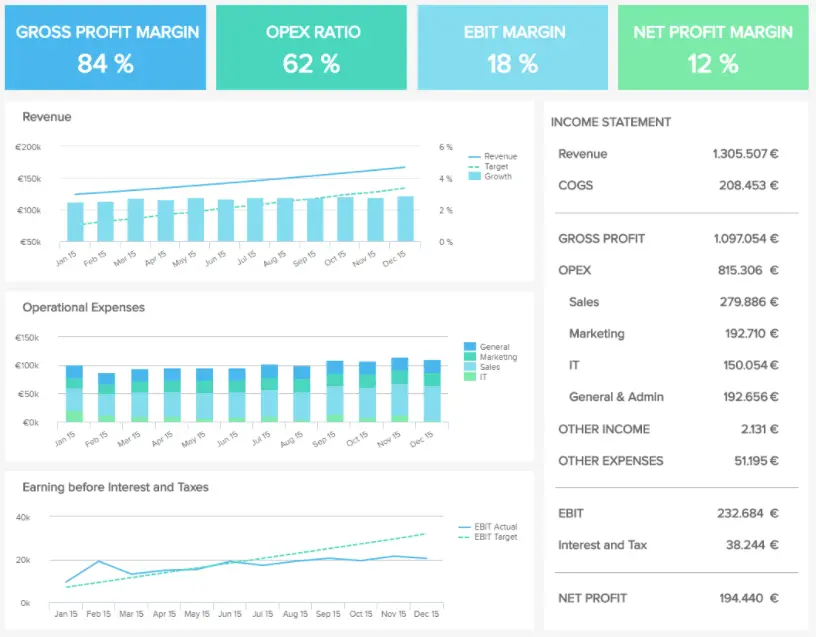

执行仪表板是 C 级专业人员用来跟踪关键 KPI 以有效管理业务运营的报告工具。 借助强大的可视化功能，高管们可以分析数据并做出明智的战略决策，以降低风险并确保增长。

现代高管报告整合了关键指标，同时概述了问题和解决方案，其中[KPI 仪表板](https://www.datafocus.ai/infos/best-kpi-dashboard-examples)用于提供其他见解，并作为执行报告和摘要中通常缺乏的附加可视化表示形式。

执行报告的可访问视觉特性意味着可以轻松理解特定数据集，发现持续的趋势并采取一系列最终使业务受益的决定性行动，通常是实时的。 主要领域得到加强，目的是识别弱点和优势，改进内部流程，提高员工敬业度，改善服务，提高生产力，并使组织更有利可图。

执行仪表板解决方案的工作原理是将相关信息源与公司内当前使用的内部系统（如会计软件、客户关系管理 （CRM） 程序、电子邮件网络和内置网站分析等平台）连接起来。

通过这些连接，您的报告将所有这些信息提取到一个位置，使您能够在不登录多个平台或系统的情况下查看业务中最重要的见解。 此外，执行报告和仪表板还允许您设定目标、使用特定的 KPI，并对其进行定制以最适合公司的需求、目的、目标和使命。

关键是，当视觉上吸引人时，传递到大脑的信息会更好地感知，事实上，65%的人口是视觉学习者。 而且，鉴于遵循带有插图的指示的人比遵循纯文本指示的人的效率高323%，敏捷执行仪表板是当今竞争激烈的商业环境中的强大工具。

您的机会：[想要通过几次点击构建执行仪表板？](https://www.datafocus.ai/console/) 免费试用我们的专业仪表板软件 14 天！

## 探索 20 个出色的高管仪表板示例

毫无疑问，执行仪表板是功能强大的工具，可以简化您业务的每个领域。 如果您遵循最佳实践并使用正确的工具，这些报告将显着加速您公司的发展。

为了证明这一点，我们将查看一系列示例，这些示例侧重于与 CMO、CFO、CTO 和 COO 角色相关的业务领域，以及包括 SaaS、零售和制造在内的行业。

这 20 个可视化执行报表示例将展示专业[仪表板设计人员](https://www.datafocus.ai/infos/dashboard-designer)在实际业务环境中的功能和价值。

### 1\. 管理KPI仪表板

管理 KPI 仪表板在基于消费者的层面上磨练收入，同时提供有关新客户获取成本的见解。

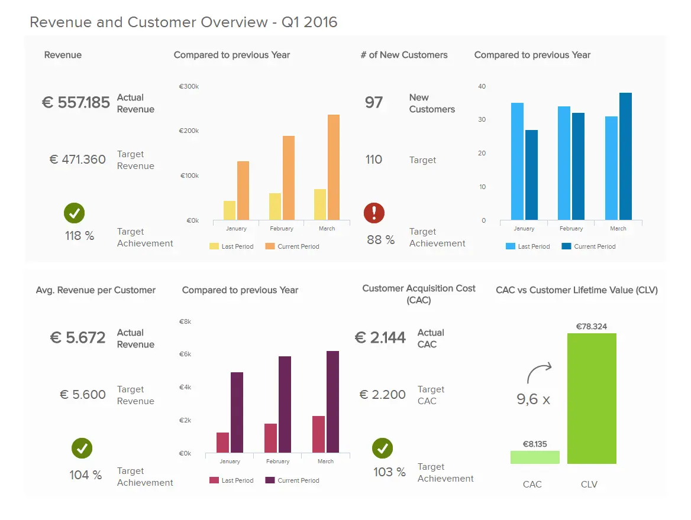

\*\*点击放大\*\*

除了有关收入发展的全面信息外，通过提供基于特定框架的实际收入指标的组合，该管理报告是发现实时趋势、显着改善经济和设定切实销售目标的宝贵方式。

此外，此动态[管理仪表板](https://www.datafocus.ai/infos/dashboard-examples-and-templates-management)提供的详细以客户为中心的信息将使您更好地了解促销活动，包括交叉销售、追加销售或个人服务的整体价值。 在降低购置成本、开发服务和提高盈利能力方面，这些 KPI 和指标本质上是金粉。

主要关键绩效指标：

- 销售目标
- 客户终身价值
- 客户获取成本

### 2\. 首席财务官的执行财务仪表板

首席财务官肩负着一项艰巨的任务，以确保公司的财务状况正在进步并取得积极成果。 此类执行仪表板模板侧重于财务部门的战略计划，这对于确保公司深入了解最重要的高级[财务图表](https://www.datafocus.ai/infos/financial-graphs-and-charts-examples)和指标至关重要，它提供了许多深入挖掘数据并生成可操作见解的机会。 让我们仔细看一个例子。

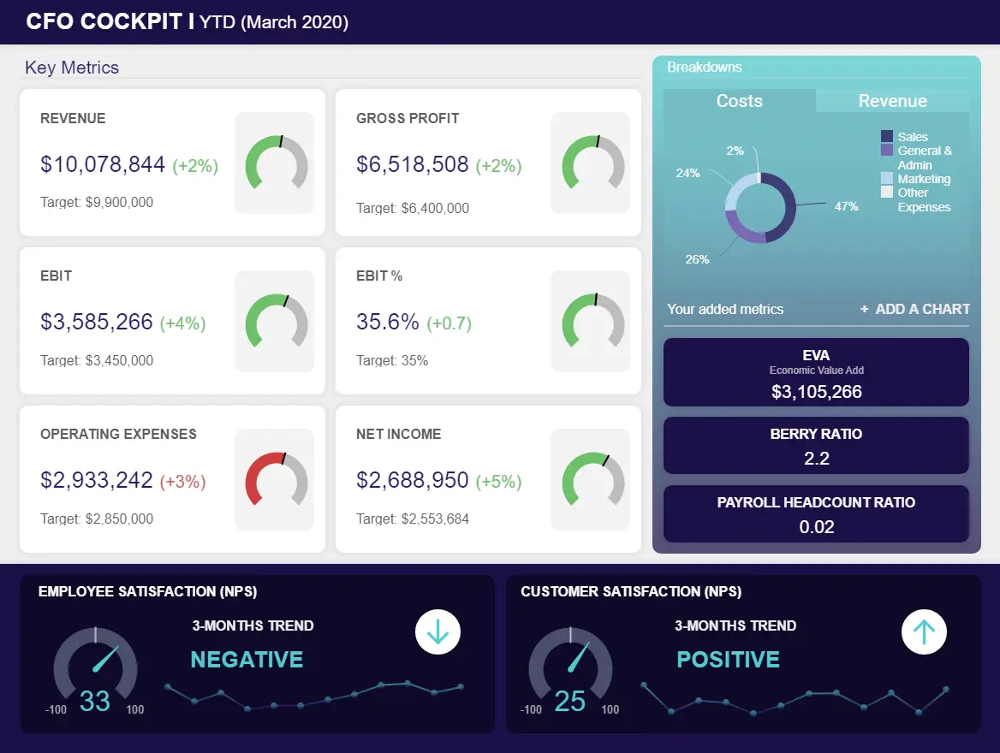

\*\*点击放大\*\*

此执行 KPI 仪表板重点介绍了首席财务官认为有助于其战略监控的 4 个最相关的绩效领域：成本、销售目标、毛利润以及客户和员工的满意度。 后者本身不是财务指标，但它们包括在内，因为首席财务官需要知道客户和团队的表现如何 - 如果满意度下降，它们肯定会影响财务状况。 这就是为什么C级管理层需要监控这些指标，以确保每个对保持公司财务健康至关重要的人都感到满意并立即做出反应 - 如果没有。

此[CFO](https://www.datafocus.ai/infos/cfo-dashboard-kpis-report-template)仪表板左侧的重点指标描述了今年第一季度的财务发展，您可以立即发现与其他执行报告仪表板指标（如净收入或收入）相比，运营费用的表现不佳。 在这种情况下，确定究竟是什么导致了这种费用增加并相应地调整您的策略是有意义的。

主要指标：

- 浆果比例
- 经济增加值
- 员工和客户满意度

### 3\. 财务概览仪表板

另一个专注于顶级金融活动的例子提供了毛利率、运营费用 （OPEX） 比率、息税前利润 （EBIT） 利润率和净利润率的全景快照，以及许多其他相关见解。

\*\*点击放大\*\*

这些财务 KPI 通常由损益表确定，不仅提供了简化组织财务流程的可行方法，而且还提供了改善企业财务驱动型运营的整体[财务](https://www.datafocus.ai/infos/kpi-examples-and-templates-finance)结构的机会。

通过创建这样的[财务仪表板](https://www.datafocus.ai/infos/dashboard-examples-and-templates-finance)，您不仅可以自动执行许多计算，还可以专注于数据告诉您的内容，并提供快速响应的机会。

主要关键绩效指标：

- 净利润率百分比
- 营业费用比率

### 4\. 投资者关系仪表板

投资者关系仪表板以及我们三分之一的执行报告示例对于量化企业的运营 KPI 至关重要，同时根据公司的整体情况计算和传达顶级指标。 这种洞察力是跟踪可能成就或破坏您企业成功的主要投资者的关键。

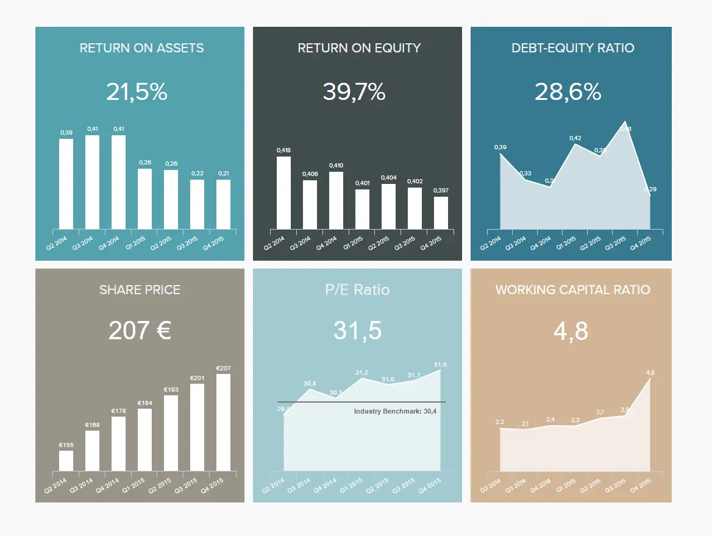

\*\*点击放大\*\*

除了大量宝贵的股权和以资产为中心的信息外，我们执行仪表板的这三分之一示例还可以深入了解贵公司的股价、财务的第一线，以及贵公司成功的近乎绝对的指示。

主要指标：

- 资产回报率
- 市盈率
- 股本回报率

### 5\. 首席技术官仪表板

由于现代问题需要现代解决方案，因此 CTO 有责任提供解决方案并照顾与技术和 IT 相关的数据和增长。 通过开发有助于管理和整合来自多个接触点的数据的执行报告仪表板，IT 部门或公司的经理可以鸟瞰最重要的 IT 战略并立即对问题采取行动。

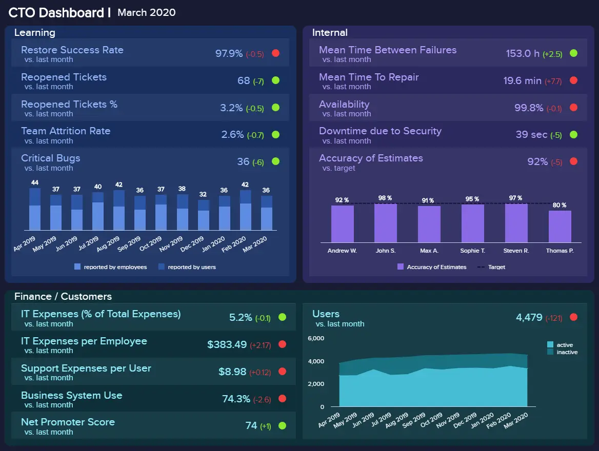

\*\*点击放大\*\*

在信息技术领域，访问最新和最重要的数据至关重要，这将使首席技术官能够做出最佳决策并提高部门绩效。 上面的[CTO 仪表板](https://www.datafocus.ai/infos/cto-dashboard-report-software-tools)等解决方案将作为最关键 IT 数据和战略开发的单一事实点。

上面的仪表板设计侧重于 3 个主要部分：学习、内部和财务/客户。 每个部分都有其独特的性能见解，并强调相关指标。 在此 IT 执行仪表板的学习部分，重点是学习，其中恢复成功率、重新打开的工单、团队流失率和关键错误将告诉您团队从错误中吸取的学习程度以及他们是否需要更多支持。 在这种情况下，您可以看到几乎所有区域都标记为绿色，除了一个区域，这最终意味着团队的表现相当不错。

在仪表板的下一部分（侧重于财务和客户），首席技术官可以仔细查看费用、用户和净推荐值。 这些指标将帮助高管将特定IT指标之外的其他信息联系起来，以便描绘出更详细和更有利可图的图景。 换句话说，如果用户和客户不满意，并且成本不断累积，则进一步调查可能是有意义的，因为 IT 部门可能会遇到其他问题。 要了解有关如何改进客户支持流程并连接到公司内其他关键部门的更多信息，我们建议您访问我们的[Zendesk 仪表板](https://www.datafocus.ai/infos/dashboard-examples-and-templates-zendesk)页面。

主要关键绩效指标：

- 严重错误数
- 重新打开的门票
- 估算的准确性
- 净推荐值

### 6\. SaaS 管理仪表板

我们的下一个执行仪表板示例专门介绍软件即服务 （SaaS）。 涵盖顶级 SaaS 管理的所有关键方面，这个最动态的模板提供了整个运营的全面鸟瞰图。

\*\*点击放大\*\*

此交互式报告工具中的每个 KPI 协同工作，以提供平衡的可视化信息组合，深入挖掘客户、经常性收入和成本。

借助包括 MRR、APRU、客户生命周期价值和客户获取成本在内的关键指标，我们的 SaaS 报告仪表板不仅可以帮助您提高软件即服务产品的效率，而且还能够可持续地满足客户不断变化的需求。 适用于任何雄心勃勃的现代技术组织的强大 BI 工具。

主要指标：

- 客户获取成本
- 客户终身价值
- 阿普
- 磁共振

### 7\. 首席营销官仪表板

作为高级决策者的最佳仪表板示例之一，我们的 CMO[营销仪表板](https://www.datafocus.ai/infos/dashboard-examples-and-templates-marketing)可让您快速浏览大量宝贵的信息。

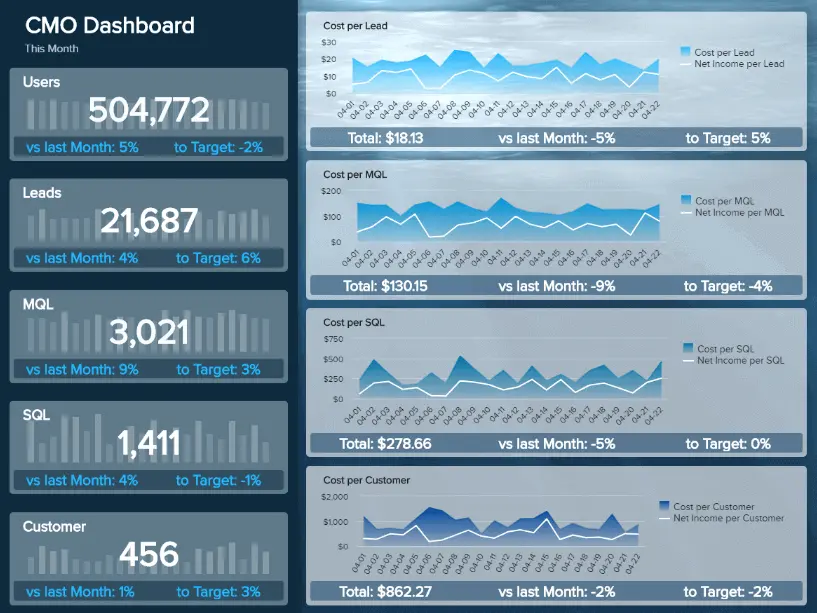

\*\*点击放大\*\*

这个最鼓舞人心的执行仪表板示例以逻辑、易于理解的格式提供五个有效的 KPI，包括数字表示和折线图，在易于访问的集中空间中提供了丰富的见解。

作为一个必不可少且包罗万象的领域，数字营销是任何现代组织成长和发展不可或缺的一部分，无论行业如何。 在这里，您可以深入了解营销绩效的每个重要方面，同时发现历史和实时的整体趋势。 通过访问这些宝贵的数据，您可以提高响应能力，同时制定改进的[营销报告](https://www.datafocus.ai/infos/daily-weekly-monthly-marketing-report-examples)和策略，从而增加受众，同时提高投资回报率 （ROI）。

主要关键绩效指标：

- 销售目标和增长
- 网站流量与潜在客户比率
- 每条线索的成本
- 潜在客户与 MQL 比率
- MQL 与 SQL 比率

### 8\. 销售 KPI 仪表板

我们的执行摘要仪表板示例的最后一个（但并非最不重要的）是我们的销售 KPI 报告。 当然，销售对几乎所有企业都至关重要，无论行业如何，这意味着使用正确的[销售 KPI](https://www.datafocus.ai/infos/kpi-examples-and-templates-sales)对于您的持续增长和成功至关重要。

\*\*点击放大\*\*

提供使销售活动发挥最佳能力所需的实用信息的全面全景，这是我们最全面的执行摘要仪表板示例之一。 本报告中包含的[销售图形和图表](https://www.datafocus.ai/infos/sales-graphs-and-charts-for-managers)范围提供了丰富的信息，这些信息将大大提高销售部门的内部效率，同时有助于降低成本、提高产量，并最终提高组织的底线。

该报告工具使销售经理和高管能够比较一系列指标，并确定在何处以及如何进行战略调整以优化最终结果。 让您的销售计划保持在正确的轨道上将有助于您的业务年复一年地取得成功 - 而这正是这项工作的工具。

主要指标：

- 每个销售代表的收入
- 客户流失率
- 追加销售和交叉销售率
- 每个销售代表的利润率
- 按活动划分的增量销售额

### 9\. 执行制造仪表板

另一个有效的执行管理仪表板可作为高级管理人员的模板，将重要的战略指标整合到一个访问点。 该仪表板设计为[KPI 记分卡](https://www.datafocus.ai/infos/kpi-scorecard-examples-templates-to-track-performance)，可确保制造主管清楚地了解有效性、质量、生产和成本。

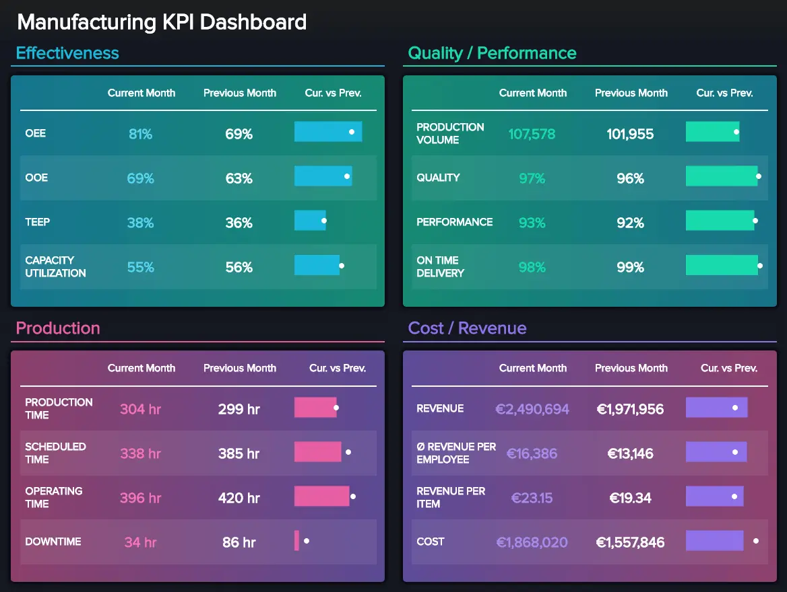

\*\*点击放大\*\*

第一部分称为有效性区域，演示关键指标的性能，例如整体运营效率、设备、总有效设备性能和容量利用率。 这些指标是使用[BI仪表板软件](https://www.datafocus.ai/infos/bi-dashboard-tools)创建的，将帮助制造业领导者将当月的发展与上个月的发展进行比较，并查看生产过程中是否存在任何问题以及是否需要进行其他调整。

其他部分的结构类似，但考虑到不同的指标和要点：制造业的 C 级经理应该对质量和绩效有一个概述，您可以在其中监控产量、性能和准时交付。 这将有助于评估产品是否按时交付，并将调查结果与上一时期进行比较，在这种情况下，一个月。

最后，此执行仪表板报告的最后一部分指出了成本和收入的发展，显示了当前月份与上个月之间的关系。 定期控制此类数据非常重要，因为它会影响此仪表板上的其他指标; 如果产量和生产时间增加，则直接导致成本增加。

主要关键绩效指标：

- 整体运营效率
- 整体设备效率
- 总有效设备性能 （TEEP）
- 产能利用率

您的机会：[想要通过几次点击构建执行仪表板？](https://www.datafocus.ai/console/) 免费试用我们的专业仪表板软件 14 天！

### 10\. 高管首席运营官仪表板

此高级执行仪表板视觉对象专为需要强大的运营存在和控制的首席运营官而设计。 为了优化业务运营，首席运营官需要跟上快节奏的环境和不断变化的情况，这些情况昨天需要数据。 这就是为什么在[自助式 BI](https://www.datafocus.ai/infos/self-service-bi-tools)的帮助下生成的仪表板对数据驱动的 COO 和努力成为 COO 的 COO 具有巨大的支持能力。

\*\*点击放大\*\*

当您考虑物流行业时，首席运营官需要对业务运营有一个可靠的概述，并快速确定增长潜力。 如上例所示，运输管理是物流中最关键的部分之一，以最有效的方式交付产品是我们残酷经济的重要组成部分。

从本质上讲，此[COO 仪表板](https://www.datafocus.ai/infos/coo-dashboard-report-template)按目的地显示车队效率、平均装载、时间和重量、交付状态和交付。 这些指标将帮助高管评估运输过程的健康状况以及是否有改进的空间。 如果您发现任何违规行为，例如装载重量和运输的增加，您可能需要考虑这是否会导致道路上的潜在事故。 关键是要优化您的指标和运营，但不要过度拉伸它们，以便您面临严重的运营问题。

主要指标：

- 交货时间
- 运输费用

现在我们列出了顶级示例，我们将仔细研究此类仪表板的好处以及为什么要使用它们。

### 11\. 财务业绩仪表板

我们的财务绩效仪表板专为忙碌的首席财务官而设计，他们既要处理许多财政问题，又要定期做出一系列紧迫的决定，我们视觉平衡的财务绩效仪表板为持续增长和成功提供了基本指标。

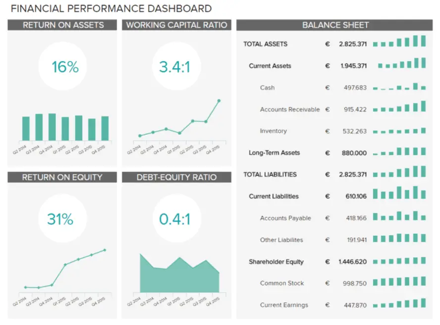

\*\*点击放大\*\*

此仪表板提供了企业如何有效地使用资本的清晰快照，同时提供了丰富的一目了然的信息，即使在压力下也有助于保持财务平衡并做出自信的战略选择。

通过您可以使用三个核心执行仪表板指标，您可以深入了解各种资产和股权的回报率，并跟踪您的营运资金。 有了这个财务KPI的大熔炉，您可以保持和谐的财务结构，管理内部和外部利益相关者的关系，并提高公司的货币效率，同时始终保持最佳的生产力水平。 这个动态[的BI](https://www.datafocus.ai/infos/business-intelligence-finance)财务工具是首席财务决策者数据驱动的瑞士军刀。

主要关键绩效指标：

- 资产回报率
- 股本回报率
- 营运资金

### 12\. 人才管理仪表板

糟糕的招聘选择或人才保留策略可能会耗尽公司预算并阻碍组织进步。 作为人力资源经理，您主要关注的问题之一是寻找、培养和维护推动公司前进的员工。 但是，虽然这里的目标很明确，但要做到正确有时是一场艰苦的战斗。

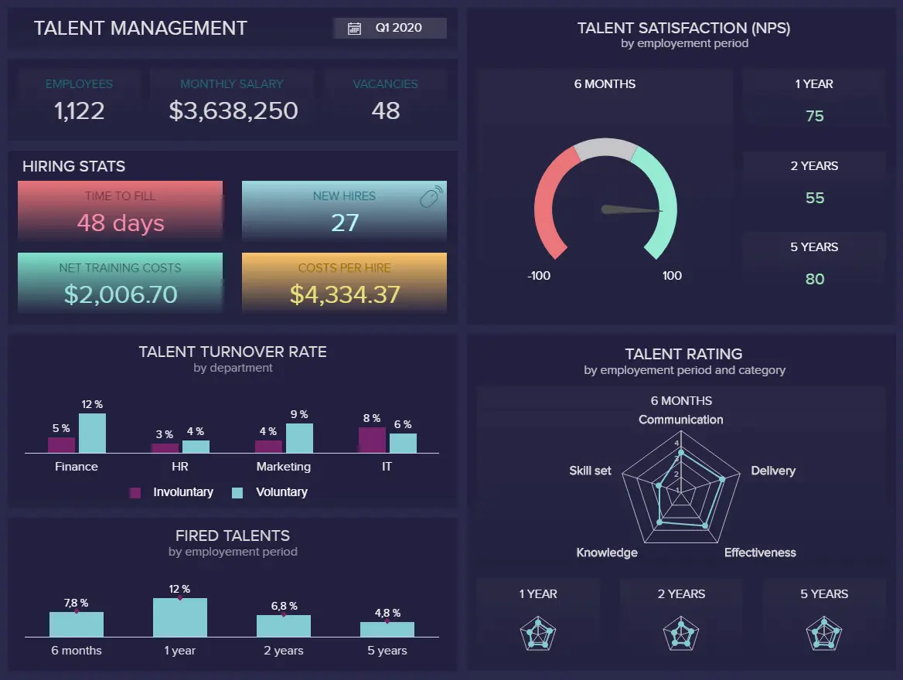

\*\*点击放大\*\*

我们的人才管理仪表板旨在帮助人力资源主管保持健康的员工保留和招聘计划，提供了一个指标大熔炉，可简化基准流动率、监控满意度水平以及访问大量高级招聘统计数据。

这个高度直观的[人力资源分析仪表板](https://www.datafocus.ai/infos/dashboard-examples-and-templates-human-resources)旨在最大限度地访问信息，提供的工具可以了解您的人才在公司工作了多长时间，同时对他们最有价值的技能进行分类。 您还可以比较解雇率，同时分析整体员工满意度水平的主要趋势，并探索与特定时间段的人才流失率的相关性。 借助触手可及的这种广泛的信息，您可以制定策略以保持最重要的人才参与业务，同时制定计划以简化招聘流程并在您最需要的领域寻找熟练的专业人员。 这是一个仪表板，可以节省人力资源人员的时间，同时显着提高您的人才投资回报率。

主要指标：

- 人才满意度
- 人才评级
- 人才流失率
- 解雇率

### 13\. 医院绩效仪表板

[医疗保健领域的商业智能](https://www.datafocus.ai/infos/healthcare-analytics)已成为高效设施管理的关键要素。 如果您是关键的医疗保健决策者，您就会知道您的许多决定都会影响患者的健康和福祉。 在某些情况下，您制定或签署的战略和计划可以决定生与死。

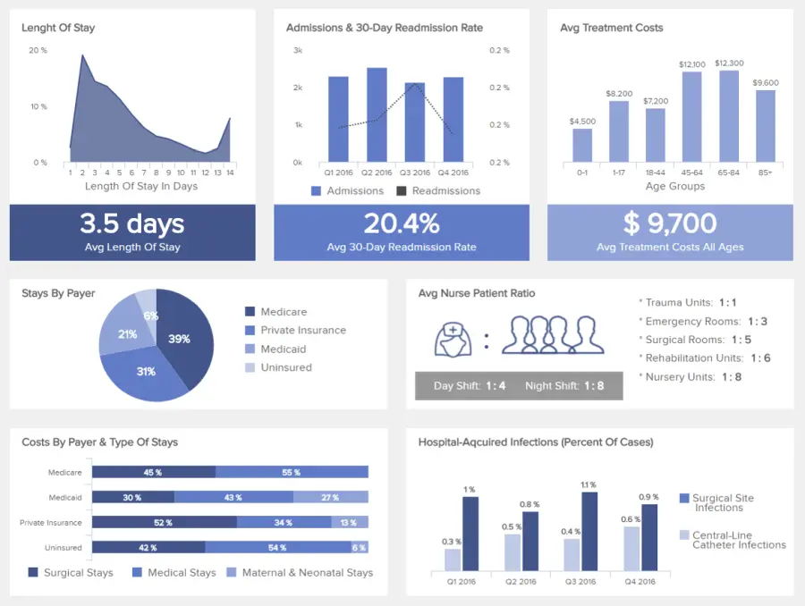

\*\*点击放大\*\*

作为我们最重要的执行摘要仪表板示例之一，该[医院仪表板](https://www.datafocus.ai/infos/dashboard-examples-and-templates-healthcare)配备了逻辑可视化的平衡组合，最终将改善患者护理，同时提高跨部门效率，减少任何不必要的运营成本或支出。

通过这个信息中心，您可以快速访问信息，使您能够根据班次评估护士与患者的比例、根据年龄组的治疗费用、再入院率、住院时间和医院获得性感染的模式。

通过从一个中央执行摘要仪表板分析这些详细信息，您可以深入了解医院的皮肤，磨练流程中的任何运营弱点。 如果出现问题，您可以在问题失控之前正面解决。 如果您发现任何积极的趋势，您可以使用这些信息在机构的其他领域进行改进。

主要关键绩效指标：

- 平均住院时间
- 再住院率
- 按付款人划分的成本

### 14\. 客户满意度仪表板

在我们这个高度互联的数字时代，消费者坐在驾驶座上。 只需滑动屏幕或单击按钮即可访问丰富的信息和潜在的购买力，提供一致、有意义和无缝的客户体验 （CX） 将使您与众不同。

\*\*点击放大\*\*

为了让您的客户始终如一地满意，使用正确的[客户服务分析工具](https://www.datafocus.ai/infos/business-intelligence-service-support)至关重要 - 作为我们最合适的执行仪表板示例之一，此客户满意度仪表板将引导您实现面向消费者的一致成功。

这个动态的执行仪表板模板具有凝聚力的指标组合，旨在更深入地了解客户的满意度，在一个易于浏览的空间中提供净推荐值 （NPS） 的清晰快照，以及消费者保留率的可比概要。 在这里，您还可以发现您的客户浏览您的网站或使用您的服务的难易程度（这对于 SaaS 公司来说是一个特别有用的功能或指标）。

有了这些全面的见解组合，您可以对客户服务流程和沟通进行有针对性的改进，同时对跨渠道为消费者提供的在线体验进行有价值的调整。 这个强大的执行项目仪表板将提高您的客户保留率、发展您的业务并提高您的底线。

主要指标：

- 客户满意度
- 净推荐值
- 客户努力得分
- 客户保留

### 15\. 采购 KPI 仪表板

撇开利基、部门或行业不谈，您的采购活动可能会对您的业务产生重大影响。 如果您的采购策略不佳，您将面临耗尽业务预算、造成供应链效率低下甚至声誉受损的风险。

\*\*点击放大\*\*

作为采购主管，您的目标是保持流程流畅、合规率健康以及供应商关系的价值。这是一项艰巨的任务，但作为最通用的执行仪表板模板，我们的采购 KPI 仪表板将帮助您实现它。

这种特殊功能的主要功能之一是能够更深入地挖掘您的端到端采购流程或采购周期。有了这些视觉信息，就可以查明具体的低效率并简化整个过程。例如，如果您有有问题的供应商，您可以设置新的采购条款或用更可靠的公司替换它们，从而节省资金并提高采购效率。

这是一个使用现代[采购分析软件](https://www.datafocus.ai/infos/business-intelligence-procurement)创建的执行仪表板示例，它展示了使用正确的高级分析工具提供的范围和愿景。

主要关键绩效指标：

- 合规率
- 供应商数量
- 采购订单周期时间

### 16\. 零售分析仪表板

零售业是一个竞争激烈的格局。 如果您想在您的利基市场中脱颖而出，跨渠道促销策略、创造力和组织效率的完美结合至关重要。 这份执行[月度报告](https://www.datafocus.ai/infos/monthly-reports-templates)将帮助您做到这一点。

\*\*点击放大\*\*

从营销活动到销售、人员配备策略等等，现代零售经理或高管每天都面临着巨大的任务。 我们的零售分析工具部分是高管销售仪表板、部分高管营销仪表板和部分运营仪表板，在一个易于理解的空间中提供广泛的基本见解。

在这里，可以探索网络流量和客流量模式，跟踪投资和回报之间的相关性，检查员工收入率，并更深入地了解销售和转化。

这个基于零售的仪表板执行摘要中的每一条信息都将帮助您正面满足消费者的需求，同时建立品牌权威并提高整体投资回报率 （ROI）。

主要指标：

- 网站流量/人流量
- 售出率
- 零售转化率
- GMROI
- 每位员工的月收入

### 17\. 实际与预测财务执行仪表板

可以说是首席财务官最重要的领域之一，该财务执行仪表板使用预测技术来预测组织未来的财务状况。 这是通过使用当前和过去数据的混合来完成的，并且被决策者高度用于定义下一个财政年度的预算目标和其他重要流程。 让我们在下面更详细地研究它。

\*\*点击放大\*\*

该模板是对损益表的不同看法，跟踪财务部门的三个关键领域：过去 12 个月的收入、成本和净利润。 这些指标中的每一个都提供了对实际和预测值以及货币和百分比的绝对差异的见解。 这使 c 级专业人员能够快速了解数字是否按预期进行，或者是否需要更改某些内容。 需要考虑的一个重要因素是，财务预测可能会因意外事件或不断变化的市场条件而有所不同，因此，需要仔细监控并考虑组织的现状。 同样，根据公司如何定义其预测流程，还需要分析不同KPI上的负面变化。

结合这些有用的知识，该示例还提供了成本预测的细分。 这是一个非常有用的工具，因为它可以帮助规划未来一段时间的资源，并发现可能影响盈利能力的低效率。 例如，我们可以看到营销支出略高于预测金额，这可能是负面情况，也可能是由于成功的策略而合理的。

主要关键绩效指标：

- 实际费用与预测费用
- 实际收入与预测收入

### 18\. 执行项目仪表板

作为项目经理，您的工作是确保在项目完成过程中一切顺利进行。 这可能会成为一项艰巨的任务，尤其是当一个项目涉及很多人和部门时。 为了帮助您完成该任务，我们的下一个示例提供了指标的完美概述，以跟踪不同领域的项目进度。

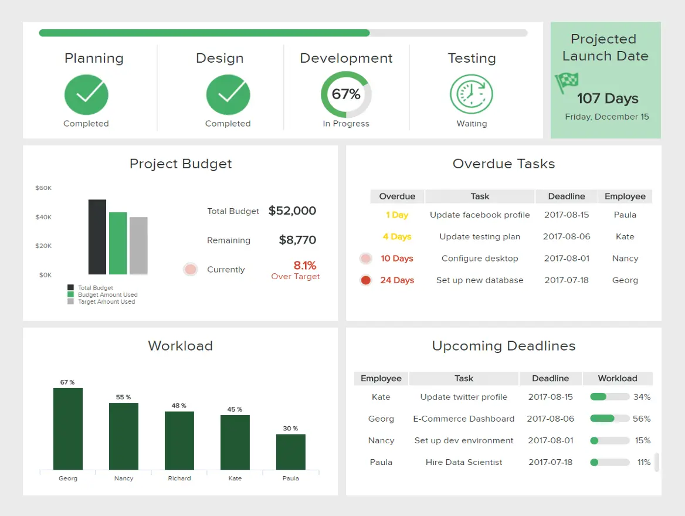

\*\*点击放大\*\*

使此执行项目仪表板模板如此有价值的原因是，它提供了所有必要信息的集中视图，以跟踪不同任务的进度。 此模板中包含的指标涵盖预算、过期任务、工作量和即将到来的截止日期等关键领域，使团队成员和 PM 能够在出现任何瓶颈时立即掌握它们。

例如，我们可以看到有几个任务已经过期，这是需要研究的事情，因为它可能会延迟其他任务，如果没有完成以前的任务，就无法执行。 通过看工作量图表，可以看到乔治是整个团队中工作量最高的一个，巧合的是，他也是逾期时间最高的一个。 这可能意味着乔治有太多的工作要做，没有足够的时间，所以需要做出一些决定，以确保他有及时完成任务所需的帮助和资源。

主要关键绩效指标：

- 总票证与未平仓票证
- 按预算交付的项目
- 平均处理时间

### 19\. 客户支持 KPI 仪表板

客户支持被认为是任何组织最重要的领域之一，毕竟，客户是可以成就或破坏业务的人。 因此，确保投入适当的资源来提供最佳支持是成功的关键。 同样，确保这些资源转化为公司的利润也同样重要。 我们的下一个示例是[客户服务仪表板](https://www.datafocus.ai/infos/dashboard-examples-and-templates-customer-service)，它涵盖了部门的所有成本相关指标。

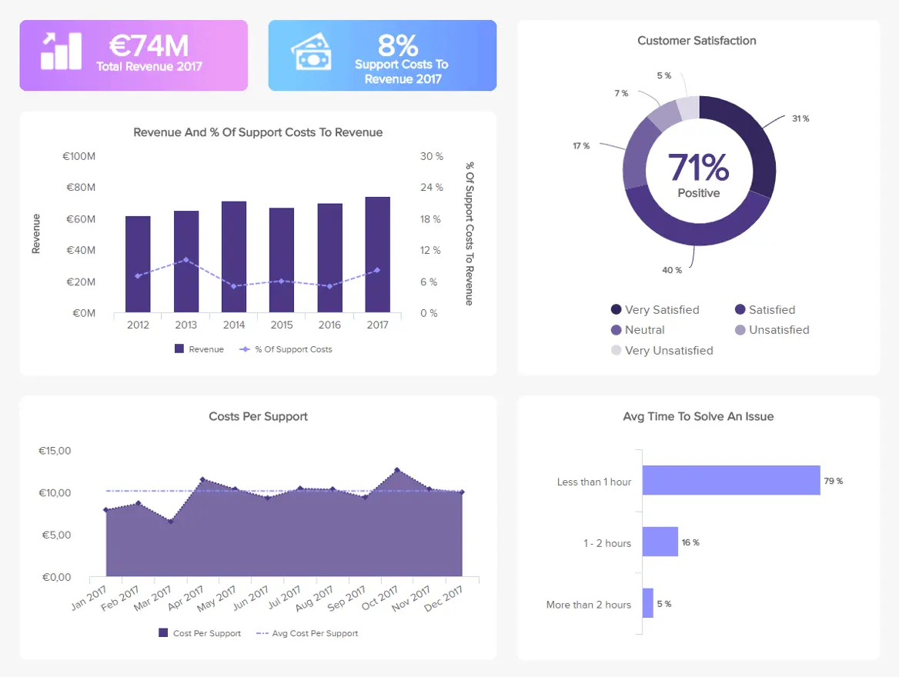

\*\*点击放大\*\*

当然，与任何业务流程一样，您希望以尽可能高的收益将成本保持在最低水平。 根据收入衡量成本可以让您清楚地了解您从投资中获得的收益以及是否需要进行任何调整。

解决问题的平均时间可能是对成本影响最大的 KPI。 解决所需的时间越长，最终解决的问题就越少，公司的成本就越高。 不用说，这也会影响您的保留率和品牌声誉，因此，优化它至关重要。 成本可能上升的另一种情况是人员过剩。 如果员工过多，问题数量过多，则会产生不必要的运营成本。

主要指标：

- 服务水平
- 支持成本与收入
- 客户满意度

### 20\. 人力资源多元化仪表板

在当今背景下，工作场所的多样性已成为强制性做法。 每天，越来越多的组织意识到融合不同文化和背景的价值，以带来可以推动成功的创新理念。 也就是说，多样性仍然对许多企业构成挑战。 我们的最后一个示例将帮助高管了解业务的当前情况以及由于高效的[人力资源分析](https://www.datafocus.ai/infos/workforce-people-hr-analytics)而实施的一些措施的成功。

\*\*点击放大\*\*

在谈论多样性时，需要考虑的范围很广，因为员工可能来自不同的性别、背景、种族和能力。 上面的人力资源主管仪表板涵盖了所有这些领域，以提供有用的见解，帮助人力资源经理评估情况。 女性/多元化员工与男性的管理职位比例在商业世界中显示出一种共同趋势，男性占据了大部分高薪职位。 但是，我们可以看到，该公司的目标是到 2025 年将女性/多元化员工的管理职位增加多达 20%。 在按部门划分种族细分时，也会发生类似的情况，白人占据了大多数行政职位。 这是需要研究的事情，以确保全面的多样性。

此仪表板中包含的另一个非常有价值的指标是按多元化组划分的离职率，因为该指标将显示员工对组织的满意度。 在这种情况下，我们可以看到黑人员工是自愿离职率最高的员工，这意味着正在发生的事情让他们在工作场所感到不舒服。 这些有价值的结论可以引导人力资源主管制定战略来解决问题，并确保多样化和安全的工作环境。

主要关键绩效指标：

- 按角色划分的性别多样性
- 种族多样性
- 按集团划分的离职率
- 按种族划分的招聘明细

您的机会：[想要通过几次点击构建执行仪表板？](https://www.datafocus.ai/console/) 免费试用我们的专业仪表板软件 14 天！

## 执行报告和仪表板的好处

为了更详细地了解执行报告和仪表板的力量和潜力，以下是使用这些直观的[在线数据可视化](https://www.datafocus.ai/infos/data-visualization-tools)工具的主要好处：

- 愿景：报告提供了增强的可见性和洞察力，从而使您能够更详细地了解业务的每个关键方面，从而使您能够做出更明智的决策。
- 进化：可视化数据的能力将使您能够不断改进业务，通过衡量和构建绩效来与周围的环境一起发展。
- 经济性：执行仪表板将允许您在一个易于理解的空间中查看和参与所需的所有信息，而不是花费无休止的时间登录您的业务系统并运行报告。 时间就是金钱，如果你节省时间（同时改进你的内部流程），你最终会节省金钱，从而使你的帝国更加经济。
- 实现：通过使用与您的业务最相关的基于执行报告的 KPI，您将能够通过努力实现准确、有价值的目标来完善和实现您的业务计划，并确保一次又一次地实现这些目标。 您可以从许多 KPI 示例中进行选择，但要考虑的重要事项是找到正确的[示例](https://www.datafocus.ai/infos/kpi-examples-and-templates)。
- 发展：从高管报告中获得的易于理解的可视化见解将为您提供跟踪单个员工绩效的工具，帮助您奖励绩效最佳员工并培养需要额外培训、支持或激励的员工。
- 基准测试：由于高管仪表板提供了基于非常具体的 KPI 的大量动态可视化，因此可以设置频繁的基准，使高级决策者能够突破组织界限，同时以改善参与度、积极性和部门间绩效的方式衡量成功。
- 沟通：通过以引人入胜且易于理解的方式提供对详细信息库的访问，执行状态仪表板通过为每个人提供信息来改善协作过程，同时提高个人绩效，从而全面改善内部沟通。
- 速度：企业越快、越高效，其表现就越好。 高管仪表板报告可帮助高管更快、更准确地做出高层决策，这有助于促进组织在许多领域的进步。 仪表板对高管的直观和可定制特性提供了独特（和强大）的好处，即加快现有流程，同时增强战略和决策过程。
- 证据：虽然这似乎是一个抽象的概念，但在分析方面，您可以访问的全景快照越多越好。 通过能够深入挖掘大量宝贵的指标，您将能够用每个人都理解的有形趋势、模式和可视化来支持您的决策 - 这种证据将使您的决策更具说服力。 这是我们通过示例和执行仪表板模板演示的概念。

## 执行仪表板报告的最佳实践

应该很清楚，仪表板用于执行报告。 此外，它们代表了报告和摘要所需的视觉部分，以便获得数据的清晰表示，从而为书面文字产生附加值。 要获得高管报告的回报，重要的是要了解如何创建特别适合您的组织的[在线仪表板](https://www.datafocus.ai/infos/online-dashboard)。 在可视化报告数据方面，执行仪表板是一种非常有效的工具，因此从一开始就正确处理非常重要。

让我们看一下基本的高管仪表板最佳实践，以及在创建引人注目的高管报告实践时应考虑的步骤。 从了解用户到数据驱动的故事讲述，您将发现使报表和仪表板尽可能成功所需的所有信息。

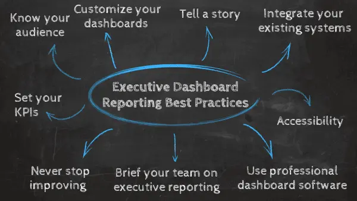

### 1\. 了解您的受众

执行报告最基本的方面是了解用户的需求、目的和目标。 根据执行摘要仪表板的关键目标功能，您需要提供数据可视化和功能，以提高性能，同时提供有利于组织发展的分析机会。

通过将自己置于核心用户的位置，询问组织内的人员他们希望哪些数据来提高绩效（或使他们的角色更轻松），并选择正确的关键绩效指标，您将为执行摘要仪表板工作奠定坚实的基础。 这就引出了下一点。

### 2\. 设置关键绩效指标 （KPI）

选择最能反映公司核心宗旨和目标的 KPI 将确保您的执行报告既相关又有效。

例如，如果您希望改善组织的财务经济，您可能希望处理财务[报告和分析](https://www.datafocus.ai/infos/financial-reporting-and-analysis)流程，然后选择设置财务仪表板，根据运营费用比率和净利润百分比向下钻取 KPI。

### 3\. 混合使用实时和过去的数据

在选择 KPI 的过程中，您将使用 衡量策略的成功或失败，重要的是要考虑实时和过去的表现。 一方面，实时分析将使不同部门有可能在任何发展发生时立即采取行动。 例如，IT部门可以发现系统中的威胁或包，并在它们造成任何损害之前修复它们。 营销部门不需要等待 30 到 40 天来评估策略的成功，相反，他们可以随时优化策略以确保最大的成功。

另一方面，历史数据可以帮助您从过去中学习，使未来变得更好。 您可以了解出了什么问题以及如何解决它。 例如，降低成本、预测未来库存管理需求等。

在报告中混合使用实时和历史信息将为您提供完整的绩效图景，以便您可以做出明智的战略决策。

### 4\. 集成现有系统

关于执行仪表板模板的设置，重要的是通过API集成您当前的所有业务系统，以确保数据的准确收集、管理、分析和实时价值。

在此过程中，您将确保已创建执行仪表板设计，该设计不仅呈现对组织最有价值的见解和指标，而且还提供一个集中的空间，在整个组织中提供数据驱动的价值。

### 5\. 保护您的数据

正如您在这篇文章中看到的那样，执行报告包含组织最重要的信息。 因此，确保其中的数据受到充分保护至关重要，特别是考虑到影响全球多个行业和公司的网络攻击的增加。

为了确保您的报告受到保护，设置数据治理计划非常重要。 这将确保在整个组织中明确定义有关数据操作的角色和职责。 例如，当执行仪表板包含敏感信息时，它们可以受密码保护。 要考虑的另一个方面是数据存储为不安全位置的位置可能会显着增加违规的可能性。 如果您依赖云存储，请确保使用云[BI](https://www.datafocus.ai/infos/cloud-bi)工具来确保数据加密、隔离、安全补丁等安全协议。

## 6\. 自定义仪表板

一旦其中一个模板的框架启动并运行，您就可以根据自己的喜好对其进行定制，编辑仪表板，使其以对您的业务最有价值的方式返回您指定的见解和指标。

最佳执行仪表板遵循最佳设计实践。 为了帮助您自定义概览报告模板以取得成功，请遵循我们的 20[项仪表板设计原则和最佳实践](https://www.datafocus.ai/infos/dashboard-design-principles-and-best-practices)基本指南。

### 7\. 用数据讲述故事

作为一个物种，我们以讲故事为生。 通过使用仪表板和可视化创建强有力的叙述，您将能够以一种激励内部和外部利益相关者的方式传递基本消息，从而提高流程的成功率。 查看仪表板，并考虑每个 KPI 或可视化效果是否传达了您要传达给最终用户或受众的信息。 起草受信任的利益相关者以提供有价值的反馈，您最终将得到一个产生一致结果的叙述。

使用指标和见解创建叙述本质上是设计过程的延伸。 为了指导您的努力，这里有一个[数据故事讲述](https://www.datafocus.ai/infos/data-storytelling-examples-with-data-visualization)指南，为您的阅读带来乐趣。

### 8\. 使用专业的执行仪表板软件

为了充分利用您的仪表板，必须使用专业软件。 虽然您可以尝试使用静态报告方式，但您对数据没有那么大的权力，因为电子表格和演示文稿不会显示实时信息，并且缺乏交互式元素最终会影响您的分析，因为您将花费大量时间来导出要创建的每个仪表板或报告的历史数据。

通过使用现代软件和工具，实时数据触手可及，互动的可能性是无穷无尽的。 从向下钻取图表的零碎部分，到自动更改可视化效果的强大筛选器。 这样，您将有更多时间专注于公司中的其他关键任务，并获得出色的业务助理，这将使您的绩效飙升。

### 9\. 向您的团队简要介绍新的执行报告流程

最后，您必须对整个组织的执行报告流程保持清晰和透明，让合适的人员访问正确的指标，并举办内部研讨会，以确保每个人都能跟上新系统的速度。

如果每个人都知道如何使用报告的核心特性和功能，并且他们完全支持您更新的流程分析流程，您将能够从触手可及的大量业务数据中榨取最后一滴价值。

既然您已经了解了此类仪表板最突出的好处，那么是时候看看来自现实世界的行业示例了。 这些模板将激发您的仪表板创建灵感，并为您提供开始构建自己的仪表板的路线图。

### 10\. 为合适的人员提供广泛的访问权限

为了最大限度地提高仪表板对高管的价值，您应该确保组织中的每个高级决策者都能访问正确的见解。 除了提供适当的访问权限外，您还应该通过提供培训研讨会来确保您的高管接受培训，以充分利用每个仪表板功能。 如果您的高管完全了解您的新仪表板软件并可以跨设备进行 24/7 全天候访问，他们将能够做出更好的决策并指导您的业务走向成功。

### 11\. 永不停止改进

无论您是使用 SaaS 执行仪表板、高级销售仪表板还是任何其他数据驱动的模板，您都应该承诺定期检查您的工作，看看它们是否返回了最佳结果。 无论您从事什么行业，重要的是要了解变化是恒定的。 通过调整仪表板以符合您周围的环境，您的执行分析工作将继续提供最佳的投资回报率，同时推动您的组织向前发展。

您的机会：[想要通过几次点击构建执行仪表板？](https://www.datafocus.ai/console/) 免费试用我们的专业仪表板软件 14 天！

## 关键要点 执行仪表板和报告

我们已经深入研究了高管级别的仪表板，有一点是明确的：根据贝恩公司进行的一项调查，使用数据分析的公司做出更快决策的可能性要高出五倍。 此外，根据Gartner的说法，大多数大型行业决策者认为大数据将在未来几年内加速积极的变化。 在提高业务绩效方面，智能数据分析是关键 - 我们现实生活中的[大数据示例](https://www.datafocus.ai/infos/big-data-examples-in-real-life)就是这一概念的切实证明。 采用执行仪表板软件的时机已经到来

在我们进入执行报告示例和执行仪表板模板世界的旅程中，我们考虑了现代报告工具的实际应用，查看了官方定义，并探索了尖端分析技能为业务表带来的许多好处。

作为一名高级管理人员，您无疑将负责制定可以成就或破坏您的业务的计划和举措。 当然，这些重要的决定伴随着巨大的压力。 但是，借助高管级别的报告和仪表板，您将能够做出选择、制定策略并以 100% 数据驱动的信心与您的员工沟通——这将使您的工作生活更轻松、更成功。

通过交互式仪表板进行的执行报告提供了一个真正的视野窗口，不仅提供更大的实时结果，而且具有巩固持续发展的无与伦比的力量，以及在竞争日益激烈的数字世界中取得可持续的成功水平。

持续增长和进步对于任何希望在这个残酷的商业时代蓬勃发展和生存的公司都至关重要，而高级报告是确保您年复一年成功的容器。

准备好处理您的分析并亲自测试这些动态执行仪表板工具了吗？ 立即试用我们功能强大的[仪表板软件](https://www.datafocus.ai/infos/best-dashboard-software-features)进行[14 天试用](https://www.datafocus.ai/console/)\- 它是完全免费的，将为您打开数字仪表板报告的所有主要优势。 享受！
