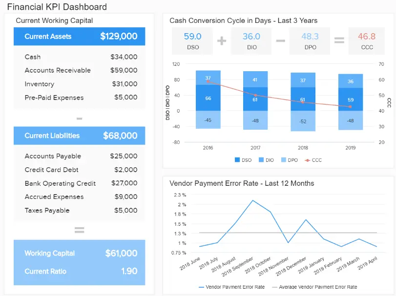
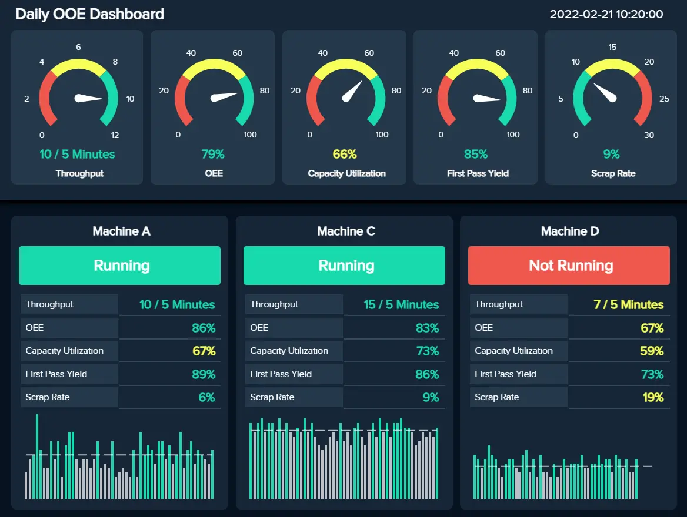

在现代，以活动为基准的品牌和企业将在竞争中获得至关重要的优势。

无论您的利基市场或行业如何，使用动态 KPI 将使您能够跟踪和提高您在多个关键领域的绩效，从而在此过程中加速您的商业成功。没有数据，在制定策略和做出明智决策时，您只会“在黑暗中射击”。虽然您可以选择许多[KPI 示例](https://www.datafocus.ai/infos/kpi-examples-and-templates)，但您应该只选择最重要的示例并将资源集中在它们上。

也就是说，使用正确的 KPI 对于您的近期和长期组织活动都至关重要。KPI跟踪是一种技术，可以让您更深入地了解业务的内部运作 - 我们将详细讨论这个概念。

在这里，我们将考虑跟踪 KPI 指标需要什么，探索当代 KPI 跟踪器的动态，并研究如何跟踪 KPI。让我们从一个定义开始！

## 什么是 KPI 跟踪？

那么，KPI跟踪到底是什么？关键绩效指标跟踪是监控最相关的关键绩效指标的权威手段，借助现代[KPI 软件](https://www.datafocus.ai/infos/kpi-dashboard-software)来提高成功率。通过定期自动测量 KPI，您可以提高生产力并降低成本。

通过为业务的各个领域选择正确的 KPI，可以使用它们来排列和可视化大型数据集。这样做不仅可以帮助您从组织数据中榨取额外价值，而且还将提供在业务的重要领域设定目标和衡量增量成功的机会。

跟踪 KPI 就是获得更大的商业智能。通过[KPI 仪表板](https://www.datafocus.ai/infos/best-kpi-dashboard-examples)等可视化创新，您可以发现比您想象的更深入的见解，从而简化您的组织，在竞争日益激烈的数字环境中取得成功。

从这个意义上说，KPI 跟踪工具是组织成长和发展的强大载体。

## KPI 跟踪有什么好处？

现在我们已经研究了一个实际的定义，让我们看看业务促进的好处。

如果您充分发挥 KPI 跟踪器的潜力并使用与您的业务核心任务相关的指标，您将获得令人难以置信的回报。从这个角度来看，以下是为您的企业使用跟踪器的主要好处：

- 情报：为了在当今的商业战场上获胜，必须根据相关指标做出始终如一的明智决策。了解如何衡量 KPI 将使您能够改进您的业务战略，最终节省您的时间和金钱，同时培养一定程度的创新，让您在您的领域脱颖而出。
- 基准测试：承诺跟踪 KPI 指标的最强大功能之一是获得基准测试的能力。KPI 跟踪软件为企业提供了创新，以设定明智的目标和基准。通过为您的组织设定智能目标，您将能够发展、扩展和完善您最重要的流程，同时更好地适应变化。
- 创新：使用正确的软件可提供洞察力，使您能够发现和发现您原本不会注意到的趋势或模式。当这种情况发生时，您将能够解锁一定程度的创造性思维，从而改善整个企业的创新。当公司获得创新能力时，他们通常会成为各自领域的思想领袖，在此过程中建立信任并提高品牌知名度。
- 沟通：[KPI报告](https://www.datafocus.ai/infos/what-are-kpi-reports-examples)和跟踪器是可视化和交互式的，这意味着它们具有令人难以置信的包容性。KPI 跟踪软件提供组织内每个人都能理解的见解，最终增强部门间沟通，同时释放现代[数据叙事](https://www.datafocus.ai/infos/data-storytelling-examples-with-data-visualization)的全部潜力。
- 动机：通过使用 KPI 仪表板设置可操作的目标，您将激励员工和特定部门改进他们的流程，从而提高生产力和动力。
- 一致性：使用正确的指标作为您的信息北极星也将帮助您以恒定、稳定的速度前进。准确的基准测试会带来持续的进步，并且拥有管理 KPI 所需的软件，您不仅有可能持续扩展，而且速度使您在竞争中脱颖而出。

“关键绩效指标和结果。我们从推动业务的职能和流程开始，然后推动公司设定目标，描述可衡量的品牌承诺，并在一页的战略计划中选择关键数字。以及为什么其余的没有

您的机会：[想免费测试专业的KPI跟踪软件吗？](https://www.datafocus.ai/console)我们提供 14 天免费试用。立即从出色的跟踪系统中受益！

## 大多数公司使用什么来跟踪 KPI？

那么，大多数公司使用什么来跟踪 KPI？简短的回答：智能仪表板和技术。为了衡量 KPI 并设定可操作的基准，当今最具前瞻性的企业使用通常称为 KPI 跟踪系统。

KPI 报告是一种工具，有助于在特定时期内衡量、收集、安排、分析和研究基本 KPI。在数字时代，可靠的 KPI 跟踪系统是可视化、交互式、可定制的，并且可通过多种媒介（包括移动和桌面）访问。

通过使用智能 KPI 跟踪器来发挥您的优势，您可以识别业务所有关键领域的潜在优势、劣势、模式和潜在改进领域。

关键绩效指标报告通常以[交互式仪表板](https://www.datafocus.ai/infos/interactive-dashboard-features)的形式呈现，提供了从销售和营销到财务、履行等关键内部功能的易于理解的表示。

借助交互式业务 KPI，您将能够以一种获得真实结果的方式与数据取得联系 - 无论是回顾性的还是实时的。KPI 提供您企业基本活动的全景快照。我们将更深入地介绍这些类型的工具以及您在本文后面投资其中一种工具之前应该期待什么。但首先，让我们看一些行业示例，以正确看待这些指标的力量。

## KPI 跟踪的实际应用：10 个真实世界的仪表板

现在我们已经清楚了跟踪关键绩效指标如何有助于增强组织发展，并初步了解了当今公司使用哪些工具来衡量它们，我们将研究 5 个真实世界的仪表板，涵盖管理、客户支持、财务、物流和高级营销，以便您可以更详细地了解如何跟踪 KPI 并在您的业务运营中增加价值。

### 1\. 管理KPI仪表板

\*\*点击放大\*\*

主要关键绩效指标：

- 客户获取成本
- 客户终身价值
- 销售目标

当涉及到快速和明智的高级决策时，管理KPI是非常宝贵的。我们的 KPI 跟踪仪表板在视觉上平衡并填充了基本的运营指标，配备了可操作的见解，以实现可持续的商业成功。

这个功能强大的[CEO 仪表板](https://www.datafocus.ai/infos/ceo-dashboard-report-examples-and-templates)提供销售、客户获取成本和客户终身价值等领域进展的全景快照，提供大量信息，旨在帮助高级管理人员制定战略，最终简化核心内部流程，同时改善企业的服务和客户体验 （CX） 产品。

### 2\. 财务关键绩效指标仪表板

\*\*点击放大\*\*

主要关键绩效指标：

- 营运资金
- 速溶比率/酸性测试
- 现金转换周期
- 供应商付款错误率
- 预算差异

此 KPI 仪表板充满了基本指标，这些指标侧重于监控企业在流动性、发票和预算等领域的财务状况。通过跟踪所有这些 KPI，企业可以设法提升其财务战略并将运营成本保持在最低水平，同时仍确保持续增长。

该财务仪表板涵盖了关键的[财务](https://www.datafocus.ai/infos/dashboard-examples-and-templates-finance)领域，例如当前的营运资金、现金转换周期和供应商错误率，是密切监控 KPI 和回答有关业务绩效的重要问题的宝贵工具。由于交互式图形和图表的混合，财务经理可以发现效率低下，做出准确的预测并保持现金在组织中流动。

### 3\. 客户支持 KPI 仪表板

\*\*点击放大\*\*

主要关键绩效指标：

- 服务水平
- 支持成本与收入
- 客户满意度

无论您是高级客户服务经理、一线座席还是服务策略师，我们的动态 KPI 跟踪仪表板都拥有洞察力的所有方面，可让您在更有效地完成工作的同时设定业务促进目标。

通过上述仪表板的逻辑呈现，可以一目了然地访问以客户服务为中心的基本 KPI，这些 KPI 深入挖掘到特定时间段的服务级别、支持成本和整体客户满意度等功能。

这是一个强大的工具，可帮助企业对其客户支持策略进行重大改进，无论其部门或行业如何。有关客户服务不同方面的更多见解，您可以浏览我们专注于[呼叫中心仪表板](https://www.datafocus.ai/infos/call-center-dashboard-reports-and-data-analytics)的文章。

### 4\. 拣货和包装 KPI 记分卡

\*\*点击放大\*\*

主要关键绩效指标：

- 拣货和包装成本
- 拣货和包装周期时间
- 拣选精度
- 包装材料的使用
- 设备利用率

我们的下一个示例是物流行业的[KPI 记分卡](https://www.datafocus.ai/infos/kpi-scorecard-examples-templates-to-track-performance)。记分卡是一种 KPI 跟踪工具，用于监控实现既定目标的进度或成就，使其成为监控的宝贵工具。决策者使用这种格式将不同的指标可视化在一起，并更全面地了解其整体绩效，并找到流程中的任何瓶颈。

拣货和包装记分卡分为四个主要区域，用于跟踪财务、有效性、利用率和质量的[物流 KPI](https://www.datafocus.ai/infos/kpi-examples-and-templates-logistics)，将告诉您与上个月结果的目标相比，您的拣选和包装流程是否运行顺利。与此配对，记分卡提供有关每行工作进度的详细信息。通过这种方式，您可以查看是否存在表现不佳的生产线并找出原因，或者在每条生产线上实施不同的策略来测试哪一条更适合您的仓库。像这样，您可以优化成本以及重要流程，以确保出色的订单管理和服务质量。

### 5\. 首席营销官仪表板

\*\*点击放大\*\*

主要关键绩效指标：

- 销售目标和增长
- 网站流量与潜在客户比率
- 每条线索的成本
- 潜在客户与 MQL 比率
- MQL 与 SQL 比率

在当今快节奏、竞争异常激烈的数字时代，如果您想消除噪音并在有意义的层面上与您的受众建立联系，那么创新并与您的营销活动保持一致至关重要。

因此，首席营销官（CMO）的工作具有挑战性和要求。从消费者人口统计数据到网站流量、潜在客户比率等等，在营销方面，有大量的数据需要筛选。我们的营销仪表板具有提供相关[营销](https://www.datafocus.ai/infos/dashboard-examples-and-templates-marketing)指标的 KPI，使忙碌的 CMO 能够简化其数据，同时快速提取可操作的见解。

对于“当下”决策和长期战略，这个强大的 KPI 仪表板提供了丰富的信息，使高级决策者能够在可持续的基础上推动营销成功和创新。但不仅如此，使用此仪表板，您还可以创建功能强大的[营销报告](https://www.datafocus.ai/infos/daily-weekly-monthly-marketing-report-examples)，从而使您的整个部门绩效飙升。

### 6\. 销售业绩仪表板

\*\*点击放大\*\*

主要关键绩效指标：

- 销售增长
- 销售目标
- 阿普
- 购置成本
- 中新社

对于动态现代销售环境中的高级管理人员和决策者来说，KPI 监控至关重要。我们的销售仪表板配备了一个有凝聚力的指标组合，旨在跟踪、监控和衡量部门增长的每个相关方面。

在这里，您可以访问丰富的 KPI 跟踪器功能，这些功能涵盖了对销售增长、目标、客户生命周期价值和基本获取成本的深入研究。借助一个易于浏览的销售[仪表板](https://www.datafocus.ai/infos/dashboard-examples-and-templates-sales)中提供的信息大熔炉，您可以制定明智的销售策略，以降低不必要的成本，同时促进增长并在出现宝贵机会时抓住它们。任何现代销售部门的基本 KPI 衡量仪表板。

### 7\. 员工绩效仪表板

\*\*点击放大\*\*

主要关键绩效指标：

- 缺勤率
- 加班时间
- 培训费用
- 员工生产力

您的员工是组织跳动的心脏。如果没有高度敬业和积极进取的内部人才，您的公司几乎会立即陷入困境，这就是为什么监控员工的表现至关重要的原因。

使用 KPI 监控系统来跟踪员工的发展方式将使您能够了解缺勤率以及培训成本、加班时间，最重要的是员工生产力。我们的员工仪表板提供了所有这些基本指标 - 这些信息将使您能够发展一种文化，让您的人才蓬勃发展，同时在需要时提供适当水平的培训或支持。任何有远见的人力资源部门的重要 KPI 跟踪系统。

### 8\. IT 项目管理仪表板

\*\*点击放大\*\*

主要关键绩效指标：

- 总票证与未平仓票证
- 按预算交付的项目
- 平均处理时间

作为组织的神经中枢，您的 IT 部门必须保持流畅、有凝聚力和适应性强。我们的 IT 项目管理仪表板旨在帮助技术人员平衡他们的项目预算，同时缩短处理时间并快速、自信地处理工单。

在此交互式[监控仪表板](https://www.datafocus.ai/infos/monitoring-dashboard-templates)中跟踪您最重要的指标将确保您可以在任何潜在的技术问题失控之前将其扼杀在萌芽状态，同时提高整个部门的生产力。一个智能的项目管理KPI跟踪模板，将使您的整个组织更高效，更沟通，更有利可图。

### 9\. 每日 OAE 仪表板

\*\*点击放大\*\*

主要关键绩效指标：

- 首次通过率 （FPY）
- 吞吐量
- 废品率

您的制造部门是您组织增长和盈利能力不可或缺的一部分。我们的专用[制造仪表板](https://www.datafocus.ai/infos/dashboard-examples-and-templates-manufacturing)旨在深入了解您的整体运营效率 （OAE），是我们最实用的 KPI 跟踪示例之一。

这个交互式信息中心一目了然地提供有关机器效率的信息，同时展示了废品率、吞吐量和一次合格率的主要趋势。有了这些信息，您就可以做出有针对性的战略决策，使您的制造过程更具成本效益，并在保持质量的同时提高产量。KPI跟踪器将帮助您加速业务增长。

### 10\. 脸书页面仪表板

\*\*点击放大\*\*

主要关键绩效指标：

- 风扇数量
- 关注者人口统计
- 按来源划分的页面浏览量
- 页面上的操作

这个功能强大的仪表板是跟踪与 Facebook 相关的 KPI 的一种高度可视化的方式，将帮助您优化社交媒体策略，以便在不断变化的数字环境中取得可持续的成功。

在这里，您可以全面了解基本指标，包括用户人口统计数据、页面参与度、粉丝或关注者数量以及按来源划分的页面浏览量。通过将所有这些关键指标整合到一个流畅的[Facebook 仪表板](https://www.datafocus.ai/infos/dashboard-examples-and-templates-facebook)设计中，您将快速构建与特定受众群体产生最共鸣的内容档案。通过这样做，您可以做出创造性和战略决策，从而显着提高品牌知名度。

您的机会：[想免费测试专业的KPI跟踪软件吗？](https://www.datafocus.ai/console)我们提供 14 天免费试用。立即从出色的跟踪系统中受益！

## 如何跟踪关键绩效指标？

现在您已经看到了一些 KPI 跟踪示例的实际应用，您一定渴望开始从此 BI 实践中受益。为了帮助您成功实现 KPI 跟踪，我们汇总了一些提示和技巧来指导您完成整个过程。

### 1\. 设定业务目标

在开始KPI跟踪之前，第一步也是最重要的一步是[定义明确的业务目标](https://smallbusiness.chron.com/importance-setting-business-objectives-4724.html)。可能对某些公司有用的方法可能与其他公司完全不同，因此，您需要设定切合实际的目标，以使您能够监控您的公司是否按预期增长。一旦你有了核心业务目标，你还需要为公司的每个部门定义特定的目标。这样，您将能够轻松选择正确的 KPI 来跟踪每个部门的进度，并在它们之间进行交叉分析。

### 2\. 定义受众

现在您已经定义了业务目标，您将离开始执行强大的 KPI 监控更近一步。但在您深入研究 KPI 之前，您还需要考虑您的受众以及什么对他们更有效率。为此，您可以问自己一些问题，例如哪些数据对这些人很重要？他们需要多久检查一次？这些 KPI 是否提供上下文？

### 3\. 遵循 BI KPI 跟踪最佳实践

一旦您定义了明确的业务目标和受众，就该选择要跟踪的特定 KPI 以监控和实现这些目标了。为此，您可以遵循商业智能行业的两个 KPI 最佳实践来定义业务的最佳指标。

- 更聪明：这是一种代表具体、可衡量、可实现、相关、有时限、评估、重新评估的实践。它基本上就像您的 KPI 需要遵循的清单，以便被视为与跟踪相关。如您所见，它们需要特定于业务目标，与您的业务相关且可实现，并处于持续评估中。
- 六个 A：您可以实施的第二个 KPI 跟踪最佳实践是六个 A，它代表对齐、可实现、敏锐、准确、可操作、活着。就像SMARTER标准一样，这种做法也旨在根据一些重要特征评估关键绩效指标的相关性。在这种情况下，该指标应与您的公司目标保持一致，使公司中的每个人都了解情况、可操作并随着业务的发展而发展。

### 4\. 混合使用实时和历史数据

有了正确的 KPI，就该开始分析了。要从 KPI 监控中提取所需的可操作见解，您需要考虑历史数据和实时数据。一方面，历史见解可以让您发现趋势并比较性能以查看您是否在改进，另一方面，实时见解可以让您了解当前的情况，并允许您在困难变成更大的问题之前发现它们。

### 5\. 使用正确的可视化效果

跟踪 KPI 流程的下一阶段是为每个指标选择正确的可视化类型。有几种类型的图形、图表和业务仪表板可供您可视化数据，此处的目标应该是选择那些将使分析过程对技术和非技术用户最具交互性和易于理解的图形、图表和[业务仪表板](https://www.datafocus.ai/infos/dashboard-examples-and-templates)。静态 Excel 表不再用于从分析中提取最大功效。这就是为什么您应该投资于 KPI 跟踪创新，这些创新将为您提供广泛的可视化类型，以适应您的每个目标并支持决策讨论。

### 6\. 区分关键绩效指标和指标

的确，绩效指标和指标都属于数据分析的范围。但是，这两个信息分支之间存在核心差异 - 它们主要归结为进度或性能。虽然指标提供的见解较低，但关键指标提供顶级信息。KPI 还可以帮助您衡量实现基本组织目标的进度，而指标则揭示您在关键领域的整体绩效。了解这些关键差异将确保您从 KPI 监控工具中获得最大价值。阅读我们关于[KPI 与指标](https://www.datafocus.ai/infos/kpis-vs-metrics-differences/#kpis-vs-metrics)的基本指南，了解更多信息。

### 7\. 设定关键绩效指标目标

在考虑如何有效地跟踪 KPI 时，设定正确的目标和指标对您的成功至关重要。为了设定准确的[KPI 目标和指标](https://www.datafocus.ai/infos/kpi-targets-goals-examples)，您应该花时间评估您在所有相关领域的当前情况。查看竞争对手的表现并进行充分的市场调查也将帮助您设定不仅现实而且实际上会导致全面持续进步的基准。在设置关键绩效指标目标时，定义短期和长期目标将帮助您设定强大的基于 KPI 的目标。

### 8\. 选择有凝聚力的 KPI 组

正如您在探索我们的 KPI 跟踪示例系统时可能已经注意到的那样，每个仪表板都配备了 KPI，这些 KPI 协同工作以衡量特定业务领域的进度。也就是说，当您跟踪 KPI 时，您的可视化应该相互补充，编织在一起形成一个可基准的信息挂毯。例如，如果您希望跟踪营销绩效，则可以选择在同一仪表板中使用客户获取、点击率和每次点击成本。

### 9\. 收集内部反馈

随着您的目标和要跟踪的 KPI 列表牢固到位，您应该允许公司内的利益相关者测试您的选择，以确保您选择的所有关键绩效指标都提供真正的价值。收集内部反馈将为您提供所需的洞察力水平，以确保组织中的每个人都可以努力实现与其部门、职能或角色相关的有效基准。有了您的反馈，您可以完善您的选择，自信地说，您拥有最好的 KPI 来跟踪您在业务的每个相关领域的成功。

### 10\. 定期重新评估您的跟踪选择

当您开始达到基准并扩展业务时，您需要签到并考虑是否需要优化或更新关键绩效指标跟踪选择以继续前进。抽出时间每季度重新评估您的选择，收集过程中的内部反馈，您的实时 KPI 跟踪流程将保持优化，以实现全面成功。不再符合组织需求的关键绩效指标将占用软件或仪表板上不必要的空间。因此，替换冗余的可视化将在增长和成功方面提供额外的价值。在关键绩效指标跟踪方面，这可能是您可以关注的最重要的过程。

## KPI跟踪软件应包括的主要功能是什么？

我们之前已经向您介绍了 KPI 跟踪工具的一般概念，现在我们将更详细地介绍您在决定要投资哪种 KPI 工具时应该寻找的特定功能。

- 数据连接器

选择 KPI 跟踪软件时，您应该考虑的第一个也是最重要的功能是可以将所有内部和外部源连接到一个访问点。这可以是社交媒体数据、历史数据库、CRM 工具数据或任何其他对您的业务有用的信息来源。通过这样做，您将能够在不同部门之间执行交叉分析并超越您的 KPI 分析目标。

除此之外，数据连接器还将节省您和您的员工手动更新[数据](https://www.datafocus.ai/infos/data-connectors)的时间，因为该工具将自动提供可用于成功监控 KPI 的最新信息。

- 用户友好的界面

在当今的现代世界中，数据分析不再仅供分析师或数据科学家执行。相反，一家希望通过利用其信息的力量取得成功的公司需要投资公司中每个人都可以访问的软件。出于这个原因，KPI 跟踪器应包括的主要功能之一是用户友好的界面，使从技术用户到非技术用户的任何人都可以利用最新的见解来做出更好的决策。

- 高级 KPI 分析

与用户友好的界面配对，KPI软件还应包括高级分析功能，供希望对数据进行额外处理的技术用户使用。能够在不同的数据库中执行高级分析，例如营销数据，CRM，ERP或常见的SQL数据库，例如MySQL，PostgreSQL，Oracle和MS SQL，可以更深入地了解KPI的性能，并有助于微调策略。其中一些功能可能包括交叉查询，自定义字段和表达式，数据预测和趋势分析等。

- 预测分析与人工智能

由于要跟踪的 KPI 如此之多，而时间却很少，您决定投资的 KPI 跟踪系统还应包括预测分析和人工智能等先进技术，以使您的生活更轻松。一方面，预测分析通过获取历史数据来预测绩效的可能结果，让您一目了然地展望未来。另一方面，DataFocus的[智能警报](https://www.datafocus.ai/infos/business-intelligence-data-alerts)等人工智能技术将使用神经网络从趋势和模式中学习，以发现数据中的任何异常。您只需要设置预定义的目标，如果事情没有按计划进行，该工具会立即通知您。

- 交互式 KPI 仪表板

如果您看到我们上面的 KPI 仪表板列表，那么您必须意识到这些强大的可视化创新如何将您的基准测试工作提升到一个新的水平。因此，在选择 KPI 监控工具时，您应该确保它包含一个功能强大的[仪表板设计器](https://www.datafocus.ai/infos/dashboard-designer)，具有基本和高级功能，可让您与信息交互并衡量关键绩效指标以提供最佳结果。

- 共享选项以促进协作

继上面提到的可访问性点之后，您应该在专业跟踪器中寻找的另一个重要功能是高级共享选项。[KPI 工具](https://www.datafocus.ai/infos/kpi-reporting)（如 DataFocus）提供了多种共享功能，例如具有不同查看者权限的实时链接、在定义的时间段内安排报告以及下载见解并以不同的文件格式（如 PDF、CSV、XLS 或 PNG 文件）共享它们的可能性。在团队之间共享报表和仪表板将在组织中建立强大的数据驱动文化，从长远来看，这将提高整体生产力。

- 实时访问 KPI 数据

现代软件的另一个强大功能是，您可以获得对动态实时数据的未开发访问权限。最好的仪表板提供交互式可视化效果，在展开时呈现关键模式、趋势和信息。通过连接强大的实时洞察，您可以在任何问题失控之前处理它们，同时做出更好、更明智的决策，最终有利于您的业务增长。使用实时数据还将帮助您与同事沟通关键信息段，从而改善过程中的沟通和协作。

- 交互式过滤器

最后但并非最不重要的一点是，尖端的现代仪表板还配备了内置的交互式过滤器。交互式过滤器的添加意味着几乎可以立即向下钻取关键信息。构建了深入分析和图表过滤器，允许用户只需单击几下即可剖析关键绩效指标数据，而不是在成群结队的不相关信息中跋涉。交互式过滤器将帮助您达到最需要的时间，简化分析流程，提高产量，并以您从未想过的方式优化您的战略规划和危机响应。

“如果不明确关键绩效指标，你就无法有效地经营一家公司，”-Hendrith Vanlon Smith Jr，Mayflower-Plymouth首席执行官

您的机会：[想免费测试专业的KPI跟踪软件吗？](https://www.datafocus.ai/console)我们提供 14 天免费试用。立即从出色的跟踪系统中受益！

## 关键要点 KPI 跟踪

无论您专攻什么或销售什么，在信息时代，让您最有价值的组织数据为您服务至关重要。仅仅瞥见庞大的组织块并希望最好的已经不够好了。在这个现代商业时代，您必须从重要的指标中提取最后一滴价值。

通过为您的业务设置正确的关键绩效指标并使用正确的系统，您将能够衡量您现有的成功，同时设置基本基准并分析过去的数据，以获得将您的业务推向新水平的智能水平。但它并没有就此结束;如果您与多个客户和利益相关者合作，则可以利用[客户报告工具](https://www.datafocus.ai/infos/client-dashboard-report-examples)并将您的所有需求整合到一个地方。

衡量 KPI 是以战略性的方式开展您的每日、每周和每月组织活动，并确保您所做的每一个举动都提供真正的业务促进价值。您衡量 KPI 的次数越多，您的公司就会变得越有凝聚力和智能。在竞争激烈的时代，最大限度地利用您的数据将使您与众不同。

在数字时代，没有理由在黑暗中四处游荡，在没有明确目的或准确方法来设置可操作基准的情况下筛选数据。通过采用现代软件和仪表板，您将开始在业务的每个重要领域看到积极的结果，同时一次推动自己领先一步，一次一个聪明的计划。而且，这是一件美妙的事情。

我们希望我们的关键绩效指标指南能够激励您掌控您的数据。如果您想使用专业和现代的解决方案来跟踪您的指标，您可以注册 DataFocus 进行[14 天试用](https://www.datafocus.ai/console)，完全免费！
