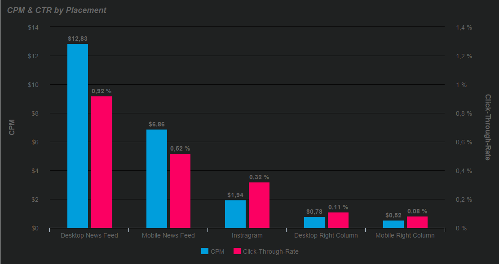

根据该公司的数据，每月有 15.9 亿人使用 Facebook，每天使用超过 10 亿人。这意味着超过 65% 的 Facebook 用户每天都登录，这意味着声称最大的社交媒体平台不再酷的说法明显被夸大了。有如此多的活跃用户渴望展示他们的兴趣、偏好、关系、位置等，Facebook 只想请求营销人员使用它来寻找潜在客户。今天，如果一个品牌想要受到重视，它必须好好照顾自己在 Facebook 的形象和广告活动。统计数据显示，Facebook 的广告收入不断增长，2015 年达到 42.99 亿美元，与仅 2 年前的 17.98 亿美元相比有了惊人的飞跃。

## 是什么让 Facebook 对营销人员如此有吸引力？

Facebook 允许品牌面对他们的受众，并与他们进行真正的互动。如果处理得当，可以产生品牌忠诚度，并更好地洞察客户的意见、需求和兴趣。研究证明，人们喜欢 Facebook 页面不仅是为了表明他们对某个品牌的支持，也是为了自己有所收获。他们希望获得定期更新、折扣、参加比赛或分享他们作为品牌用户的体验。如果公司努力使他们的品牌页面有吸引力，他们将以有效的广告活动的形式结出硕果。Facebook 允许营销人员获得有关喜欢他们页面的用户行为的详细信息，并针对他们量身定制活动。此外，Facebook 还在不断改进其广告平台并添加新功能，例如重新定位广告或通过相似的受众定位。其他重大改进是引入了黑帖 - 新闻推送式广告，也可以通过许多不同因素进行定向（例如，特定职位），并且只出现在目标客户的新闻推送上，而不会出现在公司的墙上。暗帖将显示给最有可能对其做出反应的人，并且在营销人员的网站上，允许进行 A/B 测试，即您可以向不同的受众群体发送不同的添加版本，看看什么版本效果最好。Facebook 营销人员已经知道，简单地设置广告并使用最广泛的网络进行投放是无效的。您需要深入了解您的细分受众群，并根据他们的兴趣投放广告。允许进行 A/B 测试，您可以在其中向不同的受众群体发送不同的添加版本，看看什么效果最好。Facebook 营销人员已经知道，简单地设置广告并使用最广泛的网络进行投放是无效的。您需要深入了解您的细分受众群，并根据他们的兴趣投放广告。

## 如何开始？

在[DataFocus](https://www.datapine.com)，我们多年来一直在努力实现有效的 Facebook 广告，在这篇博文中，我们与您分享 Facebook 广告指南以及您需要跟踪的最重要的 Facebook KPI。您可以从我们的经验中学习，而不会重蹈我们的覆辙。我们相信，与 Twitter 和 LinkedIn 相比，Facebook 拥有迄今为止最友好的用户界面，并提供最佳的目标选择。尤其是LinkedIn有很多限制，例如你不可能不费吹灰之力就排除移动流量或跟踪转化。考虑到这一点，我们决定继续使用Facebook的付费广告。我们还将向您展示如何优化您的广告以获得直接转化或所需操作，无论是注册时事通讯、下载白皮书还是开始免费试用。作为副作用，您很可能还会获得更多 Facebook 粉丝并看到更多用户的互动，但这不是这里的重点。这篇博文的重点是基于绩效的转化优化活动——或者正如 Facebook 所说的那样——“将人们发送到您的网站”活动。

我们将从设置您的第一个广告的一些一般性技巧开始，然后详细讨论您需要跟踪的 3 个 KPI 以优化您的绩效。请注意，我们将为 谷歌广告界面提供说明，但更高级的用户可能正在使用 Facebook 广告管理器。

## 1\. 设置您的受众：位置/年龄/性别/语言/兴趣

定位正确的受众是广告的第一步。如果您已经设置了自定义受众那就再好不过了，因为这些人最有可能转化为你的用户（例如，他们已经访问过您的网站）。然而，在上面的示例中，我们选择了一种更广泛的方法。我们的目标是美国 17万 名年龄在 24-50 岁之间、对“商业智能”感兴趣的说英语的用户。如果你没有像电子邮件列表这样的自定义受众，Facebook提供了广泛的其他目标选择，从特定兴趣、职位到更一般的“行为”。当然，您选择的定位选项将取决于您的行业和您经营的业务类型。一般来说，根据兴趣、行业中的相关主题、相关的其他 Facebook 页面（如新闻网站或拥有大量粉丝的社区），甚至是你的竞争对手（他们甚至永远不会知道）来锁定目标是一个好主意。因为Facebook 允许为一个受众组合多种兴趣，这样您就可以发挥创意并自行建立目标明确的受众。对于非常特定的（自定义）受众，值得开始一个只针对 3000 人的活动，因为高转化率的几率很高。但是，如果您选择更广泛的方法并按兴趣定位目标，我们建议您首先在您的受众中聚集至少 15.000 人，从长远来看，您应该着眼于找到超过 10万 名转化率高的人为目标。

## 2\. 设置您的预算和出价选项

我们个人建议您按展示次数（自动优化的CPM）为您的广告系列付费。您可能不习惯此选项，因为对于其他在线营销活动，例如 Google AdWords，我们通常按点击付费 (CPC)。但是，根据我们的经验，我们知道，与手动设置的最高点击价格相比，如果您按展示次数付费，那么通过针对性强且 CTR 优化的广告，您将获得更低的点击价格 (CPC)。您可以自己测试并分享您的经验，但每次点击付费的主要问题是，您并不能从效果非常好的广告（具有相当高的CTR）中获得太多好处。此外，如果您在最高出价的基础上降低太多，您将根本不会获得任何印象。

因此，就像上面的屏幕截图一样，从“优化广告投放”中选择印象选项（按印象付费），而不是 Facebook 推荐的“链接点击到您的网站”（按点击付费）。

此外，我们建议使用每日预算而不是终身预算来设置广告系列。每日预算将取决于您的受众规模。在我们的示例中，受众达 17万 人，如果每日预算为 100 欧元，Facebook 用户量估计每天将达到 14.000-37.000 人。一开始，我们将预算对应的 Facebook 用户量置于估计的中间值是可以的——因此我们每天将接触到17万人中的大约 2.5万人。如果您的活动计划持续数周，我们建议您设置每日预算，以覆盖每天大约 1/6 到 1/8 的受众。这样你可以确保你的广告频率不会上升太快，你的表现也会很稳定。

## 3\. 设置您的广告

下一步是设计您的广告。您应该牢记您期望观众做出什么样的行为，并选择具有匹配号召性用语的合适形式。Facebook 设置了一些你需要遵守的设计限制，这使其变得更加困难。首先，推荐的图片尺寸为 1.200 x 628 像素，即长宽比为 1.9:1。强烈建议一个包含号召性用语的按钮，具体取决于您希望观众做什么，例如注册新闻通讯或购买您的产品。还有一个经常会带来问题的限制——广告图片中文字的占比不得超过20%。您可以使用网格图像检查工具检查它，以确保您选择的图像能够通过 Facebook 的大门。

下一个要考虑的重点是选择广告的展示位置（展示位置选项）：

_1) 桌面新闻推送_\- 广告将显示在桌面计算机的新闻推送中，我们了解到在所有选项中具有最高的 CTR 和最高的 CPM

_2) 移动新闻推送_\- 广告将仅在手机上的新闻推送中显示

_3) 桌面_右栏 - 广告将显示在桌面电脑的右栏中

_4) 移动_右栏 - 广告将仅向移动用户显示在右栏中

_5) Instagram_ - 在Instagram上显示帖子的相对较新选项，即使您没有 Instagram 帐户，也可以显示

我们建议您不要在一个广告组中选择混合使用多个展示位置。首先，因为展示位置对可以添加的文本长度、标题、链接描述和图像尺寸有不同的要求。为了确保您拥有最好的广告，您必须为每个展示位置创建一个单独的广告组。其次，当您混合多个展示位置时，您就很难分析您的表现，因为每个展示位置在您要跟踪和优化的 KPI 方面都不同。

以下是为桌面新闻提要精心设计的广告示例：

我们从经验中知道，广告中的问题可以为点击率创造奇迹，因此选择它们而不是简单的陈述。此外，不要让广告听起来像推销的，而是信息丰富——这样的广告效果更好。我们使用不同的号召性用语按钮对进行了测试。“了解更多”按钮比“下载”或“注册”按钮表现得更好（即使我们的意图是让用户下载白皮书或注册免费试用）。我们建议您对尽可能多的广告进行 A/B 测试。通过对不同的文本、标题、图像、链接描述和行动号召按钮进行测试，您将了解到什么适合您的特定受众。

总而言之，在设置您的活动时，请记住根据深思熟虑的策略行事。首先找到合适的受众，针对这些用户投放特定且相关的广告，并始终确保人们在点击您的广告后会进入相关的登录页面。不要在您的广告中提及人们在登录页上找不到的内容，因为这样即使点击率很高，访问者也不会转化，您的钱也会白白浪费掉。

现在您的广告活动已经启动并开始运行，您可以开始使用合适的 Facebook KPI 衡量您的绩效。

## 您需要跟踪的前 3 个 Facebook KPI

重要的 KPI 会因行业、公司及其目标而异。然而，尽管行业与行业之间可能存在一些差异，并且 KPI 对企业的重要性存在一些差异，但所有公司都应该监控一些顶级 KPI。看看我们认为每个公司都应该考虑的三大类 Facebook KPI。我们使用我们的[在线数据分析工具](https://www.datafocus.ai/infos/data-analysis-tools)将它们可视化.

### 1\. 展示次数/覆盖率/频率

我们的第一个 Facebook KPI 考虑了展示次数、覆盖范围和频率。展示次数是指您的广告展示的频率，无论人们是否会点击它。一位用户可以多次看到同一个广告。

覆盖率是指能获得您的广告展示的总人数。标记展示次数可以超过覆盖面，因为用户可以多次看到同一个广告。我们也可以称达到独特的印象。

频率是展示次数除以覆盖率。这3个指标之间的关系如下图所示:

在上面的示例中，您可以看到 5 周后，我们以近 8 万次展示获得了大约 4 万名独立用户。因此，我们的频次得分几乎为 2。跟踪展示次数、覆盖面和频次至关重要，可以避免您的广告过于频繁地显示给一位用户的情况——这会导致性能下降，如下图所示：

一般来说，当您的广告播放频率达到2分时，您就应该更改您向受众展示的广告。此时，您将亲身体验到广告的点击率如何下降以及每次转化的成本如何增加。根据我们的经验，当你的广告中某个特定受众的广告频率达到4分时，即使您更改了广告，也很难转化这些用户，因为他们已经看过您公司的广告 4 次了。

### 2\. 千人成本 (CPM) 和点击率 (CTR)

下一个关键的 Facebook KPI 是指您的广告系列的成本。正如我们之前提到的，我们向您推荐按展示次数付费的方案。您自己会发现，不同受众群体的每千次展示费用会有很大差异。您应用的定位越详细，您达到的每千次展示费用就越高。当然，不同的展示位置的千人成本会有所不同。桌面新闻推送是迄今为止最昂贵的选择，千人成本在 2 到 25 美元之间。但是，您应该始终将 CPM 价格与 CTR 一起考虑，因为这两个因素最终将决定您的每次点击成本 (CPC)。除了像上面两个图表那样随着时间的推移跟踪您的每千次展示费用和每次点击成本外，建议按照我们在此图表上的方式去分析不同的展示位置选择：

此类分析将帮助您确定表现最佳的展示位置，并避免无用的展示位置。即使图表中的数据不具有代表性，您也可以看到不同放置选项之间的相似关系。

### 3\. 每次点击成本（网站点击）和每次转化成本

由于我们活动的主要目标是获得对我们网站的点击并将其转化为所需的操作（下载白皮书、注册免费试用等），因此每次点击的实际成本以及最终的每次转化成本是最重要的 Facebook KPI。在这些活动中，我们专注于网站点击率——而不是 Facebook 页面的点击率、页面的点赞、帖子点赞或分享。在其他目标不同的活动中（例如页面参与度），这些互动都是我们的预期结果。需要提醒的是，在设置个人转化跟踪之前，您不能做 Facebook 广告。

最后，每次点击费用（CPC）主要受您的定位、展示位置和点击率的影响，而点击率又主要受您的广告适合特定受众和当前频率的影响。另一方面，每次转化成本主要受您的每次点击成本和登录页的转化率的影响。

上图的图表分析了不同的每次点击成本、转化率以及根据不同的放置选项产生的每次转化成本。请注意，桌面新闻推送的 CPM 是迄今为止最昂贵的，但最终由于其高 点击率（CTR） 和转化率，它达到了最小的每次转化成本，这才是最重要的。

当您将桌面展示位置与右边栏展示位置进行比较时，似乎右边栏展示位置的CPC（每次点击费用）要低得多，但要小心 ，从那里转换用户会更加困难。但是，如果您考虑到用户点击您的右栏广告时会看到一张带有短标题（25 个标志）和包含 90 个标志的短文本的图片，这似乎并不令人惊讶。另一方面，在动态新闻广告中，您可以向观众展示更大、更高质量的图片、合适的号召性用语按钮以及带有 200 多个标志的链接描述，您可以在其中更详细地解释他们点击您的广告后可以看到什么。

在这个阶段，如果您可以详细监控和分析每次转化的成本，您就可以将它们与其他社交媒体平台甚至其他在线营销渠道（例如 Google Adwords）进行比较。最后，专注于表现最佳的渠道并充分利用您的营销预算！

[正如我们在关于最重要的谷歌分析 KPI](https://www.datafocus.ai/infos/kpi-examples-and-templates-google-analytics)的文章中已经提到的那样，这还不是您的分析之旅的终点。通过跟踪转化带来的收益（这显然不是最简单的任务），您可以计算每次转化的利润和投资回报率。

我们在这篇博文中展示和解释的 Facebook 广告数据分析只是我们[在线 BI 工具](https://www.datafocus.ai/infos/online-bi-tools)功能的一小部分。详细了解 DataFocus如何将您的 Facebook 广告提升到一个新的水平 - 立即开始[免费试用](https://www.datafocus.ai/console/)！
