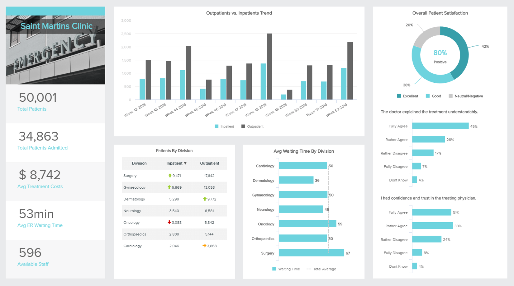
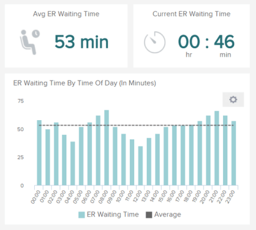

## 医疗保健 - 触及每个人的行业

医疗保健商业智能是收集来自医疗保健行业的大规模数据，并将其提炼成 4 个关键医疗保健领域的可操作见解的过程：成本、药品、临床数据和患者行为。如果世界上有一个行业可以触及所有人，那就是医疗保健行业。凭借拯救生命的力量，这个行业必须持续走向卓越。这意味着要不断努力取得进步，削减成本，改进药物、患者护理、研究和教育。由 DataFocus 等医疗保健分析软件收集的这些信息提供了宝贵的洞察力，这些见解在其他情况下是不可获得的，不仅可以提高行业的性能，还可以挽救生命。

“我们惊讶地发现，使用 DataFocus 非常容易，在几分钟内获得第一个 KPI 是多么容易。普通的 Excel 用户在IT开销为零的情况下配置和使用 DataFocus。”——塞巴斯蒂安·迪默

## 简化医疗保健 BI

人们的生命太重要了，不能接受平庸的医疗和只有适度的改善。在现代[医疗保健仪表板](https://www.datafocus.ai/infos/dashboard-examples-and-templates-healthcare)和医疗保健分析的帮助下，两者都可以推断出潜在的求救信息，并且必须不断监控和跟踪。

- 跟上影响利润的势在必行的全行业变化
- 避免因等待时间过长而损害医患关系
- 认识并平衡患者和医务人员的需求
- 优化患者护理和收入流
- 在现实生活中利用实时数据

## 在医疗保健中利用商业智能

医疗保健中的 BI 可确保更好的临床表现，相应的患者治疗效果也更好。分析工具和 BI 在文书、财务和最重要的方面减轻错误对患者健康的影响；避免再入院和误诊。它可以降低运营成本，同时在不影响患者安全和医务人员满意度的情况下提供更高质量的服务。

用于医疗保健的现代商业智能软件鼓励透明文化、提高绩效、问责制和保护医疗机构本身。它有助于准确预测对服务和劳动力供应的需求，并且在无法预料的意外情况下进行规划。医疗保健分析软件使您能够进行全面的患者分析，为医生提供强有力的见解，并最终改善患者护理。此外，它改进了数据管理和共享，减少了不治疗患者或确保他们的健康和满意度的时间。总而言之，分析保证了更好的最终结果：安全和健康的患者。

## 什么是医疗保健分析软件？

医疗保健分析软件是一个术语，用于描述数据集合，以帮助管理人员通过使用医疗保健分析工具来提高医院和医疗保健服务的运营绩效、临床结果、整体效率和质量。为了成功执行和改善患者护理，医院必须负责从医院管理、成本、诊断和患者记录等广泛的洞察力。医疗保健中的所有[大数据都](https://www.datafocus.ai/infos/big-data-examples-in-healthcare)必须以最谨慎的方式处理，尊重患者的隐私和敏感信息。

[通过使用医疗保健分析软件，并通过选择正确的医疗保健指标](https://www.datafocus.ai/infos/kpi-examples-and-templates-healthcare)，可以创建稳定的数据管理环境，并同时提高员工工作效率和患者的满意度，可以轻松地组织和处理无休止的文书工作。为了做到这一点，专业人员应该利用可以连接各种数据源的医疗保健分析工具，并提供一个稳定的管理环境，让患者、医生、护士、家庭和涉及危急情况的每个人都感到安全。也就是说，由于机器学习能力和智能预测，用于医疗保健的商业智能软件可以利用数据来预测医院每天和每小时预计接收多少患者。

## 商业智能在医疗保健中的好处

使用医疗数据分析软件有很多方法和好处，这些只是值得一提的部分：

- **财务规划：**分配资金可以帮助财务经理和员工更有效地完成工作，减少欺诈活动和支付问题的可能性。自动化数据库系统和智能数据警报可以实现财务部门的最大透明度，并使管理员能够创建一个高效的分析环境。为了使医疗保健组织最有效地处理运营、财务、患者护理和临床实践，他们必须实施医疗保健分析解决方案，使他们能够充分利用其分析能力并应对行业内的核心挑战。
- **评估性能：**医疗保健 BI 软件可以轻松跟踪医院的活动，并根据不被注意的运营效率低下的情况生成分析。在仔细考虑收集到的数据后，可以采取具体行动，以降低成本。据《美国新闻与世界报道》报道，南卡罗来纳州的一家医院发现，只需提前半天让病人出院，他们每年就可以节省近 50 万美元。
- **患者满意度：** 我们已经确定了提高患者满意度水平的重要性。将分析与正确的软件相结合，不仅可以让管理员更轻松地处理日常任务，还可以保持更新的患者记录，提醒患者根据自己的情况保持健康的生活方式，并减少重复性医疗任务。
- **协调沟通：**患者经常需要来自不同专家的会诊，因为专家繁忙的日程可能会造成沟通过程中的差距，导致他们之间缺乏信息共享。通过使用医疗保健分析软件，可以随时随地查看患者的数据、当前进展和病史，只需连接互联网即可。因此，每个处理案件的人都可以在他们的指尖上获得更新的信息，以及实时数据。通过快速处理关键患者的数据，可以显著减少再入院，并改善医疗案例的协调。
- **管理声誉：**医疗保健行业需要敏捷、快速、响应迅速和交互式的医疗保健 BI 软件，以最大限度地发挥其数据的价值并支持关键决策领域。能够准确分析与新患者获取、患者安全、再入院、医院获得状况和患者推荐意愿相关的数据，可以推动所有部门的绩效。基本上，医疗保健中的商业智能允许组织在患者和临床护理方面建立声誉，建立基于洞察力的坚实基础，更好地解决患者问题，并推动所有部门的协作。
- **预测未来：**借助高级分析，业务问题已经从“发生了什么”演变为“为什么”和“未来会发生什么”。它们赋予医疗机构提出关于未来的重要问题的权力，而不仅仅是依靠历史数据来为他们的决策提供信息——而这得益于商业智能在医疗保健中的应用。有远见使医疗保健管理人员能够采取预防措施，积极主动地为患者提供最佳护理，并确保其设施的所有级别和要素都能够有效地提供高质量的治疗。
- **支持和改进决策：**医疗保健管理者面临与系统操作、设备和设施、诊断、患者和临床护理以及医生实践相关的特定问题，所有这些都需要有效的协调。医疗保健组织需要医院商业智能软件的支持，来应对设施管理的复杂性。此外，先进的分析能力对于解决关键挑战和连接患者、临床和运营数据是必要的。医疗保健中的 BI 允许管理员跟踪关键绩效指标 (KPI)，这些指标可以分析、管理和帮助医疗保健组织根据准确的数据和基于分析的见解调整其性能。
- **数据可视化：**数据可视化是为医疗保健解决方案选择正确商业智能的关键组成部分，无论是您的机构还是组织。当 BI 用户可以轻松了解医疗保健信息、应用洞察力解决风险、预测未来事件并回答护理、管理和运营的重要领域时，成功应用基于分析的洞察力的机会就会增加。医疗保健领域的大量大数据示例每天都在说明这一点。提供更好的临床护理、改善人员分布、减少再入院和管理费用需要商业智能医疗保健应用程序。医疗保健的真正价值在于根据经过充分分析的数据为患者提供最佳护理水平。

利用医疗保健 BI 工具是医疗保健行业发展过程的一部分，它将使医院和其他组织能够在护理和管理的所有要素中建立最佳实践。随着数据源数量的不断增加和医疗保健组织内生成的数据的复杂性，对支持决策能力的高级分析的需求也在增长。医院和其他组织需要预测建模、[在线数据可视化](https://www.datafocus.ai/infos/data-visualization-tools)和现代医疗保健商业智能软件应用程序，以深入了解有关患者护理和满意度、劳动力分配、临床操作、医生和护士的日常实践以及行政和管理的见解。

只有通过全面、先进的 BI 软件获得的数据衍生洞察力的智能应用，才能在所有部门提升护理水平，并成为以价值为基础的组织。

## 医疗保健分析工具的作用是什么？

在过去的十年中，医疗保健组织投入了数百万美元来创建管理任务和活动的军队，其目标是做出更好的决策和改善患者的结果，但结果并没有提高效率。分析过程没有改进技术来对整个医疗保健系统产生更快、更安全和更有成效的影响，并确保成本效益和健康的结果。越来越多的数据被收集起来，由于人口老龄化或缺乏合格的医生、护士和护理人员等因素，越来越多的患者需要护理。这些趋势持续增长，医疗保健分析工具帮助系统整合和管理每家医院在当今数字时代面临的运营和战略决策。

预测分析、人工智能和机器学习等新兴技术正在改变医疗保健模式，并直接影响我们的生活。获得医疗保健设施是人类的一项基本需求。然而，医疗保健行业的成本是世界上最昂贵的行业之一，无论是私营还是公营。在这种情况下，分析如何提高效率？通过实施可以影响整个过程的医疗保健分析软件。
