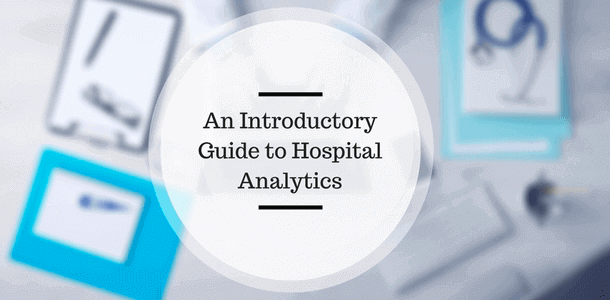

_“在有数据之前就下结论是一个大错误。” 夏洛克·福尔摩斯_

数据分析的兴起在很大程度上改变了我们看待世界的方式。我们不再需要在黑暗中摸索以做出明智的决定。现代世界拥有丰富的数据，这些数据提供了比我们十年前所能想象到的更深入的洞察。事实上，全球有600 万开发人员目前正在研究大数据和高级分析。更重要的是，到 2020 年，地球上的每个人每秒将产生 1.7 兆字节的数据。

现在，从数据分析的采用中受益匪浅的领域之一是医疗保健行业——我们特备提到了医院。数据的智能使用不仅可以使医院的运营更加经济高效，而且还可以帮助患者护理和挽救生命。在深入研究之前，让我们先考虑一些事情。

## 医院分析意味着什么？

作为医疗保健领域商业智能的一个分支，医院分析是一个术语，根据从医疗保健部门的以下四个主要领域收集的数据进行的分析活动：

- 索赔和费用数据
- 与制药和研发相关的数据
- 从持续的患者护理、电子医疗记录 (EHR) 和试验中收集的临床数据
- 关键的患者行为和情绪数据

虽然医疗保健涵盖范围广泛，但医院是重中之重，因为它们的高容量和高功能的性质。而且，无论你怎么看，这些医疗机构每天都在处理生死攸关的问题。

如果医院使用[医疗保健分析软件](https://www.datafocus.ai/infos/healthcare-analytics)，让日常运行的每一个要素都更具预测性、更直观、更高效，那么好处将是无穷无尽的。

让我们看看医疗机构可​​以通过哪些方式来利用这些指标。

## 医院分析如何用于显着增强

底线是：这些指标可以用于降低成本和改善护理协调。更具体地说，对获得的数据进行智能使用，可以显著提高医院提供的服务水平:

**降低行政成本**

位于马萨诸塞州安多弗的 Dynamics Research Corporation 的顾问 George Zachariah 在接受医疗 IT 新闻采访时谈到了这个问题。他解释说，降低管理成本确实是该行业最大的挑战之一。事实上，“所有医疗预算支出的四分之一都用于行政管理成本，这并不奇怪，因为您需要人力资源来执行。” 通过收集和研究与从餐饮到药品等各个领域与医院日常支出相关的指标，数据分析师可以帮助过度紧张的医疗机构简化预算流程，并在安全且合乎道德的情况下进行削减或替代。

**撤销欺诈行为**

通过跟踪欺诈性付款，再加上个别患者的病史，将有可能减少在处理此类情况时浪费的时间和金钱。但是，为了有效地做到这一点，不仅要使用正确的分析工具，还要更深入地了解它是如何工作的，从而获得最佳解决方案。

**增强护理协调**

通常，医院系统和 IT 基础设施可能会脱节，导致延误、效率低下和错误，进而对患者造成不利的影响。通过使用有针对性的指标和洞察力来发现内部基础设施中的漏洞，并帮助使这些系统更开放、更流畅和更具交流性，以确保快速准确地共享医疗记录、患者数据和任何其他关键信息。通过正确的分析和正确的发展，这种方法可以确保全国乃至全世界的医院和医疗机构能够共享患者的重要信息。

**改善患者健康**

医院数据分析可以帮助医院根据患者的病史和生物统计数据来维持健康的生活方式，从而提供患者个人层面的信息。这不仅是一种有价值的患者善后护理方式，也是一种有助于防止大量患者再次入院的关键措施。

**医院预测分析**

通过了解历史和实时洞察并采取行动，医院预测分析有可能在问题出现之前帮助在所有关键领域进行改善，并帮助在患者发生潜在的致命医疗问题之前发现它们。与[医疗保健中的大数据一起](https://www.datafocus.ai/infos/big-data-examples-in-healthcare)，这可能是我们目前可用的医院数据分析最强大的用途之一。

## 您可以使用的医院分析指标

当谈到有价值的医院分析时，有许多指标或 KPI（关键绩效指标）可以帮助提高医疗机构的整体效率。要全面了解这些无价的指标，您可以查看我们关于 [医疗保健商业智能](https://www.datafocus.ai/infos/business-intelligence-in-healthcare)的完整文章。

为了让您更深入地了解正在实际的数据，以下是两个主要基于 KPI 的仪表板：

### 医院 KPI 仪表板

数据截图：DataFocus（数据已脱敏）

**使用的主要 KPI：**

- **治疗费用：**一种货币管理 KPI，可帮助计算患者向医院支付的费用金额。
- **ER 等待时间：**急诊室等待时间衡量从患者到达 ER 到他们亲自去看医生的时间差。应该随着时间的推移密切监控该指标，以发现趋势并消除等待时间中的异常峰值。
- **患者等待时间：**患者必须等待治疗或咨询的时间是患者满意度的最大因素。该 KPI 衡量患者从注册到治疗必须等待的平均时间长度。当然，等待时间越短越好。

**概述：**

正如您已经收集到的那样，在医疗保健领域有大量数据需要收集、量化和整理，而当这些数据来自许多不同的部门时，一些见解会在混合中丢失，无法得到充分利用。

这个集中的医院仪表板帮助您识别随着时间推移出现的趋势，从而高效地管理您的机构，使您能够调整您执行关键任务和分配资源的方式。

医院仪表板提供了一个易于理解的全局视图，您在尝试以安全、可靠和成功的方式运行这样一个复杂机构时，需要这种视图。

上面的特定示例旨在提供基本数据的有机视图，并提供有关设施如何运作的全局见解。此仪表板旨在帮助高层管理人员和经理做出最明智的决策 - 正如您所看到的，这里提到了一些 KPI 特性。

### 医院绩效仪表板

数据截图：DataFocus（数据已脱敏）

**使用的主要 KPI：**

- **平均住院时间：**对住院患者平均所花费时间的一般测量。
- **再入院率：**医院再入院率显示出院后短时间内返回医院的患者数量。这个特殊的 KPI 提出了对所提供的护理水平以及如何改进的绝佳洞察。
- **按付款人划分的治疗成本：**一种评估不同年龄段之间成本分布的指标，由付款人评估涵盖患者护理的医疗保健提供者的成本。通过了解这一点，您还可以深入了解患者的整体满意度。

**概述：**

医院绩效仪表板利用上述平均住院时间、医院再入院率和按付款人划分的治疗成本来定义目标，并在一个易于导航的空间中提供对预期结果的洞察。

使用这样的仪表板将帮助您在临床水平以及运营和财务层面上加强努力。此外，这些特定指标将帮助您了解，如果该机构在某些领域表现不佳，应采取哪些行动，正如我们所知，这在某些情况下可能意味着生死。

要了解关于我们定制的医院仪表板的更多信息，请查看我们的[医疗保健仪表板模板](https://www.datafocus.ai/infos/dashboard-examples-and-templates-healthcare)。

### 快速案例研究：受益于医院分析的医疗机构

根据《医疗数据管理》杂志的一项研究，这是现代医疗机构受益于医疗保健和医院数据分析的三个光辉例子。

**匹兹堡大学医学中心和癌症研究中心**

作为美国领先的医疗机构之一，匹兹堡大学医学中心已经找到了收集、吸收和分析曾经难以获取和整合的独立数据源的新方法。这些努力大大加强了该研究所的癌症研究工作。

**ICU护理和预测分析**

近年来，这家著名的医疗机构开始将实时数据输入到定制应用程序中，该应用程序可以深入了解其重症监护病房的患者风险水平，帮助预防潜在问题并了解如何进行重大改进。

**倡导健康和护理质量**

Advocate Health 与 Cerner 合作，于 2015 年开发了分析工具，该工具托管在供应商基于云的人群健康管理软件平台上，以提高其患者护理水平，以及其遗传性癌症检测服务。

## 数据：医疗保健的未来

数据具有改变世界的力量——就在我们说话的时候，它已经在这样做了。通过从各种来源收集数据，了解基于医疗保健的 KPI，并使用这些发现在整个组织内做出重大改进，您的医院有可能提高 100% 的效率，从而成倍地改善员工和患者的生活。这是绝对必要的。

要了解有关 BI 软件如何帮助您的机构的更多信息，您可以轻松开始30天[免费试用](https://www.datafocus.ai/console)，或与我们联系 - 我们期待您的回音。
