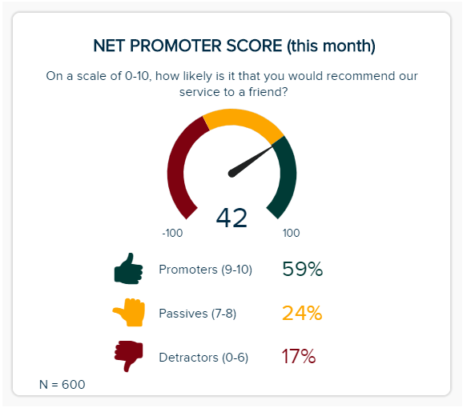
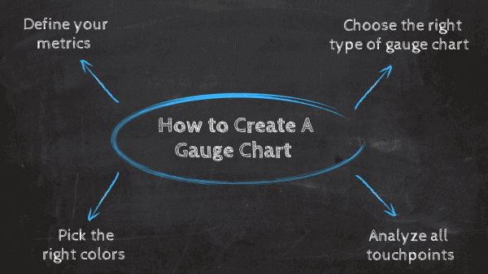
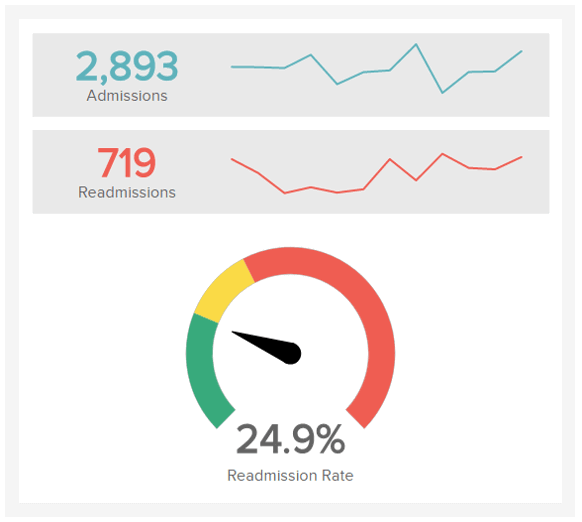
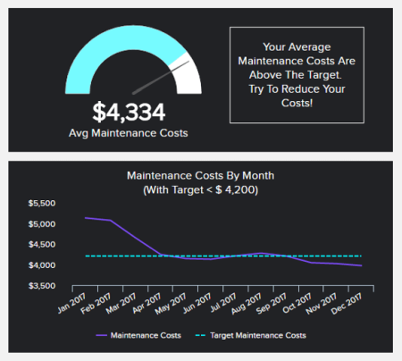

数据可视化是成功[进行数据分析](https://www.datafocus.ai/infos/data-analysis-methods-and-techniques)的基本步骤。通过为您的信息提供一个可视化的背景，您可以使其更易于理解，并为确定趋势、模式或问题做好准备。

有许多可用的图表类型，每一种都在专业的[BI 仪表板](https://www.datafocus.ai/infos/bi-dashboard-best-practices)中扮演着重要的角色。为了选择最佳的可视化组合，您需要准确地知道您想用数据讲述什么故事，以及最适合这样做的可视化工具。在这篇文章中，我们将向您介绍一种最直接的数据可视化类型，即仪表图。

如果您有兴趣了解这种类型的图表如何促进您的数据叙述，那么您就来对地方了。这份完整的指南将涵盖仪表图的各个方面，从定义、优势、创建它们的步骤，以及一系列帮助您可视化此图表类型在实际业务场景中的工作方式的实际示例列表。

让我们深入了解它的定义！

## 什么是仪表图？

仪表图是一种数据可视化类型，通常用于显示具有定量上下文的单个数据值。该图表的形状类似于速度计，旨在跟踪 KPI 与设定目标或其他时间段相比的进度。

该图表的优势在于它很容易解释。它使用各种颜色将刻度划分为代表同一度量的不同值的段，并使用一根针指向枢轴点上方的某个值。在大多数情况下，这些颜色通常显示显示的数据的最大值、中值和最小值，以便根据趋势快速可视化其性能。

仪表图是适合[执行仪表板](https://www.datafocus.ai/infos/executive-dashboards-and-reports)的图表。事实证明，它在数据的预期价值已知的情况下特别有用，这样业务部门、经理或员工只需查看图表即可轻松了解他们在该特定指标方面的立场。

## 使用仪表图的好处

仪表图是一种非常有效的图表，可以快速有效地吸引用户的注意。为了更好地理解这种可视化的力量，我们为您提供了一些主要的业务优势：

- **易于创建：**这种图表类型主要用于每次显示一个指标，这使它成为一种简单的可视化。使用正确的[在线数据可视化工具](https://www.datafocus.ai/infos/data-visualization-tools)，您只需点击几下即可创建专业图表。我们将在这篇文章中更深入地探讨这一点。
- **用户友好：**仪表图受欢迎的一个方面是人们通常熟悉它，因为它类似于汽车速度计或温度指示器。这使它成为显示性能指标并将它们展示给能够轻松理解图表中显示的值的非技术人员的绝佳图表。
- **易于解释：**遵循此类图表的用户友好界面，它们是非常容易理解的。颜色的顺序，通常从绿色到红色，使它们直观且易于理解。业务主管使用它们是因为它们能够简单而清晰地传输重要的度量标准。

## 何时使用仪表图

由于仪表图很容易创建和理解，因此可以应用于许多业务场景。但是，重要的是要考虑到，由于这种类型的可视化主要用于显示单个值，因此如果您想从数据中提取更深入的见解，它们并不是最佳选择。出于这个原因，确定您的企业可以从这种图表类型中受益的最佳场景非常重要，我们在这里告诉您一些：

- **对于渐进式信息：**如果您有一个线性指标并且想要显示它是如何变化的，那么仪表图就是最好的方法。您可以基于时间段监控指标，以了解值是如何随时间变化的，并查看您是否实现了最初的目标。您还可以将不同的时期（例如一年）的性能进行比较，看看是否有任何改进。
- **对于目标指标：**此图表的另一个流行用途是目标指标。在此上下文中使用它们将帮助您了解基于预定义目标的特定 KPI 的性能。例如，如果您想根据目标可视化跟踪特定时期内总收入的[销售 KPI](https://www.datafocus.ai/infos/kpi-examples-and-templates-sales)，则仪表图可以轻松显示在特定时间段之前已实现目标的百分比。
- **对于项目进度或截止日期：**跟踪项目进度或截止日期的仪表图在[业务仪表板](https://www.datafocus.ai/infos/dashboard-examples-and-templates)中起着重要作用。该图表用于此特定场景，通过获取项目中涉及的所有任务和截止日期，并以百分比的形式反映它们，以了解您是否延迟还是提前满足项目的截止日期并完成项目。
- **比较两个数据集：**这种可视化的另一个流行用途是比较两个数据集。这可以在同一个图表中使用多个指针来区分两个值的性能，也可以通过使用两个不同的图表来完成，这些图表显示相同的值和不同的基准。例如，您可以将一个月的收入与基于年度目标的总收入进行比较。通过这种方式，您可以了解每个月对最终目标的贡献度。

## 如何创建仪表图

到目前为止，我们已经介绍了仪表图的定义，以及您的企业可以利用它们的一些好处和场景。现在是时候开始考虑创建一个成功的仪表图的重要步骤，这将有利于您的数据讲述过程。

### 1\. 定义你的指标

第一步是定义您想要可视化的指标。正如上述提到的，由于两表的简单性质，没有上下文，就无法理解它，如果您想从数据中提取更深入的见解，它是没有用的。[此外，它们比业务 KPI 仪表板](https://www.datafocus.ai/infos/best-kpi-dashboard-examples)中的平均数字图表占用更多空间，因此在选择要使用此类图表可视化的指标时，您需要小心谨慎。确保您选择不复杂或不广泛的 KPI，坚持使用可为您的整体报告带来额外价值的绩效指标。

在定义了您将使用的指标之后，您需要提出一个尺度来定义衡量数据值如何随时间变化的范围。该范围可以是最大值，也可以分为低、中、高性能的阈值。这通常使用红色、黄色和绿色来表示积极或消极的结果。

### 2\. 选择正确的图表类型

仪表图有不同的形状和形式，具体取决于您要表示的指标类型。我们已经提到了您的企业可以从这种类型的可视化中受益的不同场景。出于这个原因，在您选择[KPI 指标](https://www.datafocus.ai/infos/kpi-examples-and-templates)后，您将看到您需要为它们选择最佳类型的仪表图。在这里，我们为您提供 3 种常用类型的快速定义：

- **车速表：**最流行的类型之一是车速表。它的名字来源于测量汽车速度的图表，由于它的圆形形状，如果你想比较一个更长的度量范围，它经常被使用。这种类型的仪表图可以使用一个或多个指针来指向基于目标或基准的某个值。
- **线性仪表图：**线性图表用于在线性刻度上指示数据值。这些值通常显示在垂直或水平条中，用颜色区分数据范围，以指针指示刻度上的数据值。
- **角度仪表图：**角度仪表图与车速表相同，但它只显示一半的圆圈。它通常用于显示有限的范围，或者当您想要基于积极或消极结果可视化指标的性能时。

### 3.选择正确的颜色

事实一再证明，人类更容易接受视觉形式的新信息。事实上，研究表明，人类大脑处理视觉的速度比文本或数字快 60.000 倍。这是因为视觉效果更直观，更有可能在您的记忆中停留更长时间。

这使得为​​仪表图选择颜色成为设计过程中的一个基本步骤。正如我们所说的，这种类型的图表通常用于显示性能指标，因此颜色通常与差、满意和好的结果相关联。例如，绿色总是与优秀或高性能相关联，黄色可能意味着平均或正常，红色可能意味着令人震惊或糟糕的结果。

另一方面，如果您使用的仪表图只是为了显示指标的进度，则需要确保选择一种赏心悦目的颜色，但仍会弹出并突出显示图表。

### 4.使用专业工具

我们帮助您创建成功的仪表图的最后一个技巧是使用一种工具，它会帮助您轻松有效地创建专业的商业图表。由于这种类型的图表需要放置在业务仪表板上时表现更好，因此使用 excel 创建它们可能不是最明智或最快的选择。相反，您应该投资一种工具，让您可以自由地创建具有不同颜色和形状的图表，使您的数据能够讲述自己的故事。

DataFocus是一款[商业智能软件](https://www.datafocus.ai/infos/best-bi-tools-software-review-list)，提供交互式和用户友好的仪表板创建器。由于其搜索功能，您只需单击几下即可创建专业的仪表图。此外，[仪表板工具](https://www.datafocus.ai/infos/online-dashboard)使您可以完全控制可视化的设计，这样您就可以选择图表的大小和颜色，以便它们可以匹配您的品牌标识，并补充您的其他指标以进行进一步分析。

## 前 6 个仪表图示例

在本指南的最后部分，我们为您提供了一个包含 6 个不同业务环境中的仪表图示例列表，这些示例将帮助您直观地了解您的组织如何从这种强大的图表类型中受益。

### 1\. 销售目标增长

我们的第一个仪表图示例是衡量销售目标和增长的高级营销 KPI。正如我们之前提到的，这种类型的图表可用于在不同的基准上比较相同的值。在此示例中，我们可以看到两个指标，它们将销售业绩与上个月以及设定的目标进行比较。通过每月跟踪这些指标并设定现实的销售目标，企业可以确保稳定的增长和可行的收入。

### 2\. 再入院率

我们的下一个示例是医院再入院率，这是要跟踪的最重要的[医疗保健 KPI之一。](https://www.datafocus.ai/infos/kpi-examples-and-templates-healthcare)该指标旨在监测患者出院后短时间内返回医院的百分比。仪表图在这里很有用，因为它可以让医院管理人员快速了解再入院率是高还是低。值得注意的是，仅凭此图表无法就再入院率为何高得出进一步的结论。为了获得这些信息，有必要深入挖掘其他方面，如医院管理、可用材料、员工素质等。

### 3.维护费用

此[制造 KPI](https://www.datafocus.ai/infos/kpi-examples-and-templates-manufacturing)旨在监控企业的维护成本。此处的图表可作为一种警报，让用户快速了解成本的变化情况。在这种情况下，我们看到一条消息说维护成本高于平均水平，这意味着需要采取进一步措施以避免预算问题。通过跟踪这一指标，您可以确保随着时间的推移优化您的成本，并为您的设备的其他未来投资节省资金。

### 4、毛利率

毛利率是包含在专业[财务仪表板](https://www.datafocus.ai/infos/dashboard-examples-and-templates-finance)中的关键指标。此 KPI 旨在跟踪总收入减去已售商品或交付服务的成本，然后将其除以总销售收入。简而言之，这个指标显示了在计入与生产和劳动力相关的所有成本后，您可以保留的总销售收入的百分比。通过跟踪毛利率，您可以了解您公司的生产效率如何，更高的毛利润意味着更高的收入。在这种情况下，仪表图的目的就是：通过查看这个百分比，业务主管可以第一眼了解公司的财务状况。

### 5\. 净推荐值

我们的下一个示例是跟踪净推荐值的[客户服务 KPI 。](https://www.datafocus.ai/infos/kpi-examples-and-templates-customer-service)该指标是[客户服务报告](https://www.datafocus.ai/infos/customer-service-reports)的重要指标，因为它旨在评估客户忠诚度和满意度。在这种情况下，图表将结果显示为一个简单的问题：从 0 到 10 ，他们推荐该品牌的可能性有多大。结果以速度计形状显示，其中指针指向当前 NPS 分数。与此配对，绿色代表 40-100 的目标范围，这意味着净推荐值为正，黄色代表中等得分，红色代表低于 -20 的负NPS。

### 6\. 整体项目进度 IT

正如我们之前提到的，仪表图的一个流行用例是跟踪项目进度。该指标旨在根据需要完成所有工作的目标日期来监控项目的完成进度。通过查看此图表，团队中的任何人都可以了解日程安排是否按计划进行。在这种类型的场景中也可以使用颜色，例如，如果项目轻微延迟，可以使用黄色，如果项目严重延迟，则可以使用红色。

## 仪表图的关键要点

当读到本实用指南的结尾时，我们希望您能更清楚仪表图如何为您的[数据讲述](https://www.datafocus.ai/infos/data-storytelling-examples-with-data-visualization)增加额外价值。我们介绍了它的主要好处，看到了一些关于如何使用和构建它们的技巧，并为您提供了一些高质量的真实业务示例，您可以在其中应用这种类型的可视化。

请记住，为了从您的指标中提取可操作的见解，您的数据需要讲述一个故事。您的仪表板需要尽可能多地具有交互性和完整性，并具有多种可视化组合，使您组织中的任何人都可以使用数据。如果没有其他指标来查看整体情况，单独的仪表图将一事无成。

如果您准备在专业[仪表板软件](https://www.datafocus.ai/infos/best-dashboard-software-features)的帮助下开始创建令人惊叹的仪表图，那么可以试用我们的30[天免费试用版](https://www.datafocus.ai/console/)，并从今天开始从高质量的数据可视化中受益！
