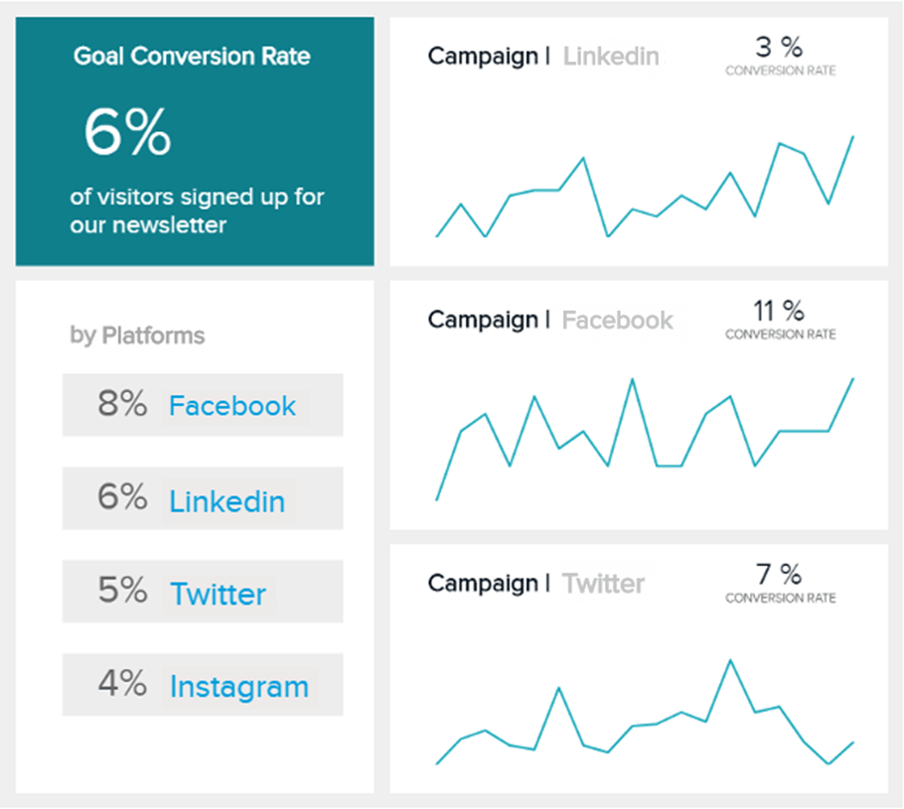
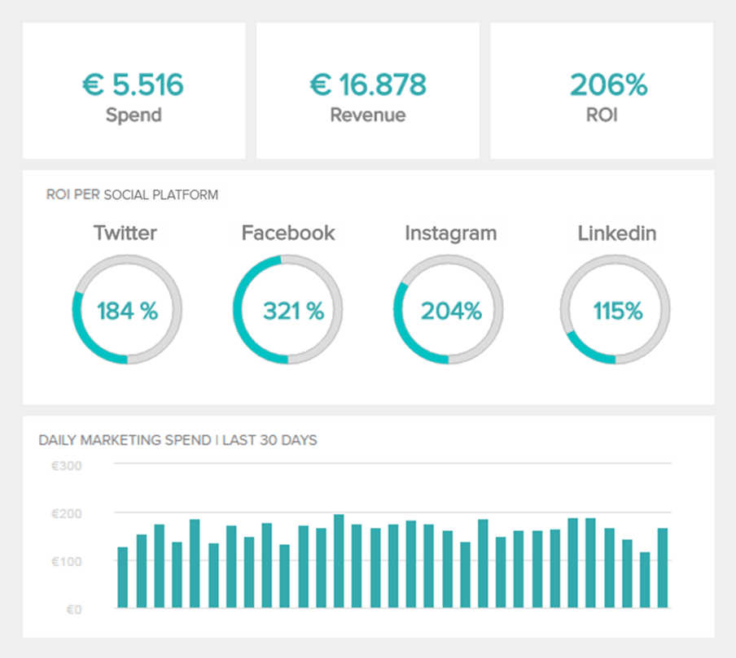
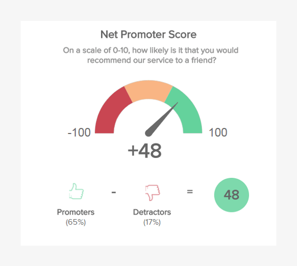
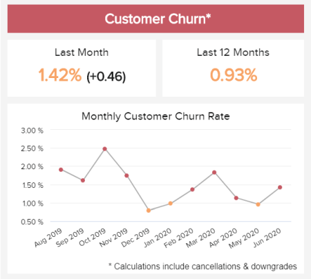
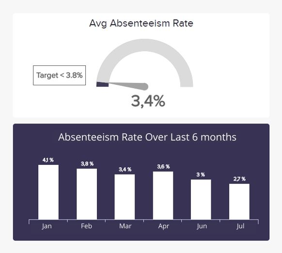
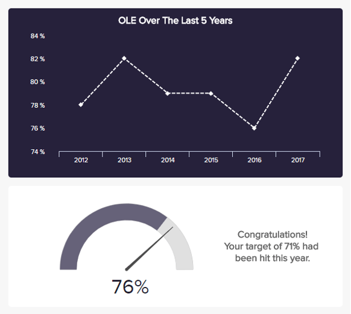

数据分析被隔离给拥有必要资源的大企业进行分析的时代早已一去不复返了。今天，由于[自助式 BI](https://www.datafocus.ai/infos/self-service-bi-tools)工具的兴起，分析的大门已经向更广泛的受众敞开。也就是说，这种可访问性水平已经将数据的使用从一种选择变成了对于想要成功的企业的强制性做法，无论其规模如何。数据分析进入小型企业仪表板和指标。

由于实时访问数据，[BI 仪表板工具为小型企业提供了有关其运营的宝贵见解。](https://www.datafocus.ai/infos/bi-dashboard-tools)对他们来说，了解组织内部正在发生的事情对于取得成功并从竞争对手中脱颖而出至关重要，而小型企业 KPI 和仪表板使他们能够做到这一点。你怎么想呢？在这里，我们将告诉您有关该主题需要了解的所有信息。从定义开始。

## 什么是小型企业仪表板？

小型企业仪表板是一种一体化分析工具，可实时访问与营销、财务、客户等相关的各种 KPI。在数据可视化的支持下，小型企业可以使用它们来跟踪绩效并确保稳定增长。

运营一个成功的组织需要处理各个部门的运营和战略方面问题，包括销售、财务、人力资源和营销等。为了有效地做到这一点，有必要收集数据并做出能够推动增长和盈利的决策。由于仪表板的交互性，这一切皆有可能。

现代[仪表板软件](https://www.datafocus.ai/infos/best-dashboard-software-features)技术以数据可视化为基础，使其易于管理和理解。借助正确的图表，小型企业所有者能够掌握任何发展情况，并与团队分享。它通过为最重要的数据源提供集中的位置来实现这一点，为所有者提供必要的信息以实时做出明智的战略决策。

## 什么是小型企业指标？

小型企业度量是对不同活动和公司目标的进展提供洞察的绩效衡量指标。通过在现代仪表板中一起跟踪所有 KPI，企业可以发现趋势和改进机会以实现持续增长。

虽然您可能认为小公司的指标看起来与大公司的指标大不相同，但事实并非如此。无论组织规模如何，指标和 KPI 都有相同的目的：根据其主要战略目标转换业务的进度和绩效。

也就是说，没有一套适用于所有小型企业的预定义 KPI，因为这将完全取决于行业、组织目标、资源等等。要选择正确的方法，需要投入时间和精力，分析组织的内部运作，绝不能只依靠直觉。为了让您开始了解该话题，您可以查看我们关于[KPI 与指标](https://www.datafocus.ai/infos/kpis-vs-metrics-differences)的文章。现在，让我们深入了解这篇文章的下一部分。

## 为什么需要小型企业 KPI 仪表板？

作为一名企业家，你要确保你在企业成功和发展过程中所投入的资金和人力资源得到最大的利用。基于直觉而非数据做出重要的战略举措可能会导致资源浪费，对公司造成无法弥补的损害。

如果这仍然不足以让您了解在您的组织中实施现代[KPI 仪表板](https://www.datafocus.ai/infos/best-kpi-dashboard-examples)软件的价值。让我们用您可以从中获得的一些其他的好处来启发您。

- **节省时间和金钱**：让我们从最明显的开始，当您根据您想要或认为会发生的事情做出重要的业务决策时，它在您面前爆发的可能性很大。一个专业的仪表板，其中包含您对小型企业最重要的 KPI，将为您提供必要的知识，以做出明智的决策并充分利用您拥有的资源。从长远来看，这不仅会使您的业务更加成功，而且还可以节省您修复问题或重新思考策略的时间和金钱。
- **更好地了解您的公司：**借助强大的[在线仪表板](https://www.datafocus.ai/infos/online-dashboard)，您可以随时了解公司的动态。这将使您能够不断发现改进机会，并实时测试不同策略的成功。最好的一点是这些工具提供了各种数据源的集中视图，这样您就不需要从一个地方跳到另一个地方寻找见解。例如，您可以设置一个营销仪表盘，比较三个不同活动在不同平台上的发展情况，并当场得出结论。
- **提高利润和生产力：**最后但同样重要的是，小型企业使用仪表板将提高生产力和盈利能力。能够看到不同活动的表现将激励您的团队更加努力地改进他们缺乏的领域。知道将改进工作的重点放在哪里，可以让您明智地利用资源来获得更好的结果。这将提高您的利润，并使您完全与竞争对手区分开来。

## 小型企业仪表板和 KPI 示例

这些只是您应该采用仪表板实践来处理小型企业报告的众多原因中的几个。现在，让我们通过一系列示例来看看它们的实际效果。

### 1.营销KPI仪表盘

_\*\*点击放大\*\*_

我们将使用小型企业营销仪表板快速完成这部分示例。您的推广工作至关重要，因为它们是让您的企业知名并建立忠诚客户群的手段。为此，您需要深入了解哪些渠道更适合您所在行业的客户，以及哪种类型的内容最能引起他们的共鸣，但最重要的是，您应该考虑您的营销团队的盈利能力，因为这是底线。

此仪表板通过提供任何营销部门都应跟踪的相关 KPI 组合来做到这一点。通过对成本和收入的洞察，您将能够了解您的营销策略的盈利能力，并找到改进机会以避免在不成功的活动中浪费资源。让我们看一些KPI。

- **每次购置成本 (CPA)**

每次购置成本 (CPA) 是一种在线广告定价模式，广告商支付规定的价格来获取新客户。对于预算有限的中型企业而言，每一分钱都很重要，因此，针对不同渠道密切跟踪此营销 KPI 是充分利用您的资金资源的好方法。在保持高转化率的同时降低 CPA 并不是一件容易的事，但它仍然可以通过时间和精力进行管理。您可以从彻底定义客户细分开始，以确保您瞄准了正确的受众，并分析他们的行为以了解他们喜欢什么，不喜欢什么。优化您的登录页面和网站性能是另一种在最大化结果的同时最小化您的 CPA 的方法。

- **转化率**

尽管我们上面的仪表板示例中没有直接提到，但转化率对 CPA 等指标有很大影响——如果你的转化率下降，你的 CPA 就会增加。转化被称为访问者做出的任何期望的操作。它可以是任何东西，从点击广告、订阅时事通讯或下载电子书，仅举几例。为了有效地跟踪您的策略的成功，有必要为您网站的不同部分实施转化目标。这样，当事情没有按计划进行时，你就能很容易地发现。

- **营销投资回报率**

对于小型企业来说，追踪市场营销的关键指标之一就是ROI（投资回报率）。顾名思义，该指标告诉您从营销工作中获得的利润百分比。它可以根据业务利润对整个部门进行计算，也可以为特定的活动或渠道计算，作为绩效衡量标准。最后一种方式是最常见的一种，它告诉营销人员应该将精力集中在哪里。

## 2\. 销售业绩仪表板

_\*\*点击放大\*\*_

我们的[销售仪表板](https://www.datafocus.ai/infos/dashboard-examples-and-templates-sales)示例是一个完美的概览，可以每周或更长时间监控与销售业绩相关的所有方面。借助强大的 KPI，此仪表板将帮助您了解您是否达到了目标，并发现需要改进的领域。让我们在下面更详细地了解其中一些指标。

- **销售增长**

从基本指标开始，我们有销售增长。这个简单的 KPI 跟踪您的销售增长，并将其与上一时期进行比较，以说明是否有增长。不用说，该指标受到许多因素的影响，例如销售渠道、营销努力、季节性影响等等。因此，有必要在销售仪表板中与其他 KPI 一起衡量它，以了解它为什么会变高或变低。

- **销售目标**

这是另一个简单的指标，被证明是最有价值的小型企业绩效指标之一。顾名思义，销售目标 KPI 将让您了解您是否有望实现预期目标。这里的一个重要注意事项是设定符合公司实际的现实和可实现的目标。这可以通过查看历史销售数据并在此基础上定义目标来完成。

- **每单位平均收入**

ARPU（每单位平均收入）衡量销售产品或服务产生的收入金额。名称的“单位”部分可以替换为客户、帐户或任何其他类型的付费客户，具体取决于业务类型。ARPU 是评估产品成功与否的重要指标，它的计算方法是将总收入除以单位、用户或订阅者的数量。

## 3.财务现金管理仪表板

_\*\*点击放大\*\*_

[由专业仪表板创建者](https://www.datafocus.ai/infos/dashboard-creator)生成的现金管理示例可实时概述您的现金流和流动性，以及如何改进它的指标。例如，查看您的速动比率和 比率，您可以通过查看红色和绿色图标轻松了解是否出现问题。在这种情况下，我们可以看到速动比率存在问题，这意味着您的企业可能面临销售缓慢、大量债务或应收账款回收不良。无论问题是什么，定期跟踪这些数据都可以帮助您快速发现问题并在问题变得更糟糕之前解决问题。让我们深入了解这个小型企业财务仪表板中的一些 KPI。

- **流动比率**

流动比率是一种[财务分析](https://www.datafocus.ai/infos/finance-analytics)指标，用于监控企业在短期内（通常为 12 个月）偿还其财务债务的能力。如上图所示，该指标考虑了所有资产和负债，其计算方法是用流动资产除以流动负债。理想的流动比率高于 1，因为这意味着你的组织有能力偿还即将到期的债务。

- **应付账款周转率**

应付账款是企业欠供应商的短期债务，它可以是运输和物流、材料、建筑租赁或设备等任何东西。应付账款周转率指标跟踪企业在特定时期内偿还债务的次数。它可以告诉潜在投资者一个组织的流动性以及他们偿还债务的能力。

- **应收账款周转率**

另一方面，应收账款是企业应从客户销售商品或提供服务中获得的未付款项。您的应收账款被视为一种资产，因为它们可以为业务带来资金，并且它们是评估盈利能力的基础。就像我们在应付账款周转率中看到的那样，应收账款周转率跟踪的是在一个特定时期内收回客户欠款所需的天数以及收回欠款的次数。您的公司将信用销售转化为现金的速度越快，您的流动性就越高。

## 4.客户留存仪表板

_\*\*点击放大\*\*_

作为小企业主，您应该知道获得新客户的成本是留存现有客户的5 倍。将留存率提高 5% 可以使盈利能力提高 25-95%。考虑到这些，将您的努力和资源投入到有效的挽留策略中是一个明智的财务决策。

我们的[客户留存仪表板](https://www.datafocus.ai/infos/customer-retention-dashboard-metrics)将帮助您做到这一点。通过深入了解各种满意度和忠诚度指标，您将能够更好地了解您的客户并为他们提供最佳体验。在这里，您还可以通过净留存率或 MRR 增长等指标，查看随着时间推移，这对您的业务产生的财务影响。

- **客户留存**

从我们的小企业指标的主要特征开始，我们有客户留存率。如前所述，该指标跟踪贵公司在 12 个月内留住客户的能力。在上图中，我们可以看到留存率的目标是 90% ，这是衡量您的努力成功与否的好方法。

- **净推荐值 (NPS)**

净推荐值或 NPS 是客户满意度和忠诚度 KPI，它告诉您客户与您的组织的互动程度以及他们将您推荐给朋友的可能性。NPS 听起来很简单，您只需向您的客户提出问题，然后将他们的答案分为推荐者和批评者，并从结果中获得评分。使用 NPS 提高留存率的一个好方法是在产品开发中考虑客户反馈。

- **客户流失**

客户流失率是对提供定期服务或订阅的企业最有用的指标，它监控在观察期间（通常是一个月）内停止使用您的产品或服务的客户百分比。这个指标是衡量你的留存策略的一个重要指标。自然，您希望将其尽可能保持在低的水平，并查看较高的月份以了解发生了什么，并防止它在未来发生。

## 5\. 员工绩效仪表板

_\*\*点击放大\*\*_

相反，您的企业有 3 或 10 名员工，跟踪他们的工作效率和绩效是确保您的公司高效运作的好方法。最后，员工是创造奇迹并朝着公司愿景努力的人，因此确保他们拥有良好的工作环境以尽可能保持工作效率非常重要。我们上面的[人力资源仪表板](https://www.datafocus.ai/infos/dashboard-examples-and-templates-human-resources)通过提供关于旷工和整体劳动效率的见解来做到这一点。让我们详细了解其中一些指标。

- **缺勤率**

在我们的小型企业绩效指标中，首先是缺勤率。顾名思义，该指标跟踪整个劳动力总工作日的缺勤率。这是一个重要的指标，因为它可以提供有关员工满意度和在组织中工作的参与度的洞察。如果您看到此指标的增长，则可能意味着出现问题并需要进行调查。

- **员工工作效率**

整体劳动效率或员工工作效率跟踪整个员工队伍的绩效。它是通过将您的总销售额除以员工人数来计算的，并且通常根据目标来衡量，如上图所示。OLE 可以为您的员工提供有关他们做了多少工作以及做得如何的见解，并在需要时调整他们的工作方式。

- **培训成本**

如果您是一家希望发展的小型企业，则有必要投资培训您的员工，以确保他们拥有必要的技能和知识以发挥最佳表现。此 KPI 将使您能够了解培训投资除以年度职业的成本和回报。在培训方面的投资不仅能给你的组织带来经济回报，还能让员工保持快乐和积极性。

## 小型企业仪表板分析的关键要点

正如您在这篇文章中所了解的那样，使用仪表板和指标的小型企业报告对于希望使用数据实现增长的小型公司来说是完美的工具。掌握这些分析工具提供的知识水平，不仅有助于做出准确的决策以确保财务成功，而且还有助于通过自动化流程来管理日常运营，否则这些流程需要手动执行。

作为一名企业家，您需要确保充分利用您的人力和金钱资源。这要归功于现代仪表板技术提供了对数据的实时访问。如果您准备好为小型企业测试最好的仪表板软件，那么今天就尝试使用 DataFocus 进行[30 天免费试用](https://www.datafocus.ai/console/)！
