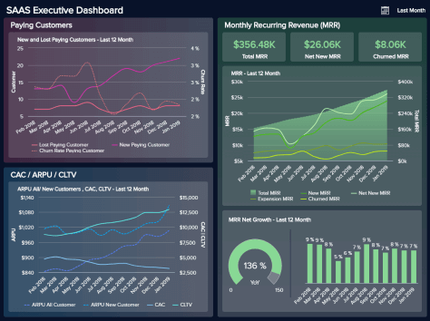

仪表板创建工具使您能够在单个屏幕上创建和组织所有数据。无需编写任何代码，仪表板制造商将允许您整合您的数据，并与您的同事、其他部门或利益相关者共享。[您可以在我们的实时仪表板](https://www.datafocus.ai/infos/live-dashboards)部分中查看选定的示例和模板，其中我们收集了来自不同行业、功能和平台的实例。

现代、专业的在线仪表板制造商将使您能够：

**看到的不仅仅是事实和数据：**我们专业的仪表板创建者连接到所有常见的数据源，例如数据库、平面文件、营销分析、社交媒体、CRM/ERP 系统和帮助台——将您的原始数据变成更易于理解的东西你自己和你的同事。在不到 10 分钟的时间里，您可以将所有数据连接到DataFocus ，并开始更清楚地了解当前趋势、关键绩效指标和其他关键业务洞察力。此外，我们易于访问的模板（您可以在登录后立即选择）为不想花费大量时间构建自己的仪表板的用户提供了一项附加功能。

**节省时间和资源：**省去中间人，完全控制您的数据。在[自助式商业智能工具之前](https://www.datafocus.ai/infos/self-service-bi-tools)与 DataFocus 一样，公司需要 IT 专家来分析和监控他们的数据。在过去的几十年里，我们见证了分析成熟度的提高，因为人们越来越习惯于每天操作数据。仪表板在线系统成倍增加，并且由于其成熟度，它们的使用更加广泛。变得更加独立而不总是依赖 IT 部门的可能性是我们的仪表板生成器为 IT 和 BI 团队提供的一个有吸引力的功能。事实上，经常被请求压得喘不过气来的 IT 现在可以从堆积如山的工单中解脱出来，而商业智能部门可以在易于使用的[MySQL 报告工具的帮助下更快地获得相同的结果](https://www.datafocus.ai/infos/mysql-reporting-tools)普通业务用户和高级 IT 专家都可以使用。

**轻松分享结果：**在您创建了令人惊叹的图表并在交互式仪表板中对其进行结构化之后，您可以以一种易于理解且引人入胜的方式与您的同事分享您的结果。不仅如此，如果您不想自己设计一个，准备好的演示仪表板和即用型模板还可以创建一个更快的数据可视化过程。我们的仪表板可以与贵公司的关键决策者共享，并且使用我们的[BI 报告工具](https://www.datafocus.ai/infos/bi-reporting)，您可以设置自动化报告供同事定期阅读。设置完成后，您不必担心一次又一次地创建这些。

**利用高级功能：**提供用户友好界面的专业仪表板创建者，此外，云存储将取得成功。我们的[云 BI](https://www.datafocus.ai/infos/cloud-bi) 解决方案使您能够访问您的仪表板，无论您位于何处。只要你在一个可以上网的设备上，你就可以创建图表，分享见解，并向你的同事发送报告。对您的性能有一个客观的看法，这是对某些过程和决策进行对话和协调的良好基础。仪表板平台的优势还在于可以根据您的意愿进行共享:如果您不希望某些同事或业务外部的人访问某些信息，那么可以限制权限或定制查看选项。这个功能将帮助您进行数据驱动的决策，因为您可以随时掌握事态发展的脉搏。

**促进数据驱动的文化**:如前所述，在您的业务中实现仪表板创建软件可以带来多种好处，其中最主要的是协作。DataFocus的用户友好界面，配合拖放功能和人工智能技术，提供自动化决策辅助，如专业数据警报，将使您的所有员工都能利用数据分析的力量。以前从未处理过数据的部门将能够与他们的同事合作，并基于数据而不是简单的直觉做出决策。从长远来看，这将建立一种坚实的数据驱动文化，从而引导您的业务取得成功和增长。

### 获取用于令人惊叹的在线仪表板的最佳仪表板创建器软件

我们的仪表板创建过程使您能够快速制作显示所有相关信息的引人注目的图表。一般来说，现代[在线仪表板](https://www.datafocus.ai/infos/online-dashboard)是强大的工具，可以帮助您开展日常业务，因为它们是您领导的数据分析或关键指标的方便、易于阅读的单页摘要。它们为您的工作提供了一个方便的概览，您可以轻松地与您想要的任何人分享。在所有这些好处中，DataFocus的在线仪表板为您提供了更多独特的优势：

**促进协作**\- 以您想要的程度与您的同事的仪表板和报告共享 - 随时控制您的信息并选择您想要显示的内容。

**远程工作**\- 从任何地方，从任何具有 Web 界面或可用性的设备访问 App Store 或 iTunes。我们的按需 BI 工具只需要您登录到您的 DataFocus帐户。

**使用直观的拖放界面**——DataFocus的仪表板生成器不需要精通的 IT 知识，您就可以通过拖放构建令人惊叹的图表和仪表板。只需选择您需要集成的数据类型并将其放入所需的字段 - 软件会完成剩下的工作。

**从静态演示开始**——仪表板制造商的美妙之处在于它的交互性。借助专业的仪表板，您可以从静态 PowerPoint 幻灯片展示您的分析结果，到一个[交互式仪表板](https://www.datafocus.ai/infos/interactive-dashboard-features)，使您能够在一个屏幕上显示所有结果，您可以根据您想要支持的讨论进行过滤。

**生成实时仪表板**——您将始终保持最新状态，并且由于自动同步，您无需永久更新您的数据源。此外，智能数据警报将为您提供有关任何业务异常的实时通知。

**整合所有数据**\- 将所有数据库连接到一个点并将数据整合到一个地方。利用跨数据库查询。借助易于使用的数据连接器，您可以从一个集中的访问点访问所有业务信息。

**监控重要的指标**\- 观察为您的业务带来价值的指标。通过选择正确的 KPI，您可以轻松发现运营或战略层面的任何显着变化。查看我们的[业务仪表板示例](https://www.datafocus.ai/infos/dashboard-examples-and-templates)，这些示例将为您提供业务监控可能性的概览。

**可选的高级 SQL 查询框的好处**——对于更高级的用户，我们的[在线 SQL 编辑器](https://www.datafocus.ai/infos/sql-editor)的此功能使您能够手动输入 SQL 代码，无论您是 IT 专家、数据分析师还是希望提取最有价值的数据科学家从您的分析中得出的见解。

**自定义您的仪表板**\- 除了只需单击几下即可轻松创建令人惊叹的仪表板，您还可以根据您的品牌或客户的身份个性化您的仪表板，使其看起来更专业。

**预测您的结果**\- 与市场上的其他[商业智能仪表板软件](https://www.datafocus.ai/infos/bi-dashboard-tools)不同，DataFocus 的在线仪表板创建器为您提供易于使用的预测分析功能，这些功能使用历史数据来预测数据中的未来结果。这将使您能够分析过去并根据预测数据确定未来目标。

对于我们更有经验的用户，我们还提供高级图表选项。使用 DataFocus 的仪表板创建软件，您可以在图表中快速添加辅助轴。假设您要准备一份报告，显示您每月的客户增长和产生的总收入。无需制作两个不同的图表——一个绘制每月收入，另一个绘制客户数量，您可以结合两个数据集并添加一个辅助轴，即使数据范围很大，通常也不会显示一个轴。在单个图表上呈现两种类型的数据是显示受众将立即理解的相关性的最佳方式。

我们的仪表板生成器还使您只需单击即可在单个图表中组合不同的图表类型。以上面的例子为例，假设您通常将每月的客户增长和总收入显示为条形图。如果您想切换样式并将数据显示为折线图，您可以在现代仪表板制造商的帮助下立即完成。我们认为负责图表的视觉性能对您来说很重要，因此我们让您一键进行更改比以往任何时候都更容易。

这些交互式仪表板不仅为高级用户而设计，也为小型公司或大型企业中的典型业务用户、经理、c 级主管或部门员工而设计，可帮助您轻松处理大量数据。连接数据源后，您可以轻松选择我们的仪表板模板之一，或开始创建自己的模板。另一种可能性是请求 POC，这是一种在您提交数据和特定要求后轻松在产品演示中获取个人仪表板的方法。这些仪表板的美妙之处不仅在于精心设计的界面，还在于作为推动可持续业务发展的强大引擎。

### 市场上最好的仪表板生成器

通过令人惊叹的视觉效果、改进的共享能力和实时数据，我们的[在线数据可视化工具](https://www.datafocus.ai/infos/data-visualization-tools)彻底改变了您报告数据的方式。我们的仪表板制造商结合了强大的功能和灵活性，将您的关键指标整合在一起，这样您就可以运营更好、更受数据驱动的业务。您可以从许多[KPI 示例](https://www.datafocus.ai/infos/kpi-examples-and-templates)中进行选择，监控对您的业务至关重要的指标不再是困难，也不再是报告积累的负担。使用我们的[KPI 仪表板软件](https://www.datafocus.ai/infos/kpi-dashboard-software)，您可以即时生成报告并使用我们的仪表板模板讲述强大的数据故事。不要让您的数据潜力未被开发，并通过同时拥有您需要做出更明智决策的大局和小细节来使其有价值。令人惊叹的图表、无穷无尽的功能、强大的报告选项来自一个工具，它可以整合部门之间的工作，增强您的演示能力或在发生业务异常时向您发出警报，确保对公司的每个业务领域采用平稳的数据驱动方法。

不仅如此，我们现在提供比以往更多的选项来自定义您的仪表板。您可以在多达 60种不同的图表类型中进行选择，每种图表类型都有其特点，为您提供更多自定义选项：数字、表格、条形图、列、地图、表格、仪表、散点图、堆积条形图、雷达图、饼图或折线图，选择权在你。您可以更改所有字体大小、颜色和样式，并应用全局样式选项，从标题到标签再到图例。

添加您的公司颜色以将您的品牌整合到您的设计中，或将 DataFocus嵌入到您自己的解决方案中。您可以更改任何背景颜色、图表本身的颜色，甚至边框和网格线。这些颜色会在几秒钟内过滤到仪表板中的每个图表。作为辅助帮助，您还可以在我们的预定义颜色主题中进行选择，这些主题是为了它们的和谐而选择的，并由我们的数据可视化专家设计。

您还可以添加图像，包括您的企业徽标，以进一步提升您的品牌形象——在与外部利益相关者共享您的仪表板时，这尤其令人印象深刻。同样，对于另一种个人风格，您还可以根据客户的颜色个性化您的在线仪表板，并以这种方式立即建立联系。我们定制的方法和多年的经验使我们能够在创建自己的数据故事和产生宝贵见解的每一步中帮助我们的客户。

最好的部分是您可以通过我们的 30天免费试用来亲自试用我们的仪表板创建工具！利用这段时间了解 DataFocus 如何让您独立于 IT 部门并提高整个公司的生产力。
