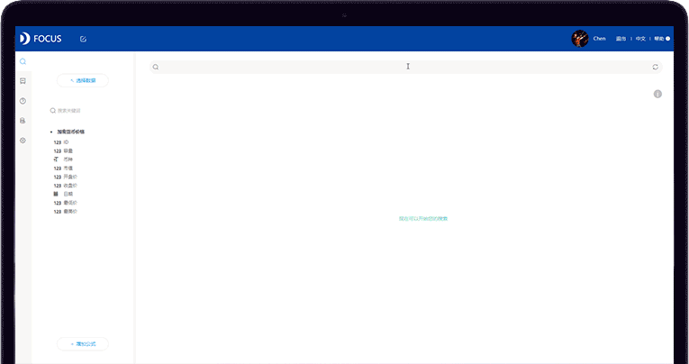

Siri、小冰、小娜，这些AI人工智能，早已是AI届的网红。很多人都有过和AI对话的经历，比如微信中的小冰。大部分时候，她的表现都很优秀，显得很机智，偶尔还会给你抖机灵。但是当你使用一段时间之后，慢慢会觉得索然无味。从闲聊的角度，虽然她的回答看起来很人类，也充满趣味，但总感觉有点不对劲，有的时候表现得太聪明，压根儿就不像个人类；另一方面，一旦你开始和她正经交流，希望向她咨询问题的时候，希望探讨一个想法的时候，小冰的表现就不再这么优秀了。

**为什么会这样呢？这得从这类人工智能AI产品的实现原理去分析。**大量的聊天机器人都是通过海量的对话语料库进行强化训练而来，这个训练浅显的说就是对大量真实的人类对话进行分类，然后标记出不同的场景、人物画像，比如年龄，性别，性格等等。然后你第一次开始聊天的时候，AI会通过几个问题将你归类，然后根据这个分类去语料库中寻找对应的回答来回应你。

但是，还有一类AI，它们希望能够解决你工作场景中的具体难题，成为你工作中的得力助手。DataFocus中的AI就是这样的。**DataFocus独有的类自然语言处理引擎技术，能够回答用户关于数据处理的问题，帮助用户得到准确的数据分析结果**。尽管DataFocus中的AI不是纯粹的自然语言问答形式，有一定的规范限制，**但只要你花30分钟习惯了他的交互方式之后，你就能“捕获”一个AI助手，成为你数据分析中的好帮手，而这才是一个工业级产品应该有的AI！**

在DataFocus中，你是如何实现这一切的呢？**那就不得不提到DataFocus具有开创意义的搜索式分析了。**

在DataFocus中，你是这样与AI交互的：在搜索框中输入关键词，点击搜索，AI就会对你的关键词进行语义分析并得出最合适的图表展示结果。

举个例子：想要分析各类商品的整体销售情况，并有序展示。只要键入关键词：类别、销售量、按销量总和降序排列。在键入以上关键词到搜索框之后，点击搜索，即可在3秒内得到可视化结果。

为什么我们需要搜索式分析呢？

**1）搜索式分析更符合人类的使用习惯。**即使是从没接触过计算机概念的人，在看到搜索框的时候，也能不需任何学习而自然操作。

2）**搜索不仅更简单，而且更灵活。**要获得各种维度的分析结果，你不需要反复拖拽多次，甚至进行事先的配置，搜索即可。

3）**基于语义的理解，拖拽式操作永远无法实现。**简单的语句可以表达复杂的意思，有些用拖拽的方式永远无法实现，或许你还得借助SQL语句。但是有了DataFocus，你不需要重拾代码，搜索即可。

怎么样，你不想了解一下这个可靠、便捷、智能的AI数据分析助手吗？欢迎在公众号或官网留言咨询哦。

**DaTaFocus，让数据分析像搜索一样简单！**
