您企业的财务状况、流程和流动性最终将决定其长期成功，这就是为什么仔细、全面和准确地监控您的资金至关重要的原因。

在我们数据驱动的数字时代，能够整理、组织和利用对其持续商业目标最有价值的见解的“业务智能”组织注定要长期蓬勃发展。[在线数据可视化](https://www.datafocus.ai/infos/data-visualization-tools)在业务运营中占据主导地位，创建更高效、更快速的工作空间。

 

也就是说，在不到两年的时间里，地球上的每个人每秒将产生大约 1.7 兆字节的新信息，希望保持财务流畅的企业需要访问配备图形和图表的[KPI 仪表板](https://www.datafocus.ai/infos/best-kpi-dashboard-examples)，这些图形和图表易于消化、准确，并提供提高效率所需的洞察力水平，并在潜在陷阱发生之前阻止它们。

在本文中，我们将介绍金融图表的基本定义，解释您为什么需要它们，并回答最基本的问题：财务分析中要包含哪些图表？通过以图形方式呈现数据，您不仅可以充分利用您的货币信息，而且简单的视觉效果将为您完成一半的解释。也就是说，让我们开始吧。

您的机会：[想要创建交互式金融图表和图形？](https://www.datafocus.ai/console/)探索我们的 14 天免费试用版并受益于出色的财务管理！

## 什么是财务图表？

财务图表是可视化工具，允许公司监控流动性、预算、费用、现金流等领域的各种绩效指标。通过这样做，他们可以成功地管理风险，以确保健康的财务状况和稳定的增长。

为了确保公司的最佳绩效，无论规模大小，定期进行[财务分析](https://www.datafocus.ai/infos/finance-analytics)并确保最高质量的数据管理都必须是公司的首要任务。如果财务部门发出警报，每个人都必须仔细倾听，因为它涉及最关键的信息，如果忽视可能会导致严重的损失。这就是为什么需要非常谨慎和关注地创建财务图表的原因。让我们更详细地了解这一点。

## 为什么需要财务分析图？

作为人类，我们对视觉数据的反应和处理比其他任何事情都好。也就是说，在消化和采取行动时，精心设计的财务图表和图表提供了最佳解决方案。根据伊利诺伊州立大学的说法，当涉及到这种视觉辅助工具时，有三个标准适用：图形和图表应该以最有效的方式显示明确的信息，有意义的数据以及当前所说的见解。

从根本上说，您需要它们，因为：

- 您将能够轻松、直观地准确跟踪您的流动性、现金流、预算和费用，并自动化流程，这些流程通常是手动完成的，并且出错风险更高。
- 通过为您的业务设置正确的[财务 KPI](https://www.datafocus.ai/infos/kpi-examples-and-templates-finance)，您将能够设定有价值的目标，从而实现增长和成功。虽然那里有许多图表，但我们将解释任何企业的宝贵图表。
- 您将能够理解所有财务信息和指标，因为它们将被拆分为可操作的类别，并以直观、可扫描的方式呈现，无论您需要包含和分析的指标如何。
- 笔和纸或静态数据在当今快节奏、竞争激烈的商业环境中将不再适用。如前所述，手动工作容易出现错误，您可以通过使用[自助式分析软件](https://www.datafocus.ai/infos/self-service-analytics)轻松避免这些错误。

“每一天的每一秒，我们的感官带来的数据比我们大脑所能处理的数据要多得多，”——彼得·迪亚曼迪斯，X-Prize基金会主席/首席执行官

仅根据这句话，很明显，通过利用提供准确、可靠和清晰的财务见解的强大图表的力量，繁忙的财政部门将能够理解他们面前的见解，从而取得成功和发展，而不是陷入成群的无意义和复杂的数据。

您可以从创建简单的收入与支出图表开始，添加与组织故事相关的其他图表，最后创建一个仪表板，该[仪表板](https://www.datafocus.ai/infos/how-to-make-a-dashboard-with-ease)将在单个屏幕上显示您的所有信息。让我们更详细地了解这一点。

## 财务数据可视化扮演什么角色？

交互式仪表板等财务数据可视化包含图表和图形，有助于在一个可导航的平台上跟踪所有核心 KPI。有关优化报告和详细分析，您可以查看我们有关[财务报告](https://www.datafocus.ai/infos/daily-weekly-monthly-financial-report-examples)示例的博客文章。

这些仪表板使时间紧迫的财务部门能够掌握业务的经济绩效，从而实现更高效的现金管理、准确的费用跟踪、全面的销售洞察以及旨在实现有价值的财务目标的其他视觉洞察。

[财务仪表板](https://www.datafocus.ai/infos/dashboard-examples-and-templates-finance)提供确保整体绩效、现金流、现金管理和损益分析取得成功所需的所有指标和见解。上面的业务仪表板不仅可以快速提取关键数据，而且可以更轻松地将您的发现传达给[业务](https://www.datafocus.ai/infos/dashboard-examples-and-templates)中的重要利益相关者。与传统的Excel图表相比，这些图表提供实时数据，这些数据将证明对您企业的财务未来非常宝贵。

不仅您的企业将有机会探索、监控和访问实时数据，而且交互级别是管理大量信息的宝贵资源，尤其是在金融领域，一个小错误可能导致数百万美元的损失。这就是为什么与财务图表和图形的交互至关重要的原因：单个KPI可以通过静态演示永远无法提供的多种有用的方式和角度进行查看。

最后，我们不能避免提到协作是现代金融数据可视化工具的首要角色之一。正如我们之前所说，财务可以说是任何企业最重要的方面，如果它们出现问题，很可能您的所有公司都会受到影响。通过使用[BI 仪表板工具](https://www.datafocus.ai/infos/bi-dashboard-tools)（如 DataFocus），您将能够与公司的其他部门实时共享您的财务见解，并增强协作、数据驱动的工作方法，从而优化您的整体业务绩效。

在财务报告中使用图形已经成为当今环境中的业务标准。当您为数据可视化流程添加智能工具、自动化、令人惊叹的视觉效果和交互性时，您的财务部门将显著提高生产力并降低成本。让我们通过我们的前 25 个财务图表模板来了解这一点。

## 查看我们的 25 个金融业务图示例

为了正确看待基于仪表板的金融业务图的重要性，这里有 25 个模板，涵盖了雄心勃勃的现代业务中最关键的以金钱为中心的方面。

### 1\. 毛利率

作为我们[损益仪表板](https://www.datafocus.ai/infos/dashboard-examples-and-templates-finance#profit-loss-dashboard)的关键组成部分，该指标以传统的饼图形式开发，但设计更易于导航。毛利润图表显示您的总收入减去销售商品成本，再除以您的总销售收入。

该图表提供毛利润的可视化表示以及明确定义的指标，可让您衡量组织的生产效率，并最终帮助您从每一美元的销售额中获得更高水平的收入。

### 2\. 营业利润率

作为另一个以损益为中心的财务图表，除了详细的条形图外，此视觉对象还拆分为易于理解的百分比指标，并将帮助您准确计算息税前利润 （EBIT）。

您的营业收入越高，您的业务可能就越有利可图，此图表将有助于该指标从历史数据和无价的实时见解的组合中浸入。

### 3\. 营业费用率

运营费用比率也与财务部门关键活动的损益范围密切相关，这种颜色编码的健康指示器将帮助您访问所需的信息，即使一目了然。

运营费用比率 （OER） 使您能够通过将运营费用与整体收入进行比较来了解业务的运营效率。这是显示损益的最佳视觉对象，但您确实需要将其与其他图表连接以创建适当的财务数据故事。通过定期监控这些信息，您将能够决定您的企业是否可扩展，并在您认为不可伸缩时对您的商业战略进行必要的更改。

### 4\. 流动比率

这个财务图表示例与现金管理仪表板密切相关，本质上是一个流动性比率，使您能够了解企业在短期内（通常在 6 或 12 个月内）支付您最关键债务的能力。

该图表以两个可视化比率计算的形式呈现，可快速访问您的整体流动性健康状况或表现，以及一个柱形图来帮助您比较数据和发现趋势，该图表将确保您能够履行义务、承诺付款并在有害障碍展开之前消除它们。

您的机会：[想要创建交互式金融图表和图形？](https://www.datafocus.ai/console/)探索我们的 14 天免费试用版并受益于出色的财务管理！

### 5\. 净利润率

这个特殊的利润图以与运营费用比率图类似的格式呈现，使忙碌的团队可以轻松获取和分析他们需要的信息，以深入研究您的底线健康状况，从而获得提高整体净利润所需的洞察力水平。

作为企业可以跟踪的最重要的财务 KPI 之一，此图表非常宝贵 - 通过使用这个强大、可靠和直观的图表，您将能够消除任何效率低下的问题，并随着时间的推移提高公司的净利润。

### 6\. 应付账款周转率

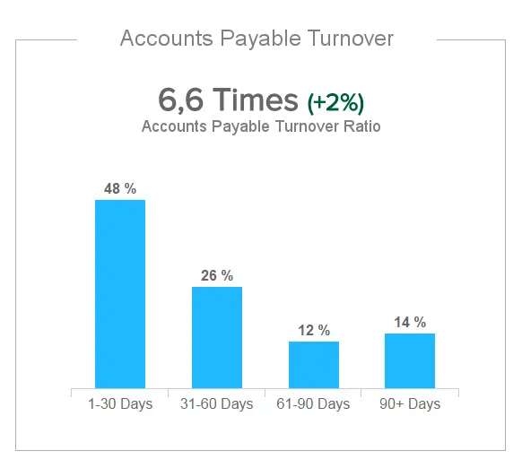

关于贵公司现金管理活动的顺利和负责任处理，应付账款周转率是另一种流动性计算，将确保您能够在规定的期限或设定的时间范围内支付所有重要费用。

比率本身根据实时变化而变化，并以粗体编号格式显示，而历史或时间顺序信息则以柱形图的形式呈现，该柱形图显示了分成不同时间段的营业额百分比。较高的比率为供应商和债权人提供了保证，即您的企业经常支付账单，并且是与供应商谈判信用额度时的关键指标，因此这是您的公司无法承受的图表。

### 7\. 应收账款周转率

以可扫描的饼图形式呈现，并附有重要的营业额指标，这是财务图表模板之一，可量化您的组织收取所欠款项的速度，从而展示您在扩展信贷方面的有效性。

您的企业越快将赊销转化为现金，您的流动性就越好，最终转化为更大的处理短期负债的能力。

### 8\. 资产回报率

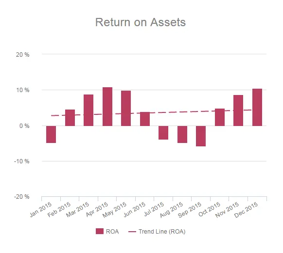

这个特定的图表非常有用，因为它是一个财务绩效 KPI，可让您了解您的企业如何利用其资产获得更多利润。

该图以易于遵循的柱形图和趋势线格式显示，可直观地表示您的组织相对于整体资产的盈利能力。这里的底线是您的 ROA 越高越好，尤其是当您将此指标与直接行业竞争对手进行比较时 - 因此此图表对于您持续的财务进展至关重要。

### 9\. 股本回报率

这种颜色键控视觉效果提供了您能够为各个股东产生的利润水平的独特衡量标准。这个特定的指标是通过将您企业的净收入（减去优先股的股息）除以股东权益（不包括优先股）来计算的——这不仅提供了财务业绩的绝佳衡量标准，而且对于与您所在行业内的其他竞争对手进行比较也很有效。

您的股本回报率越高，您为股东提供的价值就越多，这将转化为切实的长期商业成功。

### 第10章 投资毛利率回报率

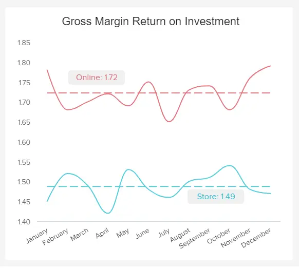

一个很好的[零售KPI](https://www.datafocus.ai/infos/kpi-examples-and-templates-retail)是毛利率投资回报率（GMROI）。它是一个库存盈利能力指标，它衡量组织将其库存转化为现金的能力（减去库存成本后）。GMROI的计算方法是将毛利润除以平均库存成本。结果将告诉您从投资的库存中赚了多少钱。该指标的行业标准是高于 1 的比率，但是，专家建议成功的零售店的 GMROI 应约为 3。这意味着该公司正在从其投资中赚钱。相反，比率低于 1 意味着需要采取措施来提高盈利能力。

在衡量GMROI时，一个好的做法是按产品类别进行。通过这种方式，您可以了解哪些产品退货更多，并将精力集中在这些产品上。

### 第 11 章 IT 成本明细

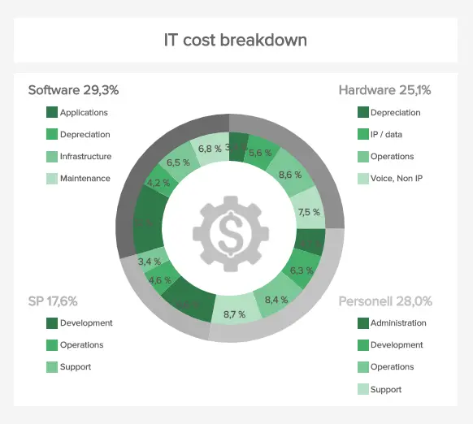

此财务图表模板特别关注 IT 部门，但您可以轻松地针对公司的任何其他功能对其进行调整。我们可以看到成本分配在指定单元（软件、硬件、SP 和人员）中的行为，同时描述其每个元素（例如，管理、开发、运营和支持）的成本百分比。监控费用图表至关重要，一方面确定主要成本驱动因素，另一方面确定可能性，以便公司调整其战略。

如果您发现一个单位花费了大量资源，则有必要进一步调查并检查成本是否合理或需要更多关注。通过使用相关的[在线商业智能软件](https://www.datafocus.ai/infos/online-bi-tools)，可以直接与此视觉对象中显示的所有值进行交互，并根据需要进行深入挖掘。如前所述，您不仅可以减少导出、导入、滚动和搜索正确信息的时间，而且由于人类是视觉生物，您的理解速度会快得多。

### 12\. 成本规避

如果没有成本规避，我们的财务数据可视化示例列表将是不完整的。这是需要注意的重要图表之一，因为它跟踪采购部门在特定时间范围内节省了多少成本（在这种情况下）。您还可以像上面的模板一样描绘 5 年趋势，并按供应商类别进行组织。例如，这个指标不像直接成本节约那样有形，但它确实为整个采购部门带来了价值。

每个采购专业人员的目标都是在未来（以及现在）降低成本，这张图表可以很容易地描述这些努力为公司带来了多少，并对节约过程产生了直接影响。例如，采购专业人员或经理可以锁定与供应商签订的合同价格，以避免将来价格上涨。要查看有关采购运营和管理的更多详细信息，您可以浏览我们的[采购指标](https://www.datafocus.ai/infos/kpi-examples-and-templates-procurement)集。

### 13\. 现金转换周期

现金转换周期 （CCC） 是一个指标，可帮助公司跟踪公司需要多少时间将其资源转换为销售现金。在我们的示例中，该公式也进行了简单的描述，以便于遵循：您需要将当天的未结销售额与未结存货天数相加，并减去应付未结天数以计算现金转换周期。如果您使用可以与之交互的财务图，并根据您的输入自动计算数据，则人为错误的可能性将降至最低。您不必在每次需要报告时都手动计算，但只需单击几下即可实时监控数据。

最后，目标始终是尽可能减少周期，因为增量可能意味着组织在管理和运营方面没有完全有效。很简单：如果公司销售消费者想要购买的东西，那么这个周期是快速而健康的。如果没有，则需要进行额外的更正，以使公司不会陷入更严重的困难。

### 14\. 供应商付款错误率

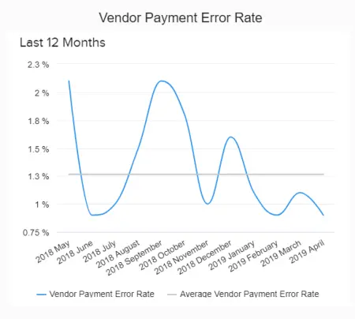

支付发票并将其开具给供应商、供应商或其他利益相关者对于分析至关重要，因为它可以显示犯了多少错误以及应付账款部门是否健康。当然，错误确实会发生，但有时它们可能是危险的，因此应将其保持在最低限度。错误可能包括向错误的实体付款、超额付款或双重发票，每个应付账款经理通常会努力尽可能减少这些错误。

适当的财务[和分析报告](https://www.datafocus.ai/infos/analytical-report-example-and-template)可以帮助这个过程。当您在现代软件工具的帮助下自动化和数字化分析时，您不必担心错误率会很快增加。在上面的例子中，我们可以看到我们的平均错误率为 1.3%，但在过去的几个月里它已经开始下降。目标应该是尽可能低的费率并避免任何可能的商业纠纷。

您的机会：[想要创建交互式金融图表和图形？](https://www.datafocus.ai/console/)探索我们的 14 天免费试用版并受益于出色的财务管理！

### 第15章 经营现金流

此现金流量图清楚地显示了业务运营的绩效。上面给出的例子显示了一家公司在 5 年内产生了多少现金。它不包括投资和/或非销售相关收入，这基本上意味着它专注于主要的现金活动（例如，销售/购买库存或支付工资）。此图表对于跟踪很重要，因为它清楚地描述了公司是否可以维持其运营并最终增长。应密切和定期监测，以避免任何潜在的困难。

要创建这样的图表，有一些[数据可视化技术](https://www.datafocus.ai/infos/data-visualization-techniques-concepts-and-methods)可供研究和遵循。这样，您对重要信息的分析和呈现将产生最佳价值并确保最有利可图的结果。

### 16\. 营运资金

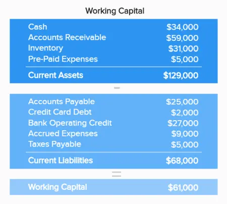

我们的下一个例子是营运资金。这是一个简单的图表，可让您一目了然地了解公司的财务状况。它不包括任何比率或比例，而仅包括代表您的流动负债、流动资产和总营运资金状态的数字。如果营运资金很高，您可能需要考虑投资多余的现金，因为更高的价值并不一定意味着您的公司表现良好。

### 17\. 浆果比例

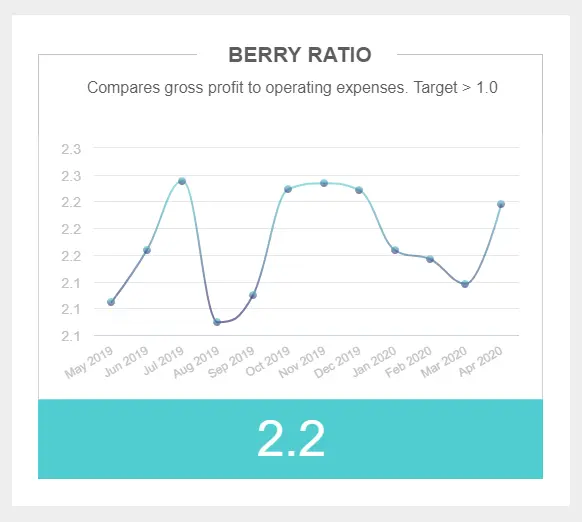

贝里比率将公司的毛利润与其运营费用进行比较，以了解特定时间段的利润金额。在上图中，我们看到 1，0 是衡量此指标的参考系数。如果您公司的浆果比率低于 1，0，则意味着您正在亏损，另一方面，如果它更高，则意味着您赚取的利润高于所有可变费用。

此业务图表是[CFO 仪表板](https://www.datafocus.ai/infos/cfo-dashboard-kpis-report-template)的基本组成部分，如果您定期跟踪它，您可以了解您的利润下降或增加的确切时期，并得出结论以改善您的业务财务状况。

### 18\. 经济附加值

这个交互式仪表图旨在跟踪公司的经济附加值 （EVA），红色、灰色和绿色使数字是正数还是负数更容易直观地理解。该指标是通过从营业利润中扣除资本成本并以现金为基础调整税收来获得的。为了计算贵公司的经济增加值，您可以使用一个简单的公式，包括：税后净营业利润（NOPAT）-投资资本\*加权平均资本成本（WACC）。

EVA是了解公司投资是否获得任何价值的基本财务指标。如果一家企业的EVA为负，这意味着它没有从投资中产生任何利润。通过定期衡量这一指标，您将对公司的财富有更全面的了解，并从长远来看做出更好的管理决策。

### 19\. 薪资人数比率

我们的下一个业务图表跟踪工资员工比率。该指标包括根据相关成本或收入等各个方面将所有人力资源全职职位除以员工总数。您可以在计算中包括全职和兼职员工以及自由职业者或承包商。薪资员工比率的总体目标是了解贵公司管理劳动力成本的情况。

通过跟踪工资员工比率等[人力资源指标](https://www.datafocus.ai/infos/kpi-examples-and-templates-human-resources)，您可以确保您的劳动力成本得到很好的投资并为您的公司带来积极的财务收益，并帮助您了解您的工资管理费用是否过高，这样您就可以快速采取行动并避免任何困难。

### 20\. 降低采购成本

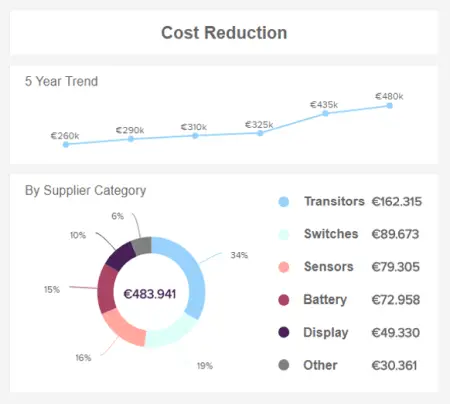

降低成本是您可以在任何[采购仪表板](https://www.datafocus.ai/infos/dashboard-examples-and-templates-procurement)中找到的重要 KPI。该指标的目的是跟踪您多年来在成本管理方面取得的切实节省。上图显示了两个图表来了解成本降低，第一个是 5 年趋势，因此您可以将您的绩效与其他年份进行比较，第二个图表按供应商类别详细查看节省，这样您就可以准确了解您节省了资金的领域。

通过监控您的成本降低情况，您可以简化供应商生命周期管理，通过利用供应链分析来提高效率，或培训您的员工如何节省成本。从长远来看，所有这些都肯定会增加您的人数。

### 21\. 每次雇用成本

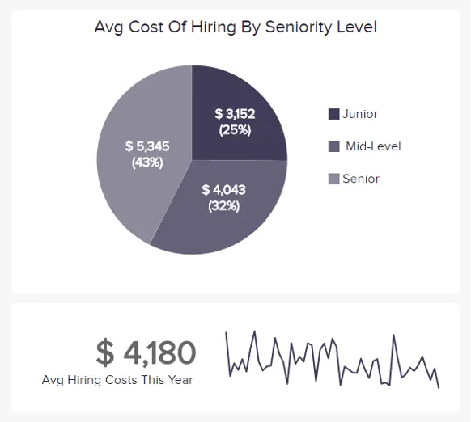

这个简单的指标旨在跟踪您在需要雇用的每位新员工身上投入的资源数量。在上面的饼图中，我们可以看到按资历划分的年度费用：初级、中级和高级。该图表涵盖了招聘过程中的所有费用，例如营销、招聘人员审查简历和进行面试所花费的时间成本，以及与之相关的培训和成本材料。

虽然看起来不像，但招聘过程通常会花费企业很多钱，通过跟踪此指标，您可以优化投资并从人才招聘预算中提取所有潜力。最后，投资于新人才将为您的公司带来更多价值。

### 22\. 市盈率

继续我们的财务图形列表，我们有市盈率 （P/E）。该指标显示在直观的面积图中，用于衡量公司与竞争对手相比的价值。它通过将公司的股价与其每股收益相关联来做到这一点。它让潜在投资者了解他们将为每美元收益支付多少钱购买股票。市盈率计算应始终考虑来自同一行业的竞争对手，因为根据每个行业的性质，这些值会有很大差异。

### 23\. 速比/酸性测试

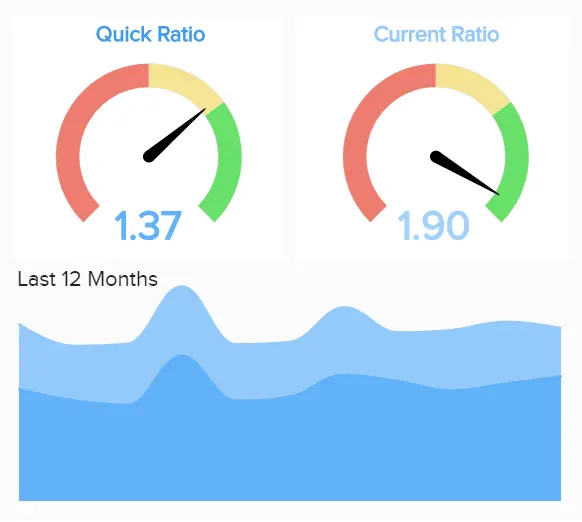

确保流动性是任何组织最大的财务目标之一。速动比率或酸性测试旨在帮助公司在短期内了解其流动性的健康状况。它衡量企业将其近现金资产（可以快速转化为现金的资产）以偿还其流动负债的能力。速动比率越高越好。您的目标应该是将其保持在至少 1，0。这意味着您的企业有能力快速支付所有当前债务。

在监控此指标时，需要注意的是，将其与流动比率进行比较时，酸性测试总是较小，因为它仅包括近现金资产。

### 24\. 预算差异

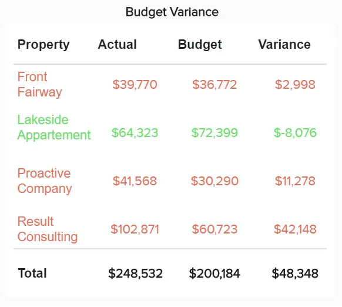

接下来，我们将预算差异显示在表格图表中。这个直截了当的指标表示不同会计类别中预算数字和实际数字之间的差异。这些值可以是有利的，也可以是不利的，并且清楚地描绘出红色表示负，绿色表示正。通过这种方式，您可以一目了然地了解哪些有效，哪些无效。负预算差异可能表示公司无法准确预测成本和收入。但是，由于组织无法控制的外部因素，也可能发生一些负差异。这可能是不断变化的商业环境，整体经济环境的变化，或原材料成本的增加，仅举几例。

### 第25章 MRR增长

要开始解释MRR的增长，我们首先需要了解MRR甚至代表什么。每月经常性收入是企业每个月可以预期产生的收入。它是一个基本指标，是计算其他相关指标（如客户生命周期价值或平均售价）的基础。长时间跟踪MRR增长可以告诉您商业模式的可持续性以及增长速度。

事实证明，该指标对于使用基于订阅的模型的公司特别有用，因为预测经常性收入对他们来说更容易。使用折线图监测MRR增长是最有效的方法，因为它可以轻松指示值在观察期间如何增加或减少。

您的机会：[想要创建交互式金融图表和图形？](https://www.datafocus.ai/console/)探索我们的 14 天免费试用版并受益于出色的财务管理！

## 哪种图表类型最适合可视化您的财务数据？

在提到分析或呈现财务数据时要考虑的一个非常重要的方面之前，我们无法完成本文：图表和图形类型。选择正确的业务图表来显示您的信息就像拍摄某物的照片并将其展示给其他人一样，您希望它易于理解并专注于您需要的内容以支持讨论。在这里，我们向您展示一些最常见的图表类型，以可视化您的财务见解：

- 折线图：这种类型的金融图表非常适合在一段时间内显示多个系列密切相关的数据，像这样，您可以在数据中找到趋势、加速、减速或波动。其由细线组成的简约设计使这种类型的图表非常容易理解。为了保持这样的状态，您应该始终将轴刻度保持在接近最高数据点的位置，这样可以避免在图表中浪费宝贵的空间。考虑仅显示分析的相关[指标](https://www.datafocus.ai/infos/operational-metrics-and-kpi-examples)也很重要，因为过多的变量会使图表过度拥挤并使其难以破译。您可以使用折线图跟踪财务 KPI，例如股本回报率、营运资本比率或息税前收益。

- 数字图：数字图是最基本的业务图表类型之一，因为它本质上是一个股票代码，可让您立即了解特定 KPI 的执行情况。您只需要选择要跟踪的时间段，以及是否要将其与趋势或固定目标进行比较，具体取决于分析目的。在财务方面，您可以使用它来衡量总现金余额、流动资产和负债等指标，或某些[销售 KPI（](https://www.datafocus.ai/infos/kpi-examples-and-templates-sales)如总收入）。跟踪这些实时数字将帮助您及时发现任何异常情况。

- 表格：表格是显示信息的经典方式，它们可以证明对处理原始数据非常有用。您可以使用表显示大量精确的度量和维度，始终具有总计以比较或支持它。如果几个人出于不同的原因需要访问数据，它们也很有用，因为他们可以过滤数据并仅使用他们需要的内容。重要的是要考虑到，由于其复杂性，您应该始终尝试使您的表格在颜色和形状方面尽可能具有视觉吸引力。您可以在[仪表板工具](https://www.datafocus.ai/infos/online-dashboard)的帮助下完成此操作。在财务方面，您可以使用表格来显示损益表 （P&L），以推动对公司收入的高级见解。

- 仪表图：[仪表图](https://www.datafocus.ai/infos/gauge-chart-examples)是一种简单明了的可视化类型，通常用于显示具有定量上下文的单个指标的性能。在颜色和指针的帮助下，这种类型的图表旨在跟踪KPI与设定目标或其他时间段相比的进度。请务必考虑，由于仪表图对于显示单个指标最有效，因此如果要从分析中获取可操作的见解，它不是最佳图表。您可以返回我们的财务图表模板列表，查看用彩色仪表图说明的经济附加值和净利润率。

- 进度图：顾名思义，进度图旨在跟踪您已完成特定目标的百分比以及您还剩下多少才能完全完成它。数据可以用圆图或条形图表示，您还可以添加参考编号以指示您在特定时间段内应该处于的位置，并比较您是否迟到或提前完成最终目标。如果您想要更详细的视图，您还可以分解不同领域的进度，并分别跟踪每个区域，以了解是否正在发生任何后退以及在哪里发生。在财务方面，您可以使用它来跟踪您的预算支出或公司投入大量投资的大项目的开发。

- 瀑布图：这种类型的可视化有助于了解正值或负值之间的累积效应，以达到最终值。例如，如果一家公司想要说明其年度利润，瀑布将显示所有收入来源，然后添加或减去所有成本以达到当年的总利润。加法和减法既可以基于时间，也可以基于类别。在我们刚刚提到的用例中，它们按收入和成本类别划分。我们关于顶部资产回报率的示例使用月度划分。

- 面积图：这种类型的图形通常组合折线图和条形图，以显示一个或多个数值如何根据第二个变量而变化。面积图与其他两个面积图的不同之处在于，在线条和基线之间添加了阴影。它通常用于显示关联属性随时间变化的趋势。在财务中，面积图通常用于表示股票随时间的变化，正如我们在上面的市盈率示例中所看到的那样。

尽管我们刚刚提到的这 7 种图表类型通常用于显示财务数据，但在选择可视化时，您应该始终考虑分析的目的是什么以及您要回答哪些问题。

## 财务图表和图表最佳实践

正如您在这篇富有洞察力的文章和我们的 25 个交互式示例列表中所看到的那样，图表能够将最复杂的数据点转换为可理解的值，从而显着增强决策过程并推动业务增长。也就是说，财务数据并不容易处理。虽然构建一个图表来显示最重要的性能指标听起来很容易，但为了使可视化成功，您仍然需要遵循一些最佳实践。在这里，我们告诉您其中的一些。

- 避免不必要的元素，保持聪明

在财务数据呈现方面，第一个最佳实践是避免用不必要的元素使图表混乱。若要避免这种情况，应首先为要生成的视觉对象定义一个明确的目标。这样，您将能够清楚地区分哪些元素是必需的，哪些元素不需要。如果使用多个轴，请确保每个轴都为您尝试显示的点提供价值。否则，可能会导致对数据的误导性解释。

这里的另一个重要注意事项是要明智地表达您的见解。例如，如果您使用条形图显示过去 12 个月的收入增长，则按月对值进行排序以查看进度是很自然的。另一方面，如果您按部门显示收入增长，最好从最大到最小增长对它们进行排序。这让观众一目了然地了解最高和最低的类别。

- 保持一致的视觉识别

图表和图形对于以直观的方式传达复杂的财务信息是不可或缺的。也就是说，在构建它们时，您使用的颜色会显着影响数据的感知方式。精心挑选的调色板可以帮助您的受众更好地理解值，并在分析过程中保持专注。相反，糟糕的调色板会使可视化过程效率降低且难以理解。

在这方面，一些好的做法是为特定主题定义特定的颜色。例如，您可以在每次显示与收入相关的图表时使用橙色，并使用不同深浅的颜色来显示不同的收入值。这样，当您的观众看到橙色时，他们会自动理解您在谈论收入。另一个好的做法是使颜色与企业的视觉识别保持一致。这使得它们对观众更友好，总体上也更专业。

- 使用易于理解的语言

您的财务目标很可能也会影响组织中的其他部门。如果您想增加在线渠道的销售额，那么您需要与营销部门联系，以考虑可以帮助实现这一目标的计划。其他几个部门也可能发生同样的情况。因此，需要使每个级别的用户都能理解财务数据。

也就是说，在构建财务报表图表时，使用友好的语言至关重要。如果要在轴中包含首字母缩略词，请确保解释它们所指的内容。相同的规则适用于您在陈述中包含的任何其他类型的技术语言。在构建图表时，您应该始终牢记您的受众。

- 讲述一个有凝聚力的数据故事

扩展上述观点，财务用户熟悉数字和公式已不是什么秘密，可能比其他任何部门都多。也就是说，为了实现与其他相关业务参与者的协作环境，数据需要以一种讲述一个有凝聚力的可理解故事的方式显示。数据可视化允许非技术用户识别数据中的趋势和模式。但是，如果没有正确组织不同的图形和图表，这是不可能的。现代[仪表板软件](https://www.datafocus.ai/infos/best-dashboard-software-features)通过提供最重要的财务指标的集中视图来帮助您完成此任务。

下图是一个财务仪表板，显示与损益相关的相关指标。能够快速查看数字如何随时间波动以及每个指标如何影响其他指标，使用户能够全面了解并做出明智的决策。

您的机会：[想要创建交互式金融图表和图形？](https://www.datafocus.ai/console/)探索我们的 14 天免费试用版并受益于出色的财务管理！

## 金融图表和图形的关键要点

我们已经阐述了财务分析中应包含哪些图表，并详细解释了每个图表。我们希望这些图形和图表模板能为您提供优化整体[财务报告和分析](https://www.datafocus.ai/infos/financial-reporting-and-analysis)所需的灵感。如果您想要更多数据驱动、基于业务的智慧珍珠，请浏览这些可用于每日、每周、每月或年度报告的销售[报告](https://www.datafocus.ai/infos/sales-report-kpi-examples-for-daily-reports)示例。

要更深入地了解对您的业务至关重要的财务报表图表，您可以测试 DataFocus 进行[14 天免费试用](https://www.datafocus.ai/console/)
