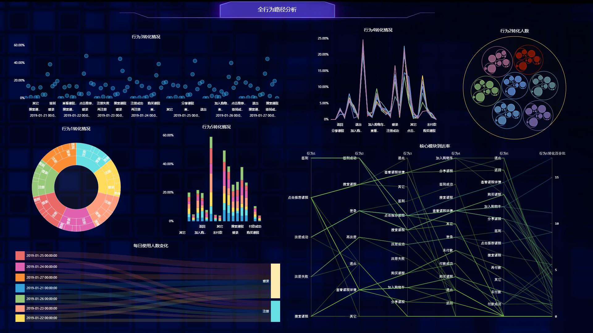

项目管理是一门综合多门学科的新兴研究领域，包括项目整合管理、项目范围管理、项目成本管理、项目进度管理、项目质量管理、项目资源管理、项目沟通管理、项目风险管理、项目采购管理和项目相关方等十大知识领域，传统的项目管理都重点着眼于这十大知识领域，却忽视了一项基础性工作：量化管理。缺乏量化管理，项目管理只能处于一种“混沌”状态。而如果采用了量化管理，项目管理的全过程就会变得“可视化”，发现问题也可以“让数字说话”。

在日常工作中，项目经理需要整合大量的数据和信息，进行量化管理，让整个团队可以直观地看到项目的实时状态，促进知识转移，并提高团队成员和其他相关方识别和解决问题的能力。因此，在整个过程中，有必要使用专业的可视化工具来收集、分析和量化信息，以实现项目目标和项目效益，让项目管理更清晰。而DataFocus利用其专业性，简便性，创新性，在众多可视化工具中脱颖而出。

DataFocus是一款专业的可视化工具，在项目量化管理中发挥重要作用。在项目管理中，项目的收益和风险控制极其重要，将项目过程中收集的数据进行量化指标，并用DataFocus可视化展示，实时监控指标变化，随时发现问题或者问题的苗头，随时预防和解决问题，把项目的损失降低到最小。

实现可视化管理，进一步把控整个项目，使项目有条不紊地进行，能够大大地降低项目风险，而不至于事后“救火”。
