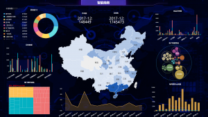
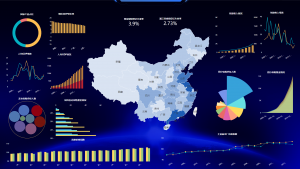
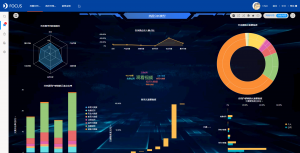

如今大数据产业正在超出我们的想象悄然发展，而随着大数据时代的到来，越来越多的公司开始意识到数据资源的管理和运用。而DataFocus作为全球首个中文自然语言大数据分析系统，在一些企业中也都开始运用。今天小编就给大家介绍一下可视化大屏的UI设计。

1、拼接大屏：大屏几乎都是拼接屏，UI设计时不用考虑屏幕缝隙影响内容的呈现，内容不会丢失，但有可能影响视觉的表现，例如一个很大的人物图像被缝隙正中“劈成”两半，或者“劈中”了眼睛，看起来很不舒服，所以设计时可以建立缝隙位置的参考线避免类似情况发生。（现在企业常用的有无缝隙、1.7mm缝隙、3.5mm缝隙、三种拼接大屏，缝隙越小越贵）

2、设计尺寸：拼接的每块小屏一般是16:9的高清屏，设计尺寸可以把上下高度设定为1080px，长度按照拼接屏的数量比例得出长度的设计尺寸。例如3乘5的一块大屏幕，高度3块屏设为1080，每块高就是360，360除9乘16等640，640就是一块屏幕的长度，640乘5块屏＝3200最后得出设计稿尺寸就是：高1080px乘宽3200px。

3、视觉设计：首先了解需求，整合数据，分析出主要数据次要数据、总量数据细分数据、各数据的维度等等，通过了解这些可以先设计出一个布局模版，也可以在纸上画出来，布局可以在设计过程中随时调整。

设计的风格，背景色一般用深色调，深色调紧张感强，让视觉更好的聚焦，大屏暗色调看上去更柔和舒服不刺眼，也会较省电。

其实可视化大屏的UI设计并不只是一个简单的设计，其核心就是要以展示数据为核心，不管在多么炫目的情况下都不会影响数据的展示。而DataFocus已具备了很多成熟的数据系统模式，在进行可视化大屏的研发和测试阶段都可运用。
