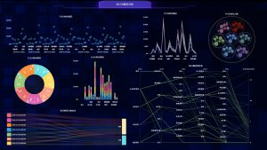

　　在日常的生活中，可视化大屏的运用随处可见，比如大型酒店、商场、大型广场等等。Datafocus品牌的可视化大屏已经在悄悄的走进人们的生活和工作中，今天我们就来分析一下市场调研的数据。如何恰当的提供多数人喜欢的酷炫效果需要，同时又符合数据价值呢？这就关系到可视化大屏的设计核心，我们对很多客户进行了市场调研得出了以下几点结论：

1、可视化大屏用户的年龄非常的均衡，能够接受可视化大屏的年龄大多在20-45岁之间，这就意味着可视化大屏设计的风格不能偏心死板。

2、在科技酷炫和数据直观简约的调查中发现两者均衡。也就是说用户可以接受二者接合使用。

3、用户大多喜欢灵活多变、蓝绿色系的视觉效果。那么按照这个调研结果可以作为设计的核心之一。

4、在调研过程中，大多数用户喜爱3D效果，对这个偏好都得到了一致赞同。所以在开发和设计上也是要以3D效果为中心来设计。

基于上述内容的总结和归纳，我们得出了一个结论，就是作为datafocus可视化大屏的开发商，在可视化大屏的设计上主要以蓝绿色系设计为主要色调、以3D效果为中心、图片要灵动多变等要求来迎合大众的喜爱程度。这样才能够让datafocus可视化大屏做到大部分人喜爱，也能够让可视化大屏真正走向市场并达到广泛的应用。
