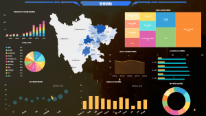
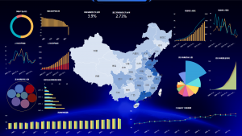

可视化大屏通俗的讲就是通过数字和文字、图标的形式将一个复杂的问题简单的陈述出来，让用户和读者能够方便阅读而且能够通俗易懂。Datafocus可视化大屏没有什么复杂的形式，开发者主要以简洁明了为设计理念，让人人能懂可视化大屏。下面Datafocus小编提出的几个问题不妨大家一起来学习和了解一下。

1、了解用户的需求并界定问题

可视化大屏的设计目的是为了解决用户某一个具体的问题，所以在项目设计开始前，开发者要基于用户的问题事实去了解项目，来弥补直觉上的缺陷。

2、与用户达成共识

在解决了用户对可视化大屏的问题之后，在问题的设计上和用户达成共识并进一步开发可视化大屏。

3、针对用户提出的问题探索调研

对可视化大屏的调研主要分为背景调研、数据信息调研和设计调研。在设计的基础上来认识数据、研究数据和整理数据，以最快的速度将数据显示出来。

可视化大屏如同电影播放一般，不那么枯燥乏味，而且能够产生兴趣的将可视化大屏中的工作内容在轻松的状态下了解和接受。可视化大屏不需要在设计和项目的投资上花心思，前期的研究分析和数据的调研才是开发者最为核心的关键问题。在确认过程中避免数据的堆积和复杂化也是datafocus可视化大屏该注意的重点内容。最终，datafocus开发商与用户之间达成一个一对一的服务对象。
