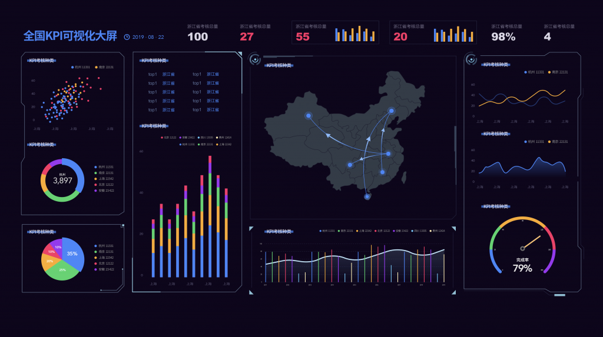
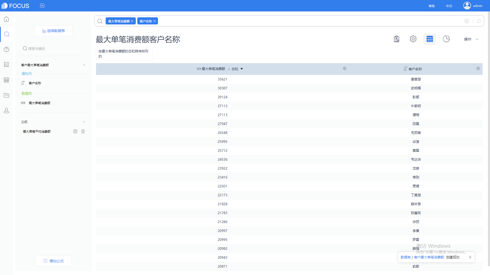

可视化大屏作为大数据能落地的一大成果之一，被广大企业和组织所青睐。由于大屏可以动态展示公司业务态势和公司实力，因此企业领导层对可视化大屏喜爱有加。然而从大量的企业实施起可视化大屏项目来看，其差异非常明显，除了项目落地成本悬殊外，项目后续评价效果也是千差万别，以至于有人说可视化大屏就是个花架子，而有的人则是极力推荐可视化大屏项目的落地。

小雨前后参与落地过30多个可视化大屏项目，其中既有用完整的可视化产品如DataFocus、Tableau、Qlik进行项目开发的，也有用可视化工具如DataV，甚至Echarts做过代码级的开发，整体上有成功也有失败。今天来总结一下这方面的经验教训，也为准备从事数据可视化大屏开发工作的同学们填填坑儿。

可视化大屏一个很重要的方面，关于数字屏幕的选型、拼接等等工作，也很重要，但这个都属于硬件范畴，我们就不讨论了。但从软件方面来讨论，可视化大屏的开发工作要关注以下几点：

1. 可视化需求的整理。首先是明确使用场景。比如这个大屏是专门用于客户接待的，还是给领导做汇报用的，还是业务部门自己用。不同的场景，使用人员不同，需要的数据也不同，最终的交互方式可能也不一样。一般情况下，我们可以简单分为对外和对内。

<table><tbody><tr><td></td><td>对内</td><td>对外</td></tr><tr><td>场景</td><td>业务部门</td><td>领导，公司展厅</td></tr><tr><td>使用人员</td><td>销售部门、市场部门员工等</td><td>领导，客户</td></tr><tr><td>汇报人员</td><td>销售总监、经理等</td><td>讲解员</td></tr><tr><td>汇报方式</td><td>投影仪、高清电视、电脑等</td><td>幕墙、大屏、背景墙等</td></tr></tbody></table>

1. 根据需求确定可视化大屏的具体指标。根据以上表格，我们可以通过需求确定具体指标。比如，对内场景中的业务部门，可视化大屏一定是聚焦在交互性、易用性，数据的实时性，以及大屏的开发难易程度。这种情况下，用DataFocus这种搜索式分析就可以简单创建可视化大屏的软件，优势就特别明显，可以极大的提高工作效率，修改起来也很方便。但如果是对外展厅中所用的，可能还得考虑购买合适的大屏硬件设备，此外，如果预算允许，也可以自主开发酷炫的功能，比如用Echarts。
2. 大屏的设计和开发。这一块儿，也是个大坑儿。如果一开始的大屏开发走了艺术设计路线，很多工作就得全部配合这个来。比如设计师设计了很漂亮的动画，用有些产品可能还无法实现，比如DataFocus或Tableau，这个时候可能得另外花钱请人进行JS代码的开发。这里特别提醒，一定要谨慎评估这些特效动画，是否真的需要，否则的话，会花很多冤枉钱。一般情况下，成熟的可视化产品自带的大屏设计功能，都能设计出中规中矩的可视化效果。

1. 评审和上线。第四步的工作周期直接与第一步相关，如果第一步工作做的足够细致，这里的就会少遇到返工和修改的问题。但是，不修改是不可能的。所以，如果你有一个很挑剔的领导，或者有很多业务部门参与其中提需求，最好是给自己找一个容易修改的产品。想想看吧，如果反复修改3次以上，都要动代码的话，你是不是要崩溃？
