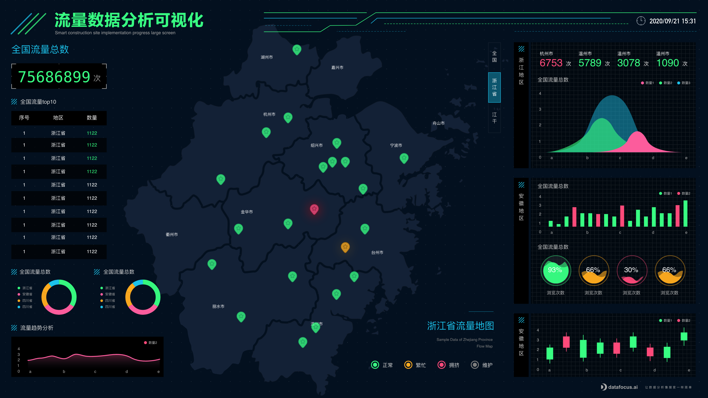

每一年的购物节晚会上，你一定看见过这样的大屏：

而且每年的效果也越来越炫酷~

这种超大画面、富有科技感和炫酷的呈现效果，确实很吸引人的眼球。但是，小编却要泼一盆冷水，其实炫酷并不是可视化大屏的真正意义，可视化大屏的真正目的是更直观快速地诠释信息。

什么是大屏数据可视化

大屏数据可视化是以大屏为主要展示载体的数据可视化设计。

“大面积、炫酷动效、丰富色彩”，大屏易在观感上给人留下震撼印象，便于营造某些独特氛围、打造仪式感。电商购物街大屏利用此特点打造了热烈、狂欢的节日氛围，原本看不见的数据可视化后，便能调动人的情绪、引发人的共鸣，传递企业文化和价值。

但是普通企业使用大屏常用来做数据分析监测使用。大屏数据可视化目前主要有信息展示、数据分析及监控预警三大类。

针对此类需求，就要求使用的可视化工具能够简洁高效，最重要的是要适合新手，只需要几分钟就能够上手，而且做出的效果实用，又能准确传达信息。

做可视化，不管是大屏，还是放在报告里的图表，都有很多种方式：

1. 开源工具 ，如Echarts、Vue、React
2. 编程工具，如Python
3. 专业工具，如DataFocus，Tableau

市面上Python、Echarts做可视化大屏的教材很多，小编也好奇看了一下，但是其实上手门槛高，基本上是程序员在做，对普通的业务人员非常不友好。

而DataFocus这样的专业工具，是无代码操作的，里面还有内置的模板，于是10分钟就有了一张企业的用户行为分析大屏：

在DataFocus中制作一张可视化大屏只需要傻瓜式操作。DataFocus支持40多种可视化图表类型，包括柱状图、饼图、折线图、桑基图、时序图、弦图等。支持添加自定义文本框、背景、边框装饰、时间器、Tab控件等。还提供联动、跳转、上卷下钻、筛选等交互式分析能力，便于用户构建实时分析型数据看板，驱动业务决策。

开源工具代码太复杂，普通工具图表不够美观，DataFocus刚刚好！

