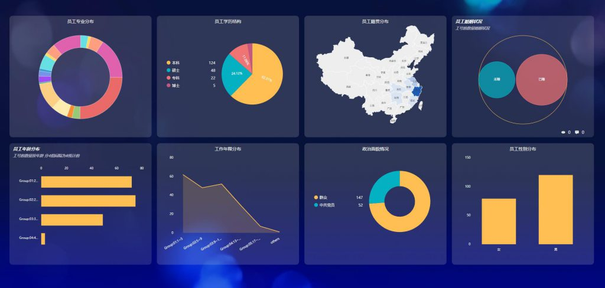

可视化数据分析是基于商业目的，有目的的进行整理、收集、加工以及分析数据，提炼信息的一个过程。这个datafocus过程概括起来主要包括：分析目的和框架、数据处理、数据分析、数据收集、数据展现还有撰写报告等 6 个阶段。

对于一个可视化数据分析项目，你的数据分析对象是谁？商业目的是什么样的？要解决什么业务问题？数据分析师对这些问题都要了然于心。对于商业的理解，整理分析框架还有分析思路。例如，减少新客户的流失量、提高客户响应率、优化活动效果等等。不同的项目对数据的要求，所使用的分析手段也是不一样的。

1、数据收集

可视化数据收集是按照确定的数据分析以及框架内容，有目的进行的收集、整合相关数据的一个过程，它就是数据分析的一个基础。

2、数据处理

数据分析处理是指对收集到的数据进行整理，加工、以便开展可视化数据分析，它是数据分析前必不可少的阶段。过程是数据分析整个过程当中最占据时间的，也能够在一定程度上取决于数据仓库的搭建以及数据质量的保证。数据处理主要包括的是数据清洗、数据转化等处理方法。

3、数据分析

数据分析是指通过数据分析手段、方法和技巧对已经准备好的数据进行分析，探索、从中发现相对因果关系、内部联系还有业务规律，为商业目提供决策参考。到了这个阶段，要能驾驭数据，就要涉及到工具和方法的使用。

以上就是可视化数据分析项目的一些内容，大家阅读完本文应该有了一定的了解，知道了是在datafocus上进行的，大家可以持续关注这方面的内容。
