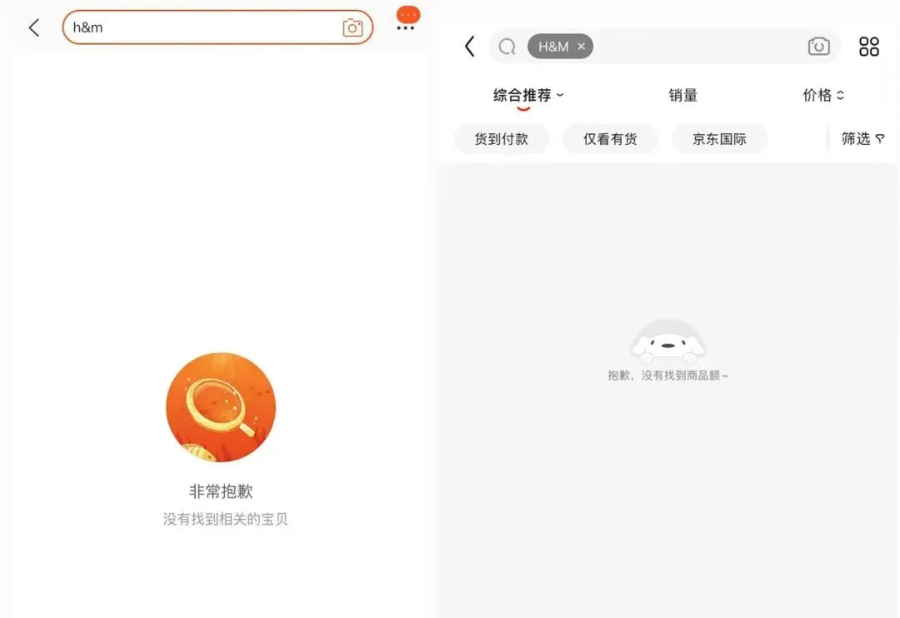
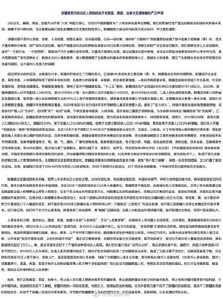

​近日，新疆棉花事件持续发酵，一时间霸占各大平台热搜榜。 起因是国外服装企业H&M集团被曝光发布声明抵制新疆棉花产品，从而引发众怒。

一场抵制大战一触即发。

DataFocus梳理了整个新疆棉花事件的全过程，用一张**桑基图**带你快速浏览。

 图片源自DataFocus

## **H&M声明抵制新疆产品**

H&M的这份声明写道：H&M集团对来自民间社会组织的报告和媒体的报道深表关注，其中包括对新疆维吾尔自治区少数民族强迫劳动和宗教歧视的指控。

同时，H&M集团表示，我们不与位于新疆的任何服装制造工厂合作，也不从该地区采购产品/原材料。

## **所谓“强迫劳动”“歧视少数民族”是谎言**

2021年3月18日，中国外交部发言人赵立坚表示，所谓新疆存在“强迫劳动”“强制绝育”等“侵犯人权行为”是个别别有用心的所谓学者和机构蓄意编造和散布弥天大谎，违背公理良知，中国人民强烈愤慨。对此任何愿意尊重和了解中国、不对新疆抱有恶意和偏见的人都应该予以警惕和抵制。 此外，中国外交部发言人华春莹还于25日表示，**这个事情本身对中国进行造谣污蔑和诋毁，就是极端错误的。** 随后，华春莹拿出了两张照片予以回击，**分别是在美国黑奴被强迫在棉花地里采摘的照片和中国新疆超过70%棉花田都已经进行机械化采摘的情景。**

  图片源自央视新闻

华春莹表示：**新疆地区的棉花是世界上最好的棉花之一，不用是相关企业的损失。**中国光明磊落，中国人民友善开放。但**中国民意不可欺、不可违。**

## **多家电商平台下架**H&M商品****

 图片源自网络

3月24日，多家电商平台已将H&M下架。目前，在淘宝、京东、拼多多、唯品会等电商平台搜索H&M、HM等关键词，已不显示相关店铺和商品。

## **H&M发布声明回应，网友并不买账！**

24日晚间，H&M对此事作出回应。但这份最新声明并未直接提及新疆，也未就抹黑新疆言论道歉。

对于H&M发布的这份声明，大家并不买账。很多网友批评这份声明“看不懂”、“避重就轻”。

 

图片源自微博

## **Nike、优衣库、阿迪达斯等品牌均遭抵制**

随后，有网友发现，近些年发表过“抵制新疆棉花”相关言论的国外企业还有不少，其中包括**阿迪达斯、耐克、优衣库、巴宝莉**等。 对于耐克、阿迪达斯等国外企业“抵制新疆棉花”的相关言论，众多网友纷纷发声“国家尊严不容侵犯，中国市场只欢迎尊重我们的品牌”。 同时不少网友在网络上发起“我支持新疆棉花”话题。

 图片源自央视网

## **多个艺人终止品牌合作**

随后宣布“终止与NIKE的一切合作”的声明接踵而来。黄轩、谭松韵、王一博等多个艺人都各自取消了品牌代言。  

## **新疆棉花的真相**

新疆棉花早已利用高新技术——北斗导航自动驾驶播种机助力播种、新型采棉机助力采收。棉花种植产业已实现降本增效，高速发展。

图片源自央视新闻

## **新疆就美英加无理制裁发表严正声明**

日前，新疆维吾尔自治区人民政府发表声明，对美国、英国、加拿大无理制裁表示坚决反对，予以强烈谴责。 

## **耐克阿迪股价大跌，安踏净利润超越阿迪达斯**

因受新疆棉花事件影响，耐克阿迪股价大跌，李宁、安踏等国货借势大涨。  图片源自网络

## **DataFocus简评**

作为世界最大棉花消费国，第二大棉花生产国，新疆的棉花产能占到全国的80%，高达全世界的五分之一。而中国棉花产量的上涨或将影响美国的纺织业。

新疆拥有地理优势，非常适合种植棉花，而且能做到全国质量最好，生产最高，因此新疆棉花算是纺织业的龙头项目。 美国所谓的强迫劳动只是借口，目的还是打压中国的纺织业。事实上，美国过去的历史就有“黑奴摘棉花”，因此散播这样的谣言会让他们的当地人更信服。抹黑污蔑只会让中国给予一次强有力的回击。当然本次事件也带来了好处，那就是给了国货一次崛起的机会，展示了国货长久积累雄厚的实力。DataFocus将继续秉持助力人人成为数据分析精英的理念，竭力成为BI领域的“国货之光”。
