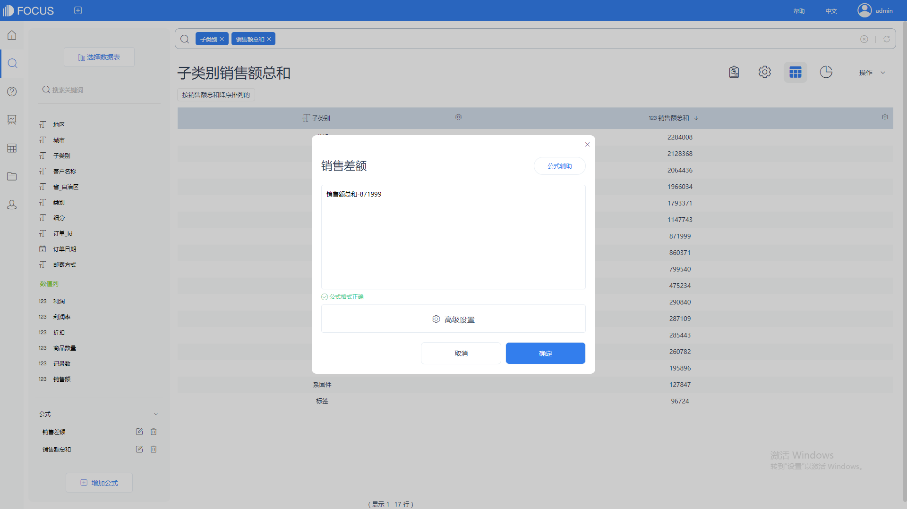
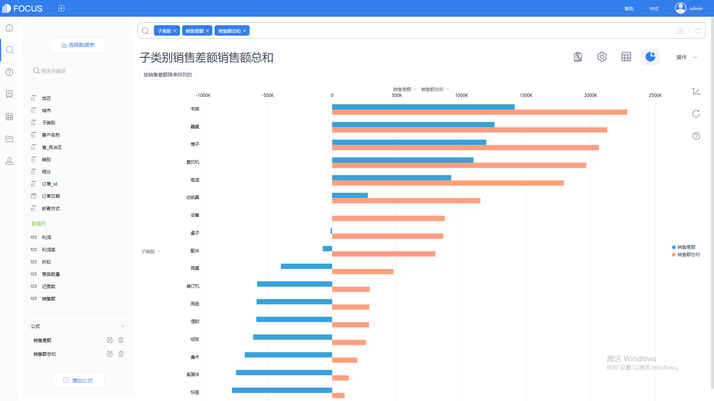

> 1.商业场景

在商业分析中，经常需要通过排名展示出最热卖的产品或产品子类。使用简单的排名分析无法展示出产品品类（或子类）之间的销售额差异。例如，销售额排名第一的书架类产品与销售额排名第三的椅子类产品的销售额相差多少?解决此类问题需要分析产品品类之间的销售额差异。本文目的在于动态对比产品子类之间的销售额差异。分析师可根据任何产品子类的销售额横向对比其他子类的销售额。

> 2.可视化

组合条状图。水平方向伸展的条状图更有利于对比产品子类别的销售额，通过设置色阶，可令可视化结果更加易于理解。

> 3.整体思路

（1）计算所选产品的销售额。（2）计算所有产品子类的销售额。（3）计算销售差额，公式为：销售差额=所选产品销售额-产品子类的销售额。

> 4.在DataFocus中实现的步骤

导入数据，进入搜索页面。

建立公式销售总额，公式为sum(销售额)，将销售额聚合方式设为总和。

搜索框输入销售额总和、子类别，可以了解到各个子类别对应的销售额，设备这一子类别对应的销售额总和为871999。

接下来我们要计算其它子类别销售额与这一子类别销售额的差值。

建立公式销售差额，公式为销售额总和-871999.

搜索框输入，子类别 销售额总和 销售差额，方便理清差额情况将销售额总和降序排列，将可视化图切换为条形图，最后得出以下结果。

